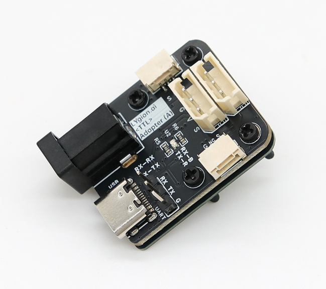
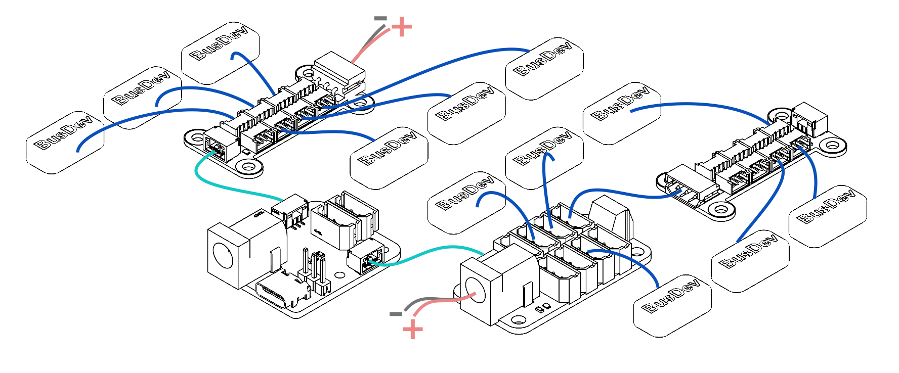
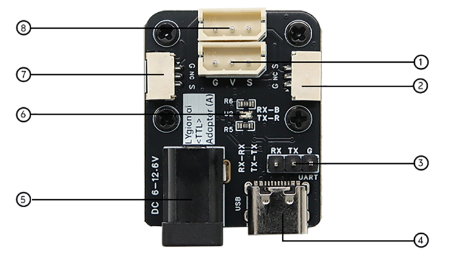
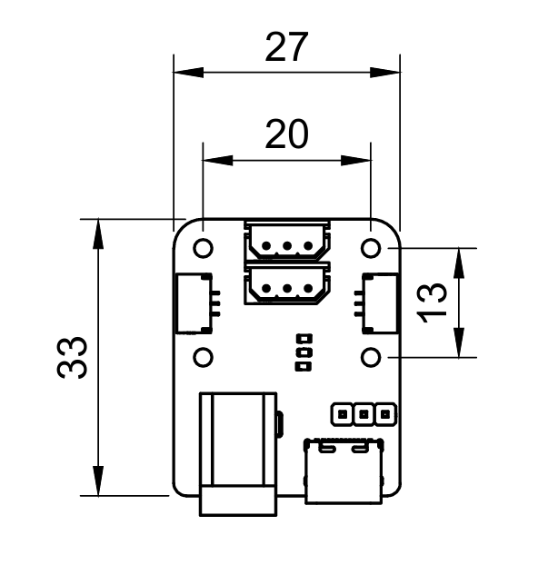
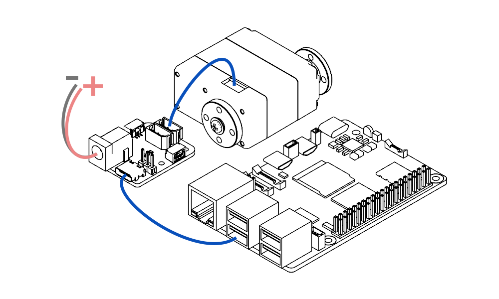
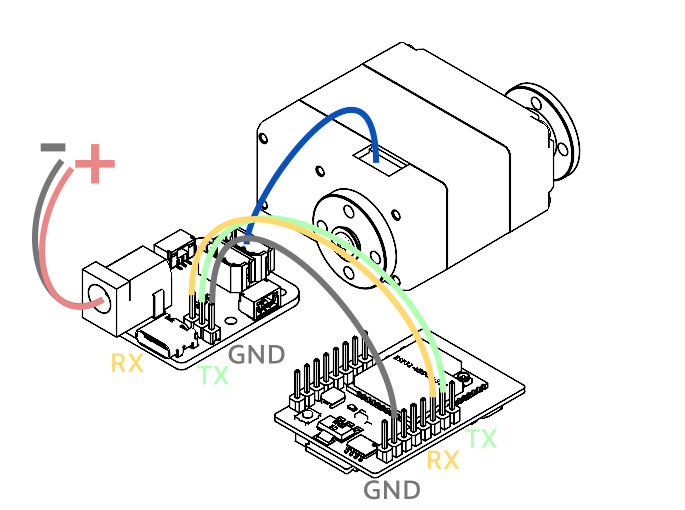
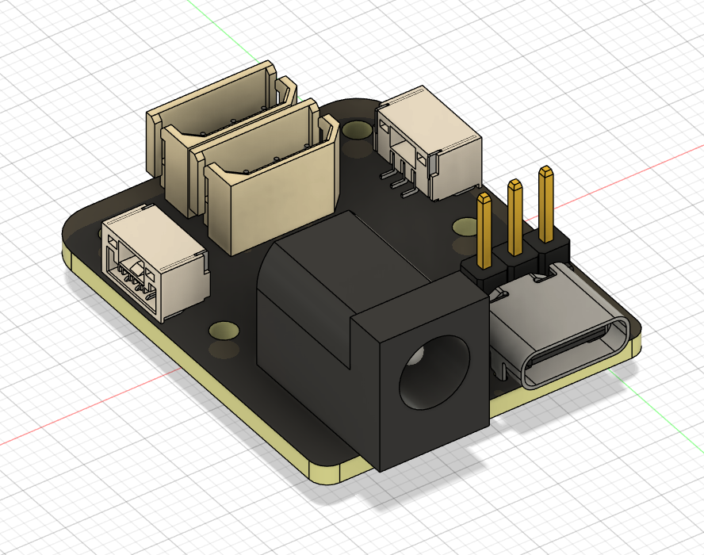

# TTL Adapter (A)

<div class="ly-lang-switch">
  <div class="ly-lang-switch__buttons">
    <a class="ly-lang-switch__button" href="/en/bus-devices/ttl-adapter-a">🌐English</a>
  </div>
</div>

{ .img-rounded width="300" }

> 面向机器人与嵌入式系统的 TTL 总线设备驱动器

---

# TTL 总线设备驱动板

兼容灵影 TTL 总线设备与飞特 TTL 总线舵机。

支持多板串联与分组供电，适合机器人、多关节系统与嵌入式控制项目。

**产品型号：TTL Adapter (A)**

---

# 1. 产品简介

TTL Adapter (A) 是一款面向机器人开发与嵌入式控制场景设计的超小型 TTL 总线通信与驱动模块。

它支持：

- USB 通信
- UART RX/TX 通信
- 单线 TTL 总线通信

可用于连接和控制：

- [灵影 (Lygion)](https://lygion.ai/) TTL 总线设备
- [飞特 (Feetech)](https://www.feetechrc.com/) STS / HLS / SCS 系列总线舵机
- 多种 TTL 总线设备混合系统

!!! note "协议兼容"
    TTL Adapter (A) 完全兼容飞特官方 TTL 通信协议，并支持最高 **3 Mbps** 的高速总线通信，可实现低延迟控制与高速状态反馈。

适用于：

- 机械臂
- 移动机器人
- 四足机器人
- 六足机器人
- 人形机器人
- 嵌入式机器人系统
- 末端执行器系统
- 自动化测试设备

得益于其超小体积与灵活供电架构，特别适合空间受限的机器人产品。


# 2. 支持设备

## 灵影 TTL 总线设备

- [TTL Stepper Driver (A) 步进电机驱动板](ttl-stepper-driver-a.md)
- [TTL Encoder E02 总线编码器](ttl-encoder-e02.md)
- [TTL Node (A) 总线节点板](ttl-node-a.md)
- 后续灵影 TTL 总线生态设备

## 飞特总线设备

- STS 系列总线舵机
- HLS 系列总线舵机

# 3. 协议兼容性

TTL Adapter (A) 完全兼容飞特官方 TTL 总线协议。

灵影 TTL 总线设备基于与飞特总线舵机相同的底层通信结构设计，因此可以在同一根 TTL 总线上混合使用。

例如可以同时连接：

- 灵影步进驱动板
- 灵影总线编码器
- 灵影总线节点板
- 飞特总线舵机

等设备。

!!! warning "设备 ID 不可重复"
    同一根 TTL 总线上的所有设备必须使用不同 ID，否则会导致通信冲突。

---

# 4. 产品特点

## USB 即插即用

仅需一根 USB 数据线即可完成：

- 参数配置
- 固件升级
- 设备扫描
- 调试测试

无需外接供电即可进行单独总线设备的参数修改与固件升级。

!!! warning "USB 供电不能替代设备工作电源"
    仅通过 USB 连接 TTL Adapter (A) 时，USB 接口提供的电压和电流通常无法满足总线舵机、步进电机驱动器等执行器的工作需求。
    
    如果需要控制设备运动，请务必接入符合设备电压和电流要求的外部电源。


## 多种通信方式同时接入

TTL Adapter (A) 支持：

- USB
- UART RX/TX
- 单线 TTL 总线

多种接口可以同时连接，无需手动切换。


## 3 Mbps 高速总线

支持最高：

- 3 Mbps 波特率

优势：

- 更低通信延迟
- 更快反馈刷新率
- 多关节机器人动作更丝滑
- 更适合实时控制系统


## 宽电压与大电流支持

支持输入电压：

- 5V ~ 25.2V

供电接口：

- DC5521（5.5 × 2.1 mm）

额定电流：

- 最大约 7A

适用于：

- 大扭矩舵机
- 多电压机器人系统
- 步进电机关节系统

!!! note "总线设备扩展"
    Lygion TTL 总线系统支持分组供电，也就是将通信总线和设备供电进行解耦。

    TTL Adapter (A) 左右两侧提供 GH1.25-3P 通信接口，该接口主要用于 TTL 总线通信扩展，不作为大电流供电接口使用。

    用户可以将 TTL Adapter (A) 连接到以下 HUB 分线板：
        [TTL-5264 8P Hub (A)](bus-devices/ttl-5264-8p-hub-a.md)
        / [HC-1.25 8P Hub (A)](bus-devices/hc-1.25-8p-hub-a.md)

    再分别为分线板单独供电，从而实现同时控制多个大功率的总线设备。


!!! tip "电源电流建议留有余量"
    电机、舵机、驱动器类设备在启动、加速、堵转或负载变化时，瞬时电流可能明显高于静态电流。
    建议电源电流不要只按平均工作电流选择，应根据实际负载和设备数量留出足够余量。


## 超小体积

产品尺寸：

- 27 × 35 mm

适用于：

- 小型四足机器人
- 嵌入式关节
- 空间受限的机器人项目


## 多板串联

侧边 TTL 总线接口支持：

- 多板串联
- 分组供电
- 系统扩展
- 示波器调试

{ .img-rounded }

---

# 5. 板载概览

| 项目 | 参数 |
|---|---|
| 产品型号 | TTL Adapter (A) |
| 输入电压 | 5V ~ 25.2V |
| 供电接口 | DC5521（5.5 × 2.1 mm） |
| USB 接口 | USB Type-C |
| UART 接口 | RX / TX / GND |
| UART 间距 | 2.54 mm |
| TTL 总线接口 | GH1.25-3P |
| 最大波特率 | 3 Mbps |
| 产品尺寸 | 27 × 35 mm |
| 定位孔直径 | 2.1 mm |
| 定位孔间距 | 13 × 20 mm |
| 支持设备 | 飞特与灵影 TTL 总线设备 |

---

# 6. 板载资源

{ width="500" .img-rounded }

1. 单线 TTL 总线设备 控制接口（HX-5264-3P）
2. 单线 TTL 板间通信接口（GH-1.25-3P）
3. UART RX-TX-GND 串口通信接口（间距 2.54mm 排针）
4. USB 接口（Type-C）
5. DC5521 供电接口（DC-005H-D020）

    !!! tip "供电接口"
        - 支持 DC 5~25.2V 供电
        - 注意：供电电压需要与连接的总线舵机/关节/轮毂电机的电压匹配

6. 通信状态指示灯
7. 单线 TTL 板间通信接口（GH-1.25-3P）
8. 单线 TTL 总线舵机/关节 控制接口（HX-5264-3P）

## 接口说明

### 1. TTL 总线设备 控制接口（HX-5264-3P）

可用于连接：

- 灵影 TTL 总线设备
- 总线舵机
- 智能关节
- TTL 轮毂电机


### 2. TTL 板间通信接口（GH-1.25-3P）

用于：

- 多板串联
- TTL 总线共享通信
- 分组供电 / 供电解耦


### 3. UART RX/TX/GND 接口

2.54 mm 排针接口。

适用于：

- ESP32
- ESP32S3
- STM32
- Arduino
- 其它 MCU / SBC 的 UART 接口


### 4. USB Type-C 接口

用于：

- PC 通信
- 固件升级
- 参数配置


### 5. DC5521 供电接口

支持：

- 5V ~ 25.2V 输入

!!! warning
    输入电压必须与连接设备的额定电压匹配。

例如：

- 6V 舵机 → 使用 6V 电源
- 12V 关节 → 使用 12V 电源
- 24V 轮毂电机 → 使用 24V 电源


### 6. 通信状态指示灯

用于显示 TTL 总线通信状态。

---

# 7. 产品尺寸

{ width="300" .img-rounded }

## 尺寸参数

| 项目 | 参数 |
|---|---|
| 宽度 | 27 mm |
| 高度 | 35 mm |
| 定位孔直径 | 2.1 mm |
| 定位孔间距 | 13 × 20 mm |

STEP 三维模型下载：

[TTL Adapter (A) Step Download](assets/files/ttl-adapter-a.step)

---

# 8. 供电方式

## 8.1 外接供电

通过 DC5521 接口连接外部电源。

支持输入范围：

- 5V ~ 25.2V

!!! warning
    输入电压必须与连接设备的工作电压一致。


## 8.2 USB 调参和控制

TTL Adapter (A) 板载 USB-TTL 芯片，可以将电脑（或 树莓派、Jetson、RK 等 SBC 设备）的 USB 接口转换为 TTL 总线通信接口。连接后，电脑会识别出一个串口设备，用户可以通过 FD 软件、Python SDK 或其他串口程序与总线设备通信。

{ .img-rounded width="720" }

典型连接方式如下：

```text
PC / SBC - USB Port
        │
        │ USB Cable
        │
TTL Adapter (A)
        │
        │ TTL Bus
        │
TTL Bus Device(s)
```

需要注意的是，USB 线通常只用于通信，不能作为总线设备的主要供电来源。

部分低功耗设备或单个设备在仅连接 USB 时，可能可以完成参数读取、ID 修改等操作，但不建议直接控制电机、舵机或其他执行器动作。执行器类设备工作时需要额外接入符合规格的外部电源。

!!! warning "USB 供电不能替代设备工作电源"
    仅通过 USB 连接 TTL Adapter (A) 时，USB 接口提供的电压和电流通常无法满足总线舵机、步进电机驱动器等执行器的工作需求。
    
    如果需要控制设备运动，请务必接入符合设备电压和电流要求的外部电源。


## 8.3 多电压分组供电

多个 TTL Adapter (A) 可以共享同一根 TTL 总线，但分别使用不同电压供电。

例如：

- A 板 → 12V 舵机
- B 板 → 6V 舵机

优势：

- 更方便机器人布线
- 电源分组更灵活
- 支持多电压机器人系统

{ .img-rounded }

!!! warning
    同一根 TTL 总线上的设备 ID 不可重复。

--

# 9. 通信方式

TTL Adapter (A) 支持三种控制方式。


## 9.1 USB 控制

适用于：

- 树莓派
- Jetson
- RK3588
- N100 小主机
- Windows PC
- Linux PC

可实现：

- 设备扫描
- 参数修改
- 固件升级
- 状态反馈读取

### 接线示例

{ .img-rounded width="720" }


## 9.2 UART RX/TX 控制

适用于：

- ESP32
- ESP32-S3
- STM32
- Arduino

### 接线方式

| Adapter | MCU |
|---|---|
| TX | TX |
| RX | RX |
| GND | GND |

TTL Adapter (A) 的 UART 通信电平为 3.3V TTL。

!!! warning "请确认 UART 电平"
    TTL Adapter (A) 的 UART 接口为 3.3V 电平。

    如果您的 MCU 或控制器使用 5V UART 电平，请确认其 IO 是否兼容 3.3V 输入，必要时需要增加电平转换电路。

!!! tip "MCU 与 TTL Adapter 接线方式"
    MCU 的 RX 应连接到 TTL Adapter (A) 的 RX。
    
    MCU 的 TX 应连接到 TTL Adapter (A) 的 TX。
    
    GND 必须连接到 GND。

### 接线示例

{ .img-rounded }


## 9.3 单线 TTL 总线

用于连接：

- 灵影 TTL 总线设备
- 飞特总线舵机
- 多设备机器人系统

支持多种设备混合使用。

---

# 10. 设备状态反馈

TTL Adapter (A) 支持读取设备反馈信息。

包括但不限于：

- 位置
- 速度
- 电压
- 电流
- 温度
- 扭矩状态
- 运行状态
- 工作模式
- 错误状态

可用于：

- 闭环控制
- 机器人状态监测
- 动作分析
- 实时监控

!!! note "总线信息反馈"
    不同的总线设备反馈的具体信息有所不同，具体可参考对应总线产品的 Wiki。

---

# 11. CH343 驱动说明

TTL Adapter (A) 使用 CH343 USB 转串口芯片。


## Windows

Windows 通常会自动安装驱动。

如果无法识别：

- 请手动安装 CH340 / CH343 驱动。


## Linux

Linux 系统通常会自动识别 CH343。

设备可能显示为：

```bash
/dev/ttyUSB0
```

或：

```bash
/dev/ttyACM0
```


## 树莓派

在 Raspberry Pi OS 中，CH343 可能被识别为：

- CH340 兼容设备
- USB CDC 设备

可以通过以下命令查看：

```bash
ls /dev/tty*
```

或：

```bash
dmesg | grep tty
```

常见设备名称：

```bash
/dev/ttyUSB0
```

```bash
/dev/ttyACM0
```

---

# 12. 飞特 FD 调试软件

TTL Adapter (A) 支持使用飞特 FD 软件进行调试。

- [下载 FD 软件](../assets/files/FD.7z)

支持功能：

- 扫描设备 ID
- 修改 ID
- 修改参数
- 读取反馈
- 升级固件

!!! note
    FD 软件的使用过程在 [快速开始](../getting-started.md#fd-software) 中有介绍

---

# 13. SDK 支持

具体使用哪个 SDK，取决于连接的设备类型。

## 飞特 SDK

当控制以下设备时建议使用：

- STS 舵机
- HLS 舵机
- SCS 舵机

[Feetech SDK on Github](https://github.com/ftservo)

[Feetech SDK on Gitee](https://gitee.com/ftservo)

## 灵影 SDK

当控制以下设备时建议使用：

- TTL Stepper Driver (A)
- TTL Node (A)
- TTL Encoder E02

SDK:

[GitHub Python SDK 链接](https://github.com/LygionOrganization/lygion_devs_py)

[GitHub C++ SDK 链接](https://github.com/LygionOrganization/lygion_devs_cpp)

如果无法访问 GitHub，也可以通过本站下载：

[本站 Python SDK 链接](assets/files/lygion_devs_py.zip)

[本站 C++ SDK 链接](assets/files/lygion_devs_cpp.zip)

灵影设备与飞特舵机可以在同一根 TTL 总线上同时控制。

## 三维模型

产品模型：

{ .img-rounded width="300" }

[TTL Adapter (A) Step Download](assets/files/ttl-adapter-a.step)