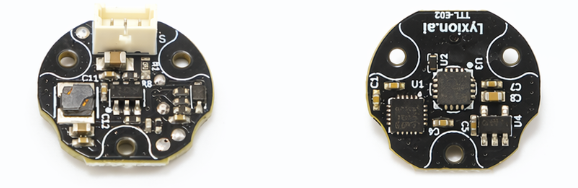
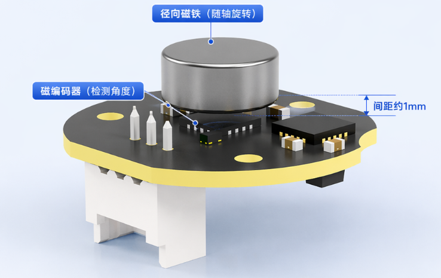
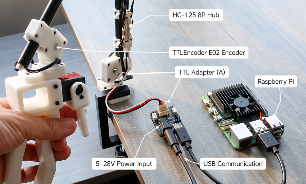

# TTL Encoder E02

<div class="ly-lang-switch">
  <div class="ly-lang-switch__buttons">
    <a class="ly-lang-switch__button" href="/en/bus-devices/ttl-encoder-e02">🌐English</a>
  </div>
</div>

TTL Encoder E02 是一款基于单线 TTL 总线通信的 12bit 绝对角度磁编码器，可用于读取机械结构的角度与速度反馈，适合机械臂、灵巧手、齿轮/同步轮、减速器输出轴、转台、轮式底盘转向机构等机器人应用场景。

本教程主要介绍如何通过 Python SDK 和 C++ / Arduino SDK 读取 TTL Encoder E02 的角度与速度，以及如何设置当前位置基准。

!!! info "适用对象"
    本文适合第一次使用 TTL Encoder E02 的用户。若你已经熟悉 Lygion TTL 总线设备，也可以直接跳转到“读取单个编码器”和“同步读取多个编码器”章节。

---

## 1. 产品功能概览

TTL Encoder E02 支持以下功能：

- 读取当前位置
- 读取当前速度
- 多设备同步读取
- 任意位置基准设置
- 校准结果掉电保存
- 与 Lygion TTL 总线设备混合使用
- 与飞特 STS / SMS / HLS 等 TTL 总线舵机混合使用

TTL Encoder E02 通过径向磁铁检测旋转角度。编码器本体固定在机械结构上，径向磁铁安装在旋转轴或旋转部件上。当磁铁随轴旋转时，编码器会输出当前角度与速度。

{ .img-rounded }

---

## 2. 主要参数

| 项目 | 参数 |
| --- | --- |
| 产品型号 | TTL Encoder E02 |
| 通信方式 | 单线 TTL 总线 |
| 默认波特率 | 1 Mbps |
| 出厂默认 ID | 1 |
| ID 范围 | 1 ~ 252 |
| 供电电压 | DC 5~28V |
| 角度反馈 | 12bit 绝对角度 |
| 单圈位置范围 | 0~4095 |
| 多圈位置范围 | 0~65534，掉电不保存 |
| 速度单位 | steps/s |
| 接口 | HC-1.25-3P |
| 引脚定义 | `- / + / S` |
| 运行电流 | <10mA |
| PCB 直径 | 约 16mm |
| SDK | Python SDK / C++ SDK |

!!! warning "供电电压确认"
    TTL Encoder E02 支持 DC 5~28V 宽电压输入。若同一根总线上还连接了其它设备，请确认所有设备都支持当前总线供电电压。

---

## 3. 工作原理

TTL Encoder E02 通过检测径向磁铁的旋转角度，实时输出当前位置与速度。

典型结构如下：

```text
旋转轴 / 齿轮 / 同步轮
        │
        │  安装径向磁铁
        ▼
径向磁铁随轴旋转
        │
        ▼
TTL Encoder E02 检测磁场角度
        │
        ▼
通过 TTL 总线输出角度与速度
```

在 12bit 精度下，一圈对应 4096 个位置值：

```text
0 ~ 4095 = 0° ~ 360°
```

步数和角度换算公式：

```python
angle_deg = position(steps) / 4096 * 360
```

例如你获取到的编码器读数从1200变成了2300，则变化幅度为 2300 - 1200 = 1100

```
1100 / 4096 * 360 ≈ 96.68°
```

说明径向磁铁相对于编码器，向正时针方向旋转了 96.68°

速度单位为 `steps/s`，可换算为角速度：

```python
speed_deg_s = speed_steps_s / 4096 * 360
```

{ .img-rounded }

---

## 4. 安装要求

TTL Encoder E02 使用时，需要将径向磁铁安装在旋转部件上，并使磁铁中心尽量对准编码器 IC 的中心区域。

推荐安装要求：

- 使用径向磁铁，而不是普通轴向磁铁
- 磁铁与编码器 IC 尽量同心
- 磁铁与编码器 IC 上表面间距建议约 1mm
- 间距最大不建议超过 1.5mm
- 磁铁旋转时应尽量减少偏心和晃动
- 编码器 PCB 应固定可靠，避免运行过程中松动

!!! tip "机械安装建议"
    TTL Encoder E02 不要求非常高的机械加工精度，但磁铁与编码器 IC 的相对位置会直接影响角度稳定性。如果读取数据跳动明显，应优先检查磁铁的同心度、间距和固定方式。

---

## 5. 硬件连接

### 5.1 使用 PC / Raspberry Pi / Jetson / Mac 读取编码器

推荐使用 [TTL Adapter (A)](ttl-adapter-a.md) 将 USB 转换为单线 TTL 总线，再通过 [HC-1.25 8P Hub (A)](hc-1.25-8p-hub-a.md) 连接 TTL Encoder E02。

```text
PC / Raspberry Pi / Jetson / Mac
        │ USB
        ▼
TTL Adapter (A)
        │ 5264-3P
        ▼
HC-1.25 8P Hub (A)
        │ HC-1.25-3P
        ▼
TTL Encoder E02
```

说明：

- TTL Adapter (A) 用于将 USB 或 UART 转换为单线 TTL 总线
- TTL Adapter (A) 板载 CH343 USB 转串口芯片
- HC-1.25 8P Hub (A) 可将一路 5264-3P 总线扩展为 8 路 HC-1.25-3P
- 多个 Hub 可以继续级联，用于连接更多编码器
- 同一根总线也可以连接飞特 STS / SMS / HLS 舵机或 Lygion TTL 总线设备

TTL Encoder E02 通常由总线供电。实际使用时，可以将 DC 5~28V 电源输入到 TTL Adapter (A)，再通过总线给编码器供电。

{ .img-rounded }

---

### 5.2 使用 Arduino / ESP32S3 / STM32 等 MCU

如果使用 MCU 控制 TTL Encoder E02，有三种常见连接方式。

#### 方式 A：使用 [Lygion ESP32S3 Robot Driver](robot-driver-with-esp32s3-lite.md)

```text
ESP32S3 Robot Driver
        │ 5264-3P
        ▼
HC-1.25 8P Hub (A)
        │ HC-1.25-3P
        ▼
TTL Encoder E02
```

ESP32S3 Robot Driver 板载 UART 转单线 TTL 电路，适合直接接入 Lygion TTL 总线设备。

#### 方式 B：用户自行设计 UART 转单线 TTL 电路

```text
MCU UART
        │
        ▼
UART 转单线 TTL 电路
        │
        ▼
TTL Encoder E02
```

这种方式适合已经有自定义主控板或机器人控制板的用户。

#### 方式 C：MCU UART 接 TTL Adapter (A)

```text
ESP32 / STM32 UART
        │ RX → RX
        │ TX → TX
        ▼
TTL Adapter (A)
        │ 5264-3P
        ▼
HC-1.25 8P Hub (A)
        │ HC-1.25-3P
        ▼
TTL Encoder E02
```

!!! note "RX / TX 连接说明"
    当 TTL Adapter (A) 作为通信转接板使用时，外部 MCU 的 UART 与 TTL Adapter (A) 的 UART 连接通常是 `RX 接 RX`、`TX 接 TX`。这与普通 USB-TTL 模块的交叉接线方式不同。

---

## 6. 软件环境

Python 示例适用于：

- Windows
- Linux
- macOS
- Raspberry Pi
- Jetson

C++ / Arduino 示例适用于：

- ESP32S3
- Arduino Mega2560
- 其它支持硬件串口的控制器

推荐 Python 版本：

```text
Python >= 3.8
```

获取 Python SDK：

```bash
git clone https://github.com/LygionRobotics/lygion_devs_py.git
cd lygion_devs_py
```

如果无法访问 GitHub，也可以通过本站下载：

[本站 Python SDK 链接](assets/files/lygion_devs_py.zip)

本教程基于以下 Python 示例：

```text
lyttlsd/read.py
lyttlsd/sync_read.py
lyttlsd/ofscal.py
```

以及以下 C++ / Arduino 示例：

```text
example/lyttlsd/FeedBack.ino
example/lyttlsd/SyncRead.ino
example/lyttlsd/CalibrationOfs.ino
```

!!! info "关于示例名称"
    TTL Encoder E02 与 TTL Stepper Driver (A) 复用了部分 SDK 接口，因此示例代码或注释中可能会出现 `TTLSD`、`motor` 等字样。对于 TTL Encoder E02，可以理解为只使用其中的位置读取、速度读取、同步读取和基准设置功能。

---

## 7. 确认串口名称

连接 TTL Adapter (A) 后，需要确认系统识别到的串口名称。

常见串口名称如下：

| 系统 | 常见串口名称 |
| --- | --- |
| Windows | `COM3`、`COM4`、`COMx` |
| Linux | `/dev/ttyUSB0`、`/dev/ttyAMA0` |
| macOS | `/dev/tty.usbserial-xxxx` |

Windows 下可通过“设备管理器 → 端口（COM 和 LPT）”查看串口号。

Linux 下可使用：

```bash
ls /dev/ttyUSB*
```

或：

```bash
dmesg | grep tty
```

!!! tip "CH343 / CH34X 驱动"
    TTL Adapter (A) 使用 CH343 USB 转串口芯片。部分 Linux、Raspberry Pi 或旧系统可能无法自动识别串口，此时需要安装 CH343 / CH34X 驱动。

---

## 8. 第一次使用前的注意事项

### 8.1 默认 ID

TTL Encoder E02 默认 ID 为：

```text
1
```

第一次设置多个编码器时，请不要将多个默认 ID 相同的设备同时接到同一根总线上。

正确流程：

```text
1. 一次只连接一个新编码器
2. 修改该编码器 ID
3. 断开后连接下一个编码器
4. 每个编码器设置为不同 ID
5. 最后再将多个已经设置好ID的编码器一起连接到总线
```

!!! warning "不要重复 ID"
    同一根 TTL 总线上不能存在重复 ID。重复 ID 会导致通信冲突，表现为读取失败、数据异常或通信不稳定。

### 8.2 默认波特率

TTL Encoder E02 默认波特率为：

```text
1000000
```

即 1 Mbps。

如果你修改过编码器波特率，需要在 Python 示例中使用相同的波特率。若总线上混合连接多个设备，也需要确认这些设备的波特率一致。

### 8.3 如何修改 ID 或波特率

目前最简单的方式是使用 Windows 下的 FD.exe 飞特舵机调试软件进行修改。

!!! note
    FD 软件的使用教程在 [快速开始](../getting-started.md#fd-software) 中有介绍

    - [下载 FD 软件](../assets/files/FD.7z)

---

## 9. 使用 `ttlsd_read.py` 读取单个编码器

示例文件：

```text
lyttlsd/ttlsd_read.py
```

该示例用于读取单个 TTL Encoder E02 的当前位置和当前速度。

`lyttlsd/ttlsd_read.py` 的完整代码如下

```python
import sys
import os

sys.path.append("..")
from lydevs_sdk import *                   # Uses lydevs_sdk library


# Initialize PortHandler instance
# Set the port path
# Get methods and members of PortHandlerLinux or PortHandlerWindows
portHandler = PortHandler('/dev/ttyUSB0') #ex) Windows: "COM1"   Linux: "/dev/ttyUSB0" Mac: "/dev/tty.usbserial-*"

# Initialize PacketHandler instance
# Get methods and members of Protocol
packetHandler = TTLSDClass(portHandler)
    
# Open port
if portHandler.openPort():
    print("Succeeded to open the port")
else:
    print("Failed to open the port")
    quit()

# Set port baudrate 1000000
if portHandler.setBaudRate(1000000):
    print("Succeeded to change the baudrate")
else:
    print("Failed to change the baudrate")
    quit()

while 1:
    # Read the current position of TTLSD motor (ID1)
    scs_present_position, scs_present_speed, scs_comm_result, scs_error = packetHandler.ReadPosSpeed(1)
    if scs_comm_result != COMM_SUCCESS:
        print(packetHandler.getTxRxResult(scs_comm_result))
    else:
        print("[ID:%03d] PresPos:%d PresSpd:%d" % (1, scs_present_position, scs_present_speed))
    if scs_error != 0:
        print(packetHandler.getRxPacketError(scs_error))
    time.sleep(0.1)

# Close port
portHandler.closePort()
```


### 9.1 修改串口

打开 `read.py`，找到串口配置代码，例如：

```python
portHandler = PortHandler('/dev/ttyUSB0')
```

根据你的系统修改为实际串口。

Windows 示例：

```python
portHandler = PortHandler('COM3')
```

Linux 示例：

```python
portHandler = PortHandler('/dev/ttyUSB0')
```

macOS 示例：

```python
portHandler = PortHandler('/dev/tty.usbserial-xxxx')
```

### 9.2 修改波特率

默认示例通常使用 1 Mbps：

```python
if portHandler.setBaudRate(1000000):
    print("Succeeded to change the baudrate")
else:
    print("Failed to change the baudrate")
    quit()
```

如果你修改过编码器波特率，需要将 `1000000` 改成对应值。

### 9.3 修改设备 ID

读取 ID 为 1 的编码器的状态：

```python
position, speed, result, error = packetHandler.ReadPosSpeed(1)
```

- `position`是当前的所处位置（常用）
- `speed`是当前的旋转速度（常用）
- `result`是通信状态
- `error`是传感器的报错信息

如果你的编码器 ID 已经改为其它值，例如 ID 3，则修改为：

```python
position, speed, result, error = packetHandler.ReadPosSpeed(3)
```

### 9.4 运行示例

进入示例所在目录后运行：

```bash
python read.py
```

运行成功后，会返回当前编码器的位置和速度。

位置单位为“步”。在 12bit 精度下：

```text
一圈 = 4096 步
0 ~ 4095 对应 0° ~ 360°
```

角度换算：

```python
angle_deg = position / 4096.0 * 360.0
```

速度单位为：

```text
steps/s
```

---

## 10. 使用 `sync_read.py` 同步读取多个编码器

示例文件：

```text
lyttlsd/sync_read.py
```

该示例用于同时读取多个总线设备的位置和速度。适合机械臂、灵巧手、多关节结构、LeaderArm、低成本闭环系统等多设备场景。

`lyttlsd/sync_read.py` 完整代码如下：

```python
import sys
import os

sys.path.append("..")
from lydevs_sdk import *                   # Uses lydevs_sdk library


# Initialize PortHandler instance
# Set the port path
# Get methods and members of PortHandlerLinux or PortHandlerWindows
portHandler = PortHandler('/dev/ttyUSB0') #ex) Windows: "COM1"   Linux: "/dev/ttyUSB0" Mac: "/dev/tty.usbserial-*"

# Initialize PacketHandler instance
# Get methods and members of Protocol
packetHandler = TTLSDClass(portHandler)

# Open port
if portHandler.openPort():
    print("Succeeded to open the port")
else:
    print("Failed to open the port")
    quit()


# Set port baudrate 1000000
if portHandler.setBaudRate(1000000):
    print("Succeeded to change the baudrate")
else:
    print("Failed to change the baudrate")
    quit()

groupSyncRead = GroupSyncRead(packetHandler, LY_TTLSD_PRESENT_POSITION_L, 4)

while 1:
    for scs_id in range(1, 11):
        # Add parameter storage for lydevs#1~10 present position value
        scs_addparam_result = groupSyncRead.addParam(scs_id)
        if scs_addparam_result != True:
            print("[ID:%03d] groupSyncRead addparam failed" % scs_id)

    scs_comm_result = groupSyncRead.txRxPacket()
    if scs_comm_result != COMM_SUCCESS:
        print("%s" % packetHandler.getTxRxResult(scs_comm_result))

    for scs_id in range(1, 11):
        # Check if groupsyncread data of lydevs#1~10 is available
        scs_data_result, scs_error = groupSyncRead.isAvailable(scs_id, LY_TTLSD_PRESENT_POSITION_L, 4)
        if scs_data_result == True:
            # Get SCServo#scs_id present position value
            scs_present_position = groupSyncRead.getData(scs_id, LY_TTLSD_PRESENT_POSITION_L, 2)
            scs_present_speed = groupSyncRead.getData(scs_id, LY_TTLSD_PRESENT_POSITION_L, 2)
            print("[ID:%03d] PresPos:%d PresSpd:%d" % (scs_id, scs_present_position, packetHandler.scs_tohost(scs_present_speed, 15)))
        else:
            print("[ID:%03d] groupSyncRead getdata failed" % scs_id)
            continue
        if scs_error != 0:
            print("%s" % packetHandler.getRxPacketError(scs_error))
    groupSyncRead.clearParam()
    time.sleep(1)
# Close port
portHandler.closePort()
```

### 10.1 添加需要同步读取的 ID

```python
for scs_id in range(1, 11):
    scs_addparam_result = groupSyncRead.addParam(scs_id)
    if scs_addparam_result != True:
        print("[ID:%03d] groupSyncRead addparam failed" % scs_id)
```

这表示同步读取 ID 1~10 的设备。

如果你只有 ID 1、2、3 三个编码器，可以改为：

```python
for scs_id in range(1, 4):
    scs_addparam_result = groupSyncRead.addParam(scs_id)
    if scs_addparam_result != True:
        print("[ID:%03d] groupSyncRead addparam failed" % scs_id)
```

如果只想读取指定 ID，也可以手动添加：

```python
groupSyncRead.addParam(1)
groupSyncRead.addParam(3)
groupSyncRead.addParam(7)
```

### 10.2 执行同步读取

同步读取通常包含发送读取请求和解析返回数据两个步骤：

```python
scs_comm_result = groupSyncRead.txRxPacket()
if scs_comm_result != COMM_SUCCESS:
    print("%s" % packetHandler.getTxRxResult(scs_comm_result))
```

运行：

```bash
python sync_read.py
```

### 10.3 与飞特总线舵机混合使用

TTL Encoder E02 可以与飞特 STS / SMS / HLS 总线舵机混合接入同一根 TTL 总线。

例如：

```text
ID 1: TTL Encoder E02
ID 2: TTL Encoder E02
ID 3: STS 总线舵机
ID 4: HLS 总线舵机
```

使用 `sync_read.py` 读取 ID 1~4 时，可以同时获得这些设备的位置和速度反馈。

!!! warning "混合总线使用要求"
    混合连接时，需要确认所有设备的 ID 不重复、波特率一致，并且都支持当前总线供电电压。

---

## 11. 使用 `ttlsd_ofscal.py` 设置当前位置基准

示例文件：

```text
lyttlsd/ttlsd_ofscal.py
```

`ttlsd_ofscal.py` 用于设置当前位置基准。它不是简单清零，而是可以将编码器当前实际位置设置为指定的位置值。

`lyttlsd/ttlsd_ofscal.py`完整代码如下：

```python
import sys
import os

sys.path.append("..")
from lydevs_sdk import *                   # Uses lydevs_sdk library


# Initialize PortHandler instance
# Set the port path
# Get methods and members of PortHandlerLinux or PortHandlerWindows
portHandler = PortHandler('/dev/ttyUSB0') #ex) Windows: "COM1"   Linux: "/dev/ttyUSB0" Mac: "/dev/tty.usbserial-*"

# Initialize PacketHandler instance
# Get methods and members of Protocol
packetHandler = TTLSDClass(portHandler)

# Open port
if portHandler.openPort():
    print("Succeeded to open the port")
else:
    print("Failed to open the port")
    quit()

# Set port baudrate 1000000
if portHandler.setBaudRate(1000000):
    print("Succeeded to change the baudrate")
else:
    print("Failed to change the baudrate")
    quit()

# current position of TTLSD is calibrated at 1024
scs_comm_result, scs_error = packetHandler.reOfsCal(1, 1024)
if scs_comm_result != COMM_SUCCESS:
    print("%s" % packetHandler.getTxRxResult(scs_comm_result))
else:
    print("[ID:%03d] ofs cal Succeeded." % (1))
if scs_error != 0:
    print("%s" % packetHandler.getRxPacketError(scs_error))

# Close port
portHandler.closePort()
```

### 11.1 将当前位置设置为 1024

代码示例：

```python
scs_comm_result, scs_error = packetHandler.reOfsCal(1, 1024)
```

含义：

```text
将 ID 1 编码器的当前位置设置为 1024
```

在 12bit 模式下：

```text
1024 对应 90°
```

换算关系：

```python
angle_deg = 1024 / 4096.0 * 360.0
```

### 11.2 运行示例

```bash
python ofscal.py
```

运行成功后，在不改变编码器和径向磁铁相对位置的情况下，再运行：

```bash
python read.py
```

此时读取到的位置应接近你刚刚设置的值，例如：

```text
position ≈ 1024
```

### 11.3 校准结果是否保存？

`reOfsCal()` 设置后的校准结果会掉电保存。

也就是说，后续重新上电后，不需要每次重新校准。

### 11.4 典型应用

该功能适合用于以下场景：

- 将机械零位设置为 `0`
- 将关节中位设置为 `2048`
- 将某个安装姿态设置为指定角度
- 装配后统一校准多个编码器的参考位置

---


## 12. 使用 C++ / Arduino SDK

如果你使用 ESP32S3、ESP32、Arduino Mega2560、STM32 Arduino Core 或其它 MCU，也可以通过 C++ / Arduino SDK 读取 TTL Encoder E02。

C++ SDK 示例位于：

```text
example/lyttlsd/
```

与 TTL Encoder E02 直接相关的示例主要有：

| 示例文件 | 用途 | 是否推荐用于 TTL Encoder E02 |
| --- | --- | --- |
| `FeedBack.ino` | 读取单个设备的位置、速度、电压、温度等反馈 | 推荐 |
| `SyncRead.ino` | 同步读取多个设备的位置与速度 | 推荐 |
| `CalibrationOfs.ino` | 设置当前位置基准 | 推荐 |
| `WritePos.ino` / `WriteSpe.ino` / `SyncWritePos.ino` / `SyncWriteSpe.ino` | 控制 TTL Stepper Driver 的位置或速度 | TTL Encoder E02 通常不需要 |
| `RegWritePos.ino` | 延时写入位置控制指令 | TTL Encoder E02 通常不需要 |

!!! info "关于示例复用"
    TTL Encoder E02 与 TTL Stepper Driver (A) 复用了部分 SDK 接口，因此 C++ 示例中也会出现 `TTLSDClass`、`Servo`、`motor` 等命名。对于 TTL Encoder E02，主要使用读取反馈、同步读取和当前位置基准校准相关函数。

### 12.1 获取 C++ / Arduino SDK

[GitHub C++ SDK 链接](https://github.com/LygionOrganization/lygion_devs_cpp)

如果无法访问 GitHub，也可以通过本站下载：

[本站 C++ SDK 链接](assets/files/lygion_devs_cpp.zip)


下载后，将 SDK 中的库文件放入 Arduino IDE 的 `libraries` 目录，或按照 SDK 仓库中的目录结构打开对应 `.ino` 示例。

!!! tip "Arduino IDE 库目录"
    Arduino IDE 常见库目录为 `Documents/Arduino/libraries`。复制库文件后，建议重启 Arduino IDE，再打开示例工程。

### 12.2 串口配置说明

C++ 示例默认使用硬件串口与 TTL 总线通信。

ESP32S3 示例：

```cpp
Serial1.begin(1000000, SERIAL_8N1, 18, 17);
ttlsd.pSerial = &Serial1;
```

其中：

```text
1000000：总线波特率，默认 1 Mbps
18：ESP32S3 的 RX 引脚
17：ESP32S3 的 TX 引脚
```

Mega2560 示例：

```cpp
Serial1.begin(1000000);
ttlsd.pSerial = &Serial1;
```

!!! warning "只保留一种串口初始化方式"
    如果使用 ESP32S3，请保留 `Serial1.begin(1000000, SERIAL_8N1, 18, 17);`。如果使用 Mega2560，请保留 `Serial1.begin(1000000);`。不要同时启用两行串口初始化代码。

如果你的 TTL Encoder E02 已经修改过波特率，需要将示例中的 `1000000` 改成实际波特率。

### 12.3 使用 `FeedBack.ino` 读取单个编码器

`FeedBack.ino` 可用于读取 ID 为 1 的 TTL Encoder E02 的位置、速度、电压、温度等数据。

对于 TTL Encoder E02，最常用的是：

```cpp
Pos = ttlsd.ReadPos(-1);
Speed = ttlsd.ReadSpeed(-1);
```

其中 `ReadPos(-1)` 和 `ReadSpeed(-1)` 表示从 `FeedBack()` 已经读取到的缓存数据中取出位置和速度。

简化后的读取示例如下：

```cpp
#include <lygion_devs.h>

TTLSDClass ttlsd;

void setup()
{
  Serial.begin(115200);

  // ESP32S3: RX = 18, TX = 17
  Serial1.begin(1000000, SERIAL_8N1, 18, 17);

  // Mega2560 can use:
  // Serial1.begin(1000000);

  ttlsd.pSerial = &Serial1;
  delay(1000);
}

void loop()
{
  int pos;
  int speed;

  ttlsd.FeedBack(1);   // Read feedback data from ID 1

  if (!ttlsd.getLastError()) {
    pos = ttlsd.ReadPos(-1);
    speed = ttlsd.ReadSpeed(-1);

    Serial.print("Position:");
    Serial.println(pos);
    Serial.print("Speed:");
    Serial.println(speed);
  } else {
    Serial.println("FeedBack error");
  }

  delay(100);
}
```

如果只想直接读取某个 ID 的位置，也可以使用：

```cpp
int pos = ttlsd.ReadPos(1);
```

如果只想直接读取速度，可以使用：

```cpp
int speed = ttlsd.ReadSpeed(1);
```

读取成功后，串口监视器会输出类似内容：

```text
Position:1200
Speed:35
```

位置和速度的单位说明与 Python SDK 相同：

```text
Position：steps，12bit 模式下一圈为 4096 steps
Speed：steps/s
```

角度换算：

```cpp
float angle_deg = pos / 4096.0f * 360.0f;
```

速度换算为角速度：

```cpp
float speed_deg_s = speed / 4096.0f * 360.0f;
```

### 12.4 使用 `SyncRead.ino` 同步读取多个编码器

`SyncRead.ino` 用于同时读取多个 TTL 总线设备的位置和速度。

默认示例中：

```cpp
uint8_t ID[] = {1, 2};
```

表示同步读取 ID 1 和 ID 2 两个设备。

如果你有 4 个 TTL Encoder E02，ID 分别为 1、2、3、4，可以改为：

```cpp
uint8_t ID[] = {1, 2, 3, 4};
```

同步读取的核心代码如下：

```cpp
ttlsd.syncReadPacketTx(ID, sizeof(ID), LY_TTLSD_PRESENT_POSITION_L, sizeof(rxPacket));

for (uint8_t i = 0; i < sizeof(ID); i++) {
  if (!ttlsd.syncReadPacketRx(ID[i], rxPacket)) {
    Serial.print("ID:");
    Serial.println(ID[i]);
    Serial.println("sync read error!");
    continue;
  }

  Position = ttlsd.syncReadRxPacketToWrod(15);
  Speed = ttlsd.syncReadRxPacketToWrod(15);

  Serial.print("ID:");
  Serial.println(ID[i]);
  Serial.print("Position:");
  Serial.println(Position);
  Serial.print("Speed:");
  Serial.println(Speed);
}
```

完整的 ESP32S3 同步读取结构可以参考：

```cpp
#include <lygion_devs.h>

TTLSDClass ttlsd;

uint8_t ID[] = {1, 2};
uint8_t rxPacket[4];
int16_t Position;
int16_t Speed;

void setup()
{
  Serial.begin(115200);
  Serial1.begin(1000000, SERIAL_8N1, 18, 17);
  ttlsd.pSerial = &Serial1;

  // Parameter 5 means the timeout period is 5 ms.
  ttlsd.syncReadBegin(sizeof(ID), sizeof(rxPacket), 5);
  delay(1000);
}

void loop()
{
  ttlsd.syncReadPacketTx(ID, sizeof(ID), LY_TTLSD_PRESENT_POSITION_L, sizeof(rxPacket));

  for (uint8_t i = 0; i < sizeof(ID); i++) {
    if (!ttlsd.syncReadPacketRx(ID[i], rxPacket)) {
      Serial.print("ID:");
      Serial.println(ID[i]);
      Serial.println("sync read error!");
      continue;
    }

    Position = ttlsd.syncReadRxPacketToWrod(15);
    Speed = ttlsd.syncReadRxPacketToWrod(15);

    Serial.print("ID:");
    Serial.println(ID[i]);
    Serial.print("Position:");
    Serial.println(Position);
    Serial.print("Speed:");
    Serial.println(Speed);
  }

  delay(10);
}
```

!!! warning "同步读取前请确认 ID"
    `ID[]` 数组中只应填写真实存在的设备 ID。如果数组中包含未连接的 ID，可能会出现同步读取失败或等待超时。

### 12.5 使用 `CalibrationOfs.ino` 设置当前位置基准

`CalibrationOfs.ino` 用于将编码器当前实际位置设置为指定位置值。

示例代码：

```cpp
ttlsd.CalibrationOfs(1, 1024);
```

含义：

```text
将 ID 1 编码器的当前位置设置为 1024
```

在 12bit 模式下：

```text
1024 = 90°
2048 = 180°
3072 = 270°
```

步数和角度换算公式：

```
angle_deg = position(steps) / 4096 * 360
```

典型示例：

```cpp
#include <lygion_devs.h>

TTLSDClass ttlsd;

void setup()
{
  Serial.begin(115200);
  Serial1.begin(1000000, SERIAL_8N1, 18, 17);
  ttlsd.pSerial = &Serial1;
  delay(1000);

  // Set the current position of ID 1 to 1024.
  ttlsd.CalibrationOfs(1, 1024);
  delay(10);
}

void loop()
{
  int pos = ttlsd.ReadPos(1);

  if (!ttlsd.getLastError()) {
    Serial.print("pos:");
    Serial.println(pos);
  } else {
    Serial.println("read position error");
  }

  delay(1000);
}
```

运行流程：

```text
1. 将机械结构转到希望作为参考位置的姿态
2. 修改 CalibrationOfs.ino 中的设备 ID 和目标位置值
3. 烧录程序
4. 打开串口监视器
5. 确认读取到的位置接近设定值
```

`CalibrationOfs()` 设置后的校准结果会掉电保存。重新上电后，编码器仍会使用该基准。

### 12.6 C++ 常用函数速查

| 函数 | 用途 | TTL Encoder E02 常用程度 |
| --- | --- | --- |
| `ttlsd.ReadPos(ID)` | 直接读取指定 ID 的当前位置 | 常用 |
| `ttlsd.ReadSpeed(ID)` | 直接读取指定 ID 的当前速度 | 常用 |
| `ttlsd.FeedBack(ID)` | 一次性回读多个反馈参数到缓存 | 常用 |
| `ttlsd.ReadPos(-1)` | 从 `FeedBack()` 缓存中读取位置 | 常用 |
| `ttlsd.ReadSpeed(-1)` | 从 `FeedBack()` 缓存中读取速度 | 常用 |
| `ttlsd.ReadVoltage(ID)` | 读取输入电压 | 可选 |
| `ttlsd.ReadTemper(ID)` | 读取温度 | 可选 |
| `ttlsd.CalibrationOfs(ID, position)` | 设置当前位置基准 | 常用 |
| `ttlsd.syncReadBegin(...)` | 初始化同步读取 | 多设备常用 |
| `ttlsd.syncReadPacketTx(...)` | 发送同步读取请求 | 多设备常用 |
| `ttlsd.syncReadPacketRx(...)` | 接收指定 ID 的同步读取返回包 | 多设备常用 |

!!! note "写入控制类函数说明"
    `WritePosEx()`、`WriteSpe()`、`SyncWritePosEx()`、`SyncWriteSpe()` 等函数主要用于 TTL Stepper Driver (A) 的运动控制。TTL Encoder E02 是角度反馈设备，通常不需要使用这些写入运动控制函数。

### 12.7 C++ 使用流程

单个编码器读取流程：

```text
1. 安装 C++ / Arduino SDK
2. 打开 FeedBack.ino
3. 根据主控板类型修改 Serial1 初始化方式
4. 修改设备 ID 和波特率
5. 烧录程序
6. 打开串口监视器
7. 转动径向磁铁，观察 Position 和 Speed 变化
```

多个编码器同步读取流程：

```text
1. 分别给每个编码器设置不同 ID
2. 将多个编码器接入同一根 TTL 总线
3. 打开 SyncRead.ino
4. 修改 ID[] 数组
5. 烧录程序
6. 查看串口监视器输出
```

设置当前位置基准流程：

```text
1. 将机械结构转到目标参考姿态
2. 打开 CalibrationOfs.ino
3. 修改 CalibrationOfs(ID, position) 中的 ID 和 position
4. 烧录程序
5. 读取位置并确认结果
```

### 12.8 C++ 常见问题

#### Q1：ESP32S3 上传后没有输出怎么办？

请检查：

- `Serial.begin(115200);` 是否已经启用
- 串口监视器波特率是否为 `115200`
- `Serial1.begin(1000000, SERIAL_8N1, 18, 17);` 中的 RX/TX 引脚是否与你的硬件一致
- `ttlsd.pSerial = &Serial1;` 是否已经设置

#### Q2：可以使用软件串口吗？

不推荐。

TTL Encoder E02 默认波特率为 1 Mbps，软件串口在高速通信下稳定性较差。建议使用硬件串口。

#### Q3：读取位置一直失败怎么办？

请检查：

- 编码器 ID 是否正确
- 波特率是否一致
- 总线供电是否正常
- RX/TX 或单线 TTL 转换电路是否正确
- 同一总线上是否存在重复 ID

#### Q4：为什么 `ReadPos(-1)` 里面的 ID 是 `-1`？

`ReadPos(-1)` 表示从 `FeedBack()` 已经读取到的缓存数据中取出位置值，不会再向总线发送新的读指令。

如果使用 `ReadPos(1)`，表示直接向 ID 1 设备发送读取位置指令。

---

## 13. 角度、速度与多圈数据说明

### 13.1 位置数据

TTL Encoder E02 的位置反馈单位是“步”。

在最高 12bit 精度下：

```text
一圈 = 4096 步
0 ~ 4095 = 0° ~ 360°
```

角度换算：

```python
angle_deg = position / 4096.0 * 360.0
```

### 13.2 速度数据

速度单位为：

```text
steps/s
```

换算为度/秒：

```python
speed_deg_s = speed_steps_s / 4096.0 * 360.0
```

### 13.3 多圈读取说明

TTL Encoder E02 支持多圈读取。在最高精度下，最大位置范围为：

```text
0 ~ 65534
```

对应约 16 圈。

降低精度后，可读取圈数可以增加。

!!! warning "多圈圈数不掉电保存"
    多圈圈数掉电后不保存。重新上电后，编码器可以输出当前单圈绝对角度，但多圈累计值需要应用层根据实际需求重新建立。

---

## 14. 常见使用流程

### 14.1 读取单个编码器

Python SDK：

```text
1. 连接 TTL Adapter (A)
2. 连接 HC-1.25 8P Hub (A)
3. 连接 TTL Encoder E02
4. 接入 DC 5~28V 供电
5. 确认串口名称
6. 修改 read.py 中的串口、波特率、ID
7. 运行 read.py
8. 转动磁铁，观察位置和速度变化
```

C++ / Arduino SDK：

```text
1. 连接 MCU 与 TTL Encoder E02
2. 打开 FeedBack.ino
3. 修改串口初始化方式、波特率和设备 ID
4. 烧录程序
5. 打开串口监视器
6. 转动磁铁，观察 Position 和 Speed 变化
```

### 14.2 同步读取多个编码器

Python SDK：

```text
1. 分别设置每个编码器为不同 ID
2. 将多个编码器接入同一根总线
3. 修改 sync_read.py 中需要读取的 ID 范围
4. 运行 sync_read.py
5. 同时读取多个编码器的位置和速度
```

C++ / Arduino SDK：

```text
1. 分别设置每个编码器为不同 ID
2. 将多个编码器接入同一根总线
3. 打开 SyncRead.ino
4. 修改 ID[] 数组
5. 烧录程序
6. 在串口监视器中查看多个设备的位置和速度
```

### 14.3 设置角度基准

Python SDK：

```text
1. 将机械结构转到目标安装姿态
2. 修改 ofscal.py 中的 ID 和目标位置值
3. 运行 ofscal.py
4. 再运行 read.py 验证当前位置
5. 后续上电自动使用该校准结果
```

C++ / Arduino SDK：

```text
1. 将机械结构转到目标参考姿态
2. 打开 CalibrationOfs.ino
3. 修改 CalibrationOfs(ID, position) 中的 ID 和 position
4. 烧录程序
5. 读取位置并确认结果
```

---

## 15. 常见问题排查

### Q1：找不到串口设备怎么办？

可能原因：

- CH343 / CH34X 驱动未安装
- USB 线只支持充电，不支持数据传输
- TTL Adapter (A) 未正确连接
- 系统权限不足，无法访问串口

解决方法：

- 更换支持数据传输的 USB 线
- 在 Windows 设备管理器中查看是否出现 CH343 设备
- Linux / Raspberry Pi 系统如无法识别，请安装 CH343 / CH34X 驱动
- Linux 下可检查当前用户是否有串口访问权限

---

### Q2：能看到串口，但读不到编码器怎么办？

请检查：

- 编码器是否正确接到 HC-1.25-3P 接口
- 线序是否正确：`- / + / S`
- TTL Adapter (A) 是否有外部供电
- 供电电压是否在 DC 5~28V 范围内
- 代码中的串口、波特率、ID 是否正确
- 同一总线上是否存在重复 ID

!!! tip "供电建议"
    仅使用 USB 供电时，经过 TTL Adapter (A) 后可能存在压降，导致实际给到 TTL Encoder E02 的电压不足。建议使用外部 DC 5~28V 供电。

---

### Q3：通信错误或无法通信怎么办？

重点检查：

- 同一根总线上是否存在重复 ID
- 设备波特率是否一致
- 代码中读取的 ID 是否真实存在
- 某个总线设备是否接线异常
- 总线连接线是否松动
- 总线供电是否稳定

同一根总线上不能存在两个相同 ID 的设备。

---

### Q4：角度数据跳动或不准确怎么办？

请优先检查机械安装：

- 径向磁铁是否安装在编码器 IC 中心附近
- 磁铁与编码器 IC 上表面间距是否约为 1mm
- 间距最大不建议超过 1.5mm
- 磁铁旋转时是否尽量保持同心
- 磁铁是否固定牢靠
- 编码器 PCB 是否固定牢靠

---

### Q5：同步读取失败怎么办？

请检查：

- `sync_read.py` 中添加的 ID 是否真实存在
- 某个 ID 的设备是否未连接
- 是否有重复 ID
- 总线供电是否稳定
- 总线连接是否松动

如果只连接了 ID 1、2、3 的设备，但代码读取 ID 1~10，未连接的 ID 可能导致同步读取异常或报错。建议只添加真实存在的设备 ID。

---

### Q6：为什么示例代码里写的是 TTLSD 或 motor？

TTL Encoder E02 与 TTL Stepper Driver (A) 复用了部分 SDK 接口。

从 SDK 功能角度看，TTL Encoder E02 可以理解为使用了其中的位置读取、速度读取、同步读取和基准设置功能。

因此示例注释中出现 `TTLSD`、`motor` 等字样，不影响实际使用。

---

### Q7：TTL Encoder E02 可以和总线舵机接在一起吗？

可以。

TTL Encoder E02 可以与飞特 STS / SMS / HLS 总线舵机、LYgion TTL Stepper Driver (A)、LYgion TTL 总线设备接入同一根 TTL 总线。

需要注意：

- ID 不能重复
- 波特率需要一致
- 总线电压需要兼容所有设备
- 总线设备数量较多时，需要保证供电稳定

---

### Q8：校准后重新上电还需要重新设置吗？

通常不需要。

使用 `reOfsCal()` 设置的校准结果会掉电保存，重新上电后仍然有效。

但多圈累计值不掉电保存。若应用依赖多圈圈数，需要在重新上电后由上位机或主控程序重新建立多圈位置基准。

---

## 16. 示例代码入口

Python SDK：

```text
https://github.com/LygionRobotics/lygion_devs_py
```

相关示例：

```text
lyttlsd/read.py
lyttlsd/sync_read.py
lyttlsd/ofscal.py
```

C++ SDK：

```text
https://github.com/LygionOrganization/lygion_devs_cpp
```

相关示例：

```text
example/lyttlsd/FeedBack.ino
example/lyttlsd/SyncRead.ino
example/lyttlsd/CalibrationOfs.ino
```

## 17. 相关资源

### 飞特舵机调试软件 FD

- [下载 FD 软件](../assets/files/FD.7z)

### SDK

[GitHub Python SDK 链接](https://github.com/LygionOrganization/lygion_devs_py)

[GitHub C++ SDK 链接](https://github.com/LygionOrganization/lygion_devs_cpp)

如果无法访问 GitHub，也可以通过本站下载：

[本站 Python SDK 链接](assets/files/lygion_devs_py.zip)

[本站 C++ SDK 链接](assets/files/lygion_devs_cpp.zip)

### STEP 模型

[TTL Encoder E02 STEP](assets/files/TTL-Encoder-E02.step)