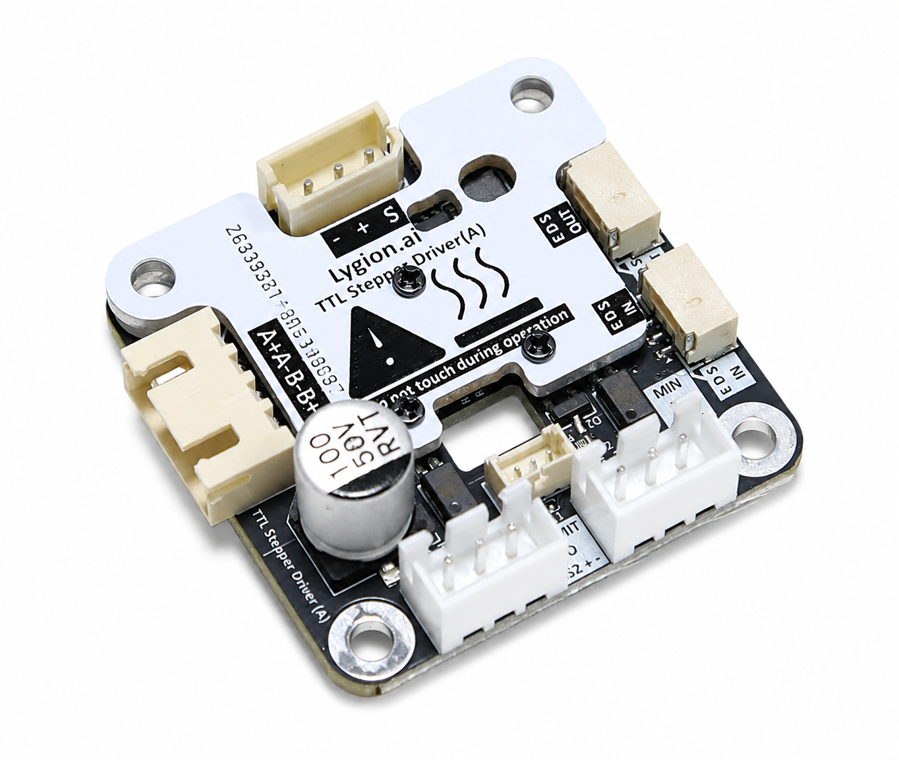
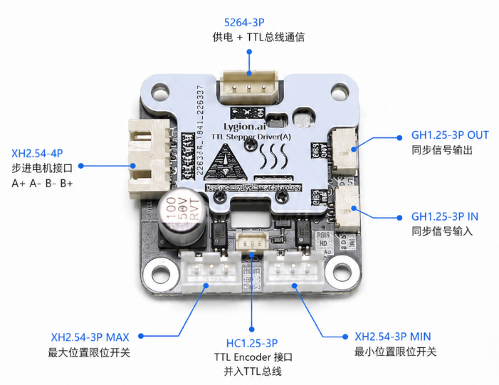
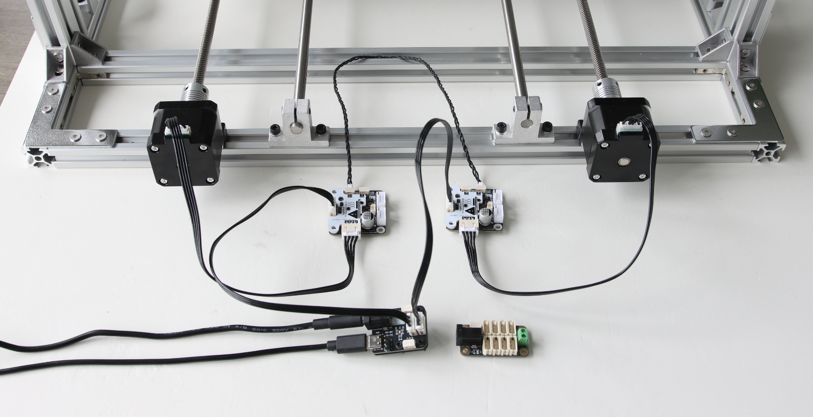
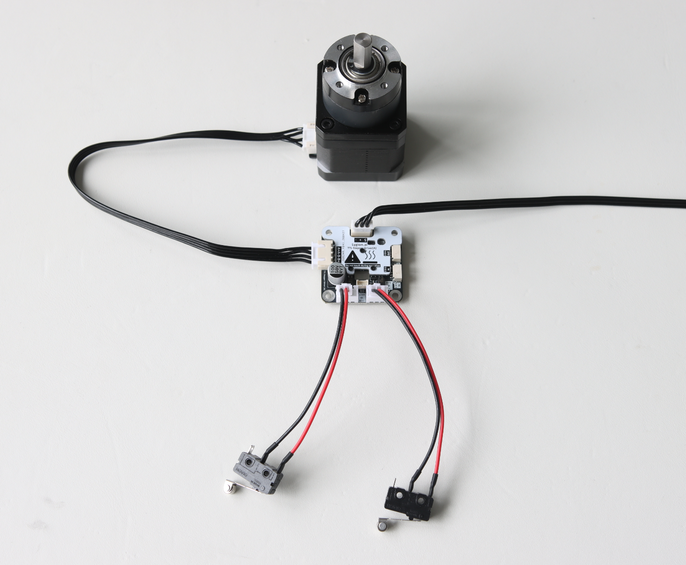

# TTL Stepper Driver (A)

<div class="ly-lang-switch">
  <div class="ly-lang-switch__buttons">
    <a class="ly-lang-switch__button" href="/en/bus-devices/ttl-stepper-driver-a">🌐English</a>
  </div>
</div>

TTL Stepper Driver (A) 是一款基于单线 TTL 总线通信的双极步进电机驱动板。它可以让普通两相步进电机像总线舵机一样被控制：上位机或 MCU 只需要通过 TTL 总线发送位置、速度、电流等控制指令，驱动板会完成底层步进驱动、加减速、状态反馈和保护逻辑。

本教程主要介绍如何连接 TTL Stepper Driver (A)，如何使用 Python SDK 进行位置控制、速度控制、反馈读取、同步控制，以及如何理解常用参数。

!!! info "适用对象"
    本文适合第一次使用 TTL Stepper Driver (A) 的用户。若你已经熟悉 Lygion TTL 总线设备，也可以直接跳转到“Python SDK 示例”章节。

---

## 1. 产品功能概览

TTL Stepper Driver (A) 支持以下功能：

- 单线 TTL 总线通信
- 位置模式控制
- 速度模式控制
- 从动同步模式
- 多设备同步写入
- 多设备同步读取
- 当前位置与速度反馈
- 电压、温度、移动状态等反馈
- 当前位置基准设置
- ID、模式、分辨率等参数设置
- 限位开关输入
- 心跳保护
- 自动限流、过流、过热等保护机制
- 与 Lygion TTL 总线设备混合使用
- 与飞特 STS / SMS / HLS 等 TTL 总线舵机混合使用

TTL Stepper Driver (A) 适合用于机器人关节、丝杆滑台、转台、轮式底盘、夹爪、教学平台、机械臂和多电机同步控制等场景。

{ .img-rounded width="300" }

---

## 2. 主要参数

| 项目 | 参数 |
| --- | --- |
| 产品名称 | TTL Stepper Driver (A) |
| 通信方式 | 单线 TTL 总线 |
| 默认通信速率 | 1 Mbps |
| 输入电压 | DC 9~26V |
| 最大电流 | 1.5A |
| 适用电机 | 双极步进电机 |
| 微步设置 | 1、1/2、1/4、1/8、1/16、1/32（默认） |
| 控制模式 | 位置模式 / 速度模式 / 从动同步模式 |
| 反馈信息 | 当前位置、当前速度、电压、温度、移动状态、目标位置等 |
| 限位接口 | MIN / LIMIT |
| 同步接口 | EDS IN / EDS OUT |
| 开发支持 | Python SDK、C/C++ SDK、示例程序 |

!!! warning "供电电压确认"
    TTL Stepper Driver (A) 支持 DC 9~26V 输入。若同一根总线上还连接了其它设备，请确认所有设备都支持当前总线供电电压。

---

## 3. 接口与接线说明

TTL Stepper Driver (A) 集成了电源与 TTL 总线接口、步进电机接口、限位开关接口和同步接口。

建议在正式上电前确认以下连接：

- 电源电压是否在 DC 9~26V 范围内
- 步进电机线序是否正确
- TTL 总线的 `+ / - / S` 是否接线正确
- 总线上是否存在重复 ID
- 限位开关是否接到正确接口

{ .img-rounded }

---

## 4. 硬件连接

### 4.1 使用 PC / Raspberry Pi / Jetson / Mac 控制

推荐使用 [TTL Adapter (A)](ttl-adapter-a.md) 将 USB 转换为单线 TTL 总线，再连接 TTL Stepper Driver (A)。

```text
PC / Raspberry Pi / Jetson / Mac
        │ USB
        ▼
TTL Adapter (A)
        │ 5264-3P TTL Bus
        ▼
TTL Stepper Driver (A)
        │
        ▼
Stepper Motor
```

TTL Adapter (A) 可为 TTL 总线提供电源输入。使用时可以将 DC 9~26V 电源接入 TTL Adapter (A)，再通过总线给 TTL Stepper Driver (A) 供电。

!!! warning "请不要只依赖 USB 给电机供电"
    USB 只能用于通信或为低功耗设备供电。步进电机运行时需要外部 DC 9~26V 电源，否则可能无法正常驱动电机，或导致通信不稳定。

---

### 4.2 使用 Arduino / ESP32S3 / STM32 等 MCU 控制

如果使用 MCU 控制 TTL Stepper Driver (A)，通常有三种方式。

#### 方式 A：使用 Lygion ESP32S3 Robot Driver

```text
ESP32S3 Robot Driver
        │ 5264-3P TTL Bus
        ▼
TTL Stepper Driver (A)
        │
        ▼
Stepper Motor
```

ESP32S3 Robot Driver 板载 UART 转单线 TTL 电路，适合直接接入 Lygion TTL 总线设备。

#### 方式 B：用户自行设计 UART 转单线 TTL 电路

```text
MCU UART
        │
        ▼
UART 转单线 TTL 电路
        │
        ▼
TTL Stepper Driver (A)
```

这种方式适合已经有自定义主控板或机器人控制板的用户。

#### 方式 C：MCU UART 接 TTL Adapter (A)

```text
ESP32 / STM32 UART
        │ RX → RX
        │ TX → TX
        ▼
TTL Adapter (A)
        │
        ▼
TTL Stepper Driver (A)
```

!!! note "RX / TX 连接说明"
    当 TTL Adapter (A) 作为通信转接板使用时，外部 MCU 的 UART 与 TTL Adapter (A) 的 UART 连接通常是 `RX 接 RX`、`TX 接 TX`。这与普通 USB-TTL 模块的交叉接线方式不同。

---

## 5. 软件环境

Python 示例适用于：

- Windows
- Linux
- macOS
- Raspberry Pi
- Jetson

C++ / Arduino 示例适用于：

- ESP32S3
- ESP32
- Arduino Mega2560
- STM32 Arduino Core
- 其它支持硬件串口的控制器

推荐 Python 版本：

```text
Python >= 3.8
```

获取 Python SDK：

```bash
git clone https://github.com/LygionOrganization/lygion_devs_py.git
cd lygion_devs_py
```

如果无法访问 GitHub，也可以通过本站下载：

[本站 Python SDK 链接](assets/files/lygion_devs_py.zip)

C++ SDK：

```text
https://github.com/LygionOrganization/lygion_devs_cpp
```

如果无法访问 GitHub，也可以通过本站下载：

[本站 C++ SDK 链接](assets/files/lygion_devs_cpp.zip)

---

## 6. 确认串口名称

连接 TTL Adapter (A) 后，需要确认系统识别到的串口名称。

| 系统 | 常见串口名称 |
| --- | --- |
| Windows | `COM3`、`COM4`、`COMx` |
| Linux | `/dev/ttyUSB0`、`/dev/ttyAMA0` |
| macOS | `/dev/tty.usbserial-xxxx` |

Windows 下可通过“设备管理器 → 端口（COM 和 LPT）”查看串口号。

Linux 下可使用：

```bash
ls /dev/ttyUSB*
```

或：

```bash
dmesg | grep tty
```

!!! tip "CH343 / CH34X 驱动"
    TTL Adapter (A) 使用 CH343 USB 转串口芯片。部分 Linux、Raspberry Pi 或旧系统可能无法自动识别串口，此时需要安装 CH343 / CH34X 驱动。

---

## 7. 第一次使用前的注意事项

### 7.1 默认 ID

TTL Stepper Driver (A) 默认 ID 通常为：

```text
1
```

第一次设置多个驱动板时，请不要将多个默认 ID 相同的设备同时接到同一根总线上。

正确流程：

```text
1. 一次只连接一个新驱动板
2. 修改该驱动板 ID
3. 断开后连接下一个驱动板
4. 每个驱动板设置为不同 ID
5. 最后再将多个已经设置好 ID 的驱动板一起连接到总线
```

!!! warning "不要重复 ID"
    同一根 TTL 总线上不能存在重复 ID。重复 ID 会导致通信冲突，表现为读取失败、数据异常、多个设备同时响应或通信不稳定。

### 7.2 默认波特率

TTL Stepper Driver (A) 默认波特率为：

```text
1000000
```

即 1 Mbps。

如果你修改过波特率，需要在 SDK 示例中使用相同的波特率。若总线上混合连接多个设备，也需要确认这些设备的波特率一致。

### 7.3 如何修改 ID、运行模式或分辨率

可以使用 Windows 下的 FD.exe 飞特舵机调试软件，也可以使用 SDK 中的参数写入示例。

!!! note
    FD 软件的使用教程在 [快速开始](../getting-started.md#fd-software) 中有介绍。

    - [下载 FD 软件](../assets/files/FD.7z)

---

## 8. 运行模式说明

TTL Stepper Driver (A) 常用运行模式包括：

| 模式 | 名称 | 典型用途 |
| --- | --- | --- |
| Mode 0 | 位置模式 | 控制电机转到指定位置 |
| Mode 1 | 速度模式 | 控制电机连续正转、反转或停止 |
| Mode 2 | 从动同步模式 | 多个驱动板通过 EDS 同步接口跟随主设备运动 |

### 8.1 位置模式

位置模式用于让电机运动到指定目标位置。

典型指令：

```python
packetHandler.WritePosEx(ID, position, speed, acc, current)
```

参数含义：

| 参数 | 含义 |
| --- | --- |
| `ID` | 设备 ID |
| `position` | 目标位置 |
| `speed` | 速度参数 |
| `acc` | 加速度参数 |
| `current` | 目标相电流参数 |

默认设置下，步进电机一圈对应 3200 微步，位置值范围约为 `0~65534`，最大控制范围约为 20.5 圈。

!!! tip "位置模式适合场景"
    位置模式适合转台、机械臂关节、滑台、夹爪、丝杆机构等需要到达指定位置的应用。

---

### 8.2 速度模式

速度模式用于让电机连续运行，可以正转、反转或停止。

典型流程：

```python
packetHandler.WheelMode(ID)
packetHandler.WriteSpec(ID, speed, acc, current)
```

速度可以为正数或负数：

```text
speed > 0：正向旋转
speed < 0：反向旋转
speed = 0：停止
```

!!! warning "速度模式建议开启心跳保护"
    速度模式下，如果上位机程序异常、通信中断或主控掉线，电机可能持续运行。建议配置心跳保护时间，让电机在长时间没有收到新控制指令时自动停止。

---

### 8.3 从动同步模式

从动同步模式用于多个步进电机保持同步运动。典型场景包括：

- 多丝杆升降平台
- 双电机同步驱动
- 并联机构
- 多轴需要保持一致运动的结构

使用方式概览：

```text
1. 将从设备设置为 Mode 2
2. 设置从设备的副 ID，使其跟随主设备
3. 使用 GH1.25-3P 连接线连接 EDS 同步接口
4. 后续只需要控制主设备 ID，从设备会自动跟随
```

EDS 同步接口连接方向：

```text
主设备 EDS OUT  →  从设备 EDS IN
从设备 EDS OUT  →  下一个从设备 EDS IN
```

!!! warning "EDS 同步接口方向不能接反"
    EDS 同步接口有方向要求，应使用 `主设备 EDS OUT → 从设备 EDS IN` 的方式级联，不要反接。

!!! note "从动模式与同步控制的区别"
    同步写也可以实现多个步进电机同步动作的效果，但是对于类似同步控制丝杆类的场景，最保险的方式还是在设备底层去实现同步动作，这样就不会出现由于应用层的程序没有写好而导致丝杆驱动不同步的风险，如果你再主设备上增加了限位开关，限位开关的效果也会同步作用于从设备，从而从底层实现更加可靠的控制算法。

{ .img-rounded }

---

## 9. 位置、速度、加速度和电流参数

### 9.1 位置参数

默认设置下：

```text
步进电机一圈 = 3200 微步
位置范围 = 0~65534
最大控制圈数 ≈ 65534 / 3200 ≈ 20.48 圈
```

如果需要更大的多圈控制范围，可以修改角度分辨率参数。该参数可以通过 FD 软件或程序脚本设置，取值范围为 `1~128`。

例如将角度分辨率设置为 `3` 后，等效每圈步数变为：

```text
3200 / 3
```

此时位置 `0~65534` 对应的实际圈数约为：

```text
65534 / (3200 / 3) ≈ 61.44 圈
```

!!! info "分辨率与控制范围"
    提高角度分辨率参数可以扩大位置模式下的多圈控制范围，但位置控制精度会相应降低。

---

### 9.2 速度参数

在不修改默认相位设置的情况下，运行速度参数的单位为：

```text
50 微步 / 秒
```

例如速度参数设置为 `400` 时：

```text
400 × 50 = 20000 微步/秒
```

默认一圈为 `3200` 微步，则对应转速为：

```text
400 × 50 × 60 / 3200 = 375 RPM
```

换算关系：

```text
RPM = 速度参数 × 50 × 60 / 3200
速度参数 = RPM × 3200 / 50 / 60
```

!!! tip "速度参数建议"
    建议运行速度参数默认不超过 `400`。更高速度需要根据电机绕组电感、输入电压、相电流设置、负载惯量和加速度参数进行实际测试。

!!! note "速度与分辨率设置无关"
    3200 这个数值是固定的，降低分辨率不会改变速度的最大值，因为精度分辨率只作用于驱动板内部的位置控制，要提升最高速度，需要改变相位值，文档后续会介绍对应的高阶操作

---

### 9.3 加速度参数

设置运行速度时，建议配置合适的加速度参数，不建议将加速度设置为 `0`。

```text
加速度参数单位 = 100 微步 / 秒²
```

!!! warning "加速度 = 0 的含义"
    加速度设置为 `0` 表示最高加速度，接近直接切换速度。若电机启动或高速运行时出现只响不转、轻微受力就停转、抖动或失步，建议优先降低目标速度和加速度。

合适的加速度可以让电机更平滑地启动、停止和变速，同时降低失步风险。

---

### 9.4 电流参数

TTL Stepper Driver (A) 设置的是电机绕组中的相电流，不是电源适配器或电源表显示的输入电流。

HR8825 采用斩波恒流控制，会限制电机绕组中的相电流。示例中常用：

```python
current = 150
```

!!! note "相电流与电源电流不同"
    电源显示的是驱动板从电源端吸取的母线电流，它会受到输入电压、电机阻抗、电机电感、转速、负载、细分设置和驱动效率等因素影响。因此，在相同电流设置下，不同输入电压或不同电机对应的电源显示电流可能不同，这是正常现象。

若需要估算相电流，可参考：

```text
相电流 ≈ 3.3 × 2 × (参数 / 1000)
```

例如参数为 `200` 时：

```text
相电流 ≈ 3.3 × 2 × (200 / 1000) = 1.32A
```

---

## 10. 限位开关

TTL Stepper Driver (A) 有两个限位开关接口：

```text
MIN
LIMIT
```

每个限位接口包含三个引脚：

```text
S / + / -
```

当 `S` 引脚被拉高时，会触发对应的限位功能。

{ .img-rounded }

### 10.1 机械限位开关接法

对于常见机械限位开关，可以使用常开接法：

```text
限位开关一端接 S
限位开关另一端接 +
```

当限位开关被按下时，`S` 被拉高，即可触发限位功能。

### 10.2 光电 / 金属感应限位开关接法

对于光电限位开关或金属感应限位开关，建议选择 PNP 型。

```text
限位开关正极接 +
限位开关负极接 -
限位开关信号线接 S
```

当限位开关达到触发条件后，信号端输出高电平，即可触发对应限位功能。

### 10.3 不同运行模式下的限位逻辑

#### 位置模式（Mode = 0）

位置模式下，只有 `LIMIT` 接口的限位功能有效。

```text
LIMIT 用于限制运动的最大位置。
触发后，电机不能继续向更大的目标位置运动。
但仍然可以向更小的目标位置运动。
```

#### 速度模式（Mode = 1）

速度模式下，`MIN` 和 `LIMIT` 两个限位接口都可以使用。

```text
MIN：用于限制负方向运动
LIMIT：用于限制正方向运动
```

### 10.4 使用速度模式完成回零

如果使用步进电机驱动丝杆机构，并安装了限位开关，可以使用速度模式完成回零流程。

典型流程：

```text
1. 开机后将运行模式设置为速度模式（Mode 1）
2. 给电机一个回零方向的目标速度
3. 电机向 MIN 限位方向运动
4. MIN 限位被触发后，电机停止
5. 将当前位置设置为零点参考
6. 再切换回位置模式（Mode 0）
```

!!! tip "为什么用速度模式回零"
    驱动板上电后的当前位置默认认为是 0，而位置模式目标范围通常为 `0~65534`。回零动作通常需要先使用速度模式完成，回零后系统才有明确的零点参考。

---

## 11. 心跳保护

心跳保护功能用于提高速度模式下的安全性。该功能仅在运行模式 `1`，即速度模式下有效。

如果上位机长时间没有发送新的控制指令，电机会自动停止运行。该功能可以避免程序异常、通信中断或上位机掉线后，车轮或执行机构持续运动。

心跳保护时间可以通过 FD 软件或程序脚本设置。需要注意，应设置的是：

```text
心跳保护时间
```

不是：

```text
保护时间
```

心跳保护时间的单位为：

```text
100 ms
```

例如设置为 `30`，表示：

```text
30 × 100 ms = 3000 ms = 3 秒
```

也就是 3 秒内没有接收到新的控制指令时，电机会自动停止运行。

---

## 12. Python SDK 快速开始

### 12.1 公共代码结构

Python 示例都有相同的串口初始化结构：

```python
import sys
import os

sys.path.append("..")
from lydevs_sdk import *

portHandler = PortHandler('/dev/ttyUSB0')
packetHandler = TTLSDClass(portHandler)

if portHandler.openPort():
    print("Succeeded to open the port")
else:
    print("Failed to open the port")
    quit()

if portHandler.setBaudRate(1000000):
    print("Succeeded to change the baudrate")
else:
    print("Failed to change the baudrate")
    quit()
```

需要根据实际系统修改串口名称：

```python
# Windows
portHandler = PortHandler('COM3')

# Linux
portHandler = PortHandler('/dev/ttyUSB0')

# macOS
portHandler = PortHandler('/dev/tty.usbserial-xxxx')
```

---

### 12.2 使用 `ttlsd_ping.py` 测试通信

示例文件：

```text
ttlsd_ping.py
```

该示例用于测试是否可以与指定 ID 的设备通信。

核心代码：

```python
model_number, result, error = packetHandler.ping(1)
```

如果通信正常，会输出类似：

```text
[ID:001] ping Succeeded. lynode model number : xxx
```

如果失败，请检查串口、波特率、ID、供电和接线。

---

### 12.3 使用 `ttlsd_read.py` 读取位置和速度

示例文件：

```text
ttlsd_read.py
```

该示例用于连续读取 ID 1 的当前位置和当前速度。

核心代码：

```python
position, speed, result, error = packetHandler.ReadPosSpeed(1)
```

运行：

```bash
python ttlsd_read.py
```

读取结果示例：

```text
[ID:001] PresPos:3200 PresSpd:0
```

参数说明：

| 返回值 | 含义 |
| --- | --- |
| `position` | 当前电机位置（常用） |
| `speed` | 当前电机速度（常用） |
| `result` | 通信状态 |
| `error` | 设备错误信息 |

---

### 12.4 使用 `ttlsd_write.py` 进行位置控制

示例文件：

```text
ttlsd_write.py
```

该示例用于控制 ID 1 电机在两个位置之间往复运动。

核心代码：

```python
packetHandler.WritePosEx(1, 3200, 600, 0, 150)
```

参数含义：

```text
ID = 1
目标位置 = 3200
速度参数 = 600
加速度参数 = 0
电流参数 = 150
```

!!! warning "示例中的速度和加速度仅用于演示"
    示例代码中 `speed=600`、`acc=0` 是为了快速演示运动效果。实际项目中建议根据电机和负载降低速度，设置合适的加速度，并逐步测试。

建议改为更保守的参数开始测试：

```python
packetHandler.WritePosEx(1, 3200, 200, 10, 150)
```

然后根据实际负载逐步提高速度和加速度。

---

### 12.5 使用 `read_write.py` 边运动边读取状态

示例文件：

```text
read_write.py
```

该示例会发送位置控制指令，并循环读取当前位置、速度和移动状态，直到电机到达目标位置。

核心读取逻辑：

```python
position, speed, result, error = packetHandler.ReadPosSpeed(ID)
moving, result, error = packetHandler.ReadMoving(ID)
```

当 `moving == 0` 时，表示当前运动已经结束。

该示例适合学习如何在应用层判断电机是否到位。

---

### 12.6 使用 `ttlsd_wheel.py` 进行速度控制

示例文件：

```text
ttlsd_wheel.py
```

该示例用于速度模式控制。

首先将设备设置为速度模式：

```python
packetHandler.WheelMode(1)
```

然后发送速度控制指令：

```python
packetHandler.WriteSpec(1, 600, 0, 150)
packetHandler.WriteSpec(1, 0, 0, 150)
packetHandler.WriteSpec(1, -600, 0, 150)
```

含义：

```text
600：正向旋转
0：停止
-600：反向旋转
```

!!! warning "速度模式安全提示"
    使用速度模式前，建议先配置心跳保护，并确认机械结构不会因为持续运行造成危险。第一次测试建议使用较低速度，例如 `100` 或 `200`。

---

### 12.7 使用 `sync_read.py` 同步读取多个设备

示例文件：

```text
sync_read.py
```

该示例用于同时读取多个总线设备的位置和速度。

默认示例读取 ID 1~10：

```python
for scs_id in range(1, 11):
    groupSyncRead.addParam(scs_id)
```

如果只有 ID 1、2、3 三个设备，应改为：

```python
for scs_id in range(1, 4):
    groupSyncRead.addParam(scs_id)
```

也可以手动添加指定 ID：

```python
groupSyncRead.addParam(1)
groupSyncRead.addParam(3)
groupSyncRead.addParam(7)
```

!!! warning "同步读取前请确认 ID"
    只应添加真实存在的设备 ID。如果代码读取未连接的 ID，可能会出现同步读取失败或等待超时。

---

### 12.8 使用 `sync_write.py` 同步控制多个设备

示例文件：

```text
sync_write.py
```

该示例用于将多个设备的目标位置、速度、加速度和电流参数打包后一次性发送。

核心代码：

```python
packetHandler.SyncWritePosEx(scs_id, 3200, 600, 0, 150)
packetHandler.groupSyncWrite.txPacket()
packetHandler.groupSyncWrite.clearParam()
```

使用场景：

- 多关节同时启动
- 多个滑台同步运动
- 多个电机需要尽量减少启动时间差

如果只控制 ID 1、2、3，应将默认循环范围改为：

```python
for scs_id in range(1, 4):
    packetHandler.SyncWritePosEx(scs_id, 3200, 200, 50, 150)
```

---

### 12.9 使用 `reg_write.py` 预写入后统一执行

示例文件：

```text
reg_write.py
```

该示例先把目标位置等参数分别写入多个设备的寄存器缓存，然后通过 `RegAction()` 统一执行。

核心代码：

```python
packetHandler.RegWritePosEx(scs_id, 3200, 600, 0, 150)
packetHandler.RegAction()
```

`RegWrite + RegAction` 与 `SyncWrite` 都可以用于多设备同步控制，但逻辑略有不同：

| 方法 | 特点 |
| --- | --- |
| `SyncWrite` | 一次性广播写入多个设备的目标参数 |
| `RegWrite + RegAction` | 先分别写入缓存，再统一触发执行 |

---

### 12.10 使用 `ttlsd_ofscal.py` 设置当前位置基准

示例文件：

```text
ttlsd_ofscal.py
```

该示例用于将当前实际位置设置为指定位置值。

核心代码：

```python
packetHandler.reOfsCal(1, 1024)
```

含义：

```text
将 ID 1 当前实际位置设置为 1024
```

典型用途：

- 将机械零位设置为 `0`
- 将当前位置设置为中位 `1600`
- 回零后将当前位置设为系统零点
- 装配后统一校准多个机构的参考位置

!!! note "校准结果保存"
    对于 TTL Stepper Driver (A) 这款产品，`reOfsCal()` 设置后的校准结果掉电不保存，每次开机后需要根据回零或编码器读数，重新校准。

---

### 12.11 使用 `ttlsd_eprom.py` 设置参数

示例文件：

```text
ttlsd_eprom.py
```

该示例展示了如何解锁 EPROM、设置 ID、设置模式、设置分辨率等参数。

常见流程：

```python
packetHandler.TorqueEn(1, 0)
packetHandler.unLockEprom(1)
packetHandler.SetID(254, 1)
packetHandler.SetMode(1, 0)
packetHandler.SetResolution(1, 1)
packetHandler.LockEprom(1)
```

!!! warning "设置新产品 ID 前请确认总线中只有一个目标设备"
    由于产品出厂 ID 都是 1，且总线上不能有相同 ID 的设备，修改 ID 参数时，建议总线上只连接一个待设置设备，避免误改其它设备。

!!! note "关于广播 ID 254"
    示例中 `SetID(254, 1)` 使用广播 ID 设置设备 ID。该操作只适合总线上只有一个设备时使用。

---

### 12.12 使用 `ttlsd_recover.py` 恢复出厂设置

示例文件：

```text
ttlsd_recover.py
```

核心代码：

```python
packetHandler.Recover(1)
```

该功能会将指定 ID 的设备恢复到出厂参数。

!!! danger "谨慎使用恢复出厂设置"
    恢复出厂设置可能会改变 ID、模式、分辨率等关键参数。执行前请确认总线上只有目标设备，并记录当前配置。

---

## 13. C++ / Arduino SDK 简要说明

如果使用 ESP32S3、ESP32、Arduino Mega2560、STM32 Arduino Core 或其它 MCU，也可以通过 C++ / Arduino SDK 控制 TTL Stepper Driver (A)。

C++ SDK 示例通常包括：

| 示例 | 用途 |
| --- | --- |
| `FeedBack.ino` | 读取位置、速度、电压、温度等反馈 |
| `WritePos.ino` | 位置模式控制 |
| `WriteSpe.ino` | 速度模式控制 |
| `SyncRead.ino` | 同步读取多个设备 |
| `SyncWritePos.ino` | 同步写入多个目标位置 |
| `SyncWriteSpe.ino` | 同步写入多个速度 |
| `RegWritePos.ino` | 预写入后统一执行 |
| `ProgramEprom.ino` | 参数设置 |
| `CalibrationOfs.ino` | 设置当前位置基准 |

ESP32S3 常见串口配置：

```cpp
Serial1.begin(1000000, SERIAL_8N1, 18, 17);
ttlsd.pSerial = &Serial1;
```

Mega2560 常见串口配置：

```cpp
Serial1.begin(1000000);
ttlsd.pSerial = &Serial1;
```

---

## 14. 常用函数速查

| 函数 | 用途 |
| --- | --- |
| `packetHandler.ping(ID)` | 测试设备是否在线 |
| `packetHandler.ReadPosSpeed(ID)` | 读取当前位置和当前速度 |
| `packetHandler.ReadMoving(ID)` | 读取移动状态 |
| `packetHandler.WritePosEx(ID, pos, speed, acc, current)` | 位置模式控制 |
| `packetHandler.WheelMode(ID)` | 设置为速度模式 |
| `packetHandler.WriteSpec(ID, speed, acc, current)` | 速度模式控制 |
| `packetHandler.SyncWritePosEx(ID, pos, speed, acc, current)` | 添加同步写入位置参数 |
| `packetHandler.groupSyncWrite.txPacket()` | 发送同步写入数据包 |
| `packetHandler.RegWritePosEx(ID, pos, speed, acc, current)` | 预写入位置参数 |
| `packetHandler.RegAction()` | 触发预写入指令执行 |
| `packetHandler.reOfsCal(ID, position)` | 设置当前位置基准 |
| `packetHandler.TorqueEn(ID, enable)` | 使能或关闭输出 |
| `packetHandler.unLockEprom(ID)` | 解锁 EPROM |
| `packetHandler.LockEprom(ID)` | 锁定 EPROM |
| `packetHandler.SetID(old_id, new_id)` | 设置设备 ID |
| `packetHandler.SetMode(ID, mode)` | 设置运行模式 |
| `packetHandler.GetMode(ID)` | 读取运行模式 |
| `packetHandler.SetResolution(ID, resolution)` | 设置位置分辨率 |
| `packetHandler.Recover(ID)` | 恢复出厂设置 |

---

## 15. 常见使用流程

### 15.1 单个电机位置控制

```text
1. 连接 TTL Adapter (A)
2. 连接 TTL Stepper Driver (A)
3. 连接步进电机
4. 接入 DC 9~26V 电源
5. 确认串口名称
6. 运行 ttlsd_ping.py 确认通信
7. 使用 ttlsd_eprom.py 或 FD 软件确认模式为位置模式
8. 运行 ttlsd_write.py 控制电机转到目标位置
9. 使用 ttlsd_read.py 或 read_write.py 查看当前位置和移动状态
```

### 15.2 单个电机速度控制

```text
1. 确认电机和驱动板连接正常
2. 建议先设置心跳保护时间
3. 将运行模式设置为速度模式
4. 运行 ttlsd_wheel.py
5. 使用较低速度参数测试正转、停止、反转
```

### 15.3 多电机同步控制

```text
1. 分别为每个驱动板设置不同 ID
2. 确认所有驱动板波特率一致
3. 将多个驱动板接入同一根 TTL 总线
4. 使用 sync_read.py 检查多个设备是否都能正常读取
5. 使用 sync_write.py 或 reg_write.py 发送多设备同步运动指令
```

### 15.4 丝杆机构回零

```text
1. 安装 MIN 限位开关
2. 将运行模式设置为速度模式
3. 给电机一个向 MIN 方向运行的速度
4. 触发 MIN 限位后电机停止
5. 使用 reOfsCal() 将当前位置设置为 0
6. 切换回位置模式
7. 后续使用位置模式进行精确控制
```

---

## 16. 常见问题排查

### Q1：找不到串口设备怎么办？

可能原因：

- CH343 / CH34X 驱动未安装
- USB 线只支持充电，不支持数据传输
- TTL Adapter (A) 未正确连接
- 系统权限不足，无法访问串口

解决方法：

- 更换支持数据传输的 USB 线
- 在 Windows 设备管理器中查看是否出现 CH343 设备
- Linux / Raspberry Pi 系统如无法识别，请安装 CH343 / CH34X 驱动
- Linux 下可检查当前用户是否有串口访问权限

---

### Q2：可以 ping 成功，但电机不转怎么办？

请检查：

- 是否接入了外部 DC 9~26V 电源
- 步进电机线序是否正确
- 电机是否为双极步进电机
- 电流参数是否过低
- 运行模式是否正确
- 是否触发了限位
- 是否已经关闭 Torque
- 电机负载是否过大

---

### Q3：电机只响不转或容易失步怎么办？

常见原因：

- 速度参数过高
- 加速度参数过高或设置为 `0`
- 电流参数过低
- 输入电压偏低
- 电机绕组电感较高，高速性能不足
- 负载惯量过大
- 细分设置不合适

建议处理方式：

```text
1. 降低速度参数
2. 设置较小但非 0 的加速度
3. 适当提高电流参数
4. 提高输入电压到电机和驱动允许范围内
5. 空载测试确认驱动是否正常
6. 再逐步增加负载
```

---

### Q4：为什么电源显示的电流和设置的电流不同？

驱动板设置的是电机绕组中的相电流，不是电源输入电流。

电源显示的是驱动板从电源端吸取的母线电流，它会受到输入电压、电机阻抗、电机电感、转速、负载、细分设置和驱动效率等因素影响。

因此，在相同相电流设置下，不同输入电压或不同电机对应的电源显示电流不同，是正常现象。

---

### Q5：速度参数如何理解？

速度参数默认单位为：

```text
50 微步/秒
```

默认一圈为 `3200` 微步时：

```text
RPM = 速度参数 × 50 × 60 / 3200
```

例如速度参数为 `400`：

```text
400 × 50 × 60 / 3200 = 375 RPM
```

---

### Q6：位置模式为什么默认只能控制约 20.5 圈？

默认一圈为 3200 微步，位置范围为 `0~65534`：

```text
65534 / 3200 ≈ 20.48 圈
```

如果需要更大多圈控制范围，可以修改角度分辨率参数。例如设置为 `3` 后，控制范围约为：

```text
65534 / (3200 / 3) ≈ 61.44 圈
```

但位置控制精度会相应降低。

---

### Q7：限位触发后为什么还能往另一个方向运动？

这是正常逻辑。

限位用于阻止电机继续向危险方向运动，但通常允许电机反向离开限位位置。否则，一旦触发限位，电机将无法退出限位状态。

---

### Q8：心跳保护功能是什么？

心跳保护用于速度模式安全保护。

如果上位机长时间没有发送新的控制指令，驱动板会自动停止电机，避免程序异常、通信中断或主控掉线后电机持续运行。

心跳保护时间单位为 `100 ms`。

例如设置为 `30`，表示：

```text
30 × 100 ms = 3 秒
```

---

### Q9：同步控制如何使用？

同步控制用于多个步进电机保持同步动作。

常见方式有两种：

```text
方式一：总线同步写入
使用 sync_write.py 或 RegWrite + RegAction，让多个驱动板几乎同时收到目标指令。

方式二：EDS 从动同步
设置从设备为 Mode 2，并通过 EDS IN / OUT 接口让从设备跟随主设备。
```

总线同步适合一般多轴控制；EDS 从动同步更适合多丝杆升降、双电机同步驱动等需要强同步的机械结构。

---

### Q10：可以和总线舵机或 TTL Encoder E02 接在一起吗？

可以。

TTL Stepper Driver (A) 可以与飞特 STS / SMS / HLS 总线舵机、Lygion TTL Encoder E02、Lygion TTL 总线设备接入同一根 TTL 总线。

需要注意：

- ID 不能重复
- 波特率需要一致
- 总线电压需要兼容所有设备
- 总线设备数量较多时，需要保证供电稳定

---

## 17. 示例代码入口

Python SDK：

```text
https://github.com/LygionOrganization/lygion_devs_py
```

相关示例：

```text
ttlsd_ping.py
ttlsd_read.py
ttlsd_write.py
ttlsd_wheel.py
read_write.py
sync_read.py
sync_write.py
reg_write.py
ttlsd_ofscal.py
ttlsd_eprom.py
ttlsd_recover.py
```

C++ SDK：

```text
https://github.com/LygionOrganization/lygion_devs_cpp
```

相关示例：

```text
FeedBack.ino
WritePos.ino
WriteSpe.ino
SyncRead.ino
SyncWritePos.ino
SyncWriteSpe.ino
RegWritePos.ino
ProgramEprom.ino
CalibrationOfs.ino
```

---

## 18. 相关资源

### 飞特舵机调试软件 FD

- [下载 FD 软件](../assets/files/FD.7z)

### SDK

[GitHub Python SDK 链接](https://github.com/LygionOrganization/lygion_devs_py)

[GitHub C++ SDK 链接](https://github.com/LygionOrganization/lygion_devs_cpp)

如果无法访问 GitHub，也可以通过本站下载：

[本站 Python SDK 链接](assets/files/lygion_devs_py.zip)

[本站 C++ SDK 链接](assets/files/lygion_devs_cpp.zip)

### STEP 模型

[TTL Stepper Driver (A) STEP](assets/files/TTL_SD_Simple Assembly.step)

---

