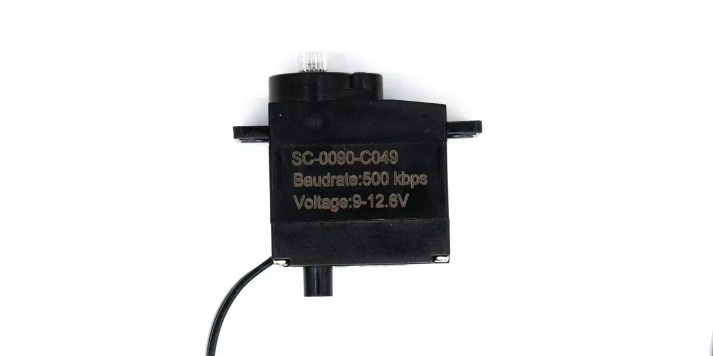

# SC-0090-C049 Dual-Shaft TTL Bus Servo

SC-0090-C049 is a compact dual-shaft TTL serial bus servo. Its specification model is `SCS0009-C049`. Electrically it is close to the SC-0090-C043, but the dual-shaft structure makes it a better fit for small joints and linkage mechanisms that need support on both sides.

{ .img-rounded width="420" }

[Download 3D Model](../../../../reference/bus-devices/bus-servos/assets/SC-0090-C049.step){ .md-button download }

## Key Specifications

| Item | Value |
| --- | --- |
| Specification model | `SCS0009-C049` |
| Output structure | Dual shaft |
| Operating voltage | DC 8-12.6V |
| Recommended supply | 3S lithium battery pack or DC supply up to 12.6V |
| No-load speed | 0.12sec/60deg, about 83RPM |
| No-load current | 150mA |
| Stall torque | 5.5kg.cm |
| Stall current | 0.6A |
| Static current | 8mA |
| Rated load | 1.83kg.cm |
| Rated current | 200mA |
| Kt constant | 9.1kg.cm/A |
| Operating temperature | -20 to 60degC |
| Storage temperature | -30 to 80degC |

## Mechanical Data

| Item | Value |
| --- | --- |
| Dimensions | 23.2 x 12.1 x 25.25mm |
| Weight | 11.5 +/- 2g |
| Housing | PC |
| Gears | Metal |
| Bearing | None |
| Angle sensor | Carbon-film potentiometer |
| Sensor range | 330deg |
| Output spline | 20T / OD 3.95mm |
| Gear ratio | 1/416 |
| Backlash | <=0.5deg |
| Output screw | M2.0 x 4 |
| Motor | Cored motor |

## 3D Model and Horns

- [Servo body STEP](../../../../reference/bus-devices/bus-servos/assets/SC-0090-C049.step){ download }
- [Round horn STP](../../../../reference/bus-devices/bus-servos/assets/arms-0090/cycle.stp){ download }
- [Half-arm horn STP](../../../../reference/bus-devices/bus-servos/assets/arms-0090/haftarm.stp){ download }
- [Single-arm horn STP](../../../../reference/bus-devices/bus-servos/assets/arms-0090/onearm.stp){ download }
- [Cross horn STP](../../../../reference/bus-devices/bus-servos/assets/arms-0090/tenarm.stp){ download }

## Connector and Pinout

| Item | Value |
| --- | --- |
| Connector | 1.25mm 3P |
| Cable length | 14 +/- 0.5cm |
| Pin 1 | Signal / TTL |
| Pin 2 | Vcc |
| Pin 3 | GND |

!!! warning "Verify the actual cable before wiring"
    Cable colors may vary between batches. Use the connector definition and product markings rather than color alone.

## Control Characteristics

| Item | Value |
| --- | --- |
| Control signal | Digital packet |
| Protocol | Half-duplex asynchronous serial, 8 data bits, 1 stop bit, no parity |
| ID range | 0-253, factory default ID 1 |
| Baud rate | 38400bps-500000bps, factory default 500000bps |
| Control algorithm | PID, configurable |
| Center position | 511 |
| Controllable angle | 310 +/- 5deg, position range 20-1003 |
| Electronic resolution | 0.322deg/pulse, 330deg/1024 |
| Default direction | Clockwise, 0 to 1023, configurable |
| Feedback | Load, position, operating speed |
| Operating mode | Mode 0: position servo mode, 0-310deg |

## Protection and Reliability

- Overload protection: triggers after load exceeds 80% of stall torque for 2s. Send a new position command to clear the overload flag.
- Maximum position update rate: 1ms.
- Logic high: 2-5V.
- Logic low: 0-0.45V.
- Load life test: more than 50,000 cycles.
- Waterproofing: not waterproof.

## Getting Started

- [Power and Wiring](../../../tutorials/power-and-wiring-basics.md)
- [Device IDs and Baud Rates](../../../tutorials/device-id-and-baudrate.md)
- [FD Device Utility](../../../tutorials/fd-tool.md)
- [Find the Serial Port](../../../tutorials/find-serial-port.md)
- [Communication Troubleshooting](../../../tutorials/communication-troubleshooting.md)

!!! tip "Align both sides carefully"
    The dual-shaft structure improves support, but the bracket must be aligned well. Misalignment adds friction and side load.
