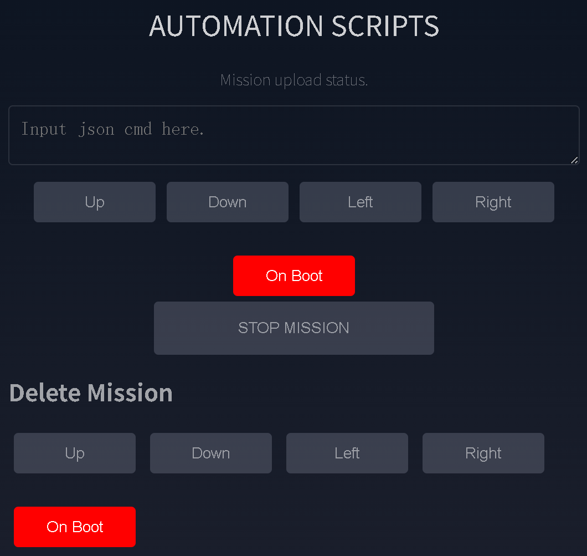

# Action Scripting

The firmware stores action sequences as mission files in onboard LittleFS. Each mission contains an introduction line followed by one JSON command per step.

Use missions to choreograph several servos, create a repeatable startup action, or bind actions to the onboard joystick.

## Build a Mission in the Web App

1. Use the servo-control **Add** buttons to generate JSON commands.
2. Insert delay commands where the mechanism needs time to move.
3. Review the resulting commands in the action-script editor.
4. Save the script to a mission name.
5. Run the mission while keeping an emergency stop path available.

{ .img-rounded width="700" }

## Reserved Mission Names

| Mission name | Trigger |
| --- | --- |
| `up` | Joystick Up |
| `down` | Joystick Down |
| `left` | Joystick Left |
| `right` | Joystick Right |
| `boot_user` | Runs repeatedly in a separate task after startup |

The default `boot` mission stores system configuration such as Wi-Fi settings. Do not use it for ordinary robot motion.

## Mission-Management JSON Commands

| Task | Example |
| --- | --- |
| Create a mission | `{"T":301,"name":"demo","intro":"First demo"}` |
| Show mission content | `{"T":302,"name":"demo"}` |
| Append a step | `{"T":303,"name":"demo","json":"{\"T\":51,\"delay\":1000}"}` |
| Insert a step | `{"T":304,"name":"demo","step":2,"json":"{\"T\":51,\"delay\":500}"}` |
| Replace a step | `{"T":305,"name":"demo","step":2,"json":"{\"T\":51,\"delay\":1000}"}` |
| Delete a step | `{"T":306,"name":"demo","step":2}` |
| Run one step | `{"T":307,"name":"demo","step":1}` |
| Run a mission | `{"T":308,"name":"demo","interval":0,"loop":1}` |
| Delete a mission | `{"T":309,"name":"demo"}` |
| Stop the active loop | `{"T":0}` |

`loop: -1` repeats indefinitely. Use that only when a reliable stop command and safe motion envelope are available.

## Example Mission

Conceptually, a two-move mission contains:

```json
{"T":11,"id":1,"pos":1500,"spd":200,"acc":20}
{"T":51,"delay":1000}
{"T":11,"id":1,"pos":2500,"spd":200,"acc":20}
{"T":51,"delay":1000}
```

!!! warning "Test each command before saving an automatic mission"
    A `boot_user` mission starts automatically. Verify every step at low speed with the robot secured before enabling it.

Resetting LittleFS removes saved missions. See [Firmware flashing and reset](firmware-flash-and-reset.md).
