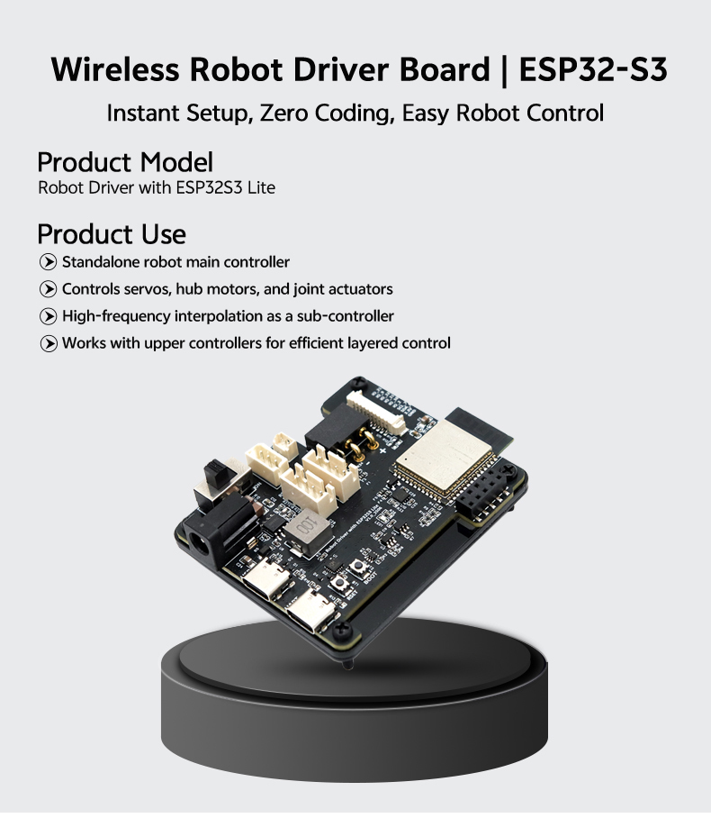
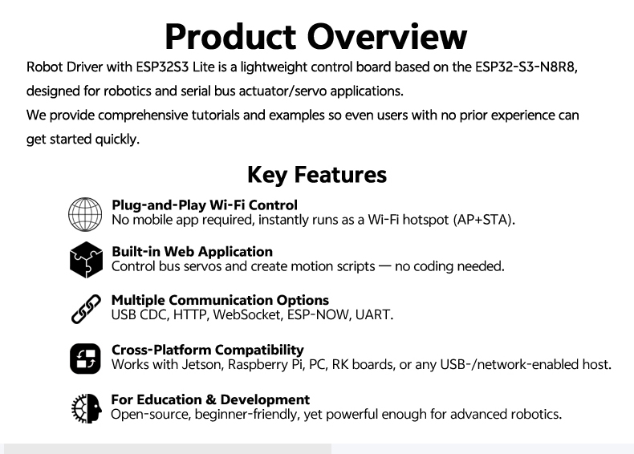

# Robot Driver with ESP32S3 Lite

Robot Driver with ESP32S3 Lite is an ESP32-S3-N8R8-based robot controller with a built-in browser application. It can operate as a standalone controller or as a lower-level controller paired with a Raspberry Pi, Jetson, PC, or another host.

{ .img-rounded width="500" }

## What It Can Do

- Control compatible TTL and RS485 bus servos
- Interface with CAN-based hub motors and joint actuators
- Run browser-created action scripts from onboard storage
- Accept the same JSON commands over the Web App, USB CDC, HTTP, WebSocket, UART, and ESP-NOW
- Provide onboard OLED, buzzer, RGB, and joystick controls
- Perform high-frequency interpolation as a robot sub-controller

{ .img-rounded width="600" }

## Start Here

1. [Identify the board resources and power behavior](board-resources.md).
2. [Connect to the built-in Web App](quickstart.md).
3. Test one servo with a read or feedback command.
4. Choose [USB CDC](usb-cdc-wired-communication.md), [HTTP](http-wireless-communication.md), or [WebSocket](websocket-wireless-communication.md) for host integration.
5. Use [action scripts](action-scripting.md) for stored sequences.

## Documentation

- [Board resources and power](board-resources.md)
- [Web App quick start](quickstart.md)
- [Action scripting](action-scripting.md)
- [JSON command interface](json-command-interaction.md)
- [USB CDC communication](usb-cdc-wired-communication.md)
- [HTTP communication](http-wireless-communication.md)
- [WebSocket communication](websocket-wireless-communication.md)
- [Firmware flashing and reset](firmware-flash-and-reset.md)
- [Advanced firmware development](advanced-development.md)
- [S.BUS development](sbus-development.md)
- [FAQ](faq.md)

## Official Firmware

[Robot Driver with ESP32S3 Lite source and examples](https://github.com/LygionOrganization/robot_driver_with_esp32s3_lite)

!!! warning "Power actuators from the peripheral supply"
    USB Type-C powers the controller and onboard functions. Servos, hub motors, and actuators require a compatible supply through the DC or XT30 input with the peripheral power switch on.
