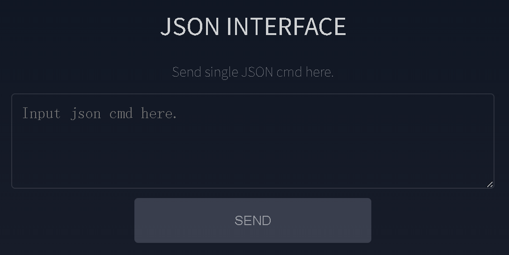

# JSON Command Interface

JSON is the common command format used by the Web App and all host communication methods. A command is a JSON object whose `T` field selects the operation.

{ .img-rounded width="700" }

## Try a Harmless Command

Display text on OLED line 1:

```json
{"T":202,"line":1,"text":"Hello, world!","update":1}
```

Sound the buzzer for one second:

```json
{"T":206,"freq":1000,"duration":1000}
```

Request board information:

```json
{"T":50}
```

## Common Servo Commands

| Purpose | Example |
| --- | --- |
| Move an ST / SM servo | `{"T":11,"id":1,"pos":2047,"spd":200,"acc":20}` |
| Set ST / SM midpoint | `{"T":12,"id":1}` |
| Change ST / SM ID | `{"T":13,"old_id":1,"new_id":2}` |
| Enable or release torque | `{"T":14,"id":1,"state":1}` |
| Read ST / SM feedback | `{"T":15,"id":1}` |
| Move HLS servo with current limit | `{"T":21,"id":1,"pos":2047,"spd":200,"acc":20,"cl":500}` |
| Move SCS servo | `{"T":31,"id":1,"pos":511,"time":1000,"spd":200}` |

## Board and System Commands

| Purpose | Example |
| --- | --- |
| Set bus baud rate | `{"T":10,"baud":1000000}` |
| Set all onboard RGB LEDs | `{"T":201,"id":40,"set":[9,0,0]}` |
| Clear OLED | `{"T":205}` |
| Get Wi-Fi settings | `{"T":401}` |
| Get AP IP | `{"T":402}` |
| Get STA IP | `{"T":403}` |
| Get MAC address | `{"T":412}` |
| Send a CAN frame | `{"T":501,"id":291,"ext":0,"data":[17,34,51]}` |
| Reboot ESP32-S3 | `{"T":600}` |

## Responses

Commands that return data generally use JSON responses. Several feedback commands use the negative form of their command type in the response. WebSocket clients also receive device telemetry with `T: 50` approximately once per second.

## Sending Commands

Use the same JSON objects through:

- The Web App JSON Interface
- [USB CDC](usb-cdc-wired-communication.md), terminated by a newline
- [HTTP POST](http-wireless-communication.md) to `/api/cmd`
- [WebSocket](websocket-wireless-communication.md) at `/ws`
- UART or ESP-NOW in custom integrations

!!! warning "Validate IDs, limits, and motion values"
    JSON commands are executed by the board. Start with feedback, display, and low-speed commands before enabling automatic or broadcast motion.

The authoritative command list is defined in `src/Config.h` of the [official firmware repository](https://github.com/LygionOrganization/robot_driver_with_esp32s3_lite).
