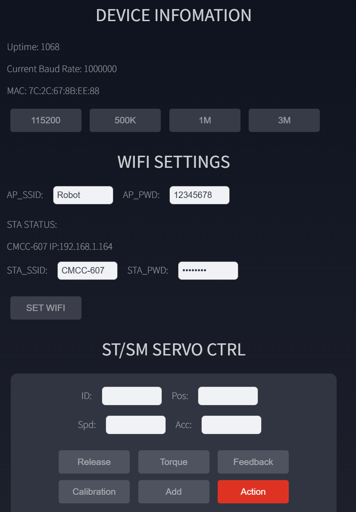
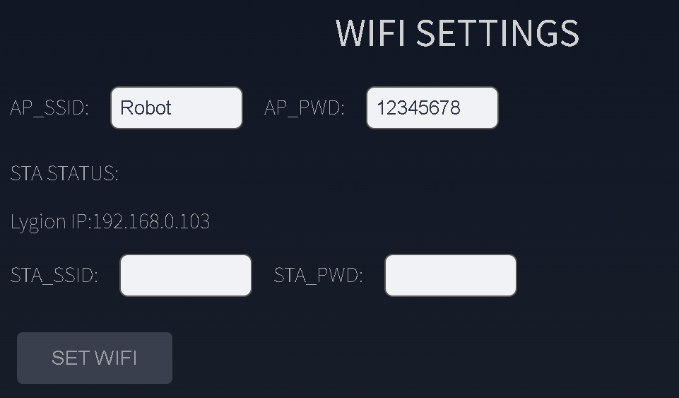
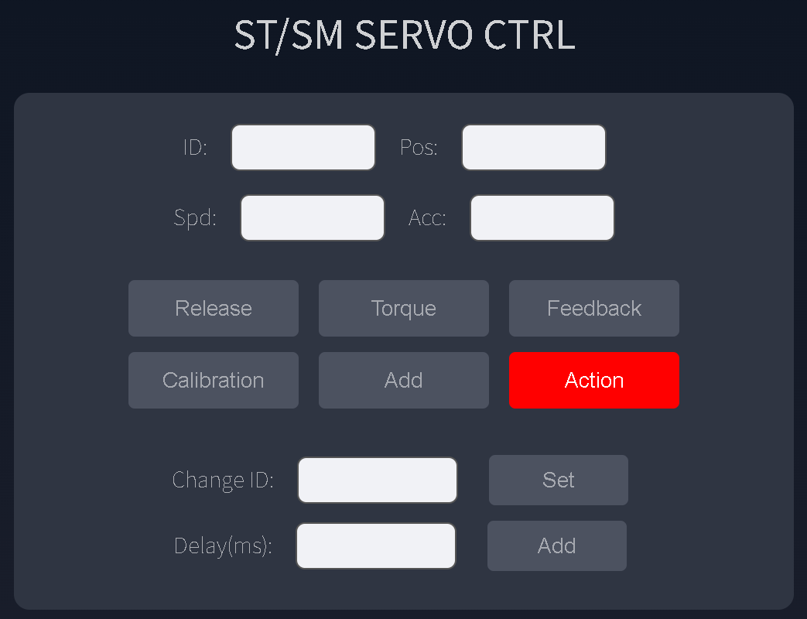
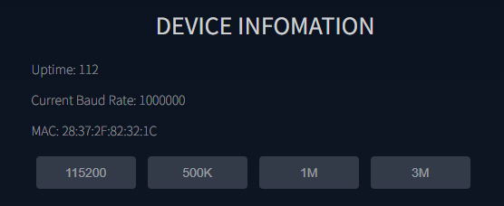

# Web App Quick Start

The factory firmware starts a Wi-Fi access point and serves a browser-based control panel. No application installation is required.

## 1. Power the Board

- USB Type-C is enough to power the board, OLED, Wi-Fi, and Web App.
- To operate servos or motors, connect a compatible supply through the DC or XT30 input and turn the peripheral power switch on.

At startup, the buzzer sounds and the OLED shows network information.

## 2. Connect to the Default Hotspot

From a phone or computer, connect to:

```text
SSID: Robot
Password: 12345678
```

Your device may report **No Internet**. Stay connected; the network is used to access the controller directly.

For multi-board systems, change the default SSID and password so every board has a unique network.

## 3. Open the Web App

Open a current browser and visit:

```text
http://192.168.4.1/
```

{ .img-rounded width="700" }

The Web App provides device information, Wi-Fi settings, servo controls, action scripts, and a raw JSON command interface.

## 4. Join an Existing Wi-Fi Network

Open **Wi-Fi Setting**, enter the router SSID and password, and apply the settings. After a successful connection, the OLED shows the STA IP address on the next startup.

Open that STA IP from a computer on the same network. AP and STA operate together in the default firmware.

{ .img-rounded width="700" }

## 5. Test One Servo Safely

1. Connect one compatible servo.
2. Apply the voltage required by that servo.
3. Confirm the servo ID and bus baud rate.
4. Use **Feedback** before commanding movement.
5. Use a conservative target position and keep the mechanism clear.

{ .img-rounded width="700" }

!!! warning "Broadcast ID 254 affects every compatible device"
    Use it only when one target device is connected.

## Device Information

The device-info panel displays the current bus baud rate, AP and STA addresses, MAC address, and uptime. Uptime should increase once per second while the WebSocket connection is healthy.

{ .img-rounded width="700" }
