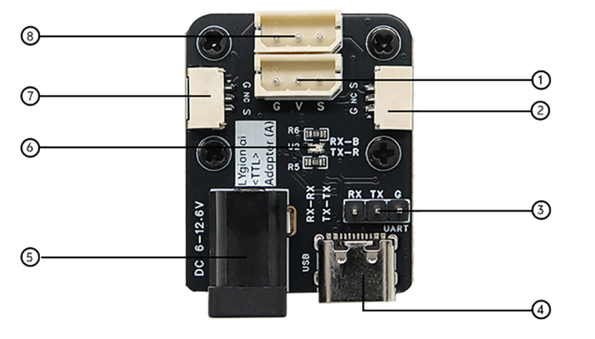
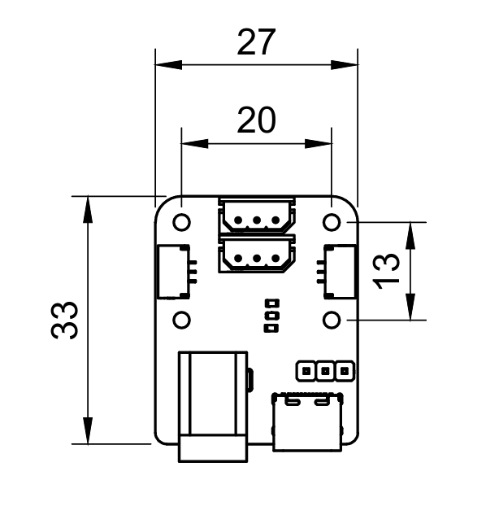

# TTL Adapter (A) Hardware Overview

TTL Adapter (A) combines USB, an MCU UART, a single-wire TTL bus connection, and an external power input.

## Board Resources

{ .img-rounded width="600" }

| No. | Resource | Purpose |
| --- | --- | --- |
| 1 | HX-5264-3P TTL bus connector | Connect bus devices, servos, and driver boards |
| 2 | GH-1.25-3P board-to-board connector | Extend communication or cascade boards |
| 3 | UART RX / TX / GND | Connect an ESP32, STM32, Arduino, or another MCU |
| 4 | USB Type-C | PC communication, configuration, and SDK development |
| 5 | DC5521 power input | Apply an external bus supply |
| 6 | Communication indicators | Show bus activity |

## Dimensions

{ .img-rounded width="360" }

| Item | Value |
| --- | --- |
| Width | 27 mm |
| Height | 35 mm |
| Mounting-hole diameter | 2.1 mm |
| Mounting-hole spacing | 13 x 20 mm |

## CAD Model

[Download TTL Adapter (A) STEP model](../../../../reference/bus-devices/ttl-adapter-a/assets/ttl-adapter-a.step)
