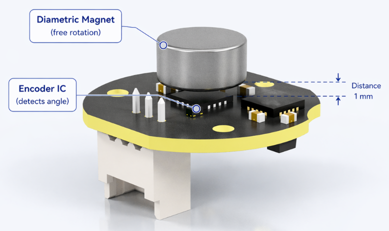

# TTL Encoder E02 Hardware Installation

TTL Encoder E02 measures the rotation of a radial magnet attached to a shaft, gear, or pulley, then reports position and speed over the TTL bus.

```text
Rotating shaft / gear / pulley
        | radial magnet
        v
Magnet rotates with the shaft
        |
        v
TTL Encoder E02 measures magnetic angle
        |
        v
Position and speed are reported over the TTL bus
```

At 12-bit resolution:

```text
0-4095 = 0-360 degrees
```

```python
angle_deg = position / 4096.0 * 360.0
```

## Mechanical Requirements

- Use a **radial magnet**, such as the supplied 6 x 2.5 mm radial magnet. Do not substitute a conventional axial magnet.
- Align the magnet center with the encoder IC center.
- Keep approximately 1 mm between the magnet and the top of the encoder IC.
- Avoid a gap greater than 1.5 mm.
- Minimize shaft eccentricity and wobble.
- Secure both the magnet and encoder PCB.

{ .img-rounded }

## Typical Connection

```text
PC / Raspberry Pi / Jetson / Mac
        | USB
        v
TTL Adapter (A)
        | 5264-3P
        v
HC-1.25 8P Hub (A)
        | HC-1.25-3P
        v
TTL Encoder E02
```

The encoder uses an HC-1.25-3P `- / + / S` connection. Use the supplied cable or verify orientation before connecting another cable.

## Installation Symptoms

| Symptom | Likely cause |
| --- | --- |
| Large angle jumps | Magnet is off-center, too far away, loose, or wobbling |
| Unstable readings | Unstable power, loose bus connection, or incorrect magnet spacing |
