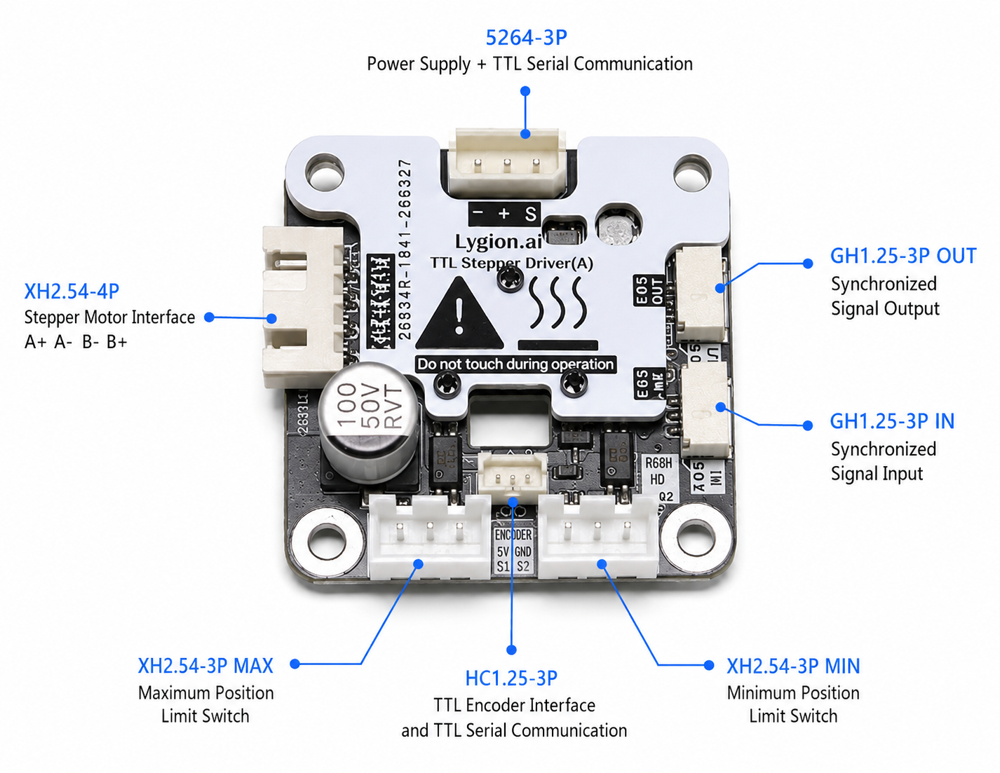

# TTL Stepper Driver (A) Hardware Wiring

The driver requires a TTL bus connection, external power, and a bipolar stepper motor. Inspect every connection before applying power.

```text
PC / Raspberry Pi / Jetson / Mac
        | USB
        v
TTL Adapter (A)
        | 5264-3P TTL bus
        v
TTL Stepper Driver (A)
        |
        v
Bipolar stepper motor
```

## Before Applying Power

- Confirm a DC 9-26 V supply.
- Verify the stepper motor phase wiring.
- Verify the TTL bus `+ / - / S` pin order.
- Check for duplicate device IDs.

{ .img-rounded }

## Power

An external DC 9-26 V supply is required to drive a motor. Do not rely on USB power.

## Stepper Motor Connection

Use a bipolar stepper motor and identify its A and B winding pairs. Incorrect phase wiring can cause vibration, noise, loss of torque, or no rotation.

## TTL Bus Connections

The 5264-3P connector can connect to:

- [TTL Adapter (A)](../ttl-adapter-a/index.md)
- [TTL-5264 8P Hub (A)](../hub-boards/ttl-5264-8p-hub-a.md)

The onboard HC-1.25-3P connection can conveniently add a [TTL Encoder E02](../ttl-encoder-e02/index.md) to the same bus.

!!! note "The driver does not read the attached encoder"
    The encoder connector only joins the encoder to the shared TTL bus. The host must read the encoder separately, and the encoder ID must differ from the driver ID.

## Limit Inputs

The driver provides `MIN` and `LIMIT` inputs. See [Limits, homing, and heartbeat protection](limits-homing-heartbeat.md).

## EDS Synchronization

Connect EDS in the direction of signal flow:

```text
Leader EDS OUT -> follower EDS IN
Follower EDS OUT -> next follower EDS IN
```

!!! warning "Do not reverse EDS IN and OUT"
    A reversed EDS chain prevents followers from tracking the leader correctly.
