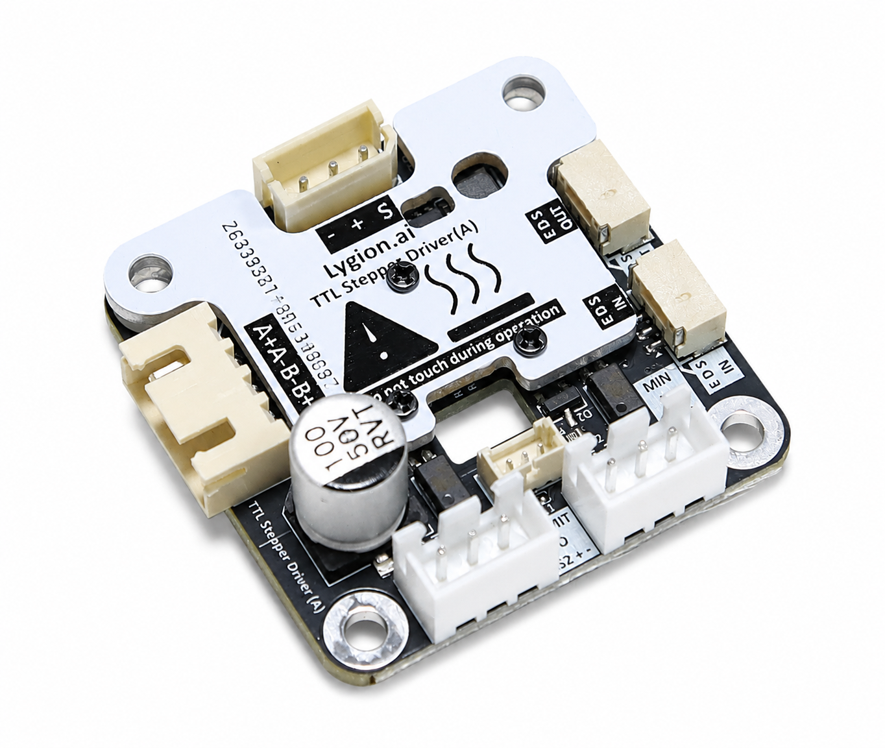

# TTL Stepper Driver (A)

TTL Stepper Driver (A) controls a bipolar stepper motor over the single-wire TTL bus. A host computer or MCU sends position, speed, acceleration, and current commands while the driver handles step generation, motion profiles, feedback, and protection.

{ .img-rounded width="360" }

## Capabilities

- Position and continuous-speed control
- EDS follower synchronization
- Multi-device synchronous reads and writes
- Position, speed, voltage, temperature, and moving-state feedback
- Limit-switch inputs
- Communication heartbeat protection
- Automatic current limiting, over-current protection, and over-temperature protection

## Specifications

| Item | Specification |
| --- | --- |
| Communication | Single-wire TTL bus |
| Default baud rate | 1 Mbps |
| Input voltage | DC 9-26 V |
| Maximum current | 1.5 A |
| Motor type | Bipolar stepper motor |
| Microstepping | Full, 1/2, 1/4, 1/8, 1/16, 1/32 default |
| Operating modes | Position, speed, EDS follower synchronization |

## Documentation

- [Hardware wiring](hardware-wiring.md)
- [Operating modes](operating-modes.md)
- [Motion and current parameters](parameters.md)
- [Control with Python](python-quickstart.md)
- [Control with C++ / Arduino](cpp-arduino.md)
- [Limits, homing, and heartbeat protection](limits-homing-heartbeat.md)
- [FAQ](faq.md)

Start with the [Python](../../../quickstart/python-first-demo.md) or [C++ / Arduino](../../../quickstart/cpp-first-demo.md) first demo.

!!! warning "Begin with conservative motion settings"
    Secure the motor and mechanism. Start with low speed, a nonzero acceleration value, and an appropriate current setting.
