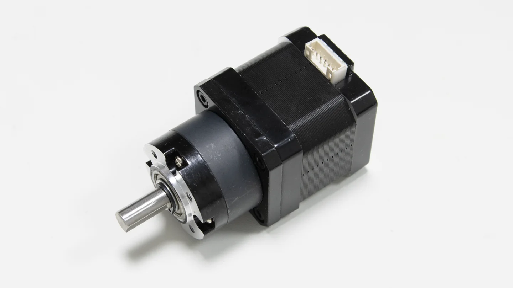
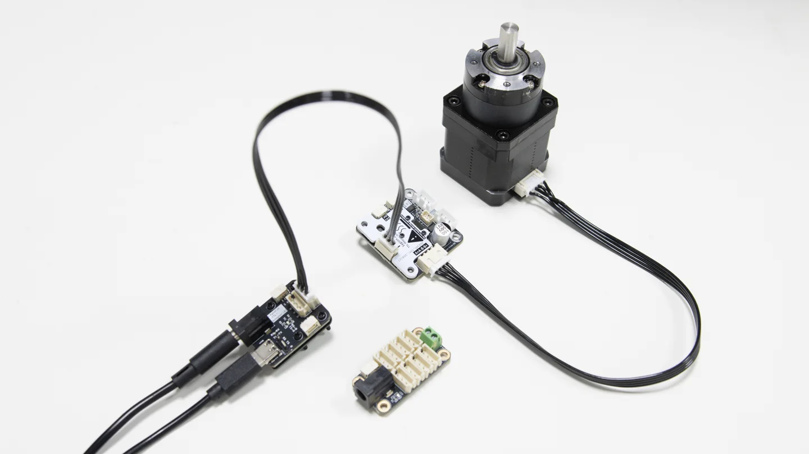
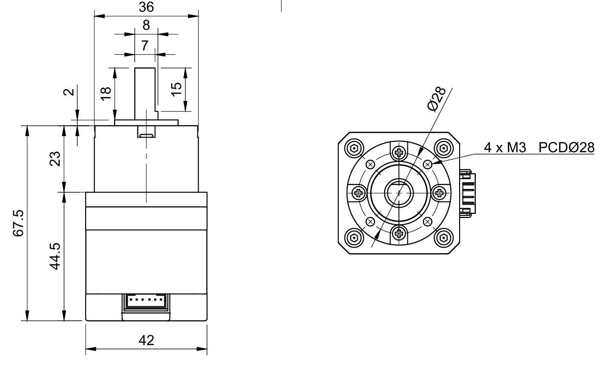
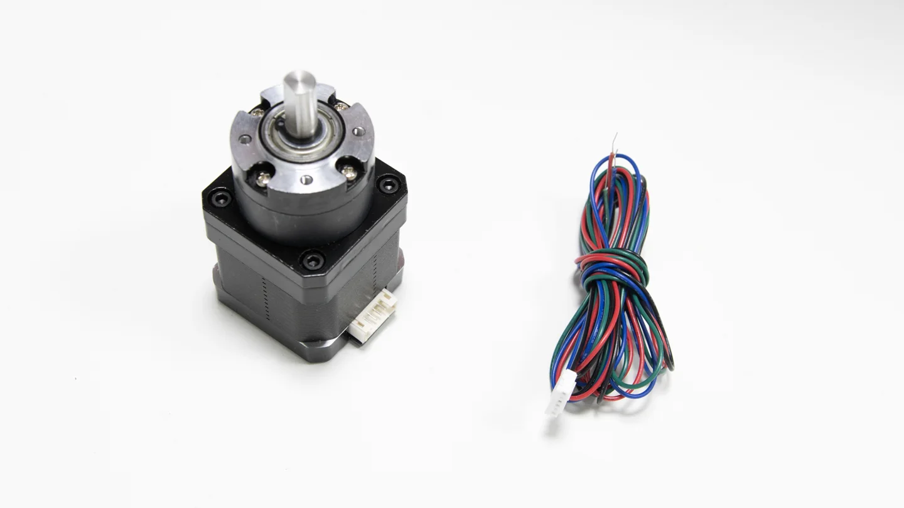

# 4240BY-G5.2 Stepper Motor

4240BY-G5.2 is a geared 42 mm bipolar stepper motor for robot mechanisms that need controlled rotary motion at relatively low speed. It can be used in mobile bases, small joints, turntables, linear stages, and belt or gear transmissions.

{ .img-rounded }

## Highlights

- 42 mm stepper motor body with an integrated reduction stage.
- Bipolar stepper motor interface, suitable for external stepper drivers.
- Works well with [TTL Stepper Driver (A)](../../bus-devices/ttl-stepper-driver-a/index.md) when TTL bus control is required.
- D-shaped output shaft and front mounting holes for couplers, timing pulleys, gears, or custom mechanisms.
- CAD files are available for mechanical integration.

## Typical Uses

- Mobile robot drive mechanisms
- Educational robot arms and small rotary joints
- Low-speed turntables and indexing fixtures
- Belt, gear, or lead-screw driven mechanisms

## Recommended Driver

Use the motor with a suitable bipolar stepper driver. For Lygion TTL bus projects, pair it with [TTL Stepper Driver (A)](../../bus-devices/ttl-stepper-driver-a/index.md).

```text
Host / MCU
    │
    ▼
TTL Adapter (A) or TTL bus controller
    │
    ▼
TTL Stepper Driver (A)
    │
    ▼
4240BY-G5.2
```

{ .img-rounded }

!!! warning "External power is required"
    Do not power the motor from USB. The stepper driver must be connected to a suitable external power supply.

## Mechanical Dimensions

{ .img-rounded }

| Item | Value |
| --- | --- |
| Motor frame | 42 mm class |
| Body width | 42 mm |
| Reference overall length | 67.5 mm |
| Output shaft | D-shaped shaft |
| Reference shaft diameter | 8 mm |
| Reference shaft extension | 18 mm |
| Front mounting holes | 4 x M3, PCD Ø28 |

!!! note "Check the CAD before fabrication"
    These values are useful for quick planning. Use the STEP, PDF, or DXF file as the final reference before machining or batch assembly.

## Bring-Up Tips

1. Start with conservative current, speed, and acceleration settings.
2. Verify motor phase wiring before connecting the mechanism to a load.
3. If the motor vibrates or only makes noise, check A/B phase order and reduce speed or acceleration.
4. During long tests, monitor motor temperature and driver cooling.

## Package Contents

{ .img-rounded }

## Downloads

| Resource | File |
| --- | --- |
| STEP model | [4240BY-G5.2.step](../../../../reference/modules/4240by-g5-2/assets/4240BY-G5.2.step) |
| Mechanical drawing PDF | [4240BY-G5.2.pdf](../../../../reference/modules/4240by-g5-2/assets/4240BY-G5.2.pdf) |
| DXF drawing | [4240BY-G5.2.dxf](../../../../reference/modules/4240by-g5-2/assets/4240BY-G5.2.dxf) |

## Related Pages

- [TTL Stepper Driver (A)](../../bus-devices/ttl-stepper-driver-a/index.md)
- [TTL Stepper Driver (A): Hardware Wiring](../../bus-devices/ttl-stepper-driver-a/hardware-wiring.md)
- [Downloads](../../../downloads/index.md)
