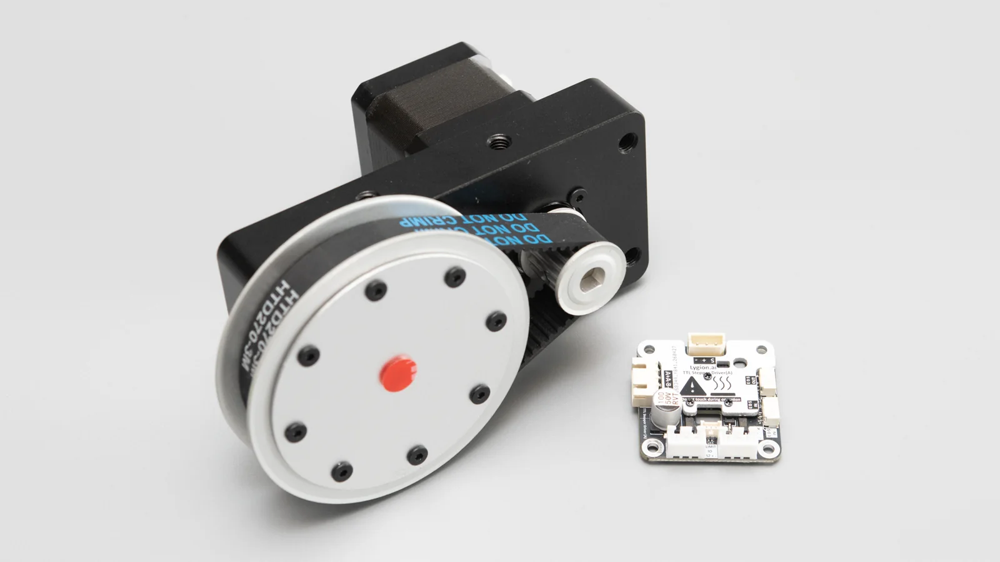
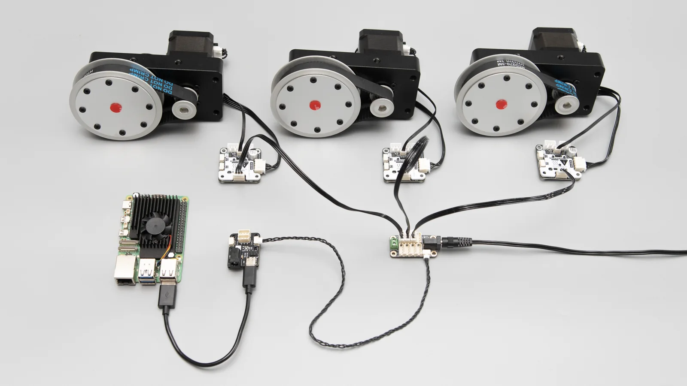
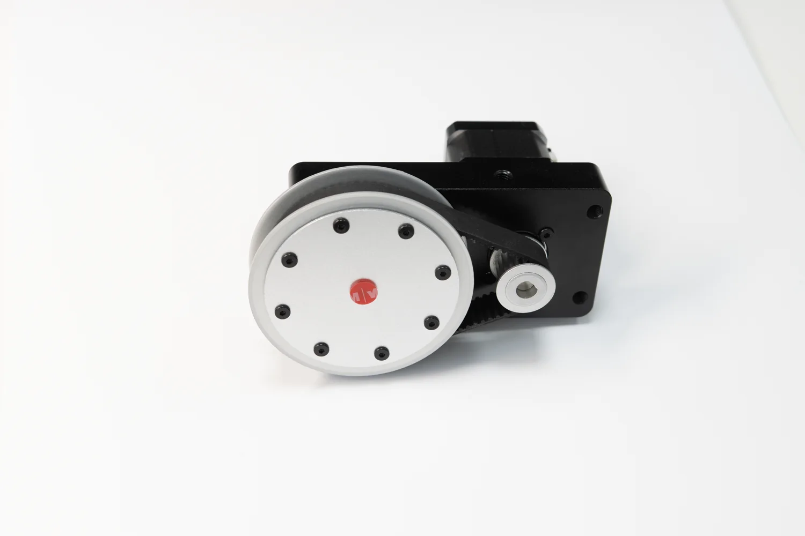
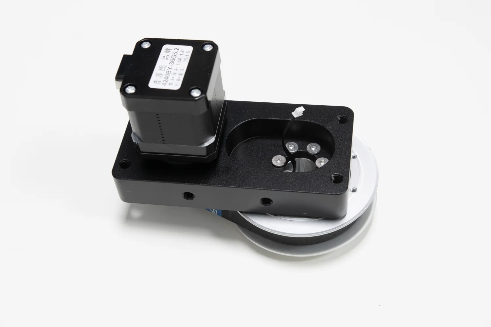
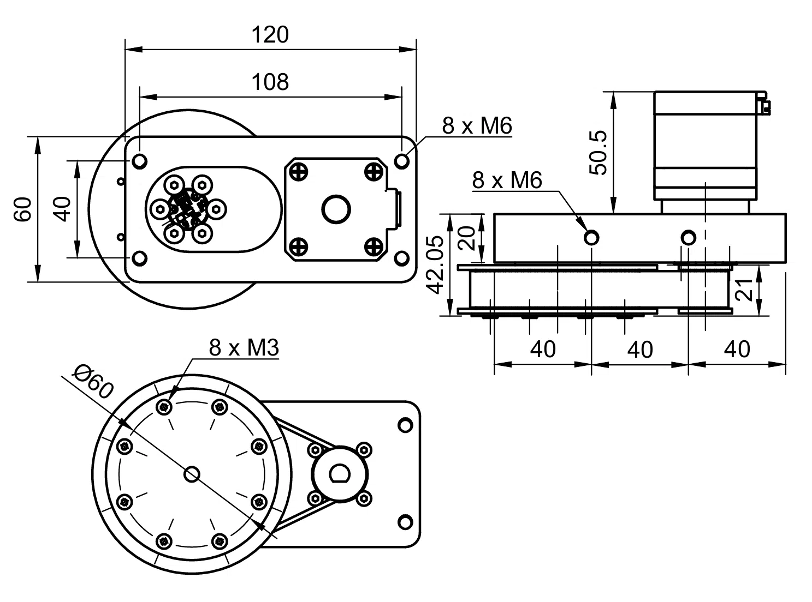
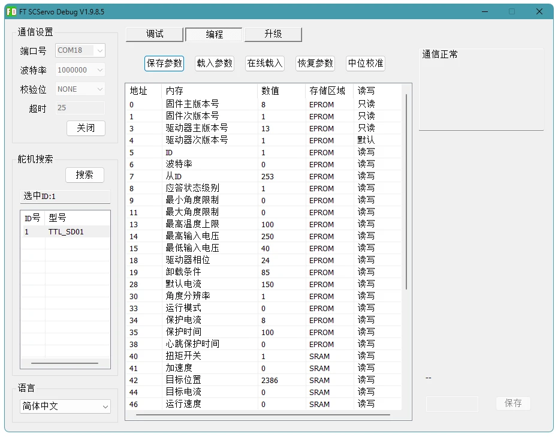
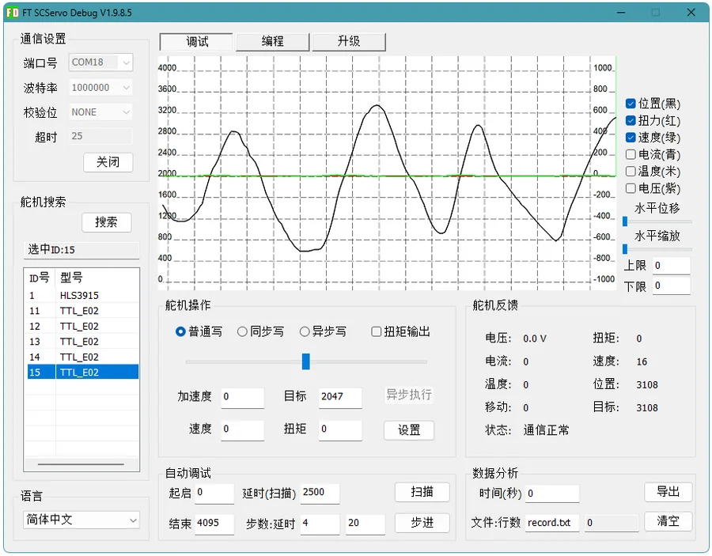
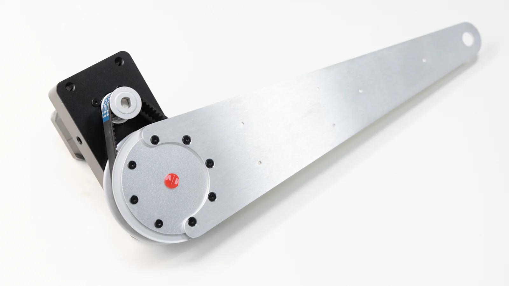
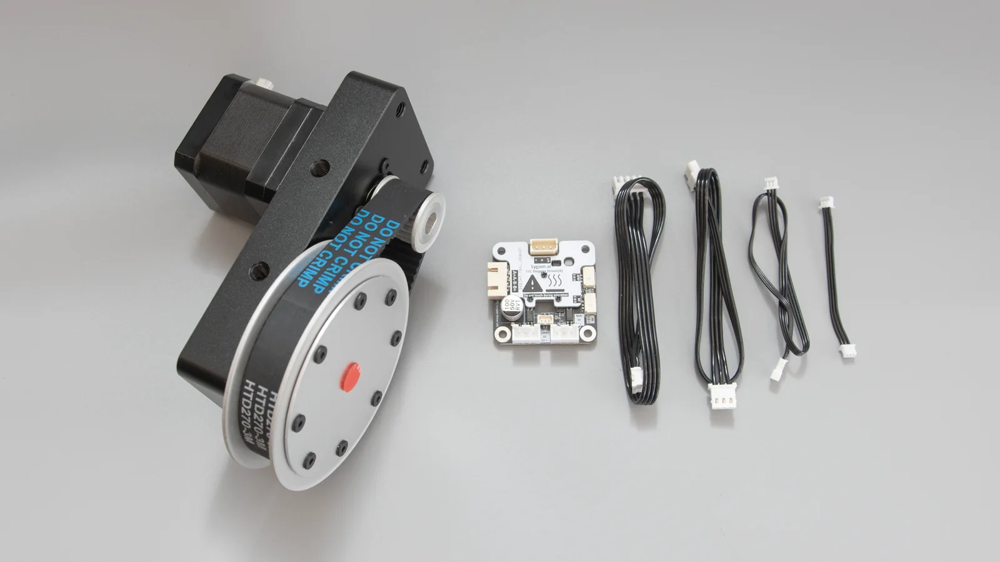

# DM42-G7220-E02 Joint Actuator

DM42-G7220-E02 is a belt-driven stepper joint actuator with output-side E02 encoder feedback. It is intended for small robot arms, steering joints, teaching platforms, and low-speed programmable rotary joints.

{ .img-rounded }

## Highlights

- Stepper-motor actuation for low-speed position control.
- Belt transmission keeps the motor offset from the output shaft.
- Output-side E02 encoder support for absolute angle feedback.
- Multiple mounting holes for plates, links, brackets, or aluminum profiles.
- Can be controlled through TTL Stepper Driver (A) and TTL Encoder E02 on the same TTL bus.

## System Overview

The stepper driver and encoder are two separate TTL bus devices. Give them different IDs. The controller reads the encoder and sends position commands to the driver.

```text
Host / MCU
    │
    ▼
TTL Adapter (A) or TTL bus controller
    ├── TTL Stepper Driver (A) ── stepper motor
    └── TTL Encoder E02 ─────── output angle feedback
```

{ .img-rounded }

!!! note "The driver does not close the loop by itself"
    TTL Stepper Driver (A) does not automatically read the E02 encoder. If your application needs startup angle recovery or closed-loop logic, your host program must read the encoder and command the driver.

## Mechanical Structure

{ .img-rounded }

{ .img-rounded }

## Dimensions

{ .img-rounded }

| Item | Value |
| --- | --- |
| Reference base plate size | 120 x 60 mm |
| Main mounting hole spacing | 108 x 40 mm |
| Base plate mounting holes | 8 x M4 |
| Output-side mounting holes | 8 x M3, PCD Ø60 |
| Reference structure height | 42.05 mm |
| Reference motor height | 50.5 mm |

## Configure with FD

Use FD to assign IDs, confirm position mode, and calibrate the encoder zero position.

### Suggested IDs

| Device | Example ID |
| --- | ---: |
| TTL Stepper Driver (A) | `1` |
| TTL Encoder E02 | `2` |

You may use other IDs, but every device on the same bus must be unique.

### Driver Settings

On the driver's `Programming` page, confirm:

| Parameter | Suggested value | Meaning |
| --- | ---: | --- |
| ID | `1` | Driver ID for the example code |
| Operating mode | `0` | Position mode |
| Acceleration | `15` | Conservative first-test acceleration |
| Target current | `200` | About 1.32 A phase current |

{ .img-rounded }

### Encoder Center Calibration

The encoder center defines the joint's `0°` reference.

1. Move the output side to your desired mechanical zero position.
2. Select the `TTL_E02` encoder in FD.
3. Open the `Programming` page and click center calibration.
4. Return to the `Debug` page. The position should normally read around `2047` or `2048`.

{ .img-rounded }

!!! tip "The encoder stores the calibration"
    E02 keeps the center calibration after power-off. In normal use, your program only needs to read the encoder and synchronize the stepper driver at startup.

## Angle Control Logic

The stepper motor is open-loop. After power-on, the driver does not know the true joint angle. The example therefore reads the E02 encoder and synchronizes the driver's current position before sending angle commands.

```text
total ratio = (72 / 20) × 5.181818182
encoder counts per turn = 4096
encoder center = 2048
stepper counts per motor turn = 3200
joint total steps = stepper counts × total ratio
encoder delta = encoder reading - encoder center
startup sync position = joint midpoint + encoder delta × encoder-to-step scale
target position = target radians × radian-to-step scale + JOINT_ZERO
```

!!! note "Adjust the encoder center if needed"
    After FD center calibration, the mechanical zero usually reads `2047` or `2048`. If your actual zero is different, change `ENCODER_CENTER` in the example code.

## Python Example

The Python example:

1. Reads the E02 encoder.
2. Synchronizes the driver's current position.
3. Moves the joint to `0°`, `+45°`, `-45°`, and back to `0°`.

Before running it, edit `PORT_NAME`, `ENCODER_ID`, and `JOINT_DRIVER_ID`.

[Download Python example](../../../../reference/modules/dm42-g7220-e02/assets/dm42_example.py){ .md-button }

## ESP32 Arduino Example

The Arduino example uses `ReadPos()`, `CalibrationOfs()`, and `WritePosEx()` to perform the same startup sync and angle test on ESP32 or ESP32S3.

Before uploading it:

- Install the Lygion C++ / Arduino SDK.
- Connect ESP32 RX/TX/GND to TTL Adapter (A).
- Update `ENCODER_ID` and `JOINT_DRIVER_ID` if your FD IDs are different.
- Keep the driver in position mode.

[Download ESP32 Arduino example](../../../../reference/modules/dm42-g7220-e02/assets/dm42_esp32_example.ino){ .md-button }

## Troubleshooting

| Symptom | Likely cause | What to check |
| --- | --- | --- |
| Encoder cannot be read | Wrong ID, baud rate, wiring, or power | Check `ENCODER_ID`, 1 Mbps baud rate, TTL wiring, and power |
| Joint angle is wrong | Encoder center is not calibrated, or startup sync failed | Recalibrate center and confirm `joint_init()` / `jointInit()` succeeds |
| Joint vibrates or only makes noise | Motor phase wiring, speed, acceleration, or current issue | Check A/B phase wiring and use conservative motion parameters |
| Direction is reversed | Motor wiring or project coordinate definition differs | Negate the target angle or redefine the positive direction |

## Installation Example

{ .img-rounded }

## Package Contents

{ .img-rounded }

## Downloads

| Resource | File |
| --- | --- |
| STEP model | [DW42-G7220-E02.step](../../../../reference/modules/dm42-g7220-e02/assets/DW42-G7220-E02.step) |
| Mechanical drawing PDF | [DM42-G7220-E02.pdf](../../../../reference/modules/dm42-g7220-e02/assets/DM42-G7220-E02.pdf) |
| DXF drawing | [DM42-G7220-E02.dxf](../../../../reference/modules/dm42-g7220-e02/assets/DM42-G7220-E02.dxf) |
| Python example | [dm42_example.py](../../../../reference/modules/dm42-g7220-e02/assets/dm42_example.py) |
| ESP32 Arduino example | [dm42_esp32_example.ino](../../../../reference/modules/dm42-g7220-e02/assets/dm42_esp32_example.ino) |

## Related Pages

- [TTL Stepper Driver (A)](../../bus-devices/ttl-stepper-driver-a/index.md)
- [TTL Encoder E02](../../bus-devices/ttl-encoder-e02/index.md)
- [TTL Encoder E02: Calibration and Multi-Turn](../../bus-devices/ttl-encoder-e02/calibration-and-multiturn.md)
- [FD Device Utility](../../../tutorials/fd-tool.md)
