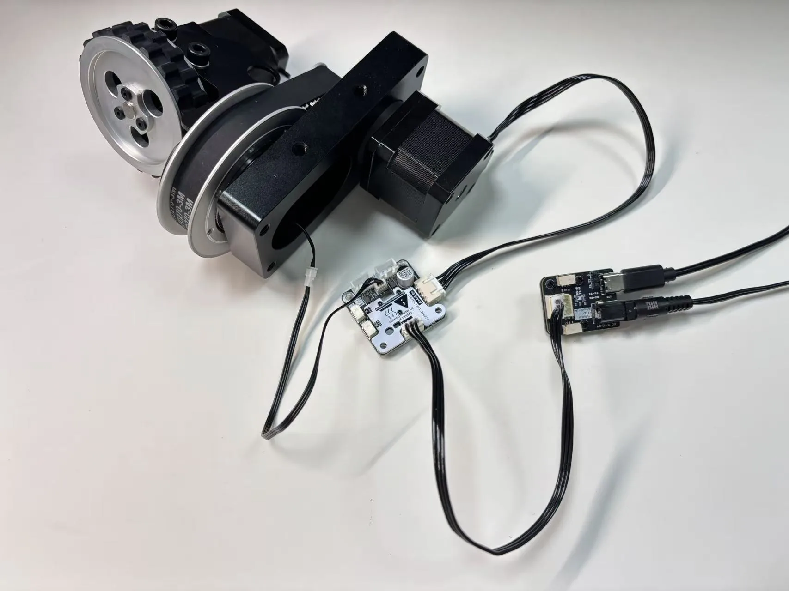
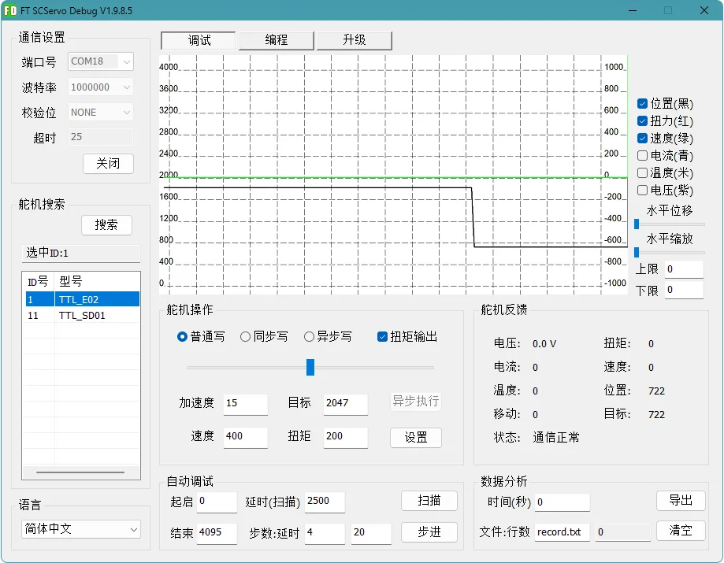
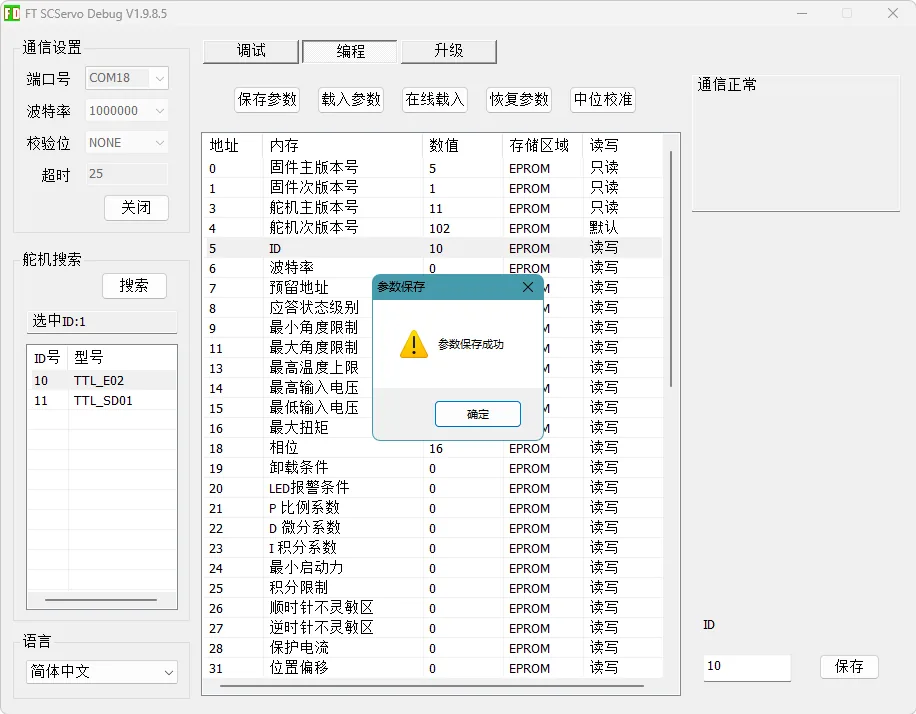
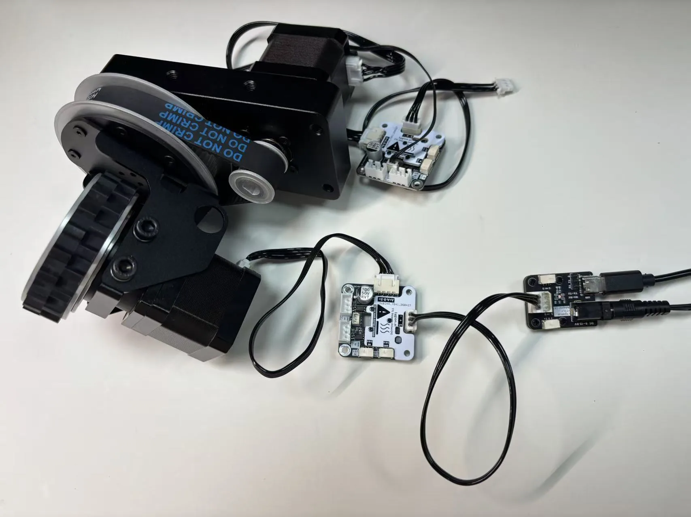
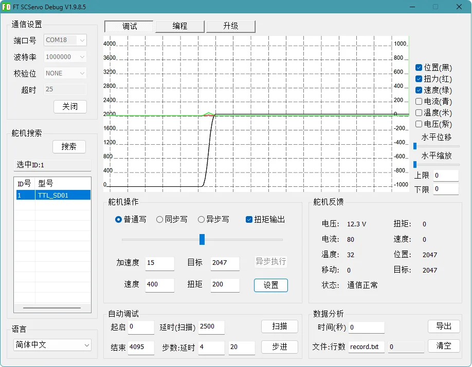
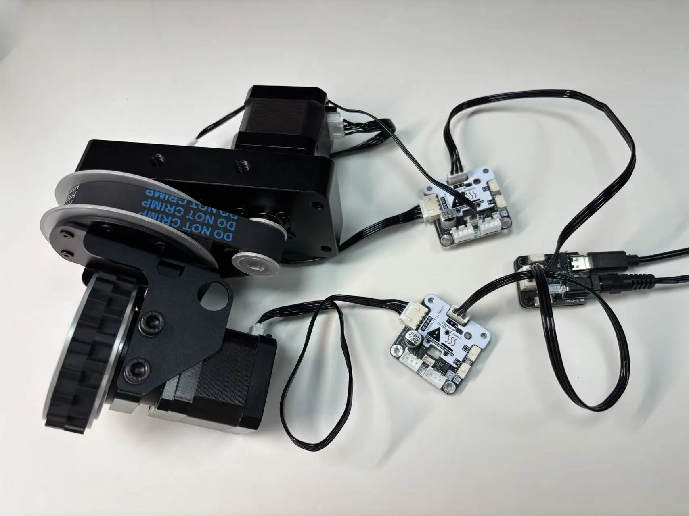

# SW69-TTL Quick Start and FD Setup

This guide walks through the first setup of one SW69-TTL module with the FD device utility. After setup, the module has three uniquely addressed TTL bus devices:

- TTL Encoder E02 for steering angle feedback.
- TTL Stepper Driver (A) for steering.
- TTL Stepper Driver (A) for the drive wheel.

## Prepare the Hardware

| Item | Purpose |
| --- | --- |
| SW69-TTL module | Steering wheel module under test |
| TTL Adapter (A) | Connects the PC USB port to the TTL bus |
| TTL-5264 8P Hub (A) | Useful for multiple devices and external power distribution |
| External DC power supply | Powers the stepper drivers and motors |
| Windows PC | Runs FD |

{ .img-rounded }

!!! warning "External power is required"
    The motors cannot be powered from USB. Connect an external supply before motor testing.

## Default Communication

| Parameter | Value |
| --- | --- |
| Baud rate | `1000000` bps |
| Common default ID | `1` |
| Usable ID range | `1` to `253` |

## 1. Configure the Steering Driver

Connect one TTL Stepper Driver (A) to the steering motor and to TTL Adapter (A). Search in FD until `TTL_SD01` appears.

{ .img-rounded }

On the `Programming` page:

1. Select `ID`.
2. Enter the steering driver ID. This guide uses `11`.
3. Save the parameter.

{ .img-rounded }

{ .img-rounded }

{ .img-rounded }

## 2. Test Steering Motion

On the `Debug` page, start with conservative values:

| Parameter | Suggested value |
| --- | ---: |
| Acceleration | `15` |
| Speed | `400` or lower |
| Torque/current | `200` |

Move the position slider slightly. The steering joint should move smoothly.

{ .img-rounded }

## 3. Configure the Encoder

The large timing pulley contains the E02 encoder used for steering feedback. Connect the encoder to the TTL bus and search again in FD. It should appear as `TTL_E02`.

{ .img-rounded }

Set the encoder ID. This guide uses `10`.

{ .img-rounded }

{ .img-rounded }

## 4. Calibrate the Steering Center

The encoder center defines steering angle `0°`.

1. Disconnect the steering motor cable so the steering joint can be rotated by hand.
2. Move the wheel to the desired mechanical center.
3. Select `TTL_E02` in FD.
4. Click center calibration on the `Programming` page.
5. Return to the `Debug` page. The position should read around `2047` or `2048`.
6. Reconnect the steering motor cable.

{ .img-rounded }

{ .img-rounded }

{ .img-rounded }

## 5. Configure the Drive Wheel Driver

Use another TTL Stepper Driver (A) for the drive wheel motor.

{ .img-rounded }

Recommended parameters:

| Parameter | Suggested value | Meaning |
| --- | ---: | --- |
| ID | `12` | Drive motor driver ID |
| Driver phase | `152` | Recommended for this wheel drive setup |
| Operating mode | `1` | Speed mode |
| Heartbeat timeout | `20` | About 2 seconds |

{ .img-rounded }

{ .img-rounded }

{ .img-rounded }

After saving parameters, power-cycle the driver.

## 6. Test the Drive Wheel

Lift the wheel off the desk or floor before testing.

| Parameter | Suggested value |
| --- | ---: |
| Acceleration | `15` |
| Speed | `400` or lower |
| Torque/current | `200` |

Click `Set`. The wheel should rotate. If heartbeat protection is enabled and no new command is sent, it should stop automatically after about 2 seconds.

{ .img-rounded }

## 7. Integrated Test

Connect the steering driver, encoder, and drive driver on the same TTL bus. Search in FD. You should see one `TTL_E02` and two `TTL_SD01` devices.

{ .img-rounded }

{ .img-rounded }

## Multi-Wheel Bases

Use unique IDs for every device on the bus. A three-wheel base can follow this pattern:

| Wheel | Encoder ID | Steering driver ID | Drive driver ID |
| --- | ---: | ---: | ---: |
| 1 | 10 | 11 | 12 |
| 2 | 13 | 14 | 15 |
| 3 | 16 | 17 | 18 |

{ .img-rounded }

## Next Steps

- [Python Development](python-development.md)
- [ESP32 Arduino Development](cpp-arduino.md)
- [TTL Stepper Driver (A): Operating Modes](../../bus-devices/ttl-stepper-driver-a/operating-modes.md)
- [TTL Encoder E02: Calibration and Multi-Turn](../../bus-devices/ttl-encoder-e02/calibration-and-multiturn.md)
