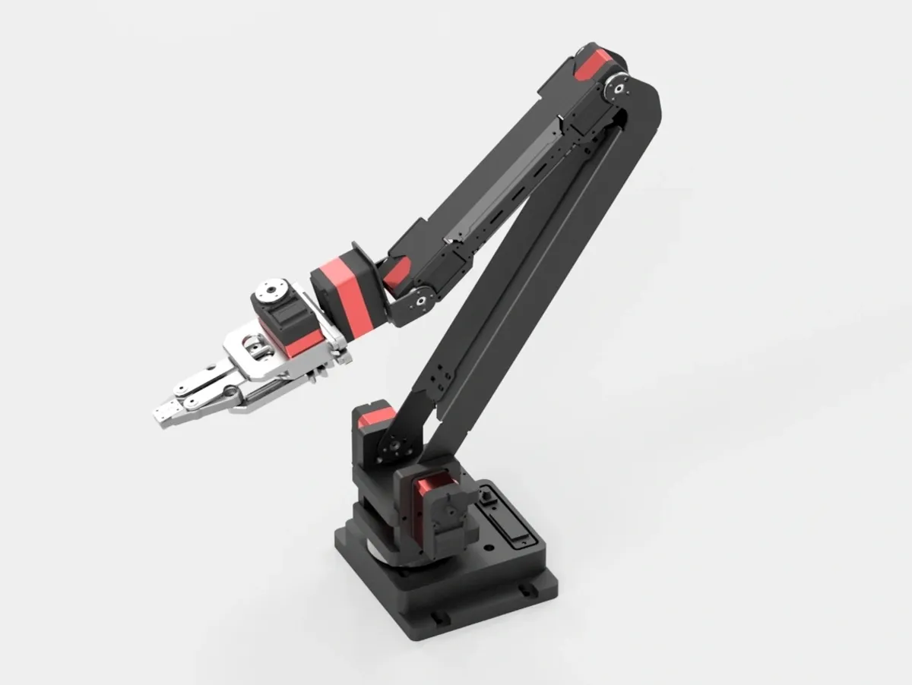

# 5+1 DOF Robotic Arm

5+1 DOF Robotic Arm is a mechanical structure project for a 5+1 degree-of-freedom robotic arm. The current Wiki page provides the main image and STEP model.

{ .img-rounded width="520" }

[Download STEP Model](../../../reference/open-lygion/assets/5-plus-1-dof-robotic-arm.step){ .md-button }

## Resources

| File | Description |
| --- | --- |
| [`5-plus-1-dof-robotic-arm.step`](../../../reference/open-lygion/assets/5-plus-1-dof-robotic-arm.step) | Mechanical STEP model |

## Notes

- Use the STEP file for mechanical review, assembly reference, or redesign.
- Before powering the arm, verify joint zero positions, motion limits, and cable slack.
- For control software, see the [Python SDK](python-sdk.md) or [C++ SDK](cpp-sdk.md).
