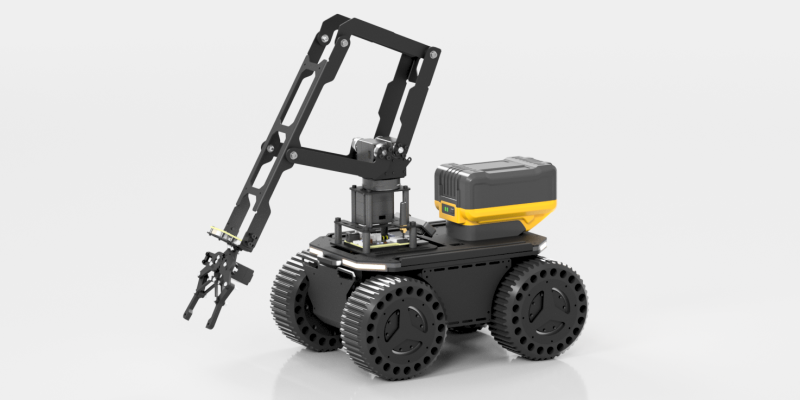

# LinkArm-M

LinkArm-M is a robotic arm controlled through a Python SDK. It is designed for module testing, education, automation scripts, mobile robots, and AI-agent integration.

{ .img-rounded }

The host connects by USB to the arm's [TTL Node (A)](../../bus-devices/ttl-node-a/index.md), which controls four serial-bus servos, the gripper, RGB LEDs, and PWM outputs.

## Main Capabilities

- single-joint and multi-joint control
- inverse and forward kinematics
- gripper, torque, LED, and PWM control
- CLI commands and an interactive shell
- Python `RobotController` API
- JSON output and batch commands
- independent configuration for multiple arms

| Item | Value |
| --- | --- |
| Recommended power | 12 V DC, at least 3 A |
| Host connection | TTL Node (A) USB Type-C |
| Bus baud rate | `500000` |
| Default joint IDs | `31`, `32`, `33`, `34` |
| TTL Node ID | `40` |
| Python | 3.8 or later |

!!! danger "USB is not actuator power"
    Connect a suitable 12 V supply or 3S battery before commanding motion.

!!! danger "Enter this arm's midpoint values before moving"
    Copy the four `servo_middle` values from the label on the arm into `arm_config.json`. Example values from another arm can cause bad kinematics, collisions, or excessive travel.

## Documentation

- [Quick Start](quickstart.md)
- [Configuration and Midpoint Calibration](configuration-and-calibration.md)
- [CLI Control](cli-control.md)
- [Python SDK](python-sdk.md)
- [Peripherals and Maintenance](peripherals-and-maintenance.md)
- [Multiple Arms and AI Integration](multi-arm-and-ai.md)
- [Troubleshooting](faq.md)

