# FD Device Utility

FD is a Windows utility for configuring and testing Lygion TTL bus devices. You can use it to scan devices, read feedback, change IDs and baud rates, write device parameters, test actuator motion, and calibrate the center position of supported encoders.

This guide uses SW69-TTL steering wheel module screenshots as examples. The exact parameter list depends on the connected product, but the workflow is the same: connect one device, scan the bus, select the device, open the programming page, edit parameters, save, and verify.

## When to Use FD

Use FD when you need to:

- Check whether a new TTL bus device is online.
- Find the current ID or baud rate of a device.
- Assign unique IDs before connecting multiple devices to one bus.
- Configure operating mode, current, phase, heartbeat protection, or other device parameters.
- Test a motor, actuator, wheel, or encoder before writing code.
- Calibrate the center position of a TTL Encoder E02 or a module that includes one.

!!! warning "FD is mainly a Windows tool"
    FD is designed for Windows. Linux, macOS, and embedded-controller users can configure IDs and parameters through the Python or C/C++ SDK instead. See [Device IDs and Baud Rates](device-id-and-baudrate.md).

## Download and Prepare

[Download FD](../../assets/files/FD.7z){ .md-button }

Prepare the following items before using FD:

| Item | Purpose |
| --- | --- |
| Windows PC | Runs the FD utility |
| TTL Adapter (A), or a compatible TTL bus adapter | Converts the PC USB serial port to the Lygion TTL bus |
| USB Type-C data cable | Connects the PC to the TTL Adapter (A) |
| External power supply | Powers stepper drivers, servos, wheel modules, and other actuators |
| Target TTL bus device | The device you want to configure or test |

!!! note "USB power is usually not enough"
    The USB connection on TTL Adapter (A) is for communication. Actuators such as stepper drivers, servos, wheel modules, and joint modules normally require an external power supply. Without it, the device may be found by FD but still fail to move.

## Basic Connection

For the first setup, connect only one target device:

```text
PC USB
  |
TTL Adapter (A)
  |
TTL bus device
  |
External power supply, if the device is an actuator
```

The example below shows a TTL Stepper Driver (A) connected to a TTL Adapter (A) for SW69-TTL steering motor configuration.

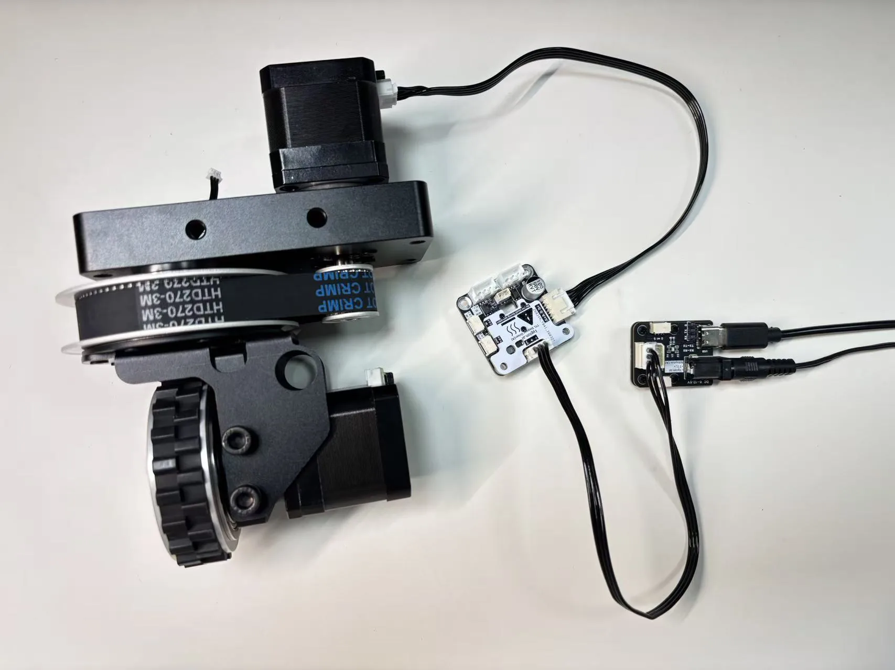{ .img-rounded }

You can use a hub when multiple devices need to share the same TTL bus. When changing IDs, baud rates, or important parameters, connect only the device you are configuring.

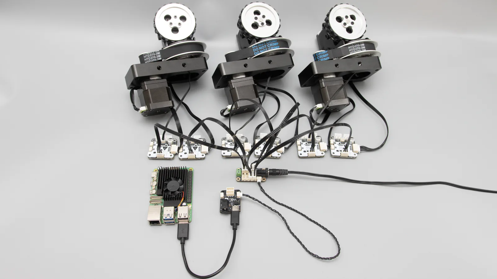{ .img-rounded }

## Open FD for the First Time

1. Extract the FD archive.
2. Connect the TTL Adapter (A) to the PC.
3. Check the serial port number in Windows Device Manager, such as `COM3` or `COM5`.
4. Open FD.
5. Select the COM port used by the adapter.
6. Set the baud rate to the current baud rate of the device. The common default is `1000000`.
7. Click `Open` to open the serial port.

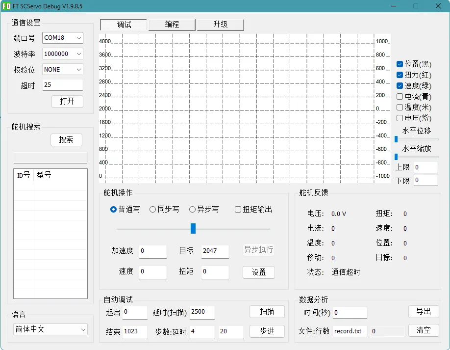{ .img-rounded }

!!! tip "If the COM port does not appear"
    Make sure the USB cable supports data transfer, not only charging. If Windows does not detect a serial port, check the USB driver, USB port, and TTL Adapter (A) connection. See [Find the Serial Port](find-serial-port.md).

## Scan for Devices

After opening the serial port, click `Search`. FD scans the current TTL bus at the selected baud rate and lists detected devices on the left.

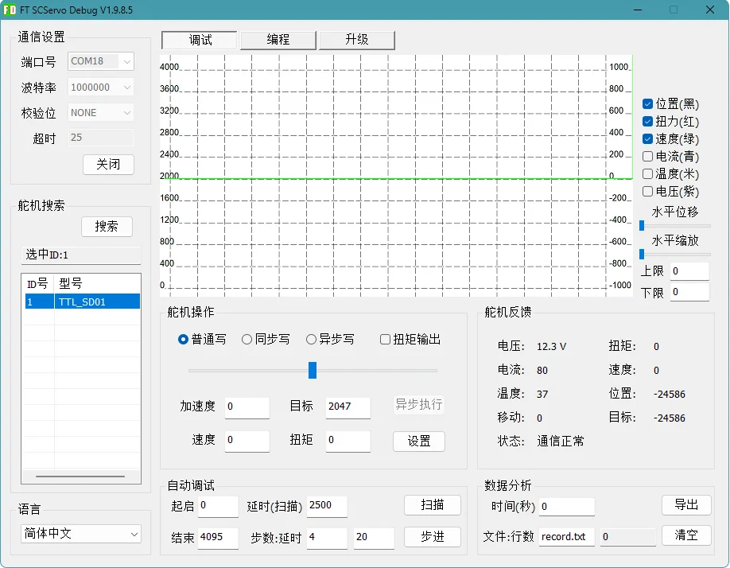{ .img-rounded }

After a device appears:

1. Click `Stop` to stop continuous scanning.
2. Select the target device in the device list.
3. Check that the device type, ID, and status match what you expect.

Common device names:

| Device name | Typical product |
| --- | --- |
| `TTL_SD01` | TTL Stepper Driver (A), stepper-driver-based modules |
| `TTL_E02` | TTL Encoder E02, timing pulleys or joint modules with an E02 encoder |

!!! warning "Do not use duplicate IDs on the same bus"
    If two devices use the same ID, both may respond to the same command. This can cause scan errors, incorrect feedback, unstable communication, or unexpected motion. When setting up new devices, configure them one at a time.

## Change the Device ID

Changing IDs is the most common FD operation. Plan a unique ID for each device first, then connect and configure one device at a time.

Recommended workflow:

```text
1. Connect only one device to the bus.
2. Open FD and scan for the device.
3. Stop scanning.
4. Select the target device.
5. Open the programming page.
6. Select the ID parameter.
7. Enter the new ID.
8. Click Save.
9. Scan again and confirm the new ID appears.
```

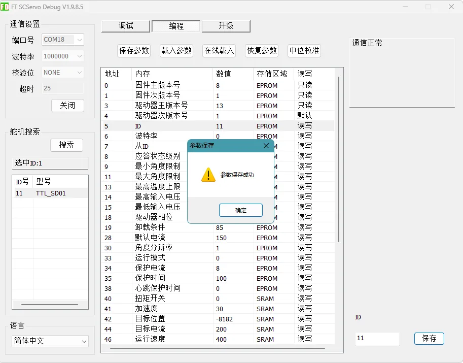{ .img-rounded }

!!! danger "Do not confuse ID with Slave ID"
    To change the device's own ID, select the `ID` parameter. Do not change `Slave ID` unless the product documentation specifically tells you to.

After saving the new ID, power-cycle the device and scan again to confirm that it appears with the new ID.

## Change the Baud Rate

The baud rate defines the communication speed between the controller and the device. All devices on the same TTL bus must use the same baud rate.

To change the baud rate:

1. Connect only one target device.
2. Scan and find it at its current baud rate.
3. Open the programming page.
4. Select the baud-rate parameter.
5. Write and save the new baud rate.
6. Close the serial port in FD.
7. Change FD to the new baud rate.
8. Open the serial port again and scan to verify.

!!! note "Common default baud rate"
    Many Lygion TTL bus devices use `1000000` as the default baud rate. If a device cannot be found, try scanning with common baud-rate settings.

## Read and Save Parameters

The programming page shows different parameters depending on the connected device. Common parameters include:

| Parameter | Typical use |
| --- | --- |
| `ID` | Sets the device ID |
| `Baud rate` | Sets the communication speed |
| `Operating mode` | Selects position mode, velocity mode, or other supported modes |
| `Driver phase` | Matches the stepper motor wiring and direction |
| `Heartbeat timeout` | Stops the actuator automatically if commands are interrupted |
| `Current` / `Torque` | Sets the actuator output level |

For example, when an SW69-TTL walking-wheel driver is used as a continuously rotating wheel, these parameters are typically configured:

| Parameter | Example value | Description |
| --- | ---: | --- |
| `ID` | `12` | Unique ID for the wheel driver |
| `Driver phase` | `152` | Phase setting used by the DW69 wheel drive |
| `Operating mode` | `1` | Velocity mode for continuous wheel rotation |
| `Heartbeat timeout` | `20` | Usually in `100 ms` units, about `2 s` |

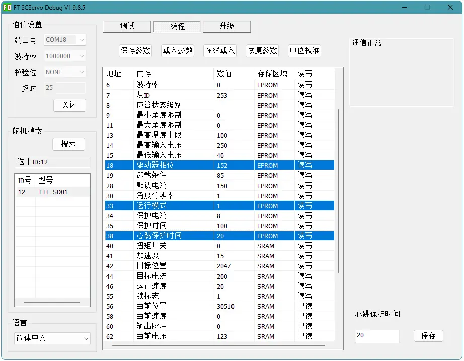{ .img-rounded }

After saving parameters, power-cycle the device and scan again. Some driver parameters take effect reliably only after restart.

## Test Actuator Motion

Actuators can be tested from the FD debug page. Before testing motion:

- Make sure the actuator has external power.
- Keep hands clear of moving parts.
- Lift wheels, tracks, or joints off the table so the robot cannot suddenly drive away.
- Start with conservative current, speed, and acceleration values.

For a stepper motor driven by TTL Stepper Driver (A), start with:

| Parameter | Suggested starting value | Notes |
| --- | ---: | --- |
| Acceleration | `15` | Smooth enough for initial testing |
| Speed | `400` or lower | Start slow and increase later |
| Torque / current parameter | `200` | About `1.32 A` phase current; check the product page for the final value |

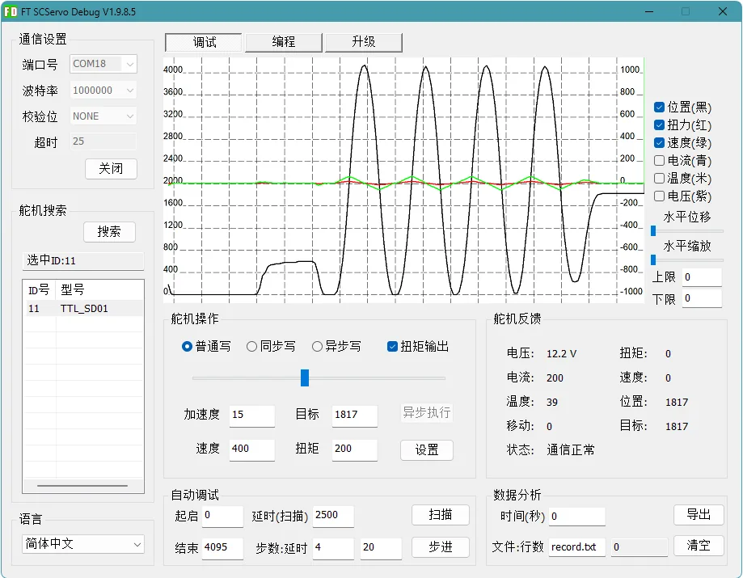{ .img-rounded }

If the device is configured in velocity mode, such as a wheel driver, clicking `Set` starts continuous rotation. When heartbeat protection is enabled, the device stops automatically if no further command is received within the configured timeout.

{ .img-rounded }

!!! tip "Start slow"
    Do not begin with high speed or high current. First confirm the direction, operating mode, and mechanical limits. Then increase speed, acceleration, and current gradually.

## Calibrate Encoder Center

Some products include a TTL Encoder E02, such as the SW69-TTL steering pulley and the DM42-G7220-E02 joint actuator. Center calibration defines the mechanical zero point. In later control code, `0°` or the neutral position is normally based on this calibrated center.

Typical workflow:

1. Make the joint or pulley free to adjust by hand.
2. Move the mechanism to the desired mechanical center.
3. Search in FD and select `TTL_E02`.
4. Open the programming page.
5. Click the center calibration button.
6. Confirm the success message.
7. Open the debug page and check that the current position is around `2047` or `2048`.

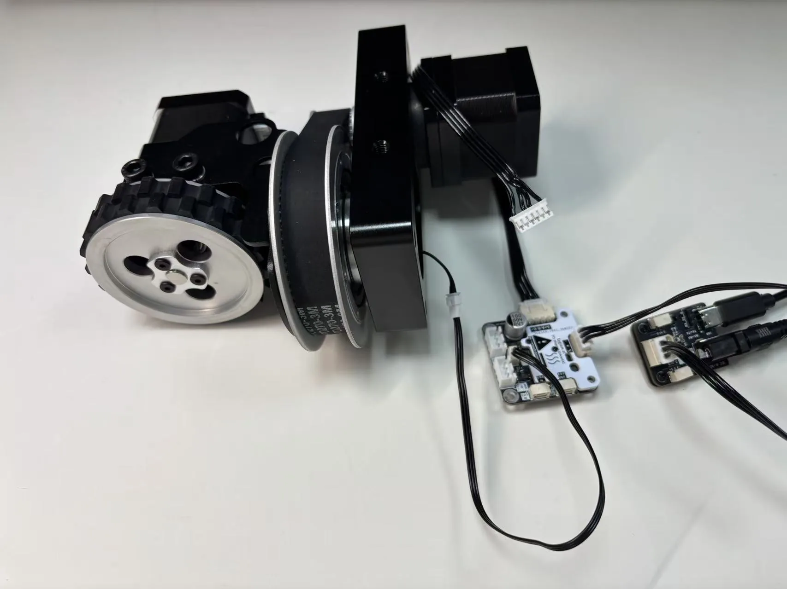{ .img-rounded }

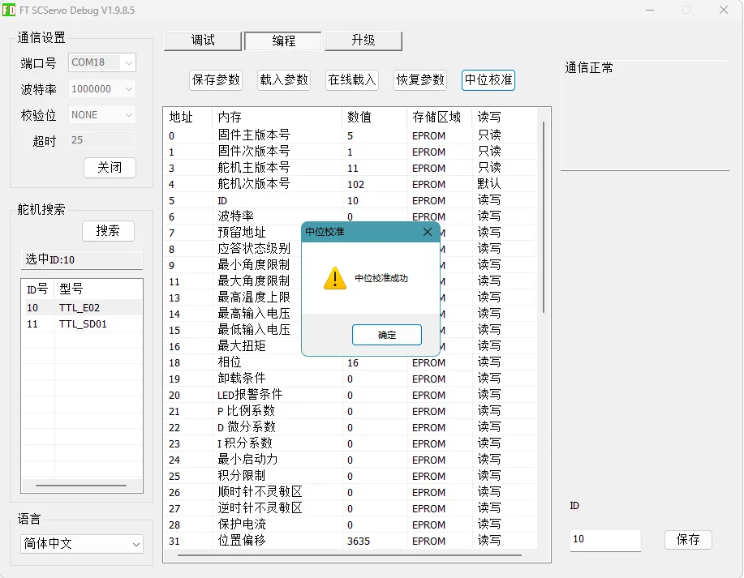{ .img-rounded }

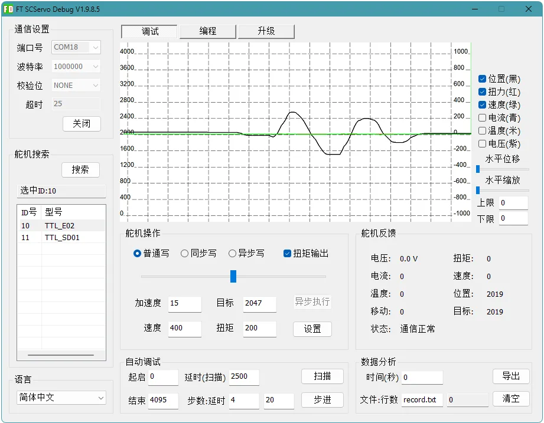{ .img-rounded }

!!! note "Center calibration is stored in the encoder"
    The center calibration value is stored inside the encoder. You usually do not need to recalibrate after every power-up. Recalibrate only after reassembly, pulley replacement, mechanical zero adjustment, or obviously incorrect feedback.

## Multi-Device ID Planning

For a system with multiple TTL bus devices, plan an ID table first and configure devices one by one.

For one SW69-TTL steering wheel module, you might use:

| Function | Device type | Example ID |
| --- | --- | ---: |
| Steering encoder | `TTL_E02` | `10` |
| Steering motor driver | `TTL_SD01` | `11` |
| Walking wheel driver | `TTL_SD01` | `12` |

For multiple modules, keep incrementing IDs:

| Module | Encoder ID | Steering driver ID | Wheel driver ID |
| --- | ---: | ---: | ---: |
| 1 | `10` | `11` | `12` |
| 2 | `13` | `14` | `15` |
| 3 | `16` | `17` | `18` |
| 4 | `19` | `20` | `21` |

After all devices are configured, connect them to the same TTL bus and scan again. FD should list all devices.

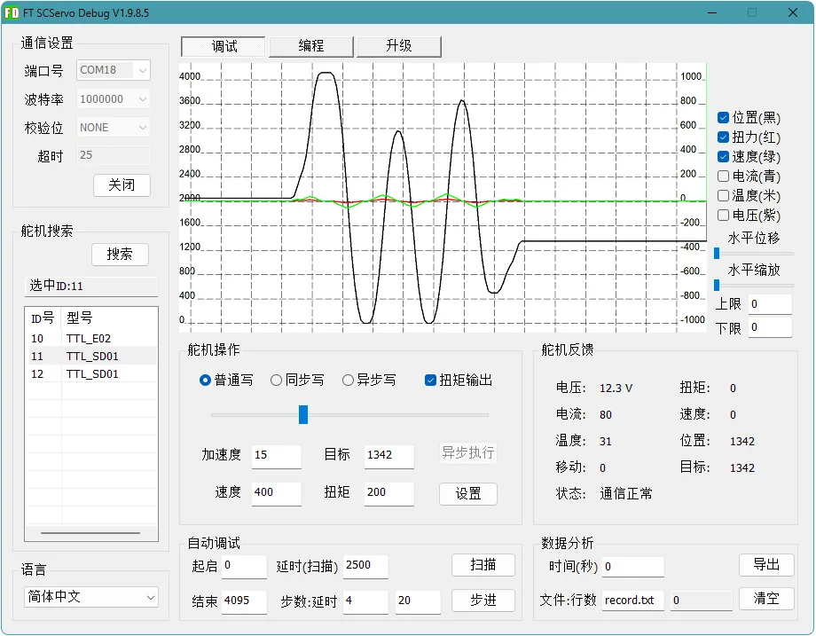{ .img-rounded }

## Recommended Bring-Up Workflow

Use this order when bringing up new hardware:

```text
1. Connect only one device and confirm power and serial communication.
2. Scan at the default baud rate.
3. Change the device ID.
4. Scan again and confirm the new ID.
5. Set required parameters from the product page.
6. Power-cycle the device.
7. Scan again and inspect the parameters.
8. Use the debug page for low-speed motion or feedback testing.
9. Configure all devices one by one before connecting them to the same bus.
10. Finish system integration with the SDK or controller program.
```

## Troubleshooting

### No device is found

Check these items in order:

- The correct COM port is selected.
- The serial port has been opened in FD.
- The baud rate matches the device.
- TTL Adapter (A) is not being used by another program.
- The USB cable supports data transfer.
- The device has external power if required.
- The TTL bus `S`, `+`, and `-` wiring is correct.
- Multiple devices with the same ID are not connected at the same time.
- The cable is not too long, loose, or damaged.

### The device is found but the motor does not move

Check:

- The actuator is powered by an external supply, not only USB.
- The current operating mode matches the test you are running.
- Speed, acceleration, current, or torque settings are not too low.
- The motor cable is connected correctly.
- A limit, protection state, or heartbeat timeout has not stopped the device.
- The device has been power-cycled after changing phase or operating mode.

### The device disappears after changing ID

This usually means FD is still scanning with the old ID or old baud rate. Try:

1. Stop scanning and scan again.
2. Confirm that the baud rate was not changed at the same time.
3. Leave only this device on the bus.
4. Power-cycle the device and scan again.

### Communication becomes unstable after connecting multiple devices

Check:

- Every device ID is unique.
- All devices use the same baud rate.
- The power supply has enough current capacity.
- High-current devices are not causing voltage drops.
- All power groups share a common GND.
- The bus cable is not too long or branched too many times.

For multi-device power and wiring practices, see [Power Grouping and Isolation](power-grouping-and-decoupling.md).
