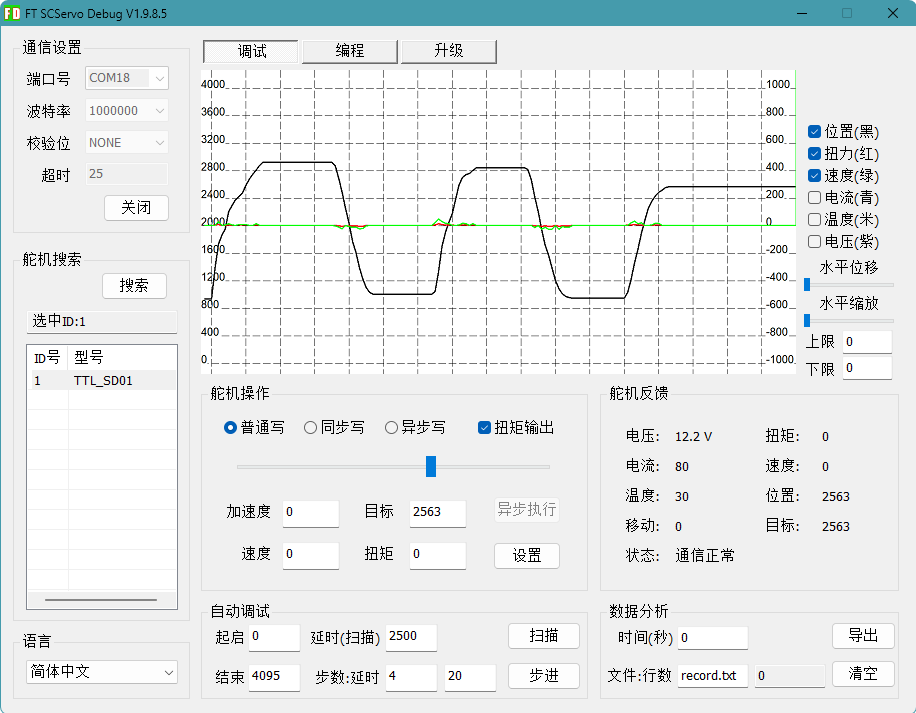

# Lygion Wiki

  <a class="ly-lang-switch__button" href="/en/index">🌐 English</a>

欢迎使用 Lygion Robotics 产品 Wiki。

Lygion Wiki 是 Lygion Robotics / 灵影机器人的产品技术文档中心，面向开发者、工程师、创客和产品集成用户，提供产品使用说明、硬件接线指南、软件开发教程、SDK 示例、开源项目资料以及常见问题说明。

本文档旨在帮助用户快速完成产品上手、硬件连接、参数配置、程序开发和系统集成。

## 第一次使用

如果你刚拿到 Lygion TTL 总线设备，请先选择你的开发方式。

  

    
推荐快速上手

    
Python 开发路线

    

      适合电脑、Raspberry Pi、Jetson、RK 等单板电脑（SBC）设备。
    

    

      
USB 连接 TTL Adapter (A)

      
运行 Python 示例脚本与总线设备通信

      
适合在电脑或支持 Python 的开发板上快速开发机器人项目

    

    <a class="dev-route-button" href="../quickstart/python-first-demo/">
      开始 Python 路线 →
    </a>
  

  

    
适合嵌入式开发

    
C++ 开发路线

    

      适合 ESP32S3、ESP32、STM32、Arduino 等嵌入式 MCU。
    

    

      
MCU UART 转 TTL 总线

      
使用 Arduino IDE 或 PlatformIO

      
运行 C++ 例程与总线设备通信

      
适合在嵌入式设备上开发机器人项目

    

    <a class="dev-route-button" href="../quickstart/cpp-first-demo/">
      开始 C++ 路线 →
    </a>
  

!!! tip "不知道该选哪条路线？"
    如果你使用电脑、树莓派、Jetson 或 N100 小主机，建议选择 **Python 开发路线**。  
    如果你使用 ESP32、STM32、Arduino 等单片机开发板，建议选择 **C++ 开发路线**。

## 常用入口

### 使用 FD 实现基础调参

!!! note "适用人群"
    新手友好，无需环境配置，图形化界面操作直观简单，但仅限于简单的测试、调参、固件升级。

    如果你使用的是非 Windows 系统，也可以参考后续的 Python / C++ 教程和对应产品的内存表，通过程序进行调参或调试工作。

{ .img-rounded width="450" }

FD 软件是运行在 Windows 平台上的总线设备调试 / 测试工具，用户可以使用它的图形化界面对总线产品进行简单测试和调参，例如为新产品更改 ID。

[FD 调试软件使用教程](tutorials/fd-tool.md){ .md-button }

### 使用 Python 语言开发

!!! note "适用人群"
    适用于使用 `PC、Mac、Raspberry Pi、Jetson、RK` 等单板电脑或主机设备的用户，使用 Python 语言进行机器人开发的场景。

| 你想做什么 | 推荐入口 |
| --- | --- |
| 第一次连接 TTL 总线设备 | [快速上手（Python）](quickstart/python-first-demo.md) |
| 电脑不识别 TTL Adapter (A) | [安装 USB 串口驱动](tutorials/install-usb-serial-driver.md) |
| 不知道在哪里输入命令 | [如何打开终端 / CMD / PowerShell](tutorials/open-terminal.md) |
| 安装 Python 或确认版本 | [安装 Python](tutorials/install-python.md) |
| 不知道串口号是多少 | [查找串口设备](tutorials/find-serial-port.md) |
| 不知道如何运行示例脚本 | [运行 Python 脚本](tutorials/run-python-scripts.md) |

### 使用 C/C++ 语言开发

!!! note "适用人群"
    适用于使用 `ESP32S3、ESP32、STM32、Arduino` 等嵌入式 MCU 的用户，使用 C/C++ 进行机器人开发的场景。

| 你想做什么 | 推荐入口 |
| --- | --- |
| 第一次用 MCU 连接 TTL 总线设备 | [快速上手（C++）](quickstart/cpp-first-demo.md) |
| 使用 Arduino IDE 开发 | [安装 Arduino IDE](tutorials/install-arduino-ide.md) |
| 使用 VS Code + PlatformIO 开发 | [安装 PlatformIO](tutorials/install-platformio.md) |
| 不确定 MCU 如何接 TTL Adapter (A) | [MCU UART 接线基础](tutorials/mcu-uart-wiring.md) |
| 不知道如何运行 `.ino` 示例 | [上传 Arduino 示例程序](tutorials/upload-arduino-sketch.md) |
| 不知道如何查看 MCU 输出 | [打开串口监视器](tutorials/serial-monitor.md) |

### 总线产品的使用说明

!!! note "适用人群"
    了解总线设备的基础使用方法后，参考具体产品文档，将产品更好地应用到机器人中。

| 总线产品 | 产品介绍 |
| --- | --- |
| [TTL Adapter (A)](reference/bus-devices/ttl-adapter-a/index.md) | 板载 USB-TTL 芯片，可以将电脑的 USB 接口或 MCU 的 UART 转换为单线 TTL 总线通信接口 |
| [TTL Stepper Driver (A)](reference/bus-devices/ttl-stepper-driver-a/index.md) | TTL 总线步进电机驱动板，包含位置、速度、同步等多种控制方式 |
| [TTL Encoder E02](reference/bus-devices/ttl-encoder-e02/index.md) | 12bit 360° 绝对角度磁编码器 |

## 模块介绍

- **快速开始**：包含 Python 和 C++ 两条教程路线，帮助用户尽快完成第一次通信。
- **基础教程**：涵盖终端、Python、C++ 开发环境、串口、驱动、供电、ID、波特率等跨产品内容。
- **产品 Wiki**：各个产品的硬件规格、接线、SDK 示例、参数、FAQ 等内容。
- **下载中心**：集中放置 SDK、软件、开源模型和资料链接。

!!! tip "推荐阅读顺序"
    Python 用户建议先完成 [快速上手（Python）](quickstart/python-first-demo.md)，再进入具体产品页面。

    MCU 用户建议先完成 [快速上手（C++）](quickstart/cpp-first-demo.md)，再进入具体产品的 C++ / Arduino 示例页面。

## 相关链接

-   **官方网站**  
    Lygion Robotics 产品与品牌主页。  
    [lygion.ai](https://lygion.ai)

-   **GitHub**  
    SDK、示例代码与开源项目。  
    [LygionOrganization](https://github.com/LygionOrganization/)

-   **在线文档**  
    选择适合你网络环境的 Wiki 入口。  
    [GitHub Pages](https://lygionorganization.github.io/lygion-wiki/) ·
    [阿里云](https://wiki.lygion.ai/)

-   **淘宝店铺**  
    产品购买、套装选择与售后服务。  
    [进入店铺](https://shop349435383.taobao.com/)

