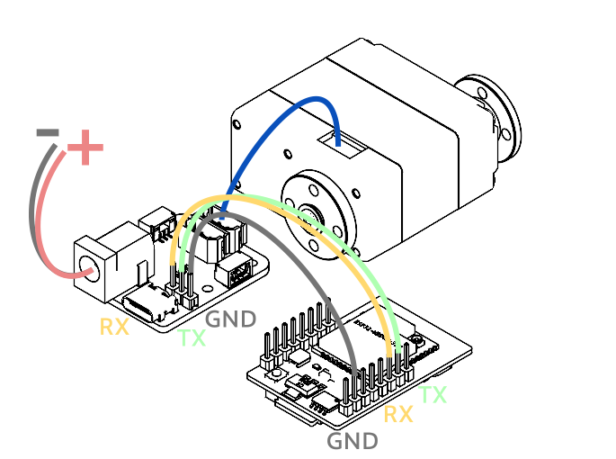

# 快速上手（C++ / Arduino）

本页脚本用于 **ESP32S3、ESP32、STM32、Arduino Mega2560、Arduino Due、RP2040** 等支持 Arduino 开发环境的嵌入式控制板。

本教程的目标是：让 MCU 通过硬件 UART 与 TTL 总线设备通信，并在 Arduino IDE 或 PlatformIO 的串口监视器中看到设备反馈。

```text
MCU Development Board
  │ UART RX / TX / GND
  ▼
TTL Adapter (A) UART Port
  │ TTL Bus
  ▼
TTL Encoder E02 / TTL Stepper Driver (A) / Other TTL Bus Device
```

{ .img-rounded width="450" }

!!! tip "请根据你的开发工具选择对应步骤"
    本文同时提供 **Arduino IDE** 和 **PlatformIO** 两种方式。  
    如果你是第一次使用 MCU，建议先选择 **Arduino IDE**。  
    如果你已经使用 VS Code 管理工程，建议选择 **PlatformIO**。

!!! tip "支持的总线设备"
    灵影的 TTL 总线设备：TTL Stepper Driver (A)，TTL Encoder E02， TTL Node (A) 等。

    飞特的 TTL 总线舵机： STS 系列，HLS 系列，SCS 系列

---

## 1. 适用设备

如果你的主控是下面这类设备，可以使用本教程：

| 设备类型 | 示例 | 说明 |
| --- | --- | --- |
| ESP32 系列 | ESP32S3、ESP32、ESP32C3 | 推荐使用硬件串口 `Serial1` / `Serial2` |
| STM32 系列 | STM32F103、STM32F4、STM32G4 等 | 需要安装 STM32 Arduino Core |
| Arduino AVR | Mega2560 | 推荐，带多个硬件串口 |
| Arduino ARM | Due、GIGA 等 | 一般带多个硬件串口 |
| RP2040 | Raspberry Pi Pico / Pico W | 需要确认 Arduino Core 的串口名称 |
| 自定义 MCU 板 | 带硬件 UART 的控制板 | 需要确认 UART 引脚、电平和供电 |

!!! warning "不推荐使用只有一个串口的入门板直接测试"
    Arduino UNO、Nano 等开发板通常只有一个硬件串口，并且这个串口还要用于 USB 下载和调试。虽然可以用软件串口尝试通信，但在 `1 Mbps` 总线波特率下稳定性通常较差。

    第一次测试建议使用 **ESP32S3 / ESP32 / Arduino Mega2560 / STM32** 等带多个硬件 UART 的开发板。

如果你使用电脑、Raspberry Pi、Jetson、RK、N100 小主机等设备，请阅读：

[快速上手（Python）](python-first-demo.md){ .md-button }

---

## 2. 准备硬件

你需要准备：

- 一个支持 Arduino 开发环境的 MCU 开发板
    - 推荐使用 [Lygion Robot Driver](../reference/bus-devices/robot-driver-with-esp32s3-lite/index.md)，ESP32S3主控板载 UART 转单线 TTL 总线电路
- [TTL Adapter (A)](../reference/bus-devices/ttl-adapter-a/index.md)，或其它 UART 转单线 TTL 总线电路
- 一个 TTL 总线设备，例如TTL Stepper Driver (A)、TTL Encoder E02、或飞特总线舵机
- USB 数据线，用于连接电脑和 MCU（取决于你所使用的 MCU 的下载固件方式）
- 合适电压的外部电源
- 杜邦线或对应端子线

第一次测试前，请检查：

- USB 线是数据线，不是只能充电的线。
- MCU、TTL Adapter (A) 接线：RX-RX，TX-TX，GND-GND 供地。
- 同一根总线上暂时只连接一个新设备，避免总线上有重复 ID。
- 如果连接步进电机、舵机或其它执行器，已经接入符合规格的外部电源。

!!! warning "不要只依赖 USB 给执行器供电"
    USB 通常只适合通信和低功耗调试。  
    如果设备需要驱动步进电机、舵机、轮组或其它执行器，请务必接入外部电源。

    不确定如何接线时，请先阅读：[供电与接线基础](../tutorials/power-and-wiring-basics.md)。

---

## 3. 安装开发工具

你可以使用 Arduino IDE，也可以使用 VS Code + PlatformIO。

=== "Arduino IDE"

    适合第一次使用 MCU 的用户，界面简单，安装和上传流程比较直观。

    请先阅读并完成：

    [安装 Arduino IDE](../tutorials/install-arduino-ide.md){ .md-button }

    安装完成后，你需要根据自己的开发板安装对应的开发板支持包，例如：

    | 开发板 | 常见支持包 |
    | --- | --- |
    | ESP32S3 / ESP32 | ESP32 by Espressif Systems |
    | STM32 | STM32 MCU based boards |
    | RP2040 | Arduino Mbed OS RP2040 Boards 或 Raspberry Pi Pico 相关支持包 |
    | Arduino Mega2560 / Due | Arduino IDE 通常已内置或可直接安装 |

=== "PlatformIO"

    适合已经使用 VS Code 的用户，也适合后续维护更完整的机器人项目。

    请先阅读并完成：

    [安装 PlatformIO](../tutorials/install-platformio.md){ .md-button }

    PlatformIO 通常需要配置 `platformio.ini`，包括开发板型号、框架、串口监视器波特率等参数。

---

## 4. 理解两个不同的串口

在 MCU C++ 路线中，通常会同时使用两个串口。

| 串口 | 连接对象 | 用途 | 常见写法 |
| --- | --- | --- | --- |
| USB 调试串口 | MCU ↔ 电脑 | 打印调试信息、查看运行结果 | `Serial` |
| TTL 总线通信串口 | MCU ↔ TTL Adapter (A) ↔ 总线设备 | 与 TTL 总线设备通信 | `Serial1` / `Serial2` |

例如 ESP32S3：

```cpp
Serial.begin(115200);                         // USB 调试串口，连接电脑串口监视器
Serial1.begin(1000000, SERIAL_8N1, 18, 17);   // TTL 总线通信串口，连接 TTL Adapter (A)
```

其中：

| 参数 | 含义 |
| --- | --- |
| `115200` | 串口监视器波特率 |
| `1000000` | TTL 总线通信波特率，默认 1 Mbps |
| `18` | ESP32S3 的 RX 引脚 |
| `17` | ESP32S3 的 TX 引脚 |

!!! warning "不要混淆两个波特率"
    `Serial.begin(115200)` 对应电脑串口监视器。

    `Serial1.begin(1000000, ...)` 对应 TTL 总线设备通信。

    串口监视器显示乱码，通常是 `115200` 没有设置正确。  
    设备一直通信失败，可能是 `1000000`、设备 ID、接线、供电或信号线供地有问题。

更多说明见：[设备 ID 与波特率](../tutorials/device-id-and-baudrate.md)。

---

## 5. 硬件接线

### 5.1 MCU 连接 TTL Adapter (A)

当 TTL Adapter (A) 作为 UART 转单线 TTL 总线转接板使用时，常见接法如下：

| MCU | TTL Adapter (A) |
| --- | --- |
| RX | RX |
| TX | TX |
| GND | GND |

!!! note "为什么这里不是 RX 接 TX？"
    TTL Adapter (A) 的 UART 口接入的是板载转换电路的输入侧，实际使用时通常采用 `RX 接 RX`、`TX 接 TX` 的方式。

    它和普通 USB-TTL 模块常见的 `RX 接 TX`、`TX 接 RX` 交叉接法不同。

!!! warning "注意 UART 电平"
    TTL Adapter (A) 的 UART 通信电平为 **3.3V TTL**。

    如果你的 MCU 是 5V IO，请确认它的 UART 输入是否兼容 3.3V 电平。必要时请增加电平转换电路，避免损坏设备。

更详细说明见：[MCU UART 接线基础](../tutorials/mcu-uart-wiring.md)。

### 5.2 TTL Adapter (A) 连接 TTL 总线设备

```text
TTL Adapter (A)
  │ 5264-3P / HC-1.25 8P Hub
  ▼
TTL Bus Device
```

请确认：

- `+` 接电源正极。
- `-` 接电源负极 / GND。
- `S` 接 TTL 总线信号。
- 执行器类设备已经接入外部电源。
- 第一次测试只连接一个新设备，避免默认 ID 冲突。

---

## 6. 获取 C++ SDK

C++ SDK 地址：

```text
https://github.com/LygionRobotics/lygion_devs_cpp
```

如果无法访问 GitHub，可以从下载中心下载压缩包：

[C++ SDK 下载](../assets/files/lygion_devs_cpp.zip){ .md-button }

### Arduino IDE 用户

通常可以把 SDK 库文件放到 Arduino 的 `libraries` 目录。

常见位置：

=== "Windows"

    ```text
    Documents\Arduino\libraries
    ```

=== "macOS"

    ```text
    ~/Documents/Arduino/libraries
    ```

=== "Linux"

    ```text
    ~/Arduino/libraries
    ```

复制完成后，请重启 Arduino IDE。

### PlatformIO 用户

PlatformIO 用户通常可以把 SDK 放到工程的 `lib` 目录中，例如：

```text
your_project/
├─ platformio.ini
├─ src/
│  └─ main.cpp
└─ lib/
   └─ lygion_devs_cpp/
```

如果 SDK 本身已经包含 PlatformIO 工程，也可以直接用 VS Code 打开该工程目录。

---

## 7. 打开第一个示例

第一次建议选择读取类示例，不建议直接运行高速运动示例。

| 设备 | 推荐第一个示例 | 说明 |
| --- | --- | --- |
| TTL Encoder E02 | `FeedBack` / `Read` 类示例 | 读取位置和速度，测试风险低 |
| TTL Stepper Driver (A) | `Ping` / `Read` / `FeedBack` 类示例 | 先确认通信，再运行运动控制 |
| 总线舵机或其它执行器 | `Ping` / `Read` 类示例 | 避免机械结构突然运动 |

!!! warning "第一次测试建议“先读后写”"
    读取类示例通常不会改变设备状态，适合验证串口、接线、ID、波特率是否正确。

    运动控制类示例可能会驱动电机或机械结构运动。请在固定设备、确认供电和安全距离后再运行。

---

## 8. 修改示例中的串口和设备 ID

不同开发板的硬件串口写法不同。请根据你的开发板选择对应方式。

=== "ESP32S3 / ESP32"

    ESP32 系列通常可以自由指定 UART 的 RX / TX 引脚。

    示例：

    ```cpp
    Serial.begin(115200);

    // Serial1.begin(baudrate, config, RX, TX)
    Serial1.begin(1000000, SERIAL_8N1, 18, 17);

    ttlsd.pSerial = &Serial1;
    ```

    请根据你的实际接线修改：

    | 参数 | 说明 |
    | --- | --- |
    | `18` | MCU RX，引脚连接 TTL Adapter (A) 的 RX |
    | `17` | MCU TX，引脚连接 TTL Adapter (A) 的 TX |

    常见建议：

    - ESP32S3 可以优先使用空闲 GPIO，例如 `RX=18`、`TX=17`。
    - 避免使用启动配置相关引脚。
    - 避免与 USB、下载、Flash、PSRAM、板载外设冲突的引脚。

=== "Arduino Mega2560"

    Mega2560 带有多个硬件串口，推荐使用 `Serial1`。

    示例：

    ```cpp
    Serial.begin(115200);
    Serial1.begin(1000000);

    ttlsd.pSerial = &Serial1;
    ```

    Mega2560 的 `Serial1` 引脚通常是：

    | 串口 | 引脚 |
    | --- | --- |
    | RX1 | D19 |
    | TX1 | D18 |

=== "Arduino Due"

    Arduino Due 也带有多个硬件串口，可以使用 `Serial1`、`Serial2` 或 `Serial3`。

    示例：

    ```cpp
    Serial.begin(115200);
    Serial1.begin(1000000);

    ttlsd.pSerial = &Serial1;
    ```

    请根据你的实际接线确认对应的 RX / TX 引脚。

=== "STM32 Arduino Core"

    STM32 不同开发板的串口名称和引脚映射可能不同，常见写法如下：

    ```cpp
    Serial.begin(115200);
    Serial1.begin(1000000);

    ttlsd.pSerial = &Serial1;
    ```

    如果 `Serial1` 编译失败，请检查当前开发板的 Arduino Core 文档，确认可用的硬件串口名称。

=== "RP2040 / Raspberry Pi Pico"

    RP2040 的 Arduino Core 可能使用 `Serial1` 表示 UART0 或 UART1，具体取决于所选开发板包。

    示例：

    ```cpp
    Serial.begin(115200);
    Serial1.begin(1000000);

    ttlsd.pSerial = &Serial1;
    ```

    请确认所选 Arduino Core 中 `Serial1` 对应的实际 RX / TX 引脚。

### 修改设备 ID

示例程序中的 ID 通常都会写在参数中

例如以下是 [TTL Stepper Driver (A)](../reference/bus-devices/ttl-stepper-driver-a/index.md) 控制步进电机转动的例程：

[lyttlsd/WritePos](https://github.com/LygionOrganization/lygion_devs_cpp/blob/main/example/lyttlsd/WritePos/WritePos.ino)

```cpp
// ttlsd.WritePosEx(ID, goalPosition, speed, acceleration, current);
ttlsd.WritePosEx(1, 3200, 600, 0, 150);
```

例如以下是更改 ID 的例程，同样也可以用于更改其它 EPROM 参数：

[lyttlsd/ProgramEprom](https://github.com/LygionOrganization/lygion_devs_cpp/blob/main/example/lyttlsd/ProgramEprom/ProgramEprom.ino)

```cpp
// 打开 EPROM 保存功能，参数 1 是旧 ID
hlscl.unLockEprom(1);

// 参数 2 是你要更改的新 ID
hlscl.writeByte(1, HLSCL_ID, 2);

// 关闭 EPROM 保存功能，因为刚刚设备的 ID 已经被改为了 2
// 所以这里关闭 EPROM 保存功能要输入新的 ID 2
hlscl.LockEprom(2);
```

默认情况下，新设备的 ID 通常为 `1`。第一次测试时建议保持默认值。

!!! warning "同一根总线上不要有重复 ID"
    多个新设备可能都使用默认 ID `1`。  
    第一次修改 ID 或测试新设备时，建议总线上只连接一个设备。

!!! tip "忘记设备 ID 怎么办？"
    如果你忘记了设置过的 ID 是什么，可以使用广播 ID 来更改设备 ID：

    ```cpp
    // 打开 EPROM 保存功能，参数 254 是广播 ID
    hlscl.unLockEprom(254);

    // 参数 2 是你要更改的新 ID
    hlscl.writeByte(254, HLSCL_ID, 1);

    // 关闭 EPROM 保存功能，因为刚刚设备的 ID 已经被改为了 1
    // 所以这里关闭 EPROM 保存功能要输入新的 ID 1
    hlscl.LockEprom(1);
    ```

    建议使用该功能时，总线上只有一个设备，否则全部设备的 ID 都会被改为 1

---

## 9. 上传程序并打开串口监视器

=== "Arduino IDE"

    1. 打开 `.ino` 示例文件。
    2. 在 `工具 / Tools` 中选择正确的开发板。
    3. 选择正确的上传端口。
    4. 根据你的开发板修改串口初始化代码。
    5. 点击上传按钮。
    6. 上传完成后打开串口监视器。
    7. 将串口监视器波特率设置为 `115200`。

    详细步骤见：

    - [上传 Arduino 示例程序](../tutorials/upload-arduino-sketch.md)
    - [打开串口监视器](../tutorials/serial-monitor.md)

=== "PlatformIO"

    1. 用 VS Code 打开工程目录。
    2. 检查 `platformio.ini` 中的开发板型号。
    3. 检查 `monitor_speed = 115200`。
    4. 根据你的开发板修改串口初始化代码。
    5. 点击 `Upload` 上传程序。
    6. 打开 `Serial Monitor` 查看输出。

    `platformio.ini` 示例：

    ```ini
    [env:esp32-s3-devkitc-1]
    platform = espressif32
    board = esp32-s3-devkitc-1
    framework = arduino
    monitor_speed = 115200
    ```

---

## 10. 查看运行结果

如果通信正常，串口监视器可能会显示类似内容：

```text
Lygion TTL Bus Demo Start
ID: 1
Position: 1200
Speed: 0
```

或：

```text
Ping succeeded. ID: 1
Read position: 1200
Read speed: 0
```

如果读取失败，可能会看到类似内容：

```text
FeedBack error
Ping failed
Read failed
```

出现失败并不一定代表设备损坏。通常优先检查：

- 串口监视器波特率是否为 `115200`。
- TTL 总线通信波特率是否为 `1000000`。
- 设备 ID 是否正确。
- MCU RX / TX / GND 是否接对。
- TTL 总线 `+ / - / S` 是否接反。
- 执行器是否接入外部电源。
- 是否有其它程序占用了串口。
- 同一根总线上是否存在重复 ID。

更多排查方法见：[常见通信问题排查](../tutorials/communication-troubleshooting.md)。

---

## 11. 常见开发板配置参考

| 开发板 | 推荐 TTL 总线串口 | 示例代码 | 备注 |
| --- | --- | --- | --- |
| ESP32S3 | `Serial1` | `Serial1.begin(1000000, SERIAL_8N1, RX, TX);` | RX / TX 可按实际接线指定 |
| ESP32 | `Serial2` 或 `Serial1` | `Serial2.begin(1000000, SERIAL_8N1, RX, TX);` | 避免使用下载和启动相关引脚 |
| Arduino Mega2560 | `Serial1` | `Serial1.begin(1000000);` | RX1=D19，TX1=D18 |
| Arduino Due | `Serial1` / `Serial2` / `Serial3` | `Serial1.begin(1000000);` | 3.3V IO |
| STM32 | `Serial1` / `Serial2` | `Serial1.begin(1000000);` | 取决于开发板和 Arduino Core |
| RP2040 | `Serial1` | `Serial1.begin(1000000);` | 取决于开发板包和引脚映射 |

!!! note "以上表格是通用参考"
    不同开发板、不同 Arduino Core、不同引脚复用设置可能存在差异。  
    如果编译失败或没有输出，请先确认当前开发板的硬件串口名称和引脚映射。

---

## 12. 常用基础教程

!!! note "说明"
    部分操作涉及终端、串口、开发环境、设备通信等基础知识。为避免在每篇产品文档中重复说明，我们将这些通用操作整理为独立的基础教程。

    在阅读具体产品教程时，如果遇到不熟悉的操作，可以通过文档中的相关链接跳转到对应基础教程，补充必要的前置知识后再继续操作。

[查看全部基础教程](../tutorials/index.md){ .md-button }

---

## 13. 如果没有成功

| 现象 | 常见原因 | 处理方式 |
| --- | --- | --- |
| 程序无法上传 | 开发板型号、端口或驱动错误 | 检查 Board、Port 和开发板驱动 |
| 串口监视器没有输出 | 监视器波特率错误；程序没有运行 | 设置为 `115200`；按复位键 |
| 串口监视器乱码 | 监视器波特率不匹配 | 设置为 `115200` |
| 一直 `Ping failed` | ID 错误；TTL 总线波特率错误；UART 接线错误 | 检查设备 ID、`1000000` 波特率、RX/TX/GND |
| 一直 `Read failed` | 设备未上电；总线接反；串口选错 | 检查电源、`+/-/S`、串口对象 |
| 连接执行器后 MCU 复位 | 电源不足；执行器从 USB 取电导致过载 | 执行器使用独立外部电源 |
| 多设备读取混乱 | 多个设备 ID 重复 | 一次只连接一个设备修改 ID |
| ESP32 上传失败 | 下载模式、USB 线或端口问题 | 按住 BOOT 再上传；更换 USB 数据线；检查端口 |
| STM32 编译失败 | 开发板包或串口名称不匹配 | 检查 STM32 Arduino Core 和可用串口名称 |

仍然无法解决时，建议按下面顺序排查：

1. 只连接一个 TTL 总线设备。
2. 先使用 TTL Encoder E02 或读取类示例。
3. 确认设备 ID 为 `1`。
4. 确认 TTL 总线波特率为 `1000000`。
5. 确认 MCU、TTL Adapter (A)、外部电源共地。
6. 确认串口监视器波特率为 `115200`。
7. 使用 FD 调试软件或 Python Demo 交叉验证设备是否正常。

相关教程：

- [常见通信问题排查](../tutorials/communication-troubleshooting.md)
- [FD 调试软件](../tutorials/fd-tool.md)
