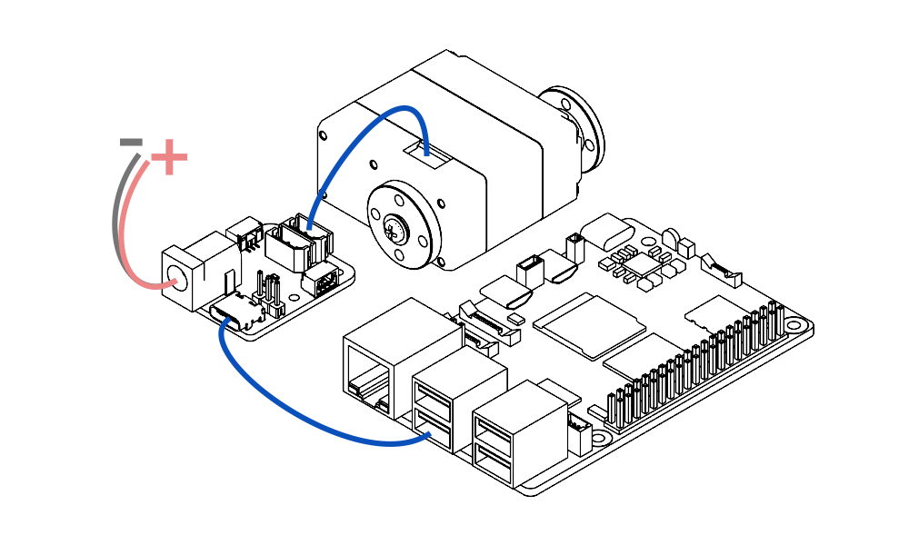

# 快速上手（Python）

本教程用于帮助你使用 **Python SDK** 跑通第一次通信测试。完成本教程后，你应该能够确认电脑、TTL Adapter (A)、串口驱动、设备 ID、波特率和 TTL 总线接线是否正常。

本教程适用于以下设备：

- Windows 电脑
- macOS 电脑
- Linux 电脑
- Raspberry Pi、Jetson、RK 等可以运行 Python 的设备或开发板

!!! note "请根据自己的系统选择对应标签页"
    本教程中的命令会按照 **Linux / macOS / Windows** 分成不同标签页。  
    请根据你正在使用的系统选择对应标签页操作，不需要同时执行所有系统的命令。

推荐第一次测试使用下面的连接方式：

```text
Computer / Raspberry Pi / Jetson / Other SBC
        │ USB
        ▼
TTL Adapter (A)
        │ TTL Bus
        ▼
TTL Encoder E02 或 TTL Stepper Driver (A) 或 飞特总线舵机
```

{ .img-rounded width="450" }

!!! tip "支持的总线设备"
    灵影的 TTL 总线设备：TTL Stepper Driver (A)，TTL Encoder E02， TTL Node (A) 等。

    飞特的 TTL 总线舵机： STS 系列，HLS 系列，SCS 系列

---

## 1. 准备硬件

开始前，请准备以下硬件：

| 硬件 | 说明 |
| --- | --- |
| [TTL Adapter (A)](../reference/bus-devices/ttl-adapter-a/index.md) | 用于将电脑 USB 转换为 Lygion TTL 总线 |
| TTL 总线设备 | 例如 TTL Stepper Driver (A)、TTL Encoder E02 或其它 TTL 总线设备 |
| USB Type-C 数据线 | 必须是支持数据传输的 USB 线，不要使用只能充电的线 |
| 外部电源 | 根据你所实用的总线设备规格选择合适电压和电流的电源 |
| 电脑或开发板 | Windows / macOS / Linux / Raspberry Pi / Jetson 等 |

连接前请检查：

- USB 线支持数据传输。
- 第一次测试时，同一根 TTL 总线上建议只连接一个新设备，避免总线上出现重复 ID。

!!! warning "不要只依赖 USB 给执行器供电"
    USB 通常只适合通信和低功耗调试。  
    如果设备需要驱动步进电机、舵机、轮组或其它执行器，请务必接入外部电源。

    不确定如何接线时，请先阅读：[供电与接线基础](../tutorials/power-and-wiring-basics.md)。

---

## 2. 安装 USB 串口驱动

[TTL Adapter (A)](../reference/bus-devices/ttl-adapter-a/index.md) 连接电脑后，系统会将它识别为一个 USB 串口设备。部分系统可以自动识别，部分系统需要先安装 USB 串口驱动。

=== "Linux"

    大多数 Linux 发行版通常可以直接识别 USB 串口设备。

    连接 TTL Adapter (A) 后，可以先执行：

    ```bash
    lsusb
    ```

    如果系统可以识别 USB 设备，后续再查找对应的串口名称。

    如果无法识别设备，请参考：[安装 USB 串口驱动](../tutorials/install-usb-serial-driver.md)。

=== "macOS"

    macOS 可能需要安装对应的 USB 串口驱动。

    连接 TTL Adapter (A) 后，如果后续无法找到 `/dev/tty.usb*` 或 `/dev/cu.usb*` 设备，请先参考：[安装 USB 串口驱动](../tutorials/install-usb-serial-driver.md)。

=== "Windows"

    Windows 通常会在插入 TTL Adapter (A) 后自动安装驱动。  
    如果设备管理器中没有出现新的 COM 端口，或设备显示为未知设备，请先安装 USB 串口驱动。

    详细步骤见：[安装 USB 串口驱动](../tutorials/install-usb-serial-driver.md)。

---

## 3. 打开终端、CMD 或 PowerShell

后面的步骤需要输入命令。不同系统的命令行工具名称不同。

=== "Linux"

    常见打开方式：

    - 按 `Ctrl + Alt + T`
    - 或在应用菜单中搜索 `Terminal`

    打开后会看到类似下面的命令行界面：

    ```bash
    username@computer:~$
    ```

=== "macOS"

    常见打开方式：

    - 按 `Command + Space` 打开 Spotlight
    - 输入 `Terminal` 或 `终端`
    - 回车打开

    打开后会看到类似下面的命令行界面：

    ```bash
    username@MacBook ~ %
    ```

=== "Windows"

    推荐使用 **PowerShell**：

    - 右键点击 Windows 开始菜单
    - 选择 `终端`、`Windows PowerShell` 或 `Terminal`

    也可以使用 CMD：

    - 按 `Win + R`
    - 输入 `cmd`
    - 回车打开

    后续 Windows 示例默认使用 PowerShell。

更多说明见：[如何打开终端 / CMD / PowerShell](../tutorials/open-terminal.md)。

---

## 4. 确认 Python 是否可用

在终端中输入以下命令，确认当前系统是否已经安装 Python。

=== "Linux"

    ```bash
    python3 --version
    ```

=== "macOS"

    ```bash
    python3 --version
    ```

=== "Windows"

    ```powershell
    py -3 --version
    ```

如果看到类似下面的输出，说明 Python 已经安装：

```text
Python 3.10.x
Python 3.11.x
Python 3.12.x
```

如果提示 `command not found`、`不是内部或外部命令`，或没有显示 Python 版本，请先阅读：[安装 Python](../tutorials/install-python.md)。

!!! note "推荐版本"
    建议使用 Python 3.9 或更新版本。  
    如果你是第一次安装 Python，建议直接安装当前稳定版本。

---

## 5. 获取 Python SDK

推荐使用 Git 获取 SDK。

=== "Linux"

    ```bash
    git clone https://github.com/LygionRobotics/lygion_devs_py.git
    cd lygion_devs_py
    ```

=== "macOS"

    ```bash
    git clone https://github.com/LygionRobotics/lygion_devs_py.git
    cd lygion_devs_py
    ```

=== "Windows"

    ```powershell
    git clone https://github.com/LygionRobotics/lygion_devs_py.git
    cd lygion_devs_py
    ```

如果无法访问 GitHub，也可以从下载中心下载 SDK 压缩包：

[Python SDK 下载](../assets/files/lygion_devs_py.zip){ .md-button }

!!! note "不会使用 Git 也可以继续"
    下载 ZIP 压缩包后，将其解压到一个容易找到的位置，例如：

    - Windows：`D:\Lygion\lygion_devs_py`
    - macOS：`~/Documents/lygion_devs_py`
    - Linux：`~/lygion_devs_py`

    然后在终端中进入这个目录继续操作。

---

## 6. 创建并启用 Python 虚拟环境

虚拟环境用于隔离当前项目需要的 Python 包，避免和系统中的其它 Python 项目互相影响。

请确保终端当前路径位于 SDK 目录中，例如：

```text
lygion_devs_py
```

然后执行下面的命令。

=== "Linux"

    ```bash
    python3 -m venv .venv
    source .venv/bin/activate
    ```

    启用成功后，命令行前面通常会出现 `(.venv)`：

    ```bash
    (.venv) username@computer:~/lygion_devs_py$
    ```

=== "macOS"

    ```bash
    python3 -m venv .venv
    source .venv/bin/activate
    ```

    启用成功后，命令行前面通常会出现 `(.venv)`：

    ```bash
    (.venv) username@MacBook lygion_devs_py %
    ```

=== "Windows"

    ```powershell
    py -3 -m venv .venv
    .\.venv\Scripts\Activate.ps1
    ```

    启用成功后，命令行前面通常会出现 `(.venv)`：

    ```powershell
    (.venv) PS D:\Lygion\lygion_devs_py>
    ```

    如果 PowerShell 提示无法运行脚本，可以在当前 PowerShell 窗口中临时允许脚本运行：

    ```powershell
    Set-ExecutionPolicy -Scope Process -ExecutionPolicy Bypass
    .\.venv\Scripts\Activate.ps1
    ```

如果不熟悉虚拟环境或脚本运行方式，请参考：[运行 Python 脚本](../tutorials/run-python-scripts.md)。

---

## 7. 安装 Python 依赖

SDK 示例通常需要串口通信相关依赖。请在已经启用虚拟环境的终端中执行：

=== "Linux"

    ```bash
    python3 -m pip install --upgrade pip
    python3 -m pip install pyserial
    ```

=== "macOS"

    ```bash
    python3 -m pip install --upgrade pip
    python3 -m pip install pyserial
    ```

=== "Windows"

    ```powershell
    python -m pip install --upgrade pip
    python -m pip install pyserial
    ```


---

## 8. 查找串口设备

连接 TTL Adapter (A) 后，系统会识别出一个串口设备。你需要找到这个串口名称，并把它填写到示例脚本中。

=== "Linux"

    执行：

    ```bash
    ls /dev/ttyUSB* /dev/ttyACM* 2>/dev/null
    ```

    常见串口名称：

    ```text
    /dev/ttyUSB0
    /dev/ttyACM0
    ```

    如果不确定哪个是 TTL Adapter (A)，可以先拔掉 USB，再执行一次命令；插回 USB 后再次执行，对比新增的设备名称。

    如果没有权限打开串口，可能需要将当前用户加入 `dialout` 用户组：

    ```bash
    sudo usermod -a -G dialout $USER
    ```

    执行后需要注销并重新登录，或者重启系统后生效。

=== "macOS"

    执行：

    ```bash
    ls /dev/tty.usb* /dev/cu.usb* 2>/dev/null
    ```

    常见串口名称：

    ```text
    /dev/tty.usbserial-xxxx
    /dev/cu.usbserial-xxxx
    ```

    在 macOS 中，实际运行脚本时通常优先使用 `/dev/cu.usbserial-xxxx`。

=== "Windows"

    打开：

    ```text
    设备管理器 → 端口（COM 和 LPT）
    ```

    查找类似下面的设备：

    ```text
    USB-Enhanced-SERIAL CH343 (COM3)
    ```

    其中 `COM3` 就是脚本中要使用的串口名称。你的电脑上可能显示为 `COM4`、`COM5` 或其它编号。

更详细说明见：[查找串口设备](../tutorials/find-serial-port.md)。

---

## 9. 确认设备 ID 与波特率

Lygion TTL 总线设备需要使用正确的 **设备 ID** 和 **波特率** 才能通信。

常见默认设置：

| 参数 | 常见默认值 | 说明 |
| --- | --- | --- |
| 设备 ID | `1` | 不同设备或不同固件可能有所差异，请以产品文档为准 |
| 波特率 | `1000000` | 即 1 Mbps |

!!! warning "同一根总线上不要有重复 ID"
    如果多个设备具有相同 ID，上位机发送指令时会出现冲突，可能导致读取失败或返回数据异常。  
    第一次修改 ID 或测试新设备时，建议总线上只连接一个设备。

!!! note "特殊波特率"
    对于一些 SCS 总线舵机，它的默认波特率（最高波特率）有可能是 `500000` 即 500 kbps。

更多说明见：[设备 ID 与波特率](../tutorials/device-id-and-baudrate.md)。

---

## 10. 修改示例脚本中的串口名称

打开你准备运行的示例脚本，找到串口初始化相关代码。不同示例脚本的写法可能略有不同，常见形式如下：

```python
portHandler = PortHandler('/dev/ttyUSB0')
```

请根据你的系统，将串口名称改成实际检测到的串口。

=== "Linux"

    示例：

    ```python
    portHandler = PortHandler('/dev/ttyUSB0')
    ```

=== "macOS"

    示例：

    ```python
    portHandler = PortHandler('/dev/cu.usbserial-xxxx')
    ```

=== "Windows"

    示例：

    ```python
    portHandler = PortHandler('COM3')
    ```

同时确认波特率设置是否正确：

```python
portHandler.setBaudRate(1000000)
```

如果示例脚本中有设备 ID 设置，也请确认它与当前设备一致。例如：

```python
DEV_ID = 1
```

!!! tip "建议先只改串口名称"
    第一次测试时，建议先保持默认设备 ID 和默认波特率不变，只修改串口名称。  
    通信成功后，再根据需要修改 ID、波特率或其它参数。

---

## 11. 运行第一个通信测试脚本

第一次测试建议优先运行 `ping` 或读取类示例。  
这类示例通常不会让电机运动，风险较低，适合用于确认通信链路是否正常。

下面命令中的脚本名称请根据 SDK 实际目录调整。如果 SDK 示例放在子目录中，请先 `cd` 到对应目录，或使用完整路径运行。

=== "Linux"

    ```bash
    python3 ttlsd_ping.py
    ```

=== "macOS"

    ```bash
    python3 ttlsd_ping.py
    ```

=== "Windows"

    ```powershell
    python .\ttlsd_ping.py
    ```

如果通信正常，通常会看到类似输出：

```text
[ID:001] ping Succeeded.
```

也可以运行读取位置或速度的示例：

=== "Linux"

    ```bash
    python3 ttlsd_read.py
    ```

=== "macOS"

    ```bash
    python3 ttlsd_read.py
    ```

=== "Windows"

    ```powershell
    python .\ttlsd_read.py
    ```

成功后可能会看到类似输出：

```text
[ID:001] PresPos:1200 PresSpd:0
```

!!! note "示例文件名可能会因 SDK 版本不同而变化"
    如果 SDK 中没有 `ttlsd_ping.py` 或 `ttlsd_read.py`，请在示例目录中查找名称包含 `ping`、`read`、`sync_read`、`reg_write`、`write` 等关键词的脚本。  
    第一次测试建议优先选择读取类脚本，不建议直接运行会让电机高速运动的示例。

---

## 12. 成功后的下一步

如果已经可以成功 `ping` 或读取数据，说明基础通信链路已经建立。你可以根据正在使用的产品继续阅读对应教程。

| 你使用的产品 | 下一步 |
| --- | --- |
| TTL Encoder E02 | [TTL Encoder E02：Python 读取](../reference/bus-devices/ttl-encoder-e02/python-quickstart.md) |
| TTL Stepper Driver (A) | [TTL Stepper Driver (A)：Python 控制](../reference/bus-devices/ttl-stepper-driver-a/python-quickstart.md) |
| TTL Adapter (A) | [TTL Adapter (A)：驱动与串口](../reference/bus-devices/ttl-adapter-a/drivers-and-ports.md) |

如果你计划开发自己的控制程序，可以继续学习：

- 如何读取设备状态
- 如何写入目标位置、目标速度或其它控制参数
- 如何同时控制多个总线设备
- 如何处理通信超时、设备离线和异常状态

---

## 13. 如果没有成功

如果脚本运行失败，请先不要反复修改很多参数。建议按照下面顺序排查：

| 现象 | 常见原因 | 处理方式 |
| --- | --- | --- |
| 找不到串口设备 | USB 线不支持数据传输；驱动未安装；USB 接口异常 | 更换 USB 数据线；重新插拔；安装 USB 串口驱动 |
| 打不开串口 | 串口名称写错；串口被其它软件占用；Linux 权限不足 | 确认串口名称；关闭 FD 软件或其它串口工具；检查串口权限 |
| `ping` 失败 | 设备 ID 错误；波特率错误；TTL 总线接线错误；设备未供电 | 检查 ID、波特率、`+ / - / S` 接线和外部电源 |
| 读取数据异常 | 总线上有重复 ID；接线接触不良；电源不稳定 | 总线上只保留一个设备测试；重新插拔连接线；检查电源 |
| 电机不转 | 没有外部电源；电流设置过低；运行模式或参数不正确 | 接入外部电源；检查电流、速度、模式和限位状态 |
| Windows 可以看到 COM 口但脚本失败 | COM 口被占用；脚本中的 COM 号不一致 | 关闭串口调试软件；确认脚本中填写的是正确 COM 口 |
| Linux 提示 Permission denied | 当前用户没有串口权限 | 将用户加入 `dialout` 组并重新登录 |

更多排查步骤见：[常见通信问题排查](../tutorials/communication-troubleshooting.md)。

---

## 14. 常用基础教程

!!! note "说明"
    部分操作涉及终端、串口、开发环境、设备通信等基础知识。为避免在每篇产品文档中重复说明，我们将这些通用操作整理为独立的基础教程。

    在阅读具体产品教程时，如果遇到不熟悉的操作，可以通过文档中的相关链接跳转到对应基础教程，补充必要的前置知识后再继续操作。

[查看全部基础教程](../tutorials/index.md){ .md-button }