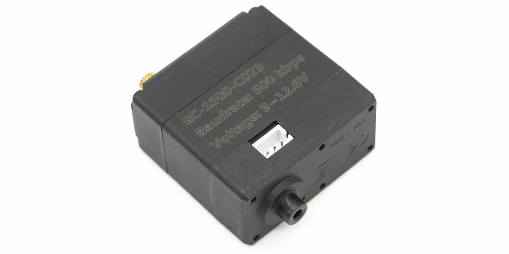

# 总线舵机

本分类收录 Lygion Robotics 常用的飞特 TTL 串行总线舵机。它们与其它 TTL 总线设备一样，通过单线 TTL 总线通信，可使用 [TTL Adapter (A)](../ttl-adapter-a/index.md)、[Robot Driver with ESP32S3 Lite](../robot-driver-with-esp32s3-lite/index.md)、[TTL Node (A)](../ttl-node-a/index.md) 或 UART(单线TTL) 接入。

## 产品列表

| 产品型号 | 结构 | 推荐电压 | 堵转扭力 | 空载速度 | 推荐入口 |
| --- | --- | --- | --- | --- | --- |
| SC-0090-C043 | 单轴，小型金属齿 | 8~12.6V | 5.5kg.cm | 0.12sec/60° | [查看 Wiki](sc-0090-c043.md) |
| SC-0090-C049 | 双轴，小型金属齿 | 8~12.6V | 5.5kg.cm | 0.12sec/60° | [查看 Wiki](sc-0090-c049.md) |
| SC-1500-C023 | 双轴，15kg 级铜齿 | 9~12.6V | 15.6kg.cm | 0.167sec/60° | [查看 Wiki](sc-1500-c023.md) |
| SC-1500-C024 | 单轴，15kg 级铜齿 | 9~12.6V | 15.6kg.cm | 0.167sec/60° | [查看 Wiki](sc-1500-c024.md) |

## 产品主图与模型

| 产品 | 主图 | 3D 模型 |
| --- | --- | --- |
| SC-0090-C043 | { width="180" } | [舵机 STEP](assets/SC-0090-C043.step) · [圆形舵盘](assets/arms-0090/cycle.stp) · [十字舵盘](assets/arms-0090/tenarm.stp) |
| SC-0090-C049 | { width="180" } | [舵机 STEP](assets/SC-0090-C049.step) · [圆形舵盘](assets/arms-0090/cycle.stp) · [十字舵盘](assets/arms-0090/tenarm.stp) |
| SC-1500-C023 | { width="180" } | [舵机 STEP](assets/SC-1500-C023.step) |
| SC-1500-C024 | { width="180" } | [舵机 STP](assets/SC-1500-C024.stp) |

0090 系列舵盘模型包括圆形、半臂、单臂和十字舵盘，详见具体型号页面。

## 使用方式

这些舵机的使用方式与其它 Lygion TTL 总线设备相同：

1. 通过 TTL Adapter (A)、Robot Driver 或 MCU UART 接入单线 TTL 总线。
2. 给舵机接入匹配的外部电源，并确保控制器和舵机共地。
3. 第一次使用时，只连接一个待配置舵机。
4. 使用 FD 调试软件搜索设备，确认默认 ID 和波特率。
5. 为每个舵机设置唯一 ID，再把多个舵机并联到同一条总线上。
6. 使用飞特 SDK 发送位置、速度和参数指令。

## 推荐学习路径

如果你第一次使用总线舵机，建议按下面顺序阅读基础教程：

1. [供电与接线基础](../../../tutorials/power-and-wiring-basics.md)：了解执行器供电、共地和电流余量。
2. [分组供电和供电解耦](../../../tutorials/power-grouping-and-decoupling.md)：多舵机同时工作时，避免电源压降和通信异常。
3. [设备 ID 与波特率](../../../tutorials/device-id-and-baudrate.md)：理解为什么每个总线设备必须使用唯一 ID。
4. [FD 调试软件](../../../tutorials/fd-tool.md)：用图形化工具搜索舵机、修改 ID、修改波特率和读取反馈。
5. [查找串口设备](../../../tutorials/find-serial-port.md)：在电脑或单板电脑上找到 TTL Adapter、Robot Driver 或其它串口设备。
6. [常见通信问题排查](../../../tutorials/communication-troubleshooting.md)：扫描不到设备、动作无响应或反馈异常时优先检查。

需要自己编写控制程序时，可继续阅读：

- [安装 Python](../../../tutorials/install-python.md)
- [运行 Python 脚本](../../../tutorials/run-python-scripts.md)
- [MCU UART 接线基础](../../../tutorials/mcu-uart-wiring.md)

## 默认通信参数

| 项目 | 默认值 / 范围 |
| --- | --- |
| 通信方式 | 单线 TTL 半双工串行通信 |
| 协议格式 | 8 data bits, 1 stop bit, no parity |
| ID 范围 | `0~253` |
| 出厂默认 ID | `1` |
| 波特率范围 | `38400 bps ~ 500000 bps` |
| 出厂默认波特率 | `500000 bps` |
| 中位 | `511` |
| 最大位置更新率 | `1 ms` |
| 信号高电平 | `2~5V` |
| 信号低电平 | `0~0.45V` |

## 推荐工具

- [FD 调试软件](../../../tutorials/fd-tool.md)：用于搜索舵机、修改 ID、修改波特率、读取反馈和调整参数。
- [飞特 SDK](https://gitee.com/ftservo)：用于在 Python、C/C++、Arduino 或其它上位机程序中控制舵机。
- [TTL Adapter (A)](../ttl-adapter-a/index.md)：电脑或单板电脑调试总线舵机时的推荐适配器。
- [Robot Driver with ESP32S3 Lite](../robot-driver-with-esp32s3-lite/index.md)：适合机器人项目中同时控制多路舵机和动作脚本。

## 接线注意事项

!!! warning "先设置 ID，再并联"
    多个舵机如果使用相同 ID，会导致搜索、控制和反馈异常。修改 ID 时建议总线上只保留一个待配置舵机。

!!! danger "外部电源必须匹配全部设备"
    总线电源会同时进入所有并联舵机和设备。接入 3S 锂电池组前，确认总线上所有设备都支持对应电压范围。

!!! tip "从低速、小角度开始测试"
    第一次动作测试建议使用较低速度、较小角度和较轻负载，确认 ID、方向、机械限位和供电都正确后再提高速度或负载。
