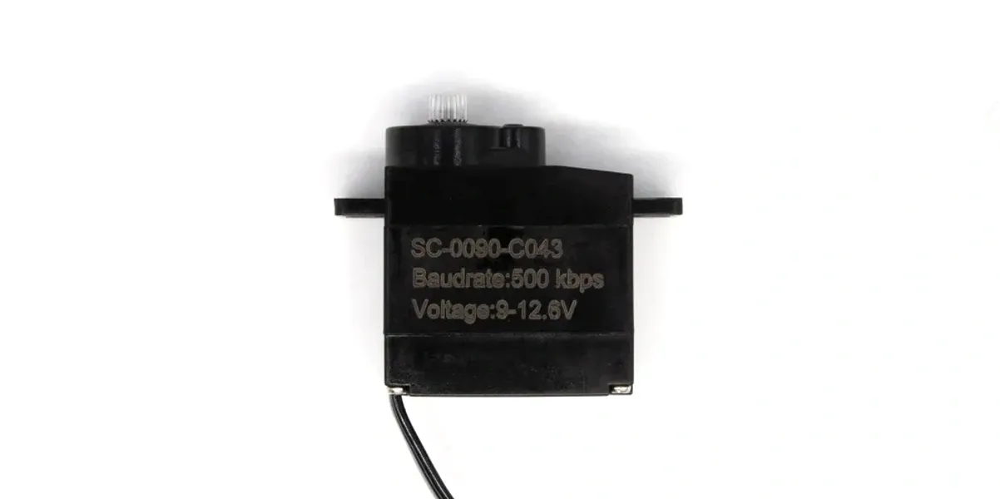

# SC-0090-C043 单轴 TTL 总线舵机

<a href="https://item.taobao.com/item.htm?id=995898962397&mi_id=0000Ad97kGZS5m0Us4XnZzsZPEbDKoAdTvN0DRRXubzsPgg&spm=a21xtw.29178619.0.0&xxc=shop&skuId=6141903866933" target="_blank">淘宝购买链接</a>

SC-0090-C043 是一款小型单轴 TTL 串行总线舵机，规格书型号为 `SCS0009-C043`。它采用金属齿轮、铁芯电机和碳膜电位器反馈，适合轻量机构、夹爪、小型关节和教学演示项目。

{ .img-rounded width="420" }

<a class="md-button" href="assets/SC-0090-C043.step" target="_blank">下载 3D 模型</a>

## 核心参数

| 项目 | 参数 |
| --- | --- |
| 规格书型号 | `SCS0009-C043` |
| 结构 | 单轴 |
| 工作电压范围 | DC 8~12.6V |
| 推荐供电 | 3S 锂电池组或 12.6V 以内直流电源 |
| 空载速度 | 0.12sec/60°，约 83RPM |
| 空载电流 | 150mA |
| 堵转扭力 | 5.5kg.cm |
| 堵转电流 | 0.6A |
| 静态电流 | 8mA |
| 额定负载 | 1.83kg.cm |
| 额定电流 | 200mA |
| Kt 常数 | 9.1kg.cm/A |
| 工作温度 | -20~60℃ |
| 保存温度 | -30~80℃ |

## 机械参数

| 项目 | 参数 |
| --- | --- |
| 外形尺寸 | 23.2 x 12.1 x 25.25mm |
| 重量 | 11.3±2g |
| 外壳材质 | PC |
| 齿轮材质 | 金属 |
| 轴承 | 无 |
| 角度传感器 | 碳膜电位器 |
| 传感器角度 | 330° |
| 出力轴 | 20T / OD 3.95mm |
| 减速比 | 1/416 |
| 齿轮虚位 | ≤0.5° |
| 出力轴螺丝 | M2.0 x 4 |
| 马达 | 铁芯电机 |

## 3D 模型与舵盘

- [舵机本体 STEP](assets/SC-0090-C043.step)
- [圆形舵盘 STP](assets/arms-0090/cycle.stp)
- [半臂舵盘 STP](assets/arms-0090/haftarm.stp)
- [单臂舵盘 STP](assets/arms-0090/onearm.stp)
- [十字舵盘 STP](assets/arms-0090/tenarm.stp)

## 接口与线序

| 项目 | 参数 |
| --- | --- |
| 接插件 | 1.25mm 3P |
| 线长 | 14±0.5cm |
| Pin 1 | Signal / TTL |
| Pin 2 | Vcc |
| Pin 3 | GND |

!!! warning "接线前核对实物线序"
    不同批次线材颜色可能不同，请以规格书和实物丝印/端子定义为准，不要只按颜色接线。

## 控制特性

| 项目 | 参数 |
| --- | --- |
| 控制信号 | Digital Packet |
| 协议 | Half Duplex Asynchronous Serial, 8bit, 1 stop, no parity |
| ID 范围 | 0~253，出厂默认 ID 1 |
| 波特率 | 38400bps~500000bps，出厂默认 500000bps |
| 控制算法 | PID，可修改 |
| 中位 | 511 |
| 可控角度 | 310±5°，位置范围 20~1003 |
| 电子分辨率 | 0.322°/pulse，330°/1024 |
| 默认方向 | Clockwise，0→1023，可修改 |
| 反馈 | 负载、位置、工作速度 |
| 运行模式 | 模式 0：角度伺服模式，0~310° |

## 保护与可靠性

- 过载保护：负载大于堵转扭力的 80% 并持续 2s 后进入保护；重新发送位置指令可清除过载保护标志。
- 最大位置更新率：1ms。
- 信号高电平：2~5V。
- 信号低电平：0~0.45V。
- 负载寿命测试：>50000 次。
- 防水性能：不防水。

## 基础教程

第一次使用本舵机时，建议先阅读：

- [供电与接线基础](../../../tutorials/power-and-wiring-basics.md)
- [设备 ID 与波特率](../../../tutorials/device-id-and-baudrate.md)
- [FD 调试软件](../../../tutorials/fd-tool.md)
- [查找串口设备](../../../tutorials/find-serial-port.md)
- [常见通信问题排查](../../../tutorials/communication-troubleshooting.md)

如果要使用 Python 或 MCU 程序控制舵机，可继续阅读：

- [安装 Python](../../../tutorials/install-python.md)
- [运行 Python 脚本](../../../tutorials/run-python-scripts.md)
- [MCU UART 接线基础](../../../tutorials/mcu-uart-wiring.md)

## 使用建议

1. 第一次使用时只连接一个舵机，使用 [FD 调试软件](../../../tutorials/fd-tool.md) 搜索设备。
2. 修改为唯一 ID 后，再与其它 TTL 总线设备并联。
3. 使用飞特 SDK 或 Lygion 总线示例发送位置指令。
4. 小型舵机堵转电流较低，但仍建议为多舵机项目预留足够峰值电流。

!!! danger "不要长时间堵转"
    堵转会迅速升高电流和温度。机械结构应避免卡死，软件上也应设置合理的角度和负载限制。
