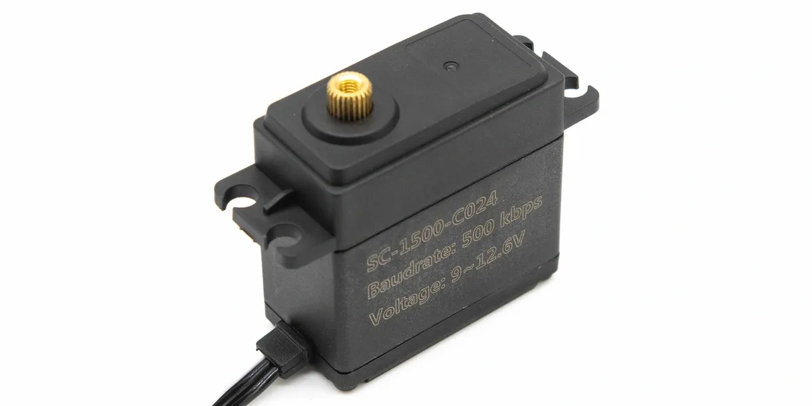
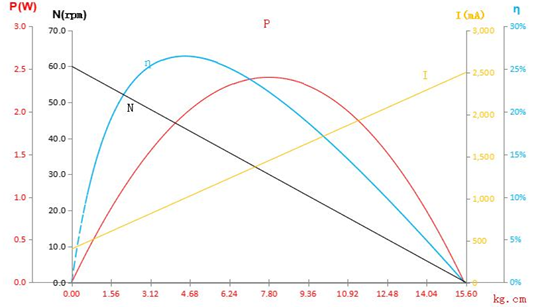

# SC-1500-C024 单轴 TTL 总线舵机

<a href="https://item.taobao.com/item.htm?id=982635791106&mi_id=0000v_NYsNZUN0hDa2Of5KzVfPsiEBuIvzjq-wjUjp19uJs&spm=a21xtw.29178619.0.0&xxc=shop&skuId=5945564497914" target="_blank">淘宝购买链接</a>

SC-1500-C024 是一款 15kg.cm 级单轴 TTL 串行总线舵机，规格书型号为 `SCS15-C024`。它采用塑胶壳、铁芯电机、铜齿轮和滚珠轴承，适合中等负载单侧输出关节、夹爪、云台和机器人机构。

{ .img-rounded width="420" }

[下载 3D 模型](assets/SC-1500-C024.stp){ .md-button download }

## 核心参数

| 项目 | 参数 |
| --- | --- |
| 规格书型号 | `SCS15-C024` |
| 结构 | 单轴 |
| 工作电压范围 | DC 9~12.6V |
| 推荐供电 | 3S 锂电池组或 12.6V 以内直流电源 |
| 空载速度 | 0.167sec/60°，约 60RPM |
| 空载电流 | 240mA |
| 堵转扭力 | 15.6kg.cm |
| 堵转电流 | 2.5A |
| 静态电流 | 40mA |
| 额定负载 | 5kg.cm，约 1/3 堵转扭力 |
| 额定电流 | 800mA |
| Kt 常数 | 6.5kg.cm/A |
| 工作温度 | -10~60℃ |
| 保存温度 | -30~80℃ |

## 机械参数

| 项目 | 参数 |
| --- | --- |
| 外形尺寸 | 40.2 x 20.2 x 40.5mm |
| 重量 | 60.2±1g |
| 外壳材质 | PA |
| 齿轮材质 | 铜齿 |
| 轴承 | 滚珠轴承 |
| 角度传感器 | 碳膜电位器 |
| 接插件 | 5264-3P |
| 线长 | 13±0.5cm |
| 出力轴 | 25T / OD 5.9mm |
| 减速比 | 1/275 |
| 齿轮虚位 | ≤0.5° |
| 出力轴螺丝 | M3 x 6 |
| 马达 | 铁芯电机 |

## 3D 模型

- [舵机本体 STP](assets/SC-1500-C024.stp){ download }

## 接口与线序

| Pin | 定义 |
| --- | --- |
| 1 | GND |
| 2 | Vcc |
| 3 | Signal / TTL |

!!! warning "接线前核对实物线序"
    本型号使用 5264-3P 接插件。请按规格书线序接入，不要与其它接口规格混插。

## 控制特性

| 项目 | 参数 |
| --- | --- |
| 控制信号 | Digital Packet |
| 协议 | Half Duplex Asynchronous Serial, 8bit, 1 stop, no parity |
| ID 范围 | 0~253，出厂默认 ID 1 |
| 波特率 | 38400bps~500000bps，出厂默认 500000bps |
| 控制算法 | PID，可修改 |
| 中位 | 511 |
| 可控角度 | 210±5°，位置范围 0~1023 |
| 电子分辨率 | 0.215°/pulse，220°/1024 |
| 默认方向 | Clockwise，0→1023，可修改 |
| 反馈 | 负载、位置、工作速度、输入电压、工作温度 |
| 运行模式 | 模式 0：角度伺服模式；模式 2：速度开环电机模式 |

## 运动特性图

{ .img-rounded }

## 保护与可靠性

- 过载保护：负载大于堵转扭力的 80% 并持续 4s 后进入保护；重新发送位置指令可清除过载保护标志。
- 电压保护：规格书控制特性页标注大于 16V 或小于 4V 进入保护；本 Wiki 推荐仍按 9~12.6V 工作范围使用。
- 过热保护：大于 70℃ 关闭扭矩输出。
- 最大位置更新率：1ms。
- 信号高电平：2~5V。
- 信号低电平：0~0.45V。
- 负载寿命测试：>50000 次。
- 防水性能：不防水。

## 基础教程

第一次使用本舵机时，建议先阅读：

- [供电与接线基础](../../../tutorials/power-and-wiring-basics.md)
- [分组供电和供电解耦](../../../tutorials/power-grouping-and-decoupling.md)
- [设备 ID 与波特率](../../../tutorials/device-id-and-baudrate.md)
- [FD 调试软件](../../../tutorials/fd-tool.md)
- [查找串口设备](../../../tutorials/find-serial-port.md)
- [常见通信问题排查](../../../tutorials/communication-troubleshooting.md)

如果要使用 Python 或 MCU 程序控制舵机，可继续阅读：

- [安装 Python](../../../tutorials/install-python.md)
- [运行 Python 脚本](../../../tutorials/run-python-scripts.md)
- [MCU UART 接线基础](../../../tutorials/mcu-uart-wiring.md)

## 使用建议

1. 第一次使用时只连接一个舵机，使用 [FD 调试软件](../../../tutorials/fd-tool.md) 搜索设备。
2. 修改为唯一 ID 后，再与其它 TTL 总线设备并联。
3. 使用 3S 锂电池组时，请保证满电电压不超过 12.6V，并预留堵转电流余量。
4. 单轴结构适合常规舵盘输出，外部支撑结构需要自行保证受力可靠。
5. 如需速度连续旋转类应用，可评估模式 2，但要注意负载增大时速度会下降。

!!! danger "15kg 级舵机需要更大的供电余量"
    多个舵机同时启动或堵转时，峰值电流可能很高。电源、开关、线材和集线板都需要按峰值电流设计。
