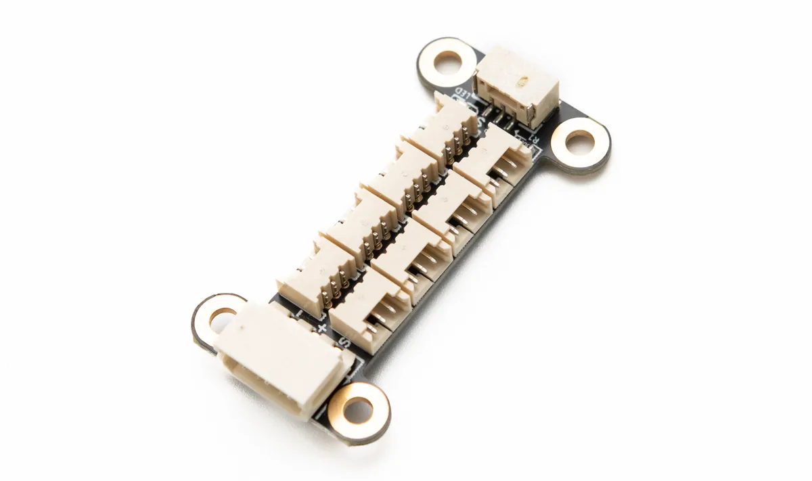

# HC-1.25 8P Hub (A)

<a href="https://item.taobao.com/item.htm?id=1002585764342&mi_id=0000YXOCtRmNxy1Iv6lT5f-IT_99heIdHCVFteEAld9UUgg&spm=a21xtw.29178619.0.0&xxc=shop" target="_blank">淘宝购买链接</a>

{ .img-rounded width="360" }

### 产品定位

**HC-1.25 8P Hub (A)** 是一款面向 HC-1.25-3P 接口 TTL 总线设备的分线板，适合空间敏感的小型机器人、灵巧手、多足机器人以及小型模块化项目。

它可以把一个 TTL 总线接口扩展为 8 个 HC-1.25-3P 接口，使多个小型总线设备可以更整洁地连接到同一条总线上。

[分组供电/供电解耦教程](../../../tutorials/power-grouping-and-decoupling.md){ .md-button }

### 主要特点

- 支持 HC-1.25-3P TTL 总线设备。
- 板载 8 个 HC-1.25-3P 接口。
- 支持 HX-5264-3P 接口，可直接连接 TTL Adapter (A) 或带 5264-3P 总线接口的控制器。
- 支持 GH-1.25-3P 通信接口，可用于通信级联或通信解耦。
- 板载供电指示灯。
- 体积约 `39 × 21 mm`，适合安装在空间紧凑的机器人结构中。
- 安装孔约 2.6 mm，4 个安装孔。

### 接口说明

| 编号 | 接口 / 资源 | 说明 |
| --- | --- | --- |
| 1 | HX-5264-3P | 可直接与 TTL Adapter (A) 或带 5264-3P 接口的控制器连接，用于通信和供电 |
| 2 | HC-1.25-3P 接口 ×8 | 用于连接 HC-1.25-3P 接口的 TTL 总线设备 |
| 3 | 供电指示灯 | 用于显示当前分线板是否接入电源 |
| 4 | GH-1.25-3P | 可用于连接 TTL Adapter (A) 或其它 Hub，仅用于通信，不用于供电 |
| 5 | 安装孔 | 约 2.6 mm 直径，4 个安装孔 |

!!! warning "GH-1.25-3P 接口仅用于通信"
    HC-1.25 8P Hub (A) 上的 GH-1.25-3P 接口主要用于 TTL 通信连接，不建议作为供电入口。

    如果需要为该 Hub 上的设备供电，应使用支持供电的 3Pin 总线接口或明确的供电入口。