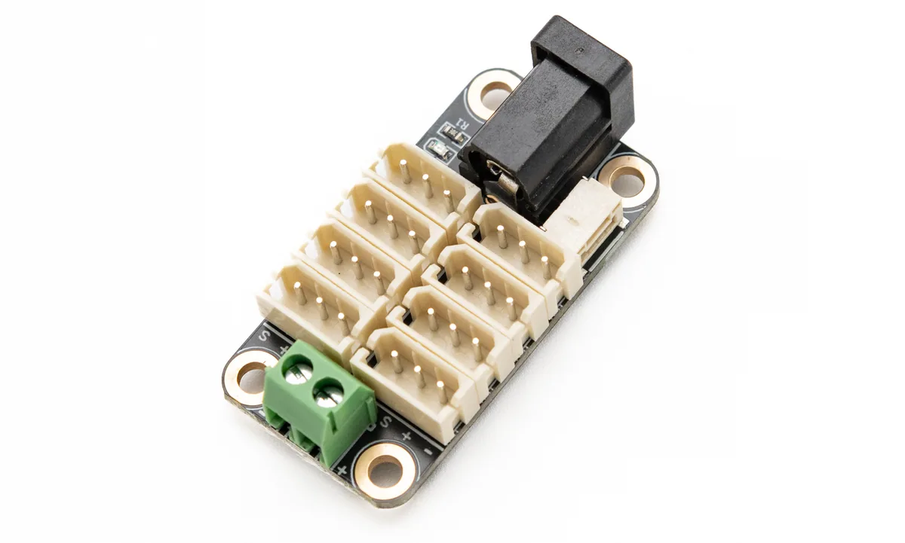

# TTL-5264 8P Hub (A)

<a href="https://item.taobao.com/item.htm?id=992302020901&mi_id=00005xvuEkVThqyvzAXR2zey4FcNumPMojg9gLPn0hggn-8&spm=a21xtw.29178619.0.0&xxc=shop" target="_blank">淘宝购买链接</a>

{ .img-rounded width="360" }

### 产品定位

**TTL-5264 8P Hub (A)** 是一款面向 5264-3P 接口 TTL 总线设备的分线板，适合用于 Lygion 步进电机驱动板飞特总线舵机等其它 TTL 总线设备。

它可以将一个 TTL 总线接口扩展为多个 5264-3P 接口，也可以通过板间通信接口实现多块分线板级联，从而为多组设备提供更清晰的供电和布线结构。

[分组供电/供电解耦教程](../../../tutorials/power-grouping-and-decoupling.md){ .md-button }

### 主要特点

- 支持 5264-3P TTL 总线接口。
- 板载 8 个 5264-3P 设备接口。
- 支持 DC5521 供电接口。
- 支持 KF301-2P 接线端子供电。
- 支持板间通信接口，便于多块 Hub 级联。
- 支持为不同分组接入不同电压的电源。
- 板载电源指示灯。
- 体积约 `44 × 21 × 14 mm`，适合安装在机械臂、多足机器人、舵机阵列等空间有限的结构中。

### 接口说明

| 编号 | 接口 / 资源 | 说明 |
| --- | --- | --- |
| 1 | KF301-2P 供电端子 | 与 DC5521 供电接口连接，任意一个供电入口接入即可 |
| 2 | 电源指示灯 | 用于显示当前分线板是否接入电源 |
| 3 | 安装孔 | 约 3 mm 直径，4 个安装孔 |
| 4 | DC5521 供电接口 | 支持 DC 5–25.2V 供电 |
| 5 | 单线 TTL 板间通信接口 | 用于多块分线板之间传递 TTL 通信信号 |
| 6 | 5264-3P 接口 ×8 | 用于连接 5264-3P 接口的 TTL 总线设备 |

!!! note "供电电压必须匹配设备"
    Hub 本身只是分线与供电分配板，不会自动升压、降压或稳压。

    接入 Hub 的电源电压必须与连接的总线舵机、关节、轮毂电机或其它设备的额定电压匹配。