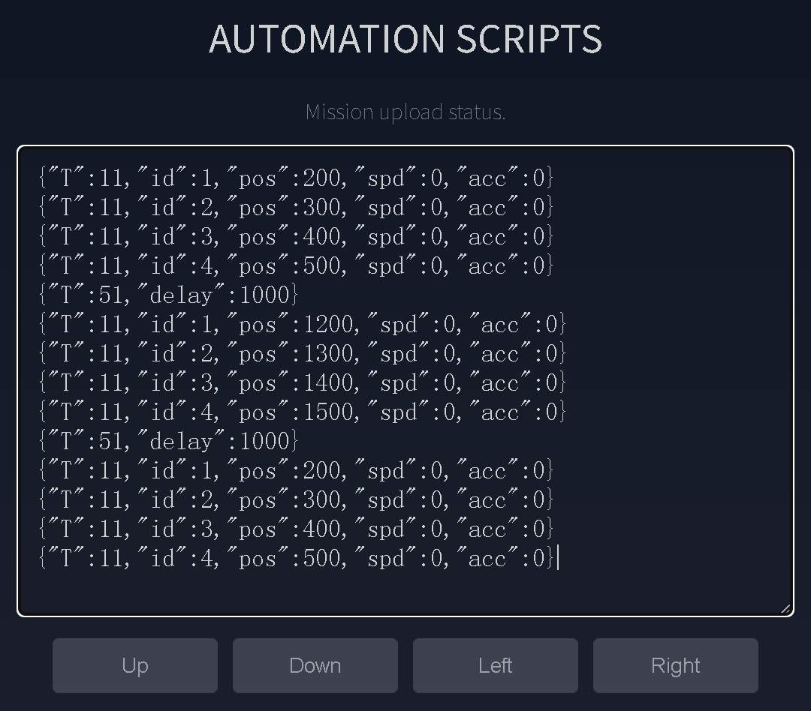

# 动作脚本与任务文件

任务文件可以按顺序保存多条 JSON 指令，用于编排舵机动作、延时、OLED、蜂鸣器和设备配置。保存后不需要保持浏览器连接，驱动板可以通过五向开关或开机流程独立执行。

## 第一个动作脚本

1. 打开 Web 控制台。
2. 使用正确的舵机组件填写 `ID`、位置、速度等参数。
3. 点击 `Add`，将动作指令加入 `Automation Scripts`。
4. 在 `Delay(ms)` 填写等待时间，例如 `1000`。
5. 点击延时后的 `Add`。
6. 重复添加后续动作。
7. 点击 `Up`、`Down`、`Left` 或 `Right` 保存并绑定按键。

{ .img-rounded width="620" }

!!! important "每行一条 JSON"
    `Automation Scripts` 输入框中，每条 JSON 指令必须独占一行，否则前端无法正确解析。

## 为什么需要延时

如果连续发送多个舵机目标位置而不等待，舵机可能还未完成前一个动作就收到新目标，表现为直接运动到最后一个位置。

```json
{"T":31,"id":4,"pos":700,"time":0,"spd":100}
{"T":51,"delay":1000}
{"T":31,"id":4,"pos":300,"time":0,"spd":100}
```

`T:51` 是延时指令，单位为毫秒。

如果多个舵机需要同时启动，应先连续写入这些舵机的动作指令，再添加统一延时：

```json
{"T":11,"id":1,"pos":1200,"spd":600,"acc":50}
{"T":11,"id":2,"pos":2800,"spd":600,"acc":50}
{"T":51,"delay":1000}
```

## 按键与任务文件

| Web 按钮 | 文件名 | 触发方式 |
| --- | --- | --- |
| `Up` | `up.mission` | 五向开关向上 |
| `Down` | `down.mission` | 五向开关向下 |
| `Left` | `left.mission` | 五向开关向左 |
| `Right` | `right.mission` | 五向开关向右 |
| `On Boot` | `boot_user.mission` | 每次开机后无限循环 |

调用任务时只写名称，不需要 `.mission` 后缀。

`STOP MISSION` 或以下指令可以停止当前任务：

```json
{"T":0}
```

## `boot.mission` 与 `boot_user.mission`

二者用途不同：

- `boot.mission`：系统启动配置文件，用于保存 Wi-Fi、总线波特率等启动设置。
- `boot_user.mission`：用户通过 `On Boot` 保存的自动化动作，开机后无限循环。

例如，让设备每次启动都将总线波特率设置为 500 Kbps：

```json
{"T":303,"name":"boot","json":"{\"T\":10,\"baud\":500000}"}
```

## 使用 JSON 管理任务

### 创建任务

```json
{"T":301,"name":"demo","intro":"Demo mission"}
```

### 追加指令

```json
{"T":303,"name":"demo","json":"{\"T\":51,\"delay\":1000}"}
```

### 运行任务

```json
{"T":308,"name":"demo","interval":0,"loop":1}
```

- `interval`：每条任务指令执行后的额外延时。
- `loop`：循环次数，`-1` 表示无限循环。

### 删除任务

```json
{"T":309,"name":"demo"}
```

完整文件操作命令见[JSON 指令参考](json-command-interaction.md#mission-files)。

## 重置任务文件

Web 页面底部的 Reset 会格式化 ESP32-S3 文件系统，删除任务文件和已保存的 Wi-Fi 配置。重置后需要重新配置网络。

!!! warning "先备份脚本"
    重置不可撤销。重要任务应同时保存在电脑上的文本文件或版本控制仓库中。
