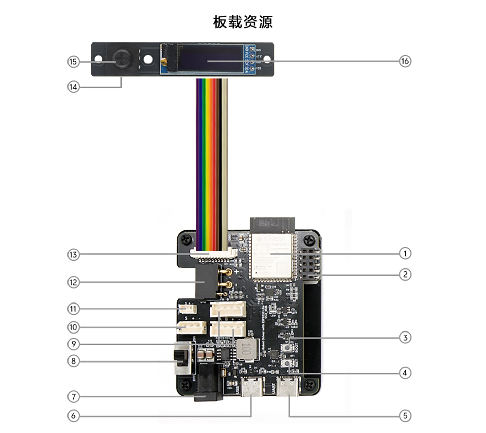
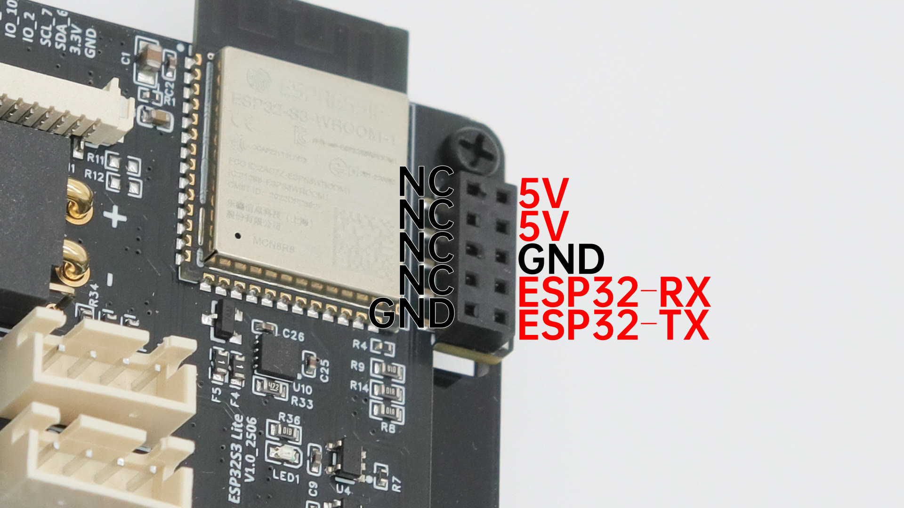

# 硬件资源与接线

{ .img-rounded width="760" }

## 资源编号

| 编号 | 资源 | 说明 |
| ---: | --- | --- |
| 1 | ESP32-S3-WROOM-1 R8N8 | 主控与板载天线模块 |
| 2 | 2.54 mm 2×5 HAT 接口 | Raspberry Pi UART、5V 与 GND |
| 3 | IO0 按键 | 自动下载失效时手动进入下载模式 |
| 4 | EN 按键 | 手动复位 ESP32-S3 |
| 5 | UART Type-C | UART0 转 USB，默认用于串口透传和刷机 |
| 6 | USB Type-C | ESP32-S3 原生 USB CDC |
| 7 | DC5521 | DC 6~20V 电源输入 |
| 8 | 电源开关 | 控制外部执行器供电 |
| 9 | XH2.54-4P | RS485 总线舵机 / 关节接口 |
| 10 | HX-5264-3P | 单线 TTL 总线接口 |
| 11 | HC-1.25-3P | 单线 TTL 总线接口 |
| 12 | XT30PW(2+2) | CAN 通信与供电 |
| 13 | 多功能扩展接口 | IO、3.3V 和 GND |
| 14 | 无源蜂鸣器 | 位于 UI 板背面，由 IO21 控制 |
| 15 | 五向开关 | 本地触发任务或自定义功能 |
| 16 | 0.91 英寸 OLED | I²C 屏幕 |

## 电源

### 外部执行器电源

DC5521 输入范围为 DC 6~20V，XT30(2+2) 也可用于执行器通信和供电。

!!! danger "电压由执行器决定"
    电源输入与总线舵机、关节和轮毂电机的供电路径直接相连。必须按照执行器额定电压选择电源。

### 板载电源

- 5V 5A DC-DC 稳压输出
- 3.3V LDO
- Type-C 可以单独启动 ESP32-S3、OLED、蜂鸣器和 Wi-Fi

电源开关只控制外部动力供电。连接 Type-C 后，即使开关为 `OFF`，ESP32-S3 仍会启动。

## 通信接口

### 单线 TTL

- HX-5264-3P
- HC-1.25-3P

用于连接兼容的单线 TTL 总线舵机和关节设备。

### RS485

XH2.54-4P 接口用于 RS485 总线舵机或关节设备。

### CAN

XT30PW(2+2) 同时提供 CAN 通信与供电，适用于 CAN 轮毂电机和关节执行器。

## HAT 接口

{ .img-rounded width="760" }

2×5 接口的有效信号：

| 引脚 | 用途 |
| --- | --- |
| 5V × 2 | 可为 Raspberry Pi 或接收机供电，板载电源最高支持 5A |
| GND | 公共地 |
| ESP32-RX | ESP32-S3 UART0 接收 |
| ESP32-TX | ESP32-S3 UART0 发送 |
| NC | 未连接 |

连接 Raspberry Pi 时：

| 驱动板 | Raspberry Pi |
| --- | --- |
| ESP32-RX | GPIO-TX |
| ESP32-TX | GPIO-RX |
| GND | GND |

默认 UART0 波特率为 1 Mbps。

!!! warning "UART0 默认是透传模式"
    如需让 Raspberry Pi 通过 UART0 发送 JSON，应先通过 USB CDC、HTTP 或 WebSocket 发送 `{"T":605,"sf":0}` 关闭透传。

## 扩展 IO

多功能扩展接口从左到右：

```text
IO21, IO9, IO12, IO11, IO10, IO2, IO7, IO6, 3V3, GND
```

已被板载资源占用的引脚：

| 资源 | 引脚 |
| --- | --- |
| 蜂鸣器 | IO21 |
| 五向开关 Up | IO10 |
| 五向开关 Down | IO11 |
| 五向开关 Left | IO12 |
| 五向开关 Right | IO9 |
| 五向开关 OK | IO2 |
| OLED SDA | IO6 |
| OLED SCL | IO7 |

二次开发时避免让同一引脚同时承担冲突功能。

## USB 与 UART 接口区别

| 接口 | 默认用途 |
| --- | --- |
| `USB` | 原生 USB CDC，上位机高速通信 |
| `UART` | UART0 转 USB，串口透传和固件恢复 |

两者外形相同，接线前应查看 PCB 丝印。

## 机械图纸下载

[下载 Robot Driver with ESP32S3 Lite 三维图纸（STEP，约 78 MB）](<assets/Robot Driver with ESP32S3 Lite.step>){ .md-button .md-button--primary }

STEP 文件可用于：

- 检查控制板和外壳的安装空间
- 设计支架、底盘与设备舱
- 评估接口、线缆和紧固件的避让空间
- 导入 CAD 软件进行装配设计

!!! warning "加工前复核实物版本"
    图纸适合结构设计和装配评估。正式开孔、加工或批量生产前，请确认图纸版本与手中的控制板硬件批次一致，并复核关键安装尺寸和接口位置。
