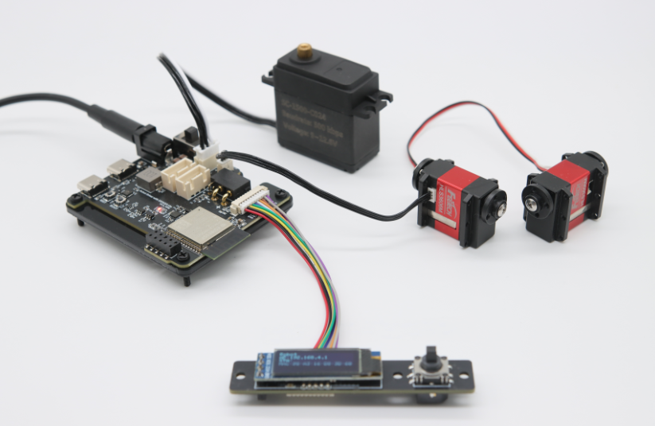

# Robot Driver with ESP32S3 Lite

<a href="https://item.taobao.com/item.htm?id=976100303360&mi_id=0000-71ipVAVfFB4OuwgzhdKnbhj47k9pP_8CMr_JP1eQgw&spm=a21xtw.29178619.0.0&xxc=shop" target="_blank">淘宝购买链接</a>

Robot Driver with ESP32S3 Lite 是一款面向机器人项目的 ESP32-S3 控制板。它既可以独立运行机器人控制逻辑，也可以作为 Raspberry Pi、Jetson 或 PC 的下位机，负责执行舵机控制、动作脚本和高频设备通信。

{ .img-rounded width="720" }

## 你可以用它做什么

- 通过浏览器直接控制飞特 STS、SMS、HLS、SCS 系列总线舵机。
- 使用单线 TTL、RS485 或 CAN 接口连接舵机、轮毂电机和关节执行器。
- 将动作保存为任务文件，并绑定到五向开关或设置为开机自动运行。
- 通过 USB CDC、HTTP、WebSocket 或 GPIO UART 接收上位机 JSON 指令。
- 使用 ESP-NOW 与其他 ESP32 设备通信。
- 接入 S.BUS 遥控接收机，开发遥控机器人。
- 使用 PlatformIO 和 Arduino 框架修改开源固件。

## 核心规格

| 项目 | 规格 |
| --- | --- |
| 主控模块 | ESP32-S3-WROOM-1 R8N8 |
| 输入电压 | DC 6~20V，必须与所连接执行器的额定电压匹配 |
| 执行器接口 | 单线 TTL、RS485、CAN |
| 上位机通信 | USB CDC、GPIO UART、USB UART、HTTP、WebSocket |
| 无线通信 | Wi-Fi AP + STA、ESP-NOW |
| 本地交互 | 0.91 英寸 OLED、五向开关、无源蜂鸣器 |
| 电源资源 | 5V 5A DC-DC、3.3V LDO |
| 数据格式 | JSON |
| 开发框架 | Arduino，推荐 VS Code + PlatformIO |

## 通信方式怎么选

| 方式 | 典型频率 | 适合场景 |
| --- | ---: | --- |
| USB CDC | 约 2700~3100 条指令/秒 | 有线高频控制、日志和稳定通信 |
| WebSocket | 约 62~66 条指令/秒 | 无线低延迟控制、双向状态推送 |
| HTTP | 约 40 条指令/秒 | 简单请求、配置和低频自动化 |
| GPIO UART | 最高取决于配置，默认 1 Mbps | Raspberry Pi HAT、嵌入式主机 |

!!! note "数据来自当前资料包"
    实际通信频率会受到固件版本、网络环境、上位机性能和指令负载影响。

## 从哪里开始

1. 第一次使用，请阅读[快速开始](quickstart.md)。
2. 想用浏览器操作，请阅读[Web 控制台](web-console.md)。
3. 想控制舵机，请阅读[舵机与总线设备](servo-control.md)。
4. 想用 Python 或其他上位机程序控制，请阅读[上位机通信](host-communication.md)。
5. 想修改固件，请阅读[PlatformIO 二次开发](advanced-development.md)。

## 文档地图

- **开始使用**
    - [快速开始](quickstart.md)
    - [Web 控制台](web-console.md)
    - [舵机与总线设备](servo-control.md)
- **自动化与接口**
    - [动作脚本与任务文件](action-scripting.md)
    - [JSON 指令参考](json-command-interaction.md)
    - [上位机通信](host-communication.md)
- **硬件与维护**
    - [硬件资源与接线](board-resources.md)
    - [UART 透传与 S.BUS](uart-sbus.md)
    - [固件恢复](firmware-flash-and-reset.md)
- **开发与排障**
    - [PlatformIO 二次开发](advanced-development.md)
    - [故障排查](faq.md)

## 开源项目

- [Robot Driver with ESP32S3 Lite 固件与示例](https://github.com/EffectsMachine/robot_driver_with_esp32s3_lite)

!!! warning "供电安全"
    DC5521 和 XT30(2+2) 的电源会直接供给执行器接口。接通电源前，必须确认输入电压与全部舵机、关节和轮毂电机兼容。
