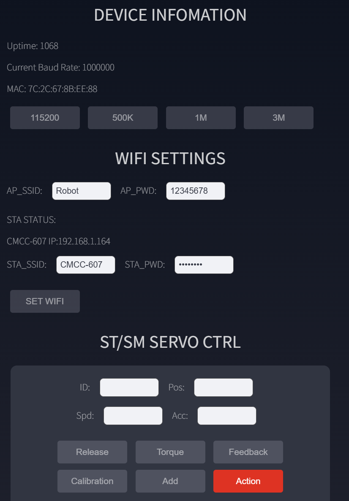
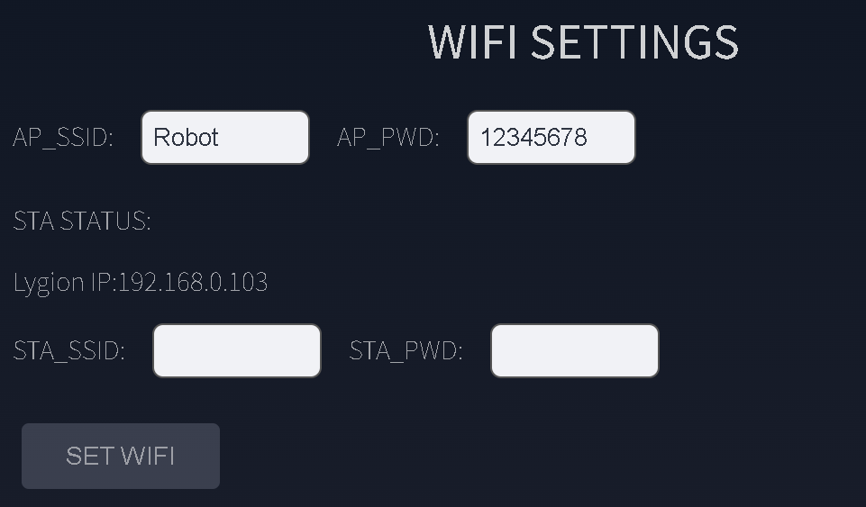

# 快速开始

本页帮助你在不安装软件的情况下完成第一次连接，并通过浏览器确认驱动板工作正常。

## 准备物品

- Robot Driver with ESP32S3 Lite
- 一台带 Wi-Fi 和浏览器的电脑、手机或平板
- USB Type-C 数据线
- 如需控制舵机：与舵机额定电压匹配的 DC 电源

## 认识两个 Type-C 接口

驱动板有两个外形相同但用途不同的 Type-C 接口：

- **USB 接口**：ESP32-S3 原生 USB CDC，用于上位机高速通信。
- **UART 接口**：UART0 转 USB，用于刷机和默认的串口透传。

!!! warning "不要接错接口"
    初次浏览器使用只需要给任意 Type-C 接口供电；后续进行 USB CDC 通信时必须连接标有 `USB` 的接口，刷机和 FD 串口透传则使用 `UART` 接口。

## 1. 给驱动板上电

仅体验 OLED、蜂鸣器、Wi-Fi 和 Web 控制台时，连接 Type-C 即可。ESP32-S3 会直接启动，电源开关的位置不影响 Type-C 供电。

如需控制舵机或其他执行器：

1. 将匹配执行器电压的电源接入 DC5521 或 XT30(2+2)。
2. 将电源开关拨到 `ON`。
3. 等待蜂鸣器响一声，OLED 显示网络信息。

!!! danger "执行器电压"
    外部电源与执行器接口直连。例如控制 12V 舵机时应使用 12V 电源。不要仅根据驱动板支持 6~20V 就忽略执行器自身的额定电压。

## 2. 连接驱动板热点

驱动板首次启动会创建 Wi-Fi 热点：

| 项目 | 默认值 |
| --- | --- |
| SSID | `Robot` |
| 密码 | `12345678` |
| Web 地址 | `http://192.168.4.1` |

=== "Windows"

    1. 点击任务栏网络图标。
    2. 选择 `Robot`，输入密码 `12345678`。
    3. 如果 Windows 提示“无 Internet”，保持连接。
    4. 使用 Edge、Chrome 或 Firefox 打开 `http://192.168.4.1`。

=== "macOS"

    1. 点击菜单栏 Wi-Fi 图标。
    2. 选择 `Robot`，输入密码 `12345678`。
    3. 如果系统提示热点无法访问互联网，仍然保留连接。
    4. 使用 Safari、Chrome 或 Firefox 打开 `http://192.168.4.1`。

=== "Linux"

    1. 在桌面网络菜单中连接 `Robot`，输入密码 `12345678`。
    2. 保持连接，即使网络管理器显示“受限连接”。
    3. 使用 Chrome 或 Firefox 打开 `http://192.168.4.1`。

=== "手机 / 平板"

    1. 在系统 Wi-Fi 设置中连接 `Robot`。
    2. 拒绝自动切换到蜂窝网络或其他 Wi-Fi。
    3. 使用浏览器打开 `http://192.168.4.1`。

## 3. 确认连接正常

进入控制台后查看 `DEVICE INFORMATION`：

- `Uptime` 应每秒递增。
- `Current Baud Rate` 默认应为 `1000000`。
- 页面按钮可以正常点击。

{ .img-rounded width="720" }

如果 `Uptime` 不更新，先刷新页面，再确认设备仍连接 `Robot` 热点。

## 4. 推荐配置到局域网

AP 模式适合首次配置，但电脑或手机连接驱动板热点时通常无法访问互联网。推荐将驱动板加入现有路由器：

1. 找到 `WIFI SETTINGS`。
2. 在 `STA_SSID` 输入路由器 Wi-Fi 名称。
3. 在 `STA_PWD` 输入路由器密码。
4. 点击 `SET WIFI` 并确认。
5. 等待 `STA STATUS` 显示 Wi-Fi 名称和 IP。
6. 记录该 IP，将电脑或手机切回原来的路由器。
7. 在同一局域网内，用记录的 IP 打开控制台。

{ .img-rounded width="520" }

!!! tip "AP 与 STA 可以同时工作"
    驱动板默认使用 AP + STA 混合模式。加入路由器后，自建热点仍可用于现场维护。

## 下一步

- 了解页面功能：[Web 控制台](web-console.md)
- 连接并控制舵机：[舵机与总线设备](servo-control.md)
- 用 Python 控制：[上位机通信](host-communication.md)
