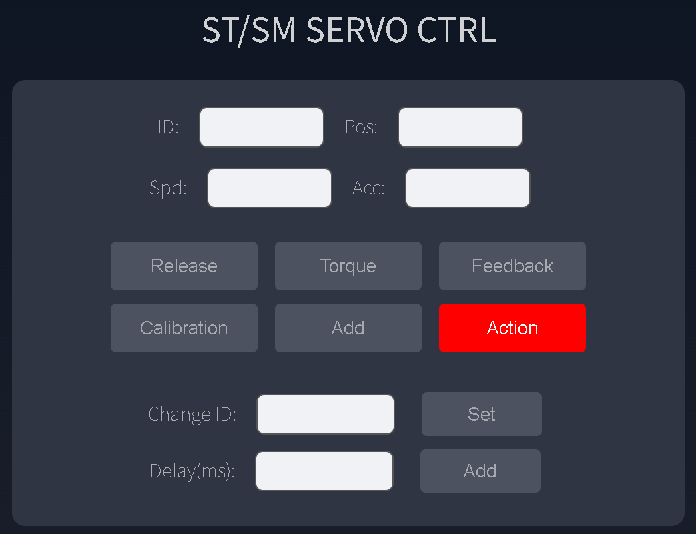

# 舵机与总线设备

驱动板可控制飞特 STS、SMS、HLS、SCS 系列总线舵机，并为后续 CAN 轮毂电机和关节执行器扩展预留接口。

## 接线前检查

1. 确认舵机额定电压。
2. 使用匹配电压的电源连接 DC5521 或 XT30(2+2)。
3. 将舵机连接到对应的单线 TTL 或 RS485 接口。
4. 将开关拨到 `ON`。
5. 确认 Web 控制台中的总线波特率与舵机一致。

!!! danger "Type-C 不用于舵机动力供电"
    Type-C 可以启动 ESP32-S3 和板载资源，但不能替代执行器外部电源。

## 设置舵机 ID

新舵机通常使用相同的默认 ID。首次配置多个舵机时：

1. 总线上只连接一个舵机。
2. 选择与舵机系列匹配的控制组件。
3. 设置正确的总线波特率。
4. 在 `ID` 输入当前 ID。
5. 在 `Change ID` 输入新 ID。
6. 点击 `SET`。
7. 测试新 ID 后断开该舵机，再配置下一个。

!!! warning "不要同时修改多个同 ID 舵机"
    如果多个出厂 ID 相同的舵机同时在线，它们可能一起被改成相同的新 ID。

如果忘记当前 ID，可以使用广播 ID `254`。使用广播 ID 时，总线上必须只保留一个舵机。

## STS / SMS 参数

{ .img-rounded width="480" }

| 参数 | 含义 |
| --- | --- |
| `ID` | 舵机 ID |
| `Pos` | 绝对目标位置，单位：步 |
| `Spd` | 速度，单位：步/秒；`0` 表示最高速度 |
| `Acc` | 加速度，单位：步/秒²；`0` 表示最高加速度 |

常用按钮：

- `Release`：关闭扭矩锁，可用外力转动舵机。
- `Torque`：打开扭矩锁，使舵机保持目标位置。
- `Feedback`：读取当前位置并填入 `Pos`。
- `Calibration`：将当前位置设置为中位。
- `Action`：立即执行当前动作。
- `Add`：将动作转换为 JSON 并加入动作脚本。

## HLS 参数

HLS 组件与 STS / SMS 类似，额外提供 `Current Limit` 用于限制输出电流和扭矩。

!!! warning "HLS 速度不能为 0"
    当前资料中的 HLS JSON 指令要求 `spd` 使用有效非零速度值，否则舵机可能不转动。

## SCS 参数

| 参数 | 含义 |
| --- | --- |
| `Pos` | 目标位置，单位：步 |
| `Time` | 运动时间，单位：ms |
| `Spd` | 速度，单位：步/秒 |

当 `Time` 和 `Spd` 都为 `0` 时，舵机以最高速度运动。SCS 系列没有设置中位功能。

以 SC-1500 为例：

- 编码器基础范围约为 `0~1023`。
- 为避开电位计边缘非线性，默认有效位置范围约为 `20~1001`。
- 角度换算可使用：`步数 = (1024 / 220) × 角度`。

STS / SMS / HLS 常见编码器范围为 `0~4095`，可使用：`步数 = (4096 / 360) × 角度`。

## 控制失败检查

1. 外部电源是否已连接。
2. 电源开关是否为 `ON`。
3. 输入电压是否匹配舵机。
4. Web 控制台 `Uptime` 是否更新。
5. 是否选择了正确的舵机系列组件。
6. 总线波特率是否一致。
7. 舵机 ID 是否正确或冲突。
8. 使用广播 ID `254` 单独测试。

需要用 FD 软件直接调参时，请阅读[UART 透传与 S.BUS](uart-sbus.md)。
