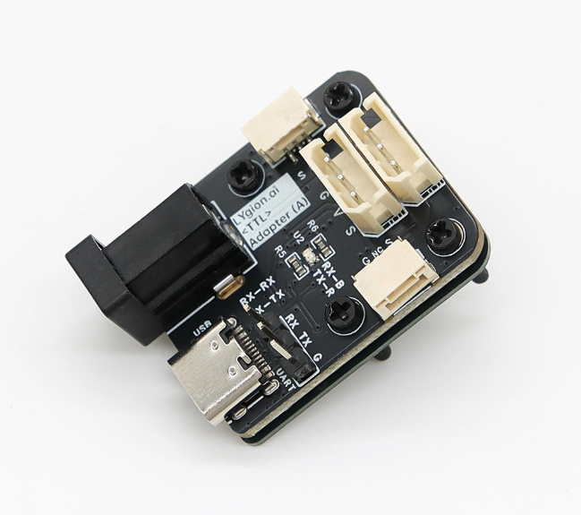

# TTL Adapter (A)

<a href="https://item.taobao.com/item.htm?id=983866781632&mi_id=0000IWUJGGoNcGk3nsNMEVwQL9fkDaIBh-RqoLIzC7UwpL8&spm=a21xtw.29178619.0.0&xxc=shop" target="_blank">淘宝购买链接</a>

TTL Adapter (A) 是一款用于机器人和嵌入式系统的 TTL 总线通信适配器。它可以把电脑 USB 接口或 MCU UART 接口转换为单线 TTL 总线，用于控制 Lygion TTL 总线设备和兼容的飞特 TTL 总线舵机。

{ .img-rounded width="360" }

## 适合做什么

- 使用电脑、Raspberry Pi、Jetson 或 Mac 调试 TTL 总线设备。
- 使用 Python SDK 读取设备反馈或发送控制指令。
- 使用 FD 调试软件扫描设备、修改 ID、修改参数。
- 将 MCU 的 UART 接入单线 TTL 总线。
- 为多个 TTL 总线设备提供通信入口和基础供电入口。

## 主要特性

| 项目 | 参数 |
| --- | --- |
| 通信接口 | USB、UART RX/TX、单线 TTL 总线 |
| USB 接口 | USB Type-C |
| 供电输入 | DC 5~25.2V |
| 最大波特率 | 3 Mbps |
| 支持设备 | Lygion TTL 设备、Feetech STS / HLS / SCS TTL 总线舵机 |
| 产品尺寸 | 27 × 35 mm |

## 文档导航

- [硬件概览](hardware-overview.md)
- [供电与接线](power-and-wiring.md)
- [驱动与串口](drivers-and-ports.md)
- [SDK 与工具](sdk-and-tools.md)

## 第一次使用

如果你只是想尽快跑通通信，请先阅读：

- [快速上手](../../../quickstart/index.md)
- [查找串口设备](../../../tutorials/find-serial-port.md)

!!! warning "USB 供电限制"
    USB 可以用于通信和低功耗调试，但不建议作为舵机、步进驱动器等执行器的主要工作电源。
