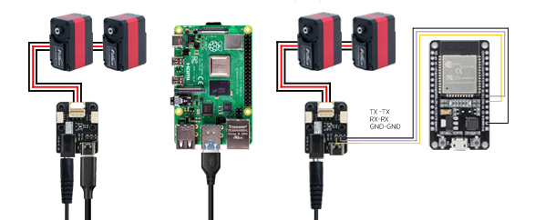
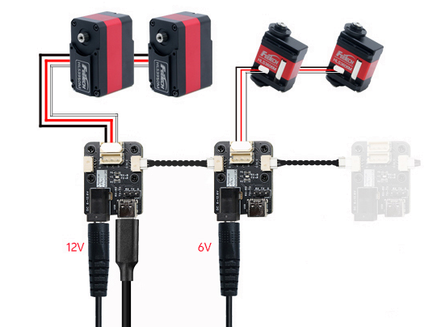

# TTL Adapter (A) 供电与接线

TTL Adapter (A) 支持 USB 通信、UART 通信和单线 TTL 总线通信。不同使用方式的接线逻辑不同。

{ .img-rounded }

## PC / SBC USB 控制

```text
PC / Raspberry Pi / Jetson / Mac
        │ USB
        ▼
TTL Adapter (A)
        │ TTL Bus
        ▼
TTL Bus Device(s)
```

USB 线用于通信。执行器类设备需要额外接入外部电源。

## 外部供电

通过 DC5521 接口输入外部电源。

| 项目 | 参数 |
| --- | --- |
| 输入电压 | DC 5~25.2V |
| 供电接口 | DC5521 |

!!! warning "电压必须匹配设备"
    输入电压不仅要适配 TTL Adapter (A)，也要适配连接到总线上的设备。不要把低压设备接到高压总线。

## MCU UART 控制

TTL Adapter (A) 的 UART 接口可连接 ESP32、STM32、Arduino 等 MCU。

| TTL Adapter (A) | MCU |
| --- | --- |
| TX | TX |
| RX | RX |
| GND | GND |

!!! note "与普通 USB-TTL 模块不同"
    当 TTL Adapter (A) 作为单线 TTL 转接板使用时，外部 MCU 与 Adapter 的 UART 连接通常为 `TX 接 TX`、`RX 接 RX`、`GND 接 GND`。

## 分组供电

{ .img-rounded }

多个 TTL Adapter 或 Hub 可用于分组供电，使不同电压或大电流设备更容易布线。

建议在以下场景使用分组供电：

- 同一系统中同时有 6V、12V、24V 设备。
- 多个大扭矩舵机或步进驱动器同时工作。
- 总线距离较长，压降明显。

更多通用说明见：

- [供电与接线基础](../../../tutorials/power-and-wiring-basics.md)
- [分组供电/供电解耦教程](../../../tutorials/power-grouping-and-decoupling.md)