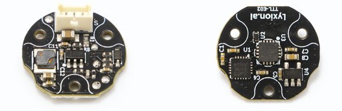

# TTL Encoder E02

TTL Encoder E02 是一款基于单线 TTL 总线通信的 12bit 绝对角度磁编码器，可用于读取机械结构的角度和速度反馈。

{ .img-rounded width="360" }

## 适用场景

- 机械臂关节角度反馈
- 灵巧手关节反馈
- 齿轮、同步轮或减速器输出轴角度检测
- 转台角度读取
- 轮式底盘转向机构反馈
- 机械臂 Leader-Follower 或低成本闭环系统

## 主要参数

| 项目 | 参数 |
| --- | --- |
| 通信方式 | 单线 TTL 总线 |
| 默认波特率 | 1 Mbps |
| 出厂默认 ID | 1 |
| ID 范围 | 1~252 |
| 供电电压 | DC 5~28V |
| 角度反馈 | 12bit 绝对角度 |
| 单圈位置范围 | 0~4095 |
| 多圈位置范围 | 0~65534，掉电不保存 |
| 接口 | HC-1.25-3P |

## 文档导航

- [硬件安装](hardware-installation.md)
- [Python 读取](python-quickstart.md)
- [C++ / Arduino](cpp-arduino.md)
- [校准与多圈](calibration-and-multiturn.md)
- [FAQ](faq.md)

## 快速开始

第一次使用建议先完成：

- [快速上手](../../../quickstart/index.md)
- [查找串口设备](../../../tutorials/find-serial-port.md)
