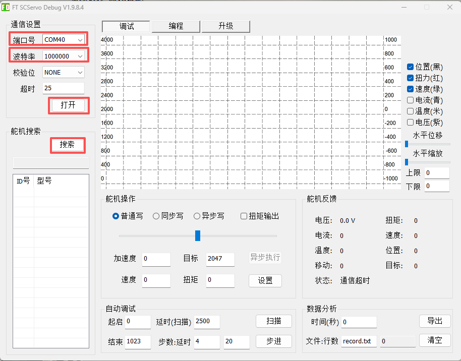
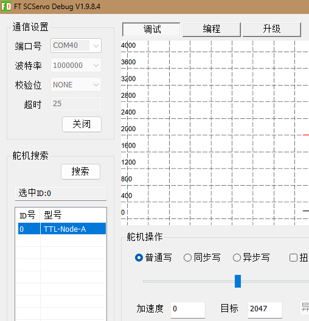
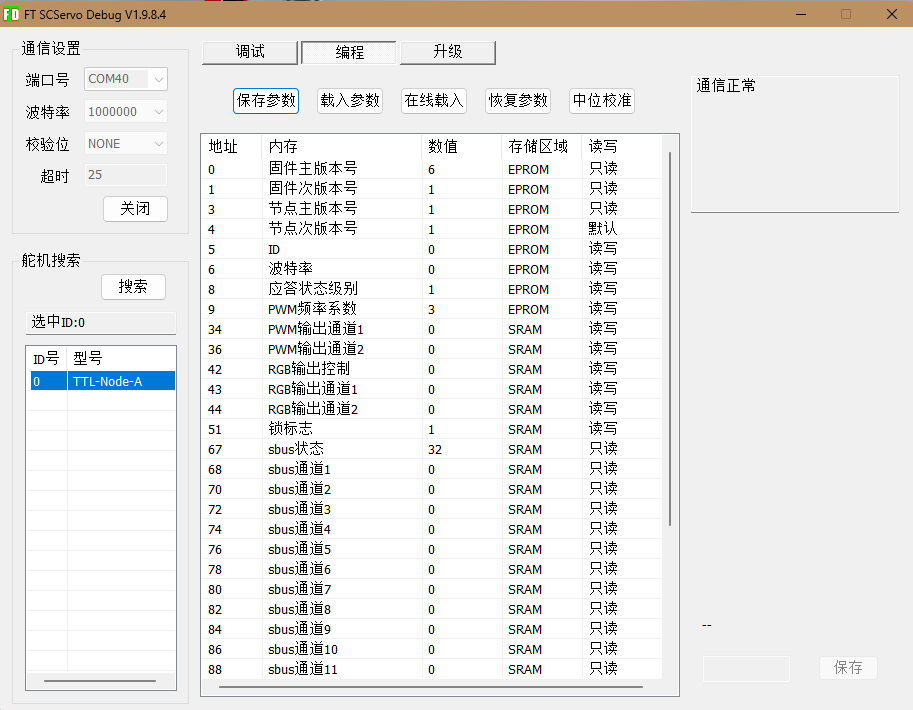
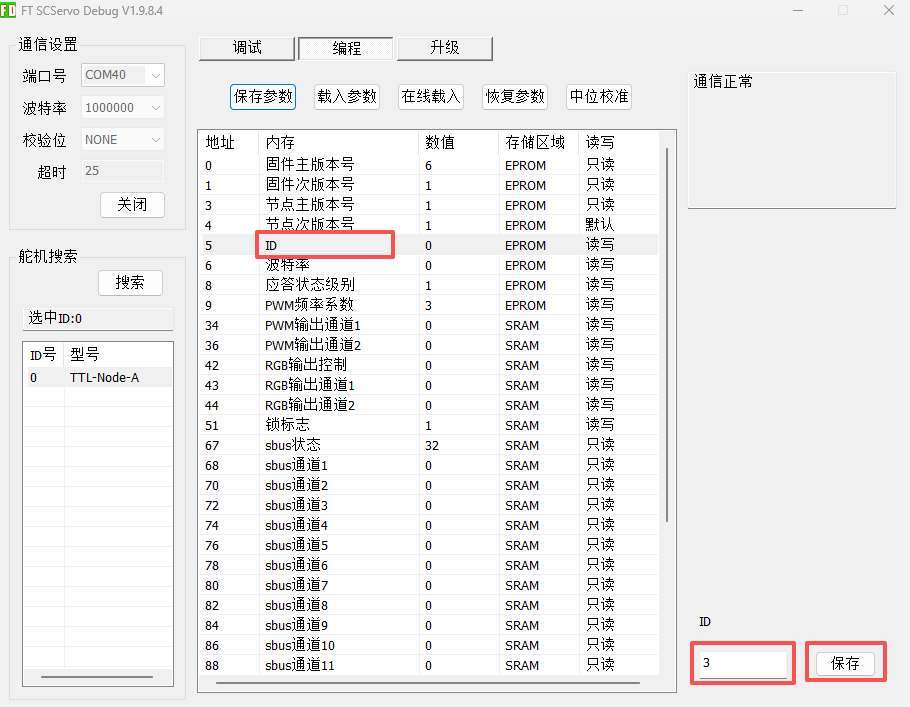
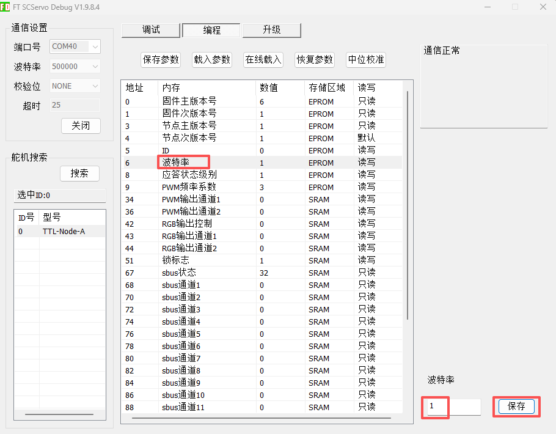

# 使用 FD 配置 TTL Node (A)

FD 是 Windows 平台上的图形化总线设备调试工具，可用于搜索 TTL Node (A)、修改设备 ID 和波特率，以及测试 PWM、RGB 和 S.BUS 数据。

!!! warning "修改 ID 前只连接一个待配置设备"
    TTL Node (A) 的出厂 ID 为 `0`。如果总线上同时存在多个相同 ID 的设备，搜索和写入参数可能失败或作用于错误设备。

## 连接并搜索设备

1. 使用 USB Type-C 直接连接 TTL Node (A)，或通过 TTL Adapter (A) 连接。
2. 打开 FD。首次识别 TTL Node (A) 时需要联网下载设备信息。
3. 选择系统分配的 `COM` 端口。不确定端口时，可在 Windows 设备管理器中查找名称包含 `CH343` 的设备。
4. 波特率选择 `1000000`，校验位选择 `NONE`。
5. 点击“打开”，再点击“搜索”。
6. 找到 `TTL-Node-A` 后点击“停止”，避免持续搜索影响后续操作。

{ .img-rounded }

搜索成功后，左侧列表会显示设备型号和 ID：

{ .img-rounded }

## 打开参数页面

选中左侧的 `TTL-Node-A`，再点击顶部“编程”选项卡。标记为“读写”的参数可以修改，标记为“只读”的参数只能查看。

{ .img-rounded }

## 修改设备 ID

1. 在参数表中选择“ID”。
2. 在右下角输入新 ID。
3. 点击“保存”。
4. 关闭并重新打开端口，使用新 ID 搜索确认。

可设置的 ID 范围为 `0~253`，且不能与同一总线上的其他节点或舵机重复。

{ .img-rounded }

## 修改波特率

“波特率”参数保存的是编号，不是直接填写波特率数值。

| 参数值 | 实际波特率 |
| ---: | ---: |
| `0` | 1,000,000 bps |
| `1` | 500,000 bps |
| `2` | 250,000 bps |
| `3` | 128,000 bps |
| `4` | 115,200 bps |
| `5` | 76,800 bps |
| `6` | 57,600 bps |
| `7` | 38,400 bps |

1. 选择“波特率”。
2. 输入对应的参数值并保存。
3. 关闭 FD 端口。
4. 将左侧通信波特率改为新的实际波特率，再重新打开和搜索。

{ .img-rounded }

!!! note "总线上所有设备波特率必须一致"
    例如总线舵机使用 500,000 bps 时，TTL Node (A) 也需要设置为参数值 `1`。

## 常用参数

| 参数 | 地址 | 说明 |
| --- | ---: | --- |
| ID | 5 | 设备地址，范围 `0~253` |
| 波特率 | 6 | 使用上表中的编号 |
| 应答状态级别 | 8 | `0`：除读和 PING 外不应答；`1`：所有指令均应答 |
| PWM 频率系数 | 9 | PWM 输出的频率配置 |
| PWM 输出通道 1 | 34 | `0~1000`，控制输出口 01 |
| PWM 输出通道 2 | 36 | `0~1000`，控制输出口 02 |
| RGB 输出控制 | 42 | 写入需要刷新的 RGB 通道数量，本产品为 `2` |
| RGB 输出通道 1 | 43 | RGB1 颜色值 |
| RGB 输出通道 2 | 44 | RGB2 颜色值 |
| S.BUS 状态 | 67 | 接收机状态，只读 |
| S.BUS 通道 1 起 | 68 | 遥控通道数据，只读，各通道间隔 2 字节 |

## 功能测试

### PWM 输出

PWM 通道值范围为 `0~1000`：

- `0`：关闭输出
- `500`：约 50% 占空比
- `1000`：100% 占空比，输出电压约等于输入电压

!!! warning "先接外部电源，再测试低功率负载"
    仅使用 USB 供电时不能使用 PWM 电源输出。PWM 值与实际平均电压并非严格线性。

### RGB 输出

FD 中的单个 RGB 通道采用设备内部颜色编码。设置 RGB1、RGB2 后，需要将“RGB 输出控制”写为 `2` 才会刷新两组灯。

在程序中建议使用 SDK 的 RGB 函数，直接传入 R、G、B 分量，无需手动计算编码值。

### S.BUS 输入

连接并配对遥控接收机后，可在参数表中查看 S.BUS 状态和各通道数据。若数值不更新，请检查信号线、GND、接收机供电和遥控器配对状态。

## 故障排查

- 搜索不到设备：确认端口、波特率和 USB 数据线。
- 端口无法打开：关闭可能占用串口的 Arduino 串口监视器或其他软件。
- 修改波特率后设备消失：将 FD 左侧通信波特率切换到新值。
- 多设备通信不稳定：检查 ID 是否重复、波特率是否一致。
- PWM 或舵机无动作：确认已从带供电的总线接口接入 9~12.6V 电源。

通用 FD 操作说明见：[FD 调试软件教程](../../../tutorials/fd-tool.md)。
