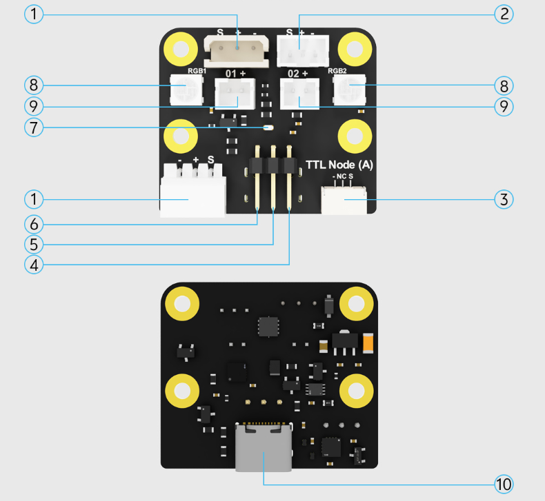
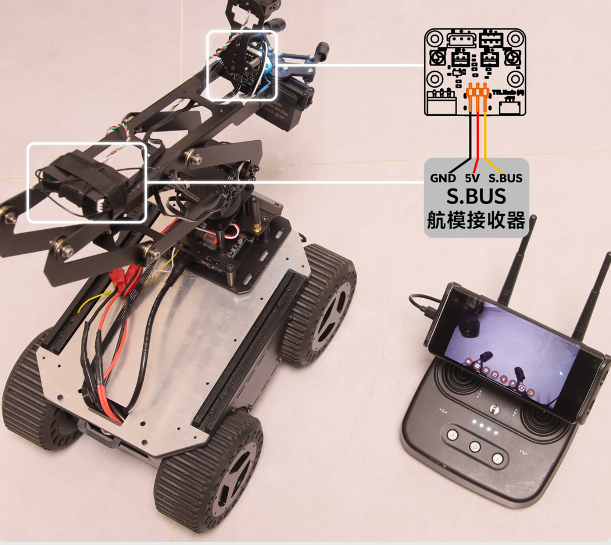
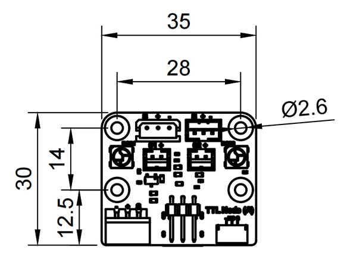

# TTL Node (A) 硬件概览

TTL Node (A) 将 TTL 总线通信、S.BUS 输入、RGB 状态灯、PWM 电源输出和 USB 通信集成在一块 30 × 35 mm 的板卡上。

## 板载资源

{ .img-rounded }

| 编号 | 板载资源 | 用途 |
| --- | --- | --- |
| 1 | HX-5264-3P 单线 TTL 总线接口 | 连接 TTL 总线舵机、关节执行器或其他总线设备 |
| 2 | PH2.0-3P 单线 TTL 总线接口 | 连接使用 PH2.0-3P 接口的 TTL 总线设备 |
| 3 | GH1.25-3P 板间通信接口 | 传输 TTL 信号并共地，不向外部设备供电 |
| 4 | S.BUS 接收接口 | 接收航模遥控接收机输出的 S.BUS 信号 |
| 5 | 5V 500mA 电源输出 | 为需要 5V 供电的遥控接收机供电 |
| 6 | GND | 信号与电源公共地 |
| 7 | 通信状态指示灯 | 显示设备通信状态 |
| 8 | 两组 RGB LED 状态灯 | 显示设备、机器人或任务状态 |
| 9 | 两路 PWM 电源输出 | 控制照明灯、电磁铁、电磁阀或小型直流电机 |
| 10 | USB Type-C | 连接电脑或单板电脑进行通信和控制 |

## S.BUS 遥控输入

板载 S.BUS 接口用于接收航模遥控器接收机的信号。主机可通过 TTL 总线或 USB 读取遥控器各通道数据，让主控板获得实时读取 S.BUS 信号的能力，且通信线路与其它总线设备复用，降低系统整体的复杂度。

板卡提供 5V、最大 500mA 的稳压输出，可为 5V 接收机供电。输入电压范围为 9~12.6V 的接收机，也可以根据自身规格从总线供电侧取电。

{ .img-rounded }

## RGB 状态指示灯

板上包含两组 3 × 8 位 RGB LED。两组状态灯可通过总线分别控制颜色，可用于显示：

- 设备在线和通信状态
- 机器人动作或任务阶段
- 故障和报警提示

## TTL 总线接口

TTL Node (A) 可连接飞特 STS、SCS、HLS 系列等兼容的 TTL 串口总线舵机，并支持同时控制多台舵机和读取反馈信息。

板载设备 ID 可修改，因此同一条总线上可以并联多块 TTL Node (A)，用于读取多个遥控接收机或控制多组 RGB 状态灯。

| 接口 | 信号 | 供电说明 |
| --- | --- | --- |
| HX-5264-3P | 单线 TTL 总线 | 包含总线供电连接 |
| PH2.0-3P | 单线 TTL 总线 | 包含总线供电连接 |
| GH1.25-3P | TTL 信号和 GND | 不包含设备供电 |

!!! note "GH1.25-3P 的用途"
    GH1.25-3P 适合连接 Hub Boards 等具有独立供电能力的产品，可让不同供电要求的设备共用通信总线，同时保持电源隔离。

## 尺寸参数

| 项目 | 参数 |
| --- | --- |
| 宽度 | 30 mm |
| 高度 | 35 mm |
| 定位孔直径 | 2.6 mm |
| 定位孔中心距 | 14 × 28 mm |

{ .img-rounded }
