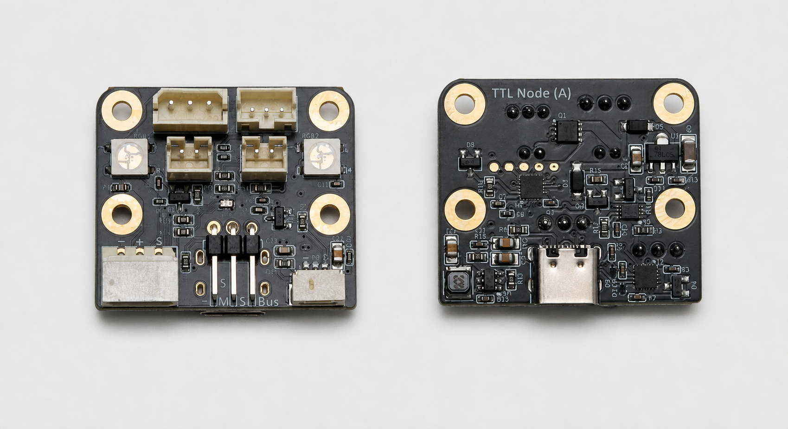

# TTL Node (A)

<a href="https://item.taobao.com/item.htm?id=1000498551122&mi_id=0000EqfUbpP4xYyVJifW-djdLvYQI1dO6NjHsuDkuy2akfk&spm=a21xtw.29178619.0.0&xxc=shop&skuId=6154739638242" target="_blank">淘宝购买链接</a>

TTL Node (A) 是一款集成遥控输入、状态指示、可调电源输出、USB 通信和多种 TTL 总线接口的多功能节点板，可广泛应用于远程控制、机器人、无人车和自动化项目。

它与 TTL 总线舵机共用同一条总线，支持多个设备并联。配合电脑、Raspberry Pi、Jetson 等主机使用，可以快速为项目扩展遥控信号读取、电源开关、状态指示和舵机控制功能。

{ .img-rounded }

<small>TTL Node (A) 正面与背面</small>

## 主要功能

- S.BUS 遥控信号输入
- 两组 3 × 8 位 RGB LED 状态指示灯
- 两路 PWM 可调电源输出
- USB Type-C 通信接口
- 多种 TTL 总线舵机接口
- 可修改设备 ID，支持多块 TTL Node (A) 在同一总线上并联

## 出厂设置

| 项目 | 默认值 |
| --- | --- |
| 设备 ID | `0` |
| 通信波特率 | `1,000,000 bps`（1 Mbps） |
| 应答状态级别 | `1`，所有指令均返回应答包 |

!!! warning "并联前先设置 ID"
    多块 TTL Node (A) 和总线舵机不能使用重复的设备 ID。首次修改 ID 时，建议总线上只连接一个待配置设备。

## 典型应用

- 通过航模遥控器控制机器人、无人车或机械臂
- 使用 RGB 灯显示运行、动作或报警状态
- 控制照明灯、电磁铁、电磁阀或小型直流电机
- 使用电脑或单板电脑控制和调试 TTL 总线设备
- 在现有 TTL 总线中扩展遥控输入和辅助供电能力

## 产品规格

| 项目 | 参数 |
| --- | --- |
| 产品尺寸 | 30 × 35 mm |
| 输入电压 | DC 9~12.6V，适用于 3S 锂电池 |
| TTL 总线接口 | HX-5264-3P、PH2.0-3P、GH1.25-3P |
| S.BUS 接口 | 2.54 mm 3P 排针插座 |
| 接收机供电 | 5V，最大 500mA |
| USB 接口 | USB Type-C |
| RGB 状态灯 | 两组，每组 3 × 8 位 |
| PWM 电源输出 | 两路 PH2.0-2P，每路最大 3A |
| PWM 满占空比输出 | 输出电压等于输入电压 |

!!! warning "GH1.25-3P 不提供设备电源"
    GH1.25-3P 接口仅用于 TTL 信号传输和共地，不向外部设备供电。该接口适合连接 Servo Hub 等独立供电设备。

!!! warning "PWM 值与输出电压并非完全线性"
    PWM 输出用于调节负载的平均功率。输入的 PWM 数值与负载两端的实际电压不一定呈严格线性关系。

## 文档导航

- [快速开始](quickstart.md)
- [硬件概览](hardware-overview.md)
- [供电与接线](power-and-wiring.md)
- [驱动与串口](drivers-and-ports.md)
- [使用 FD 配置](fd-configuration.md)
- [Arduino 开发](arduino-development.md)
- [SDK 与工具](sdk-and-tools.md)

## 推荐组合

- TTL Node (A) + [TTL Adapter (A)](../ttl-adapter-a/index.md)
- TTL Node (A) + [Robot Driver with ESP32S3 Lite](../robot-driver-with-esp32s3-lite/index.md)
- TTL Node (A) + [Hub Boards](../hub-boards/hc-1.25-8p-hub-a.md)

## 为什么选择 TTL Node (A)

- **高集成度，一板多用**：在 30 × 35 mm 的板卡上集成通信、遥控输入、状态灯和电源输出，减少额外电路和连接线。
- **快速接入现有系统**：可直接加入兼容的 TTL 串口总线，无需占用主控额外的 S.BUS、PWM 或 RGB 控制接口。
- **支持多设备并联**：可修改设备 ID，同一总线可连接多块 TTL Node (A) 和多个总线舵机。
- **兼容常用设备**：可与飞特 STS、SCS、HLS 系列等兼容的 TTL 串口总线舵机共用总线。
- **适合快速开发**：提供 Python 和 C++ 示例，便于在电脑、单板电脑或嵌入式控制器上开发。

TTL Node (A) 适合创客、学生、机器人开发者，以及需要集成远程控制、状态指示和辅助供电功能的项目团队。
