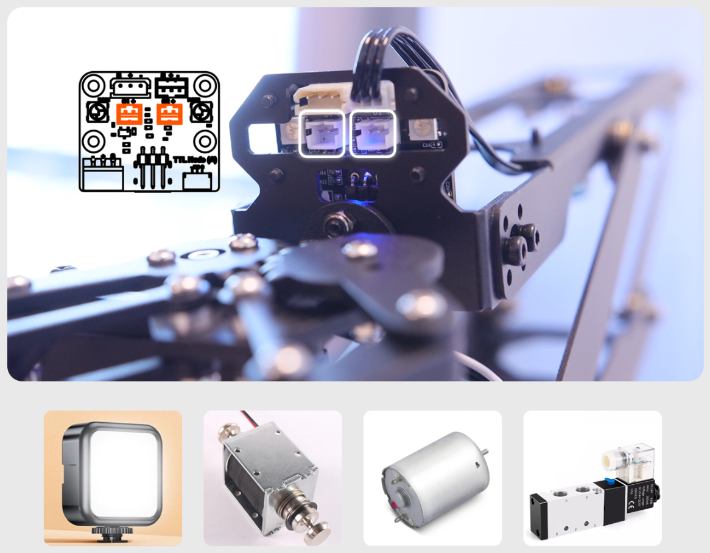
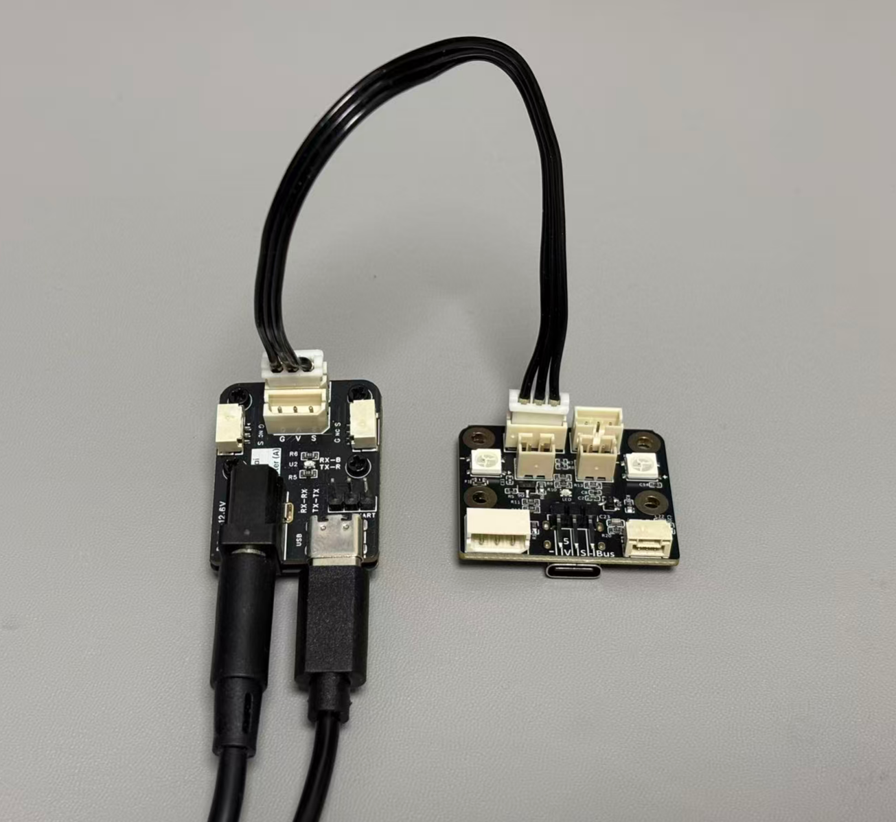
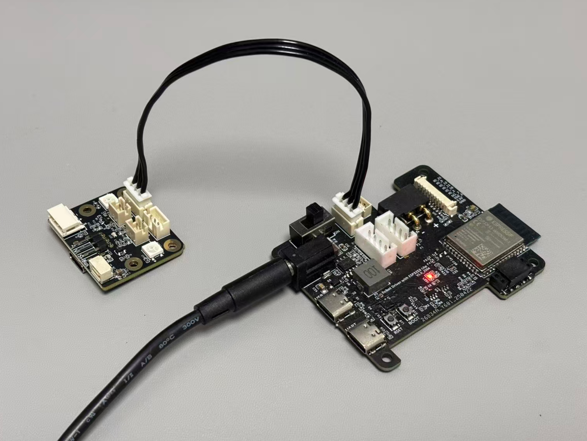

# TTL Node (A) 供电与接线

TTL Node (A) 的工作输入电压为 DC 9~12.6V，可由 3S 锂电池或符合要求的稳压电源供电。接线前应同时确认板卡、总线舵机和外部负载的额定电压。

## 基本总线接线

```text
电源
 │
 ▼
TTL Node (A) ── TTL Bus ── Servo / Joint / Other TTL Device(s)
```

TTL Node (A) 与 TTL 总线舵机可以并联在同一条总线上。所有设备需要满足：

- 设备 ID 不重复
- 通信波特率一致（本产品出厂默认波特率为 1 Mbps）
- 供电电压相互兼容
- 电源容量能够覆盖所有设备的峰值电流

## S.BUS 接收机接线

对于需要 5V 供电的遥控接收机，可使用板载 5V 500mA 输出：

| TTL Node (A) | 遥控接收机 |
| --- | --- |
| S.BUS | S.BUS 信号输出 |
| 5V | 5V 电源输入 |
| GND | GND |

!!! warning "先确认接收机供电规格"
    不同遥控接收机允许的输入电压不同。只有供电电压与总线供电电压适配的接收机才可以直接从总线供电侧取电；对于 5V 的接收机可以使用板载 5V 输出。

## PWM 电源输出

板卡提供两路 PH2.0-2P PWM 电源输出，每路额定最大电流为 3A，可用于驱动：

- 直流照明灯或补光灯
- 电磁铁
- 小型直流电机
- 电磁阀

在 100% 占空比时，输出电压等于 TTL Node (A) 的输入电压。

!!! warning "PWM 不是线性可调直流稳压"
    PWM 通过快速开关调节负载的平均功率。PWM 数值、平均电压和实际负载效果并非完全线性，尤其会受到负载类型、开关频率和测量方式影响。

!!! danger "感性负载注意事项"
    电机、电磁铁和电磁阀属于感性负载。使用前应确认负载启动电流不超过接口和电源能力，并根据实际电路要求采取续流、浪涌抑制和电源去耦措施。

{ .img-rounded }

## USB 主机连接

TTL Node (A) 可通过 USB Type-C 连接电脑、Raspberry Pi、Jetson 或 RK3566 等主机：

```text
PC / Raspberry Pi / Jetson / RK3566
                 │ USB
                 ▼
            TTL Node (A) <—— Power
                 │ TTL Bus
                 ▼
            TTL Device(s)
```

仅连接 USB、不接入 9~12.6V 外部电源时，可以：

- 配置 TTL Node (A) 或同一总线上的舵机参数
- 控制板载 RGB 灯
- 通过板载 5V 输出为不超过 500mA 的接收机供电
- 读取 S.BUS 遥控信号

此时不能驱动舵机转动，也不能使用两路 PWM 电源输出。需要控制舵机或外部负载时，必须从 HX-5264-3P 或 PH2.0-3P 总线接口接入 9~12.6V 电源。

!!! note "执行器仍需可靠供电"
    USB 可为板载逻辑和小功率外设供电，但舵机、电机、电磁铁等执行器应通过符合电压和电流要求的外部电源供电。

!!! danger "禁止错误接入电源"
    不要将电源正负极接反，也不要把电源正极接到 TTL 信号端。GH1.25-3P 只有信号和 GND，不能作为供电入口。

## 常用组合

=== "TTL Adapter (A)"

    使用 TTL Adapter (A) 作为电脑或 MCU 的总线通信入口，再通过 TTL 总线访问 TTL Node (A)。

    { .img-rounded }

=== "Robot Driver with ESP32S3 Lite"

    使用 Robot Driver with ESP32S3 Lite 连接 TTL Node (A) 和总线舵机，适合遥控车和移动机器人。

    { .img-rounded }

=== "Servo Hub"

    使用 GH1.25-3P 信号接口连接独立供电的 Servo Hub，可在同一通信总线上使用不同供电要求的设备。

更多通用说明：

- [供电与接线基础](../../../tutorials/power-and-wiring-basics.md)
- [分组供电和供电解耦](../../../tutorials/power-grouping-and-decoupling.md)
