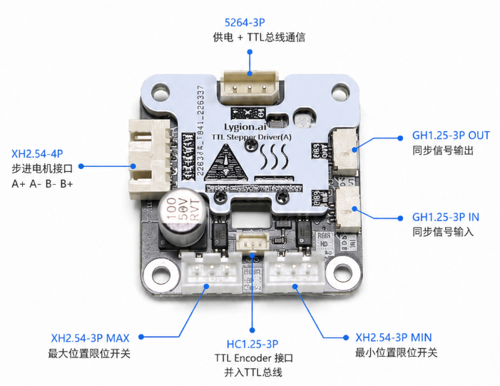

# TTL Stepper Driver (A) 硬件接线

TTL Stepper Driver (A) 需要同时连接 TTL 总线、电源和步进电机。正式上电前应仔细检查接线。

## 典型连接

```text
PC / Raspberry Pi / Jetson / Mac
        │ USB
        ▼
TTL Adapter (A)
        │ 5264-3P TTL Bus
        ▼
TTL Stepper Driver (A)
        │
        ▼
Stepper Motor
```

## 上电前检查

- 电源电压是否在 DC 9~26V 范围内。
- 步进电机接口线序是否正确。
- TTL 总线的 `+ / - / S` 是否接线正确。
- 总线上是否存在重复 ID。

{ .img-rounded }

## 电源

TTL Stepper Driver (A) 驱动电机时必须接入外部电源。不要只依赖 USB 供电。

| 项目 | 参数 |
| --- | --- |
| 输入电压 | DC 9~26V |

## 步进电机接口

请确认步进电机为双极步进电机，并确认 A/B 相线序。线序错误可能导致电机只响不转、抖动或无法正常输出扭矩。

## TTL 总线接口

5264-3P 可以连接：

- [TTL Adapter (A)](../../../reference/bus-devices/ttl-adapter-a/index.md)
- [TTL-5264 8P Hub (A)](../../../reference/bus-devices/hub-boards/ttl-5264-8p-hub-a.md)

HC1.25-3P 可以连接
- [TTL Encoder E02](../../../reference/bus-devices/ttl-encoder-e02/index.md)

!!! note "连接编码器"
    步进电机驱动板板载接口用于连接编码器，仅用于布线方便，将编码器并入到 TTL 总线使用。
    
    步进电机驱动板并不会读取编码器数据，所以编码器和步进电机驱动板的 ID 不可以相同。

## 限位接口

TTL Stepper Driver (A) 提供 `MIN` 和 `LIMIT` 两个限位接口。详细逻辑见：[限位、回零与心跳保护](limits-homing-heartbeat.md)。

## EDS 同步接口

EDS 同步接口用于从动同步模式，连接方向为：

```text
主设备 EDS OUT → 从设备 EDS IN
从设备 EDS OUT → 下一个从设备 EDS IN
```

!!! warning "EDS 方向不能接反"
    从动同步模式对信号传输方向敏感，接反后从设备无法正确跟随主设备。
