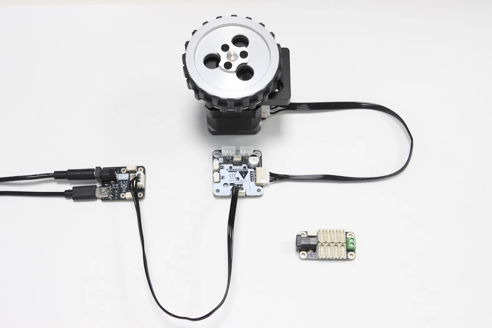
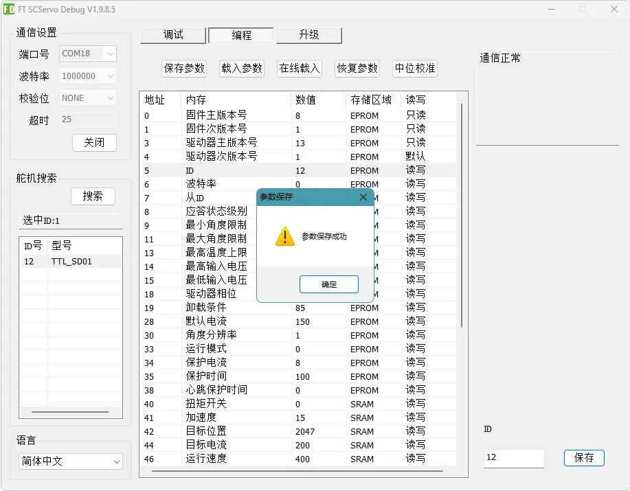
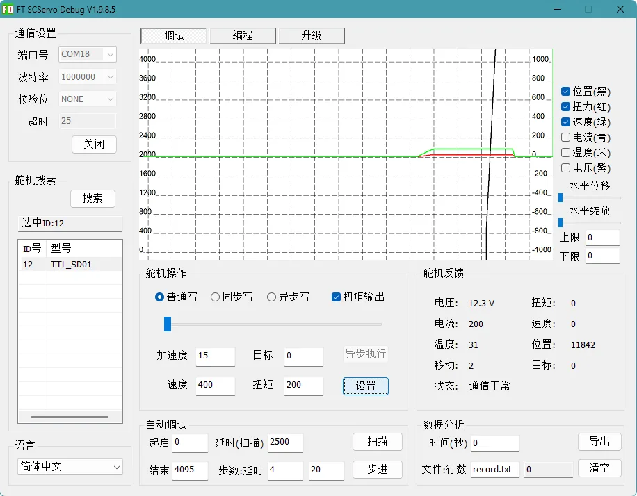

# 驱动轮 DW69

DW69 是一款用于移动机器人底盘的 69 mm 级驱动轮组件，适合教学机器人、实验底盘、小型移动平台和自定义轮式机构。页面提供的 PDF、DXF 和 STEP 文件可用于结构设计、装配检查和加工参考。

{ .img-rounded }

## 产品特点

- 69 mm 级轮体，适合中小型移动机器人底盘。
- 轮体与安装结构面向机器人底盘集成，便于与电机、支架或轮架组合使用。
- 提供多个 STEP 版本，便于在不同装配方案中引用。
- 提供 PDF 和 DXF 图纸，便于快速查看外形尺寸和加工孔位。

## 典型应用

- 双轮差速底盘
- 三轮或四轮移动平台
- 教学机器人和实验平台
- 自定义驱动轮组或轮式执行机构

## 选型与集成建议

1. 根据底盘重量、目标速度和地面材质选择电机、减速比和驱动器。
2. 结构设计时应预留轮体外径、轮宽、轴向间隙和安装螺丝空间。
3. 若用于闭环速度控制，应在电机端或轮端增加编码器反馈。
4. 多轮底盘应保证左右轮安装高度一致，避免轮体悬空或局部过载。
5. 正式加工前，请使用 STEP 模型检查轮体、支架和底盘板之间的干涉。

## 机械资料

DW69 的机械图纸包含轮体外形、安装孔位和装配参考尺寸。由于不同版本的 STEP 文件可能对应不同装配状态，建模时请根据实际使用的结构版本选择文件。

| 资料 | 说明 |
| --- | --- |
| `DW69 [SP01].step` | DW69 的 STEP 装配版本之一 |
| `DW69 [SP02][SP03].step` | DW69 的 STEP 装配版本之一 |
| `DW69.pdf` | 机械图纸 PDF |
| `DW69.dxf` | DXF 图纸 |

!!! note "尺寸核对"
    本页不直接替代加工图纸。需要开孔、加工或批量装配时，请以 PDF、DXF 或 STEP 文件中的尺寸为准。

## 与驱动系统配合

DW69 是机械轮组，需要与电机、驱动器和控制器配合使用。若项目使用步进电机作为驱动源，可参考 [TTL Stepper Driver (A)](../../bus-devices/ttl-stepper-driver-a/index.md) 完成位置模式或速度模式控制。

```text
控制器 / 上位机
    │
    ▼
电机驱动器
    │
    ▼
驱动电机
    │
    ▼
DW69 驱动轮
```

## FD 参数配置

若使用 DW69 配套步进电机和 [TTL Stepper Driver (A)](../../bus-devices/ttl-stepper-driver-a/index.md) 控制车轮，推荐先使用 FD 调试软件完成驱动器参数配置。

### 准备物料

| 物料 | 用途 |
| --- | --- |
| DW69 驱动轮和配套电机 | 被调试的车轮执行机构 |
| TTL Stepper Driver (A) | 控制步进电机转动 |
| TTL Adapter (A) | 将电脑 USB 转换为 TTL 总线 |
| 外部直流电源 | 为步进电机和驱动器供电 |
| Windows 电脑 | 运行 FD 调试软件 |

!!! warning "测试前抬起车轮"
    第一次调试时，请将车轮抬离桌面或地面。确认方向、速度和停止逻辑正常后，再让车轮接触地面测试。

### 接线步骤

1. 使用 4P 电机线连接 DW69 配套电机和 TTL Stepper Driver (A)。
2. 使用 5264 3P 连接线连接 TTL Stepper Driver (A) 和 TTL Adapter (A)。
3. 为 TTL Stepper Driver (A) 接入符合规格的外部电源。
4. 使用 USB 线连接 TTL Adapter (A) 和电脑。
5. 打开 FD 软件，选择 TTL Adapter (A) 对应串口，波特率设置为 `1000000`。
6. 点击 `打开`，再点击 `搜索`，等待设备列表出现 `TTL_SD01`。

{ .img-rounded }

### 推荐参数

进入 `编程` 页面后，建议先配置以下参数：

| 参数 | 推荐值 | 说明 |
| --- | ---: | --- |
| ID | `1` | 单个车轮测试可保持 `1`；多设备总线中必须为每个驱动器设置唯一 ID |
| 驱动器相位 | `152` | 适配 DW69 车轮驱动参数，并开启心跳保护相关能力 |
| 运行模式 | `1` | 速度模式，用于连续驱动车轮正转、反转或停止 |
| 心跳保护时间 | `20` | 单位为 `100 ms`，即约 `2 s` |

{ .img-rounded }

!!! note "截图中的 ID"
    FD 截图用于说明参数所在位置和操作界面。截图中的设备 ID 可能与本文推荐的单轮测试 ID `1` 不同，实际使用时请以你在设备上保存的 ID 为准。

保存参数后，建议断开驱动器供电并等待数秒，再重新上电。更改驱动器相位或运行模式后，断电重启可以避免旧状态影响测试。

{ .img-rounded }

!!! tip "心跳保护"
    速度模式下建议开启心跳保护。若上位机程序异常退出、串口断开或控制器掉线，驱动器会在超时后自动停止车轮。

### 速度测试

切换到 `调试` 页面并选择车轮驱动器。推荐从以下保守参数开始：

| 参数 | 推荐值 | 说明 |
| --- | ---: | --- |
| 加速度 | `15` | 不建议使用 `0`，`0` 表示接近最高加速度 |
| 速度 | `100` 或更低 | 第一次测试使用低速，确认方向和稳定性后再逐步提高 |
| 扭矩 | `200` | 对应相电流约 `1.32 A` |
| 目标值 | 任意 | 速度模式下该参数无效 |

相电流估算公式：

```text
相电流(A) ≈ 3.3 × 2 × (电流参数 / 1000)
```

当电流参数为 `200` 时：

```text
3.3 × 2 × (200 / 1000) = 1.32 A
```

点击 `设置` 后，车轮应开始连续转动。若已开启心跳保护且没有持续发送新的速度指令，车轮会在约 2 秒后自动停止。

{ .img-rounded }

## Python 例程

Python 示例使用 TTL Stepper Driver (A) 的速度模式接口控制 DW69 正转、反转和停止。运行前请确认：

- 已安装 Lygion Python SDK。
- `PORT_NAME` 已改成当前电脑上的实际串口号。
- `WHEEL_DRIVER_ID` 与 FD 中配置的驱动器 ID 一致。
- 驱动器已设置为速度模式。

[下载 Python 例程](assets/dw69_example.py){ .md-button }

```python
--8<-- "docs/reference/modules/dw69/assets/dw69_example.py"
```

## ESP32 Arduino 例程

Arduino 示例使用 ESP32 的 `Serial1` 与 TTL Adapter (A) 通信，并通过 `WriteSpe()` 周期发送速度指令。运行前请确认：

- 已安装 Lygion C++ / Arduino SDK。
- ESP32 的 RX/TX/GND 与 TTL Adapter (A) 正确连接。
- `WHEEL_DRIVER_ID` 与 FD 中配置的驱动器 ID 一致。
- 驱动器已设置为速度模式。

[下载 ESP32 Arduino 例程](assets/dw69_esp32_example.ino){ .md-button }

```cpp
--8<-- "docs/reference/modules/dw69/assets/dw69_esp32_example.ino"
```

## 常见问题

| 现象 | 可能原因 | 处理建议 |
| --- | --- | --- |
| 车轮不转 | 驱动器未设置为速度模式；电源未接入；电机线序错误 | 检查运行模式 `1`、外部供电和 A/B 相线序 |
| 车轮只转一下就停 | 心跳保护已开启，但程序没有周期发送速度指令 | 保留示例中的周期发送逻辑，或在 FD 中确认心跳时间 |
| 车轮抖动或只响不转 | 速度过高、加速度过高、电流不足或负载过大 | 降低速度，使用非 0 加速度，适当提高电流并检查负载 |
| 旋转方向与预期相反 | 电机相序或安装方向与项目定义不同 | 在程序中取反速度值，或调整项目中的方向定义 |

## 资料下载

| 资料 | 文件 |
| --- | --- |
| STEP 3D 模型 SP01 | [DW69 [SP01].step](<assets/DW69 [SP01].step>) |
| STEP 3D 模型 SP02/SP03 | [DW69 [SP02][SP03].step](<assets/DW69 [SP02][SP03].step>) |
| 机械图纸 PDF | [DW69.pdf](assets/DW69.pdf) |
| DXF 图纸 | [DW69.dxf](assets/DW69.dxf) |
| Python 例程 | [dw69_example.py](assets/dw69_example.py) |
| ESP32 Arduino 例程 | [dw69_esp32_example.ino](assets/dw69_esp32_example.ino) |

## 相关资料

- [TTL Stepper Driver (A)](../../bus-devices/ttl-stepper-driver-a/index.md)
- [TTL Stepper Driver (A)：运行模式](../../bus-devices/ttl-stepper-driver-a/operating-modes.md)
- [TTL Stepper Driver (A)：限位、回零与心跳保护](../../bus-devices/ttl-stepper-driver-a/limits-homing-heartbeat.md)
- [FD 调试软件](../../../tutorials/fd-tool.md)
- [机器人模组](../index.md)
