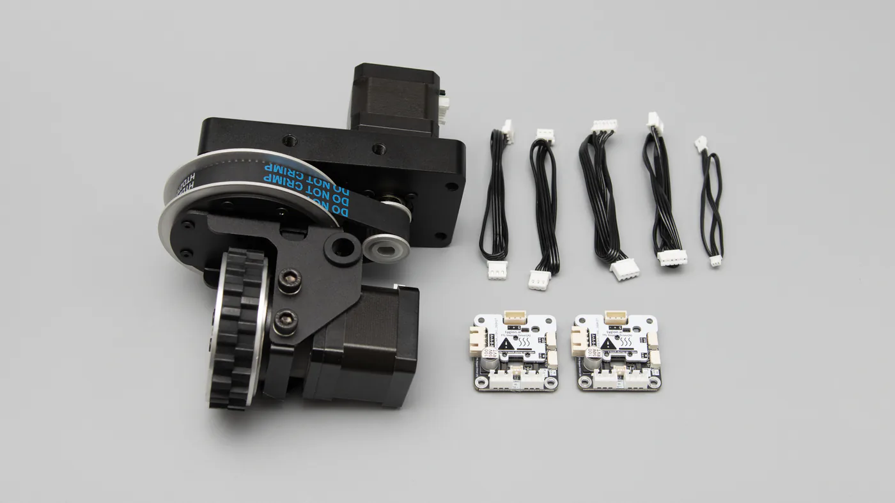

# 全向移动底盘舵轮模组 SW69-TTL

SW69-TTL 是一款面向移动机器人底盘的 TTL 总线舵轮模组。模组将转向关节、行走驱动轮、TTL 步进电机驱动器和绝对值编码器集成在一个紧凑单元中，适合构建全向移动底盘、教学平台和移动机器人实验平台。

[淘宝购买链接](https://item.taobao.com/item.htm?id=1051141186021&mi_id=0000dIrkVbbYH22Cl2TVu33q1OgcmB6RYAyll_lmfsgMUws&spm=a21xtw.29178619.0.0&xxc=shop){ target="_blank" .md-button }
[快速上手](quickstart.md){ .md-button .md-button--primary }

{ .img-rounded }

## 产品概览

SW69-TTL 由转向组件和行走组件两部分组成：

| 组件 | 功能 | 关联资料 |
| --- | --- | --- |
| 转向组件 | 控制车轮朝向，并通过绝对值编码器反馈转向角度 | [DM42-G7220-E02](../dm42-g7220-e02/index.md)、[TTL Encoder E02](../../bus-devices/ttl-encoder-e02/index.md)、[TTL Stepper Driver (A)](../../bus-devices/ttl-stepper-driver-a/index.md) |
| 行走组件 | 控制轮体连续旋转，实现底盘驱动 | [DW69](../dw69/index.md)、[TTL Stepper Driver (A)](../../bus-devices/ttl-stepper-driver-a/index.md) |

转向电机和行走电机本体均为双极步进电机，不包含独立 MCU。设备 ID、运行模式、相电流、速度和心跳保护等参数实际写入对应的 [TTL Stepper Driver (A)](../../bus-devices/ttl-stepper-driver-a/index.md)。

## 主要特性

- TTL 总线通信，可通过同一总线集中控制多个舵轮模组。
- 转向关节内置 TTL Encoder E02，支持绝对角度反馈和掉电保持的中位校准。
- 行走轮支持速度模式，可配置心跳保护，降低上位机异常时持续运动的风险。
- 转向与行走使用相同类型的步进驱动板，便于调试、替换和扩展。
- 提供 Python 示例，演示开机角度同步、转向角度控制和行走速度控制。

## 使用流程

建议按照下面顺序完成第一次调试：

1. 准备 TTL Adapter (A)、TTL-5264 8P Hub (A)、外部电源和连接线。
2. 单独连接转向电机驱动板，设置驱动器 ID，并完成转向电机测试。
3. 将 TTL Encoder E02 接入总线，设置编码器 ID，并校准转向中位。
4. 单独连接行走电机驱动板，设置驱动器 ID、速度模式和心跳保护。
5. 将同一舵轮的 3 个总线设备并入总线，完成整体测试。
6. 多个舵轮并联时，为每个总线设备分配唯一 ID。
7. 使用 Python 或 C++ / Arduino 程序进行上位机控制。

详细步骤请阅读：[快速上手与 FD 配置](quickstart.md)。

## 推荐 ID 分配

同一根 TTL 总线上不能出现重复 ID。下表给出三舵轮底盘的推荐分配方式，实际项目可按机构布局调整。

| 舵轮 | 编码器 ID | 转向电机驱动器 ID | 行走电机驱动器 ID |
| --- | ---: | ---: | ---: |
| 1 | 10 | 11 | 12 |
| 2 | 13 | 14 | 15 |
| 3 | 16 | 17 | 18 |

!!! warning "避免重复 ID"
    新设备出厂 ID 通常相同。首次配置时，建议同一时间只连接一个未配置设备，完成 ID 修改后再并入总线。

## 供电建议

SW69-TTL 需要外部直流电源为电机和驱动器供电。推荐使用 5S 或 6S 锂电池组，也可以使用输出电压在 `9 V` 到 `25.2 V` 范围内的直流电源适配器。

电源电流需要根据舵轮数量、相电流设置、负载和运动工况选择。以 3 个舵轮为例，较稳妥的电源能力约为 `9 A`；如果实际控制策略不会长期使用最大相电流，较小电流的电源也可以用于低负载调试。实测中，3 舵轮底盘在相电流参数较保守的情况下可使用 `4 A` 电源完成基本控制测试。

!!! warning "接线和供电"
    USB 连接仅用于通信，不应作为电机供电来源。接入外部电源前，请确认电压范围、极性、线序和供电容量。多舵轮底盘建议使用 [TTL-5264 8P Hub (A)](../../bus-devices/hub-boards/ttl-5264-8p-hub-a.md) 进行总线扩展和分组供电。

## 文档导航

| 页面 | 内容 |
| --- | --- |
| [快速上手与 FD 配置](quickstart.md) | 物料准备、单个舵轮 ID 配置、编码器中位校准、行走电机参数配置和整体测试 |
| [Python 程序开发](python-development.md) | Python 开发环境、示例程序结构、转向角度换算、开机同步和行走速度控制 |
| [C++ / Arduino 程序开发](cpp-arduino.md) | C++ / Arduino 开发状态、移植要点和接口对应关系 |

## 资料下载

| 资料 | 文件 |
| --- | --- |
| STEP 3D 模型 | [SW69-TTL_STEP.step](assets/SW69-TTL_STEP.step) |
| 机械图纸 PDF | [SW69-TTL.pdf](assets/SW69-TTL.pdf) |
| DXF 图纸 | [SW69-TTL.dxf](assets/SW69-TTL.dxf) |
| Python 示例 | [sw69_example.py](assets/sw69_example.py) |
| ESP32 Arduino 示例 | [sw69_esp32_example.ino](assets/sw69_esp32_example.ino) |

## 相关资料

- [TTL Adapter (A)](../../bus-devices/ttl-adapter-a/index.md)
- [TTL-5264 8P Hub (A)](../../bus-devices/hub-boards/ttl-5264-8p-hub-a.md)
- [TTL Stepper Driver (A)](../../bus-devices/ttl-stepper-driver-a/index.md)
- [TTL Encoder E02](../../bus-devices/ttl-encoder-e02/index.md)
- [设备 ID 与波特率](../../../tutorials/device-id-and-baudrate.md)
- [FD 调试软件](../../../tutorials/fd-tool.md)
