# 全向移动底盘舵轮模组 SW69-TTL

<a href="https://item.taobao.com/item.htm?id=1051141186021&mi_id=0000dIrkVbbYH22Cl2TVu33q1OgcmB6RYAyll_lmfsgMUws&spm=a21xtw.29178619.0.0&xxc=shop" target="_blank">淘宝购买链接</a>

# 产品介绍

SW69-TTL 是面向移动机器人底盘的舵轮模组，基于总线通信，易于集成和使用。

它主要由两个部分组成：

负责转向的组件 和 负责行走的组件

负责转向的组件的结构原理与 关节执行器 [DM42-G7220-E02](../../modules/dm42-g7220-e02/index.md) 大致相同，但是具体零件的种类和装配方式有所不同

负责行走的组件为 驱动轮 [DW69](../../modules/dw69/index.md)

这两个部分加上连接件集成在一起，就是 SW69-TTL，包括使用方式也是，属于那两个组件的教程的集合，再另外加一些舵轮相关的算法

# 快速上手

## 物料准备

每套 SW69-TTL 包含以下物料。

{ .img-rounded }

如果你是初次使用，需要调试和与其它舵轮模组一起使用，推荐购买：

[TTL Adapter (A)](../../bus-devices/ttl-adapter-a/index.md)：它用于把控制器的 USB 或 UART 转换成用于与总线设备通信的单线 TTL。

{ .img-rounded width="240" }

[HC-1.25 8P Hub (A)](../../bus-devices/hub-boards/ttl-5264-8p-hub-a.md):它做为分线板，可以为总线上扩展更多设备，支持分组供电，可以实现更多设备，更多供电（即使是不同电压规格的总线设备也可以并入到同一根总线进行控制）

{ .img-rounded width="360" }

电源：推荐使用 5s 或 6s 锂电池组，或者其它直流电源适配器，电压在9-25.2V期间的都可以使用，电流要看你要使用多少个舵轮模组，如果你使用三个舵轮模组，电流最稳的是9A，但考虑到实际的工况并不会长时间处在这个电流下工作，所以根据具体使用工况来选择电源，我们测试的三个舵轮模组的底盘，使用4A的电源也可以正常控制（因为控制中为了避免发热，没有一直给它设置最大的电流）

## 初期接线并使用 FD 软件设置 ID

### 设置转向模组电机的驱动器 ID

这部分介绍使用 FD 软件来为总线设置 ID，适用于 Windows 用户使用，其它系统的用户可以参考[设备 ID 与波特率](../../../tutorials/device-id-and-baudrate/)来使用 Python 或 C/C++ 来设置 ID。

[下载 FD 软件](../../../tutorials/fd-tool/)

在使用总线设备前，需要先为总线设备设置 ID，由于设备的出厂 ID 都是相同的，而且总线上不能出现相同 ID 的设备，所以在使用前，我们需要分别总线设备设置 ID，然后再将设置过 ID 的设备并入到总线统一控制

首先设置转向模组的驱动电机的ID，这里注意，SW69-TTL 上的两个电机都是相同的，都是双极步进电机+减速器，内部并没有 MCU，设置 ID、运行模式等参数实际上是设置 TTL Stepper Driver (A) 驱动板的参数，这个驱动板连接哪个电机，哪个电机就对应是什么功能

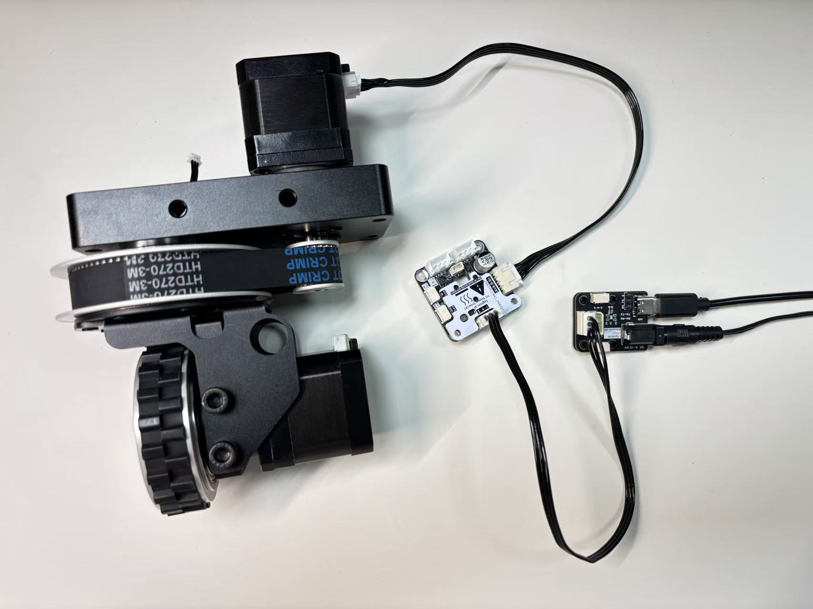{ .img-rounded }

先取任意一个驱动板，使用 SW69-TTL 包装内 5264连接线（比较粗的3P线）连接到 TTL Adapter (A)，使用 2.0-4P 连接线连接转向模组的步进电机和 TTL Stepper Driver (A) 步进电机驱动板，再通过 USB 线连接 TTL Adapter (A) 和电脑（使用 FD 软件调参就要用 Windows 系统的电脑）

在电脑中查看 TTL Adapter (A) 的串口号，可参考[查找串口设备](../../../tutorials/find-serial-port/)

运行 FD 软件

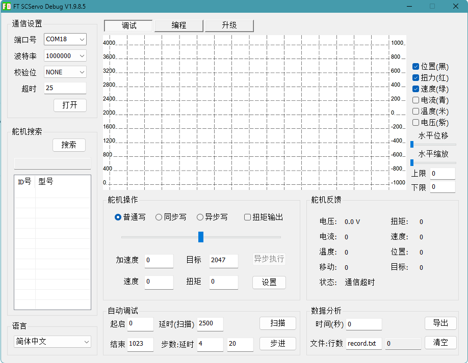{ .img-rounded }

选择 TTL Adapter (A) 的串口号（串口号是电脑给设备分配的，我这里是 COM18 ，你的大概率不会和我的一样）

选择波特率为 1000000 （TTL Stepper Driver (A) 与 TTL Encoder E02 都是出厂默认 1 Mbps 波特率）

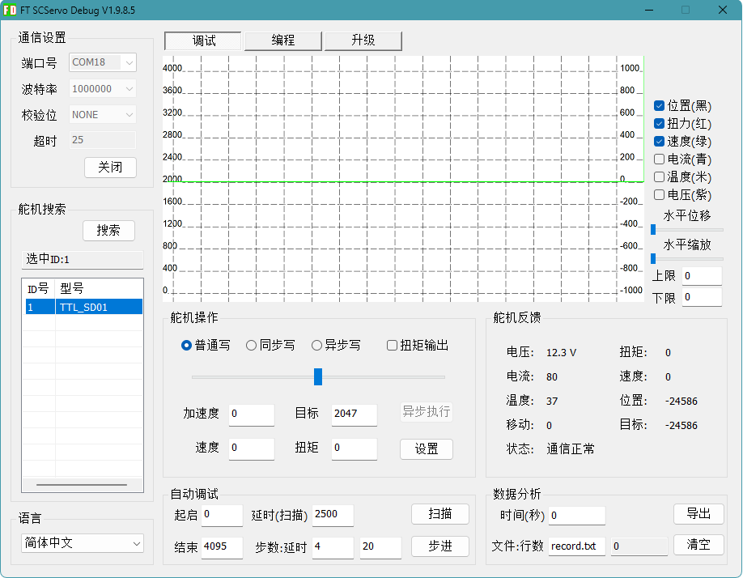{ .img-rounded }

点击 打开

点击 搜索

等待搜索到 TTL_SD01 后，点击 停止，由于默认 ID 为 1，并且搜索都是由小 ID 开始一直搜索到253，所以如果你设置了一个比较大的 ID，使用 FD 软件时的搜索时间就会相对久一些

点击停止后 鼠标点击左侧搜索到的设备，此时 FD 软件开始与步进电机驱动板进行通信

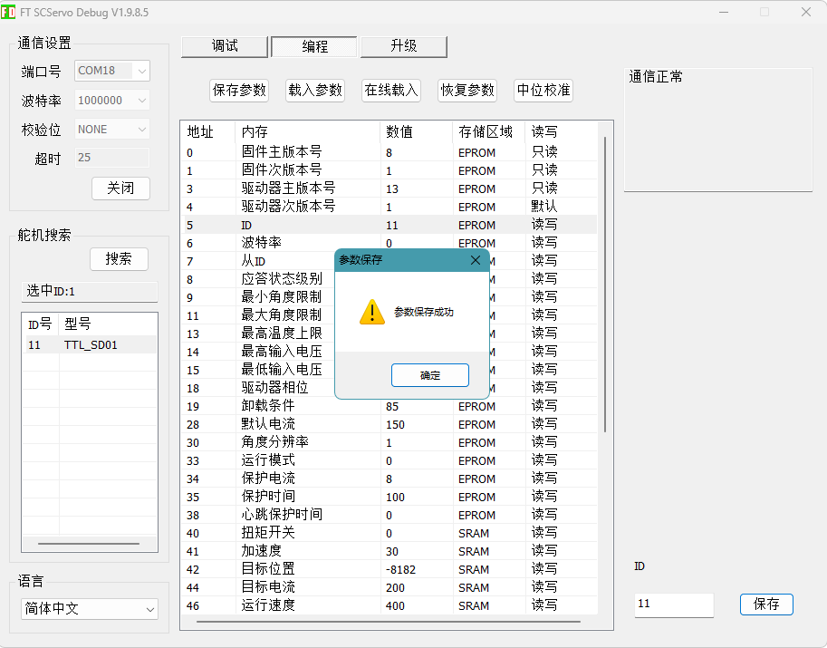{ .img-rounded }

点击上方的 编程，进入到编程页面

选择 ID（这里注意，不要选择 从ID），在右下角的输入栏中，输入你想要设置的 ID，这个是转向模组的电机 ID（前提是这个驱动板后续也只连接这个电机），你可以设置为1-253范围内的任意数值，然后点击 保存

我们这里将它设置为 11

提示 参数保存成功，点击确定，这个驱动板的 ID 就设置成功了

#### 测试转向模组电机

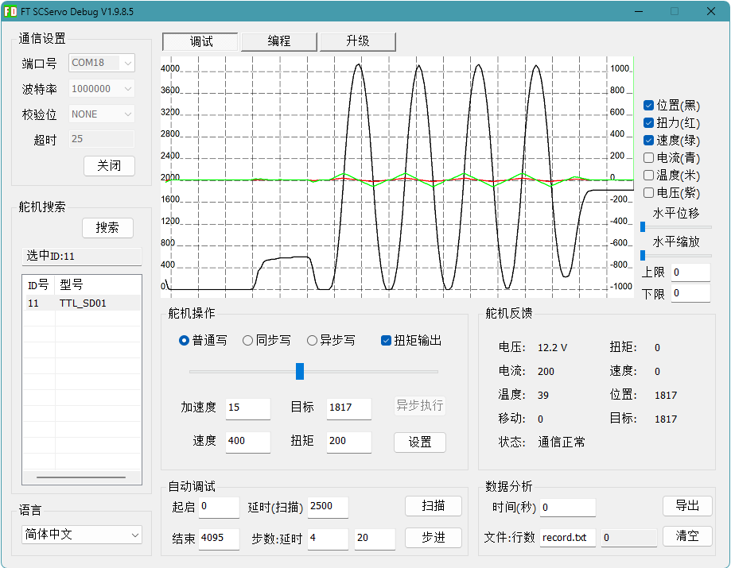{ .img-rounded }

点击 调试，打开 FD 的调试界面

点击左侧的 TTL_SD01，告诉 FD 软件你要控制哪个设备

加速度输入 15

速度输入 400 以内的数字，速度参数超过400电机有可能会不转

扭矩值在这里代表相电流参数，这个参数与相电流的换算关系为：相电流（A）≈ 3.3 * 2 * (相电流参数 / 1000)

建议输入扭矩值 200，3.3 * 2 * (200 / 1000) = 1.32A，这个电流大小适合长时间使用，电机和驱动器都不会发热太多

左右拖拽滑块，可以看到电机在小幅度范围内摆动，说明测试通过

注意，当前的 GUI 滑块只能在 0-4095的位置范围内拖拽，所以转向模组的摆动幅度也比较小，后续使用程序控制时，会介绍这个位置数值和真实角度的对应关系，使用程序就可以控制关节摆动更大的角度范围了

### 设置转向模组的编码器的 ID

在转向模组的同步带同步轮减速组的输出端（大同步轮）内部，集成了 TTL Encoder E02 编码器，它也是 TTL 总线设备，可以反馈这个转向关节的真实绝对角度，参数校准后可以保存，不需要每次开机都进行校准

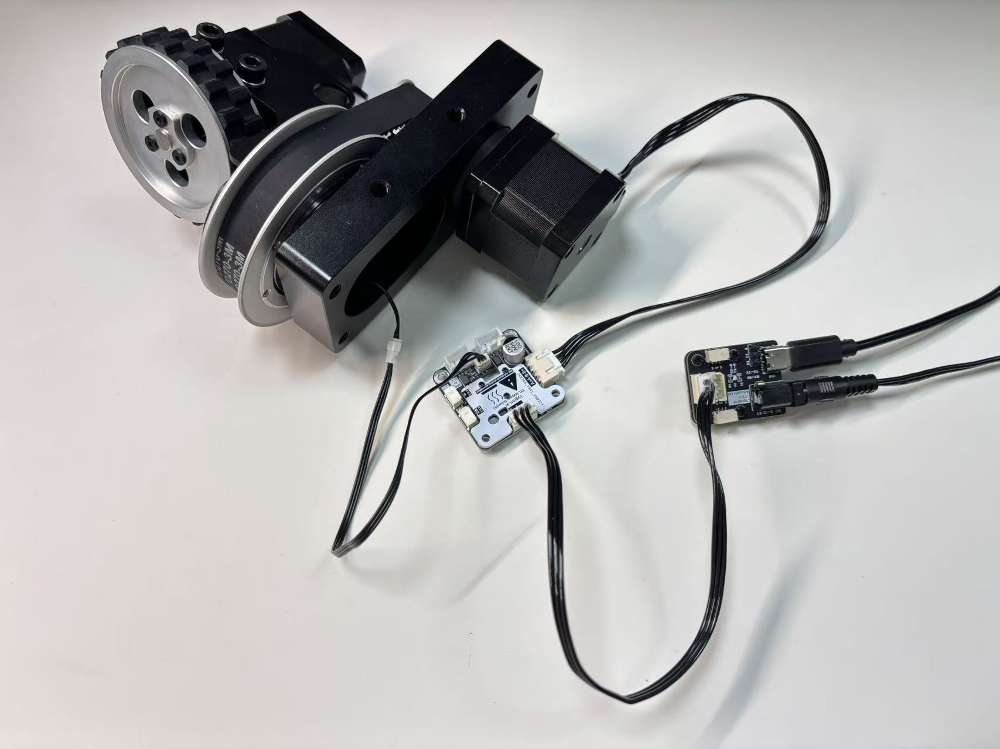{ .img-rounded }

使用 GH1.25-3P 延长线（包装内细的3P线）来连接 TTL Encoder E02 编码器 和 TTL Stepper Driver (A) 步进电机驱动板，为了方便用户连接，编码器已经连接有一根短线，用户通过包装内的延长线来将它连接到步进电机驱动板，步进电机驱动板仅用于将编码器并入到总线，步进电机驱动板的 MCU 并不会去读取编码器的信息，闭环控制部分由上位机控制器实现，这部分在后续的章节中会有具体介绍

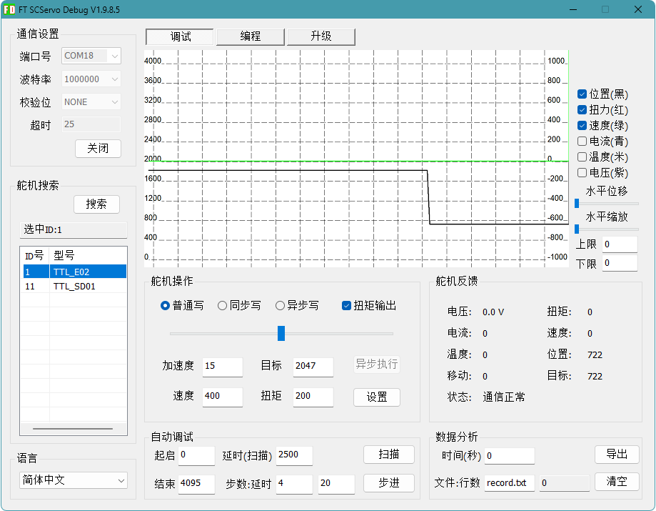{ .img-rounded }

在 FD 软件中点击 搜索

可以看到左侧的设备列表中出现了 TTL_E02，点击 停止

这个就是编码器，选择它，FD 软件开始与 TTL Encoder E02 通信

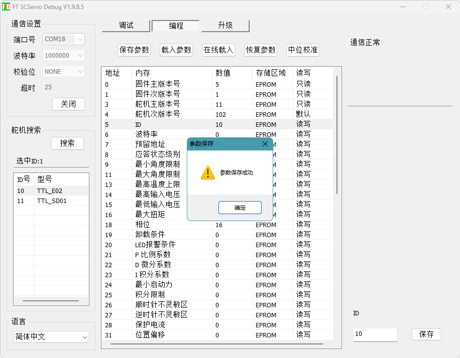{ .img-rounded }

点击 编程 进入到编程页面

选择 ID（这里注意，不要选择 从ID），在右下角的输入栏中，输入你想要设置的编码器 ID，你可以设置为1-253范围内的任意数值，然后点击 保存

我们这里将它设置为 10

提示 参数保存成功，点击确定，这个编码器的 ID 就设置成功了

#### 校准编码器中位

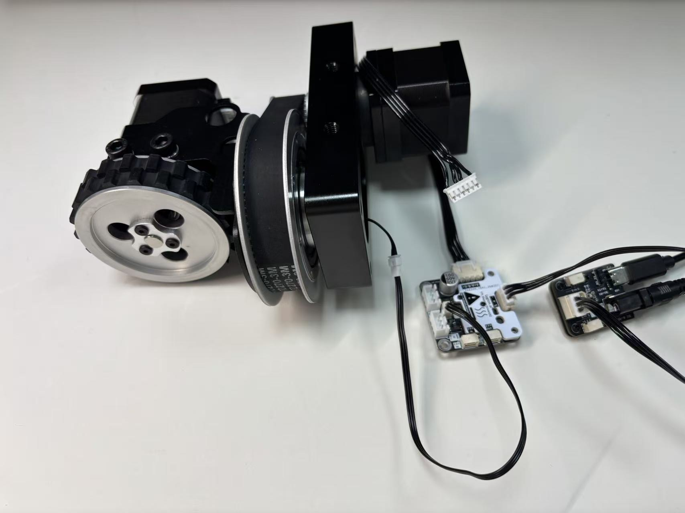{ .img-rounded }

断开转向模组的步进电机的4P线连接（如果不断开的话，用人手很难转动转向关节）

将舵轮转动到中位（后续会将这个位置当作转向的基准，舵轮转向关节处于这个位置时，小车朝正前方/正后方行进），转动到这个位置后就不要碰旋转关节了

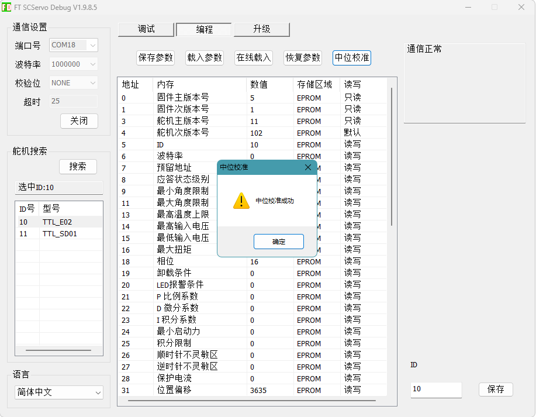{ .img-rounded }

在 FD 软件中，选择 TTL_E02 这个编码器设备，点击 编程 界面右上角的 中位校准

显示 中位校准成功，点击确定

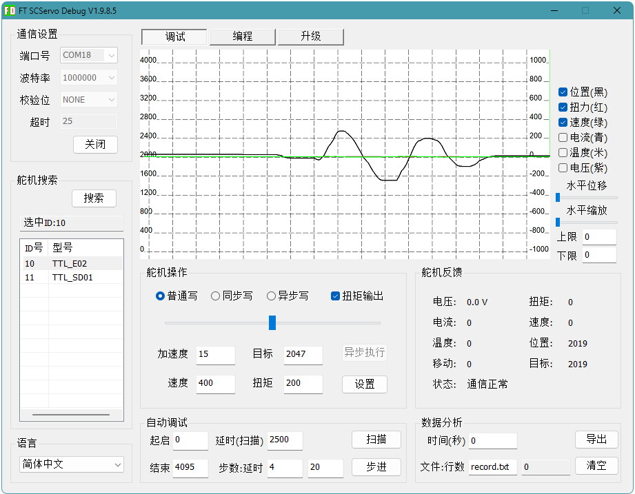{ .img-rounded }

然后点击 调试，可以看到当前的位置变为了 2047或2048 左右，说明中位校准成功

此时转动转向关节，可以发现编码器反馈的读数有变化，当把关节再次转向到中位时，编码器读数仍然为 2047或2048左右，这个校准参数掉电不丢失，后续使用就无需校准了

把刚才断开的步进电机 4P 连接线接好，至此，转向模组这部分的设备（步进电机驱动板和编码器）已经调试成功了

### 设置驱动模组电机的 ID

断开之前步进电机驱动板与 TTL Adapter (A) 的连接，注意断开 TTL Adapter (A) 这端，这个驱动板就是用来控制转向关节电机的，不要和一会要用来控制行走模组的电机驱动板搞混了

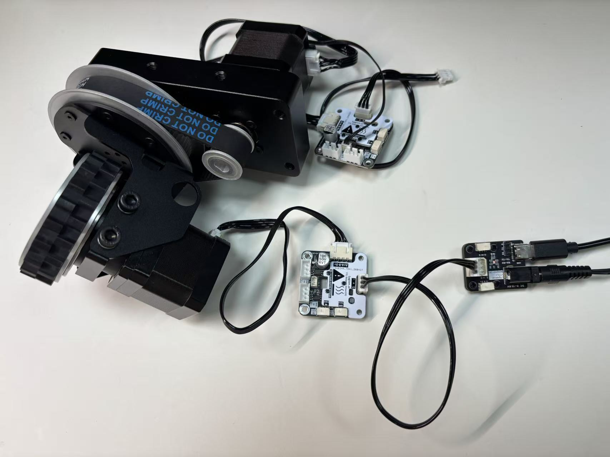{ .img-rounded }

再拿来另一块还没设置 ID 的步进电机驱动板，使用 4P 线连接行走组件的电机和步进电机驱动板，使用 5264连接线（粗一些的 3P 线）连接步进电机驱动板和 TTL Adapter (A)

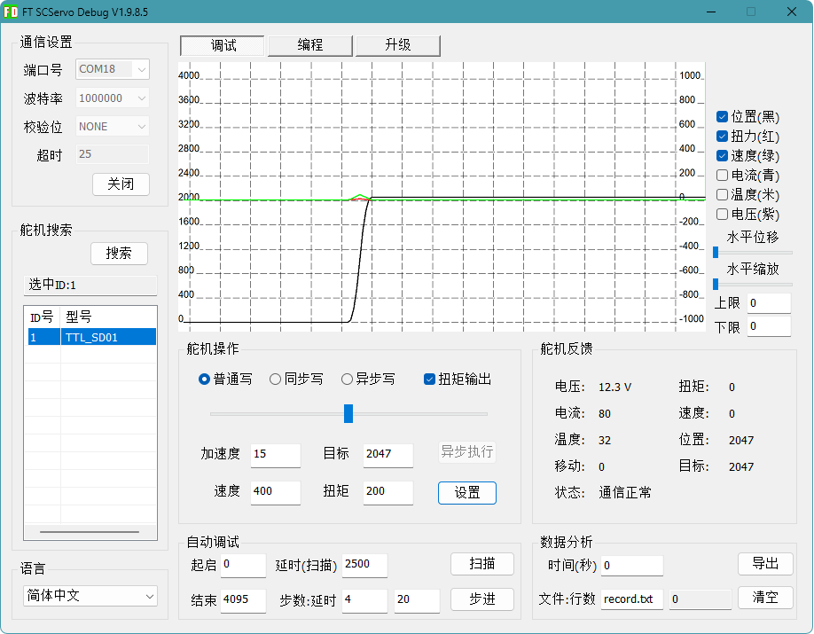{ .img-rounded }

在 FD 软件中点击 搜索，搜索到 TTL_SD01 后点击 停止，由于这个是新的驱动板，所以它的 ID 应该是 1，很快就能搜索到，记得点击 停止

鼠标点击 TTL_SD01 这个 ID 为 1 的设备，FD 软件开始与之通信

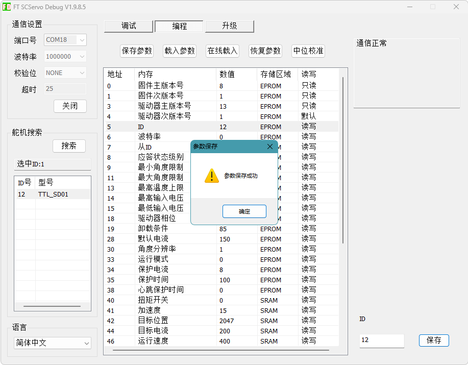{ .img-rounded }

点击 编程 进入到编程页面，这个驱动板用于控制连续转动的车轮，所以除了要更改 ID，还要更改运行模式参数

点击 ID（注意不要点击 从ID），在右下角输入你要更改成的 ID，可以为 1-253 范围内的任意数值（但不要与其它总线设备相同），我们这里将它改为 12，然后点击 保存

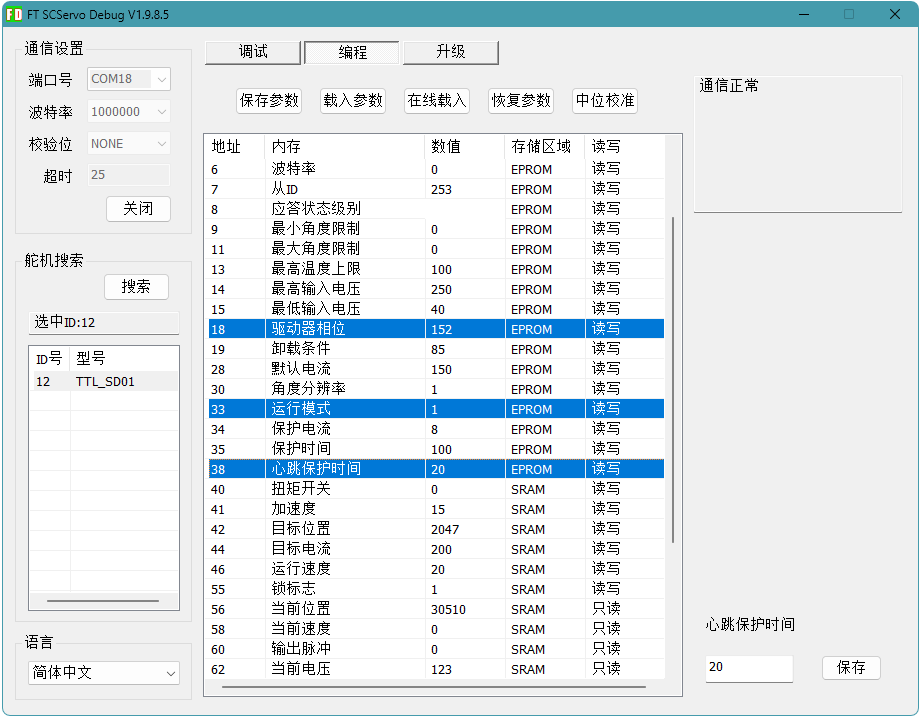{ .img-rounded }

之后需要更改一些参数来匹配车轮的驱动器参数：

驱动器相位，改为 152，开启心跳保护，这样用做车轮时更安全，车轮驱动器在一定时间内没有接收到新的指令，会自动停止转动，避免控制器发送转动指令后控制端出现异常导致发送不出来停止指令而导致车轮一直转动下去，开启心跳保护更安全

运行模式，将运行模式改为 1（运行模式0：位置模式，运行模式1：速度模式，可以驱动车轮连续转动）

心跳保护时间，推荐20，这个值你可以自定义，单位是100ms，20就是2秒钟内没有新的指令，电机自动停止转动

由于更改了相位，所以设备需要断电重启，断开电机驱动板与 TTL Adapter (A) 的接线，等待几秒钟再重新连接

#### 测试驱动组件的电机

点击 FD 软件 调试，打开调试面板进行测试

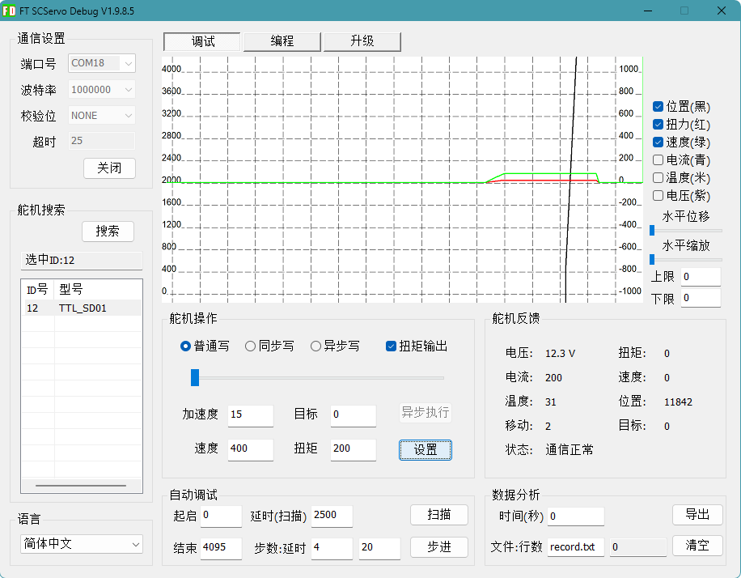{ .img-rounded }

加速度：15，这个值越小（不为0），速度变化越平缓（驱动板内部会自动计算速度插值，实现柔性启停），为0时代表最高加速度（无插值）

速度：400，400为当前驱动器相位值的最高速度，再高的数值有可能会导致电机无法转动，调整相位值属于进阶操作，后续教程中会有介绍，调整相位可以实现更高的转速（损失细分精度）

扭矩：200，扭矩值在这里代表相电流参数，这个参数与相电流的换算关系为：相电流（A）≈ 3.3 * 2 * (相电流参数 / 1000)

建议输入扭矩值 200，3.3 * 2 * (200 / 1000) = 1.32A，这个电流大小适合长时间使用，电机和驱动器都不会发热太多

目标值无所谓，速度模式下这个参数无效

将负责行走的车轮翘起来一些，让它与桌面不接触，避免转动起来后它在桌面上乱跑

点击 设置，电机开始转动，你要不间断连续按 设置，电机才会一直转动，否则在你按下最后一次设置2秒钟后，电机会触发心跳保护而自动停止，你可以在编程页面中自行设置合适的心跳保护时间

## 资料状态

当前页面为资料占位页。后续可补充：

- 产品主图
- 机械尺寸和安装孔位
- 电气接口和线序
- 控制方式和示例程序
- 3D 模型或装配资料

相关基础内容可先参考[总线设备](../../bus-devices/index.md)和[基础教程](../../../tutorials/index.md)。
