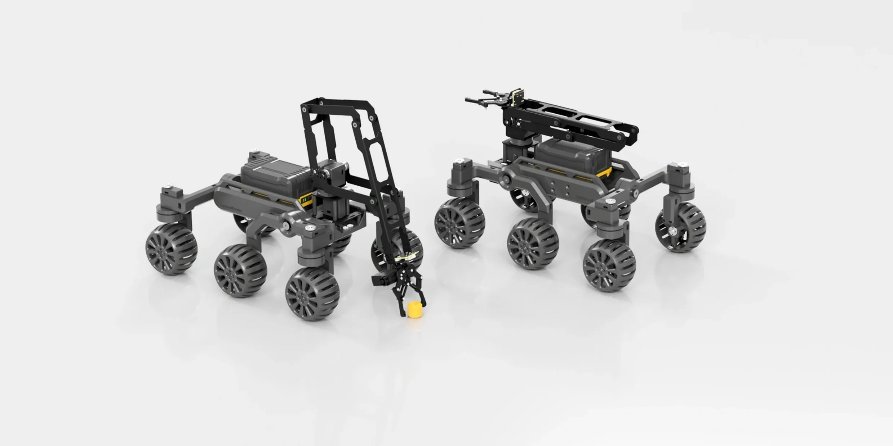

# 6x6 Rover

6x6 Rover 是一个六轮移动底盘开源项目。本站目前提供项目模型压缩包，可使用 3D 打印工艺生产。

{ .img-rounded }

[下载模型资料](assets/6x6-rover.zip){ .md-button }

## 资料

| 文件 | 说明 |
| --- | --- |
| [`6x6-rover.zip`](assets/6x6-rover.zip) | 机械模型 / 项目资料压缩包 |

## 使用建议

- 打开模型前先完整解压 ZIP 文件。
- 如果需要二次设计，建议先确认电池、控制板、舵机或电机的安装空间。
- 控制部分可以参考 [Python SDK](python-sdk.md)、[C++ SDK](cpp-sdk.md) 和[总线设备基础教程](../../tutorials/index.md)。
