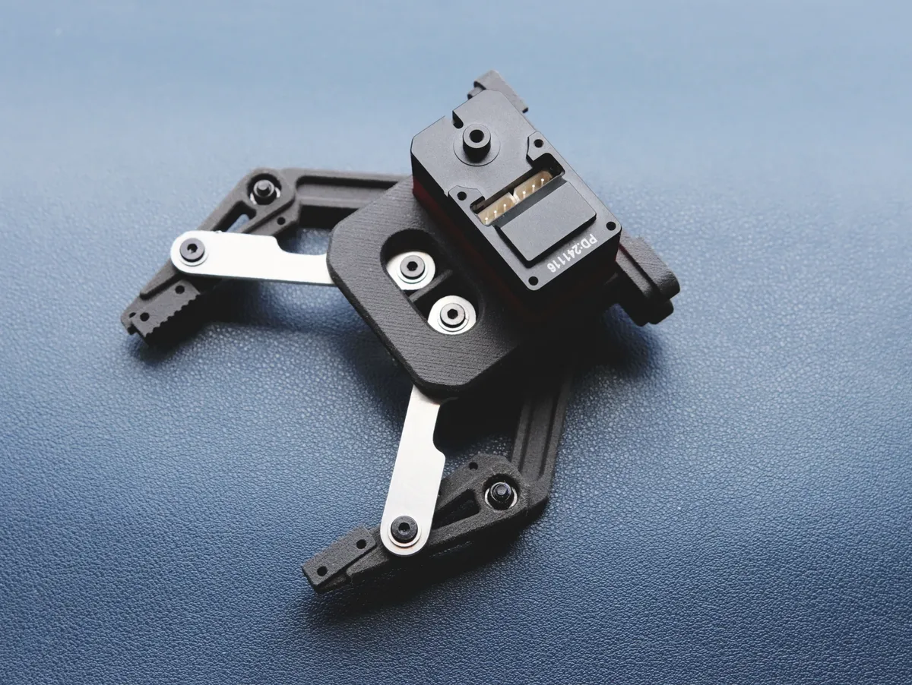

# Self-locking Gripper

Self-locking Gripper 是一个自锁夹爪结构项目。本站目前提供项目 STEP 模型。

{ .img-rounded width="520" }

[下载 STEP 模型](assets/self-locking-gripper.step){ .md-button }

## 资料

| 文件 | 说明 |
| --- | --- |
| [`self-locking-gripper.step`](assets/self-locking-gripper.step) | 机械结构 STEP 模型 |

## 使用建议

- 自锁结构适合需要保持夹持状态的末端执行器场景。
- 安装到机械臂前，建议先单独测试开合范围、舵机方向和夹持力。
- 调试控制程序时可以参考 [Python SDK](python-sdk.md)、[C++ SDK](cpp-sdk.md) 和[供电与接线基础](../../tutorials/power-and-wiring-basics.md)。
