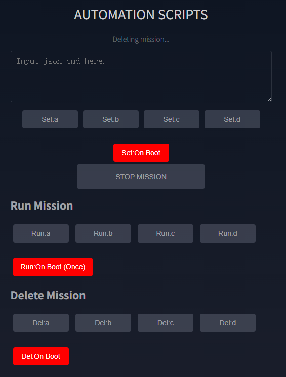
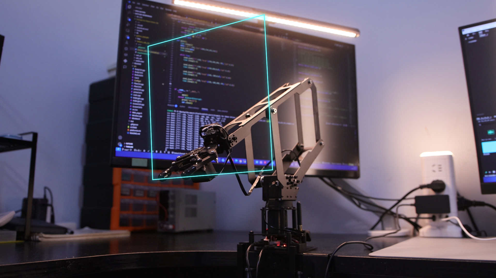

# LinkArm-LT 动作脚本

Web 控制台的 `AUTOMATION SCRIPTS` 可将多条 JSON 指令保存为 `.mission` 任务文件。文件保存在 ESP32-S3 Flash 中，掉电后仍会保留。

{ .img-rounded }

## 任务文件与按钮

| Web 按钮 | 文件或行为 |
| --- | --- |
| `Set:a` ~ `Set:d` | 保存为 `a.mission` ~ `d.mission` |
| `Run:a` ~ `Run:d` | 执行对应任务文件 |
| `Set:On Boot` | 保存为 `boot_user.mission`，开机后无限循环 |
| `Run:On Boot (Once)` | 手动运行一次开机任务 |
| `STOP MISSION` | 终止当前任务 |
| `Del:a` ~ `Del:d` | 删除对应任务文件 |

调用任务文件时不需要写 `.mission` 后缀。

!!! danger "谨慎使用开机自动运行"
    `boot_user.mission` 会在每次启动后自动循环执行。保存前应确认动作范围安全，并熟悉 `STOP MISSION` 的位置。

## 编写规则

- 每行只能包含一条完整 JSON 指令。
- 使用英文半角标点。
- 不要把一条指令拆成多行。
- 建议先在 `JSON INTERFACE` 中单独验证每条指令。
- 坐标必须位于机械臂实际可达范围内。

## 示例：末端绘制矩形

以下脚本依次移动到四个坐标点：

```json
{"T":138,"xyzg":[230,100,200,0],"spd":1.2}
{"T":138,"xyzg":[230,100,0,50],"spd":1.2}
{"T":138,"xyzg":[230,-100,0,50],"spd":1.2}
{"T":138,"xyzg":[230,-100,200,0],"spd":1.2}
```

`xyzg` 依次表示 `X`、`Y`、`Z` 和夹爪角度，`spd` 表示运动速度参数。

{ .img-rounded }

## 在动作间加入停顿

使用 `T=51` 延时指令，单位为毫秒：

```json
{"T":138,"xyzg":[230,100,200,0],"spd":1.2}
{"T":51,"delay":1500}
{"T":138,"xyzg":[230,100,0,50],"spd":1.2}
{"T":51,"delay":1500}
{"T":138,"xyzg":[230,-100,0,50],"spd":1.2}
{"T":51,"delay":1500}
{"T":138,"xyzg":[230,-100,200,0],"spd":1.2}
{"T":51,"delay":1500}
```

## 推荐测试流程

1. 固定机械臂并清空工作范围。
2. 在 `JSON INTERFACE` 中逐条测试动作。
3. 把速度设置得较低。
4. 将指令复制到 `AUTOMATION SCRIPTS`。
5. 先保存为 `a.mission`，不要直接设为开机运行。
6. 点击 `Run:a` 验证完整动作。
7. 确认可靠后，再考虑设置开机任务。

## 通过 JSON 管理任务

程序也可创建、编辑和运行任务文件。完整命令见[JSON 指令参考](json-commands.md#mission-files)。
