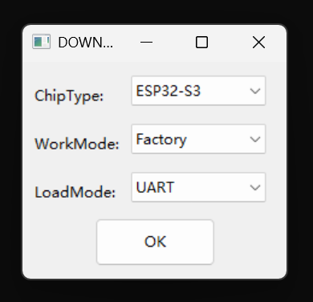
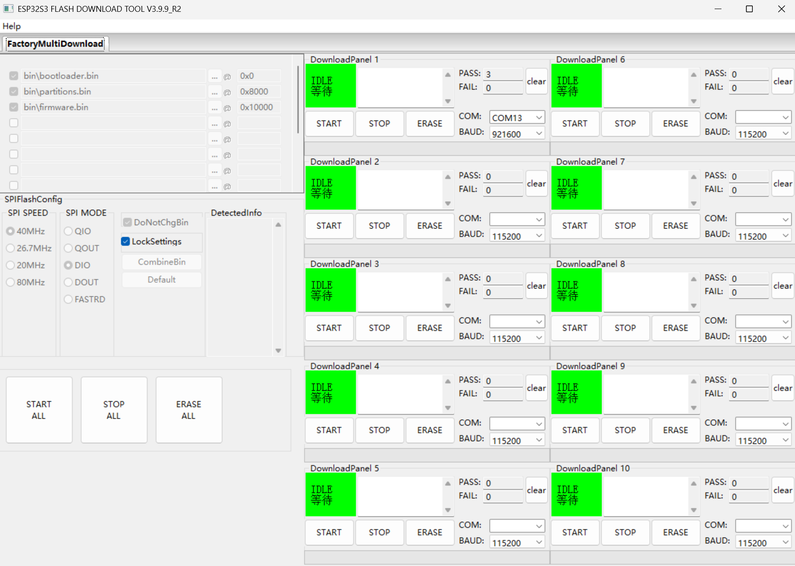
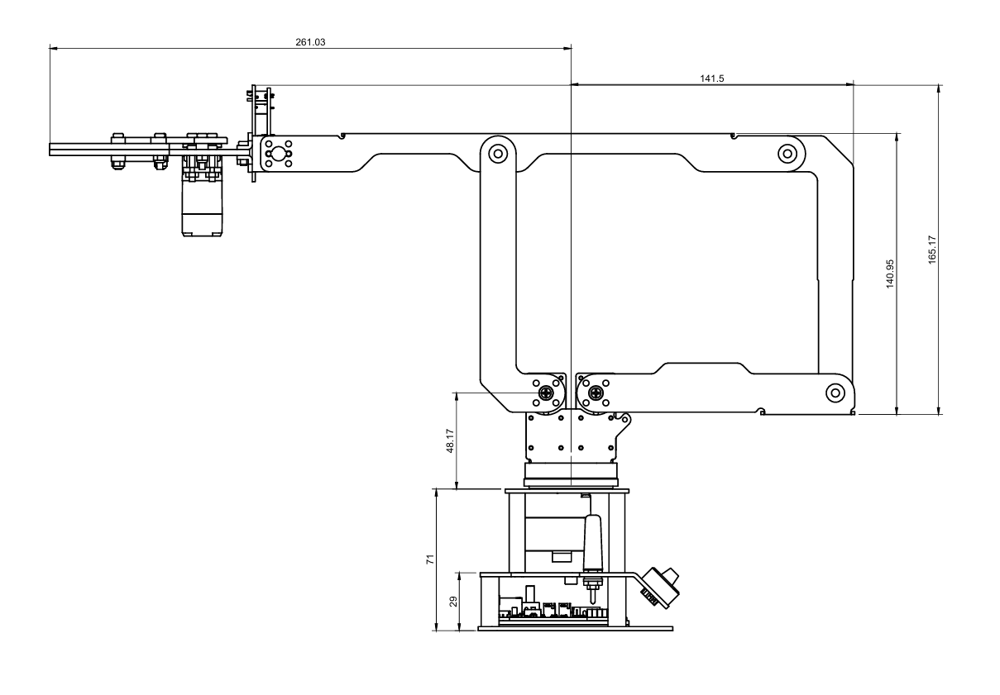

# 固件恢复与中位校准

固件恢复会重新写入控制器程序和文件系统。刷机后，原有 Wi-Fi 配置、任务文件和机械臂中位校准可能被清除。

!!! danger "刷机后不要直接运行机械臂"
    中位校准缺失时，机械臂可能进入校准模式或移动到错误姿态。完成刷机后应立即检查 RGB 和关节姿态，再执行中位校准。

## 准备文件

1. 下载 [robot_driver_with_esp32s3_lite](https://github.com/EffectsMachine/robot_driver_with_esp32s3_lite) 项目。
2. 解压项目。
3. 打开 `download_tool/LinkArm_LT_Download_Tool`。
4. 准备 Windows 电脑和支持数据传输的 USB Type-C 线。

当前 PDF 提供的批量下载工具为 Windows 程序。

## 连接刷机接口

使用驱动板的 `UART` USB Type-C 接口连接电脑。不要使用日常上位机通信所用的中间 `USB` 接口。

## 配置下载工具

运行 `flash_download_tool_3.9.9_R2.exe`：

| 选项 | 值 |
| --- | --- |
| ChipType | `ESP32-S3` |
| WorkMode | `Factory` |
| LoadMode | `UART` |

{ .img-rounded }

点击 `OK` 后：

1. 选择驱动板的 COM 端口。
2. `BAUD` 选择 `921600`。
3. 点击 `START`。
4. 等待状态显示完成。
5. 断电并重新上电，使新固件运行。

{ .img-rounded }

## 中位校准 { #midpoint-calibration }

校准数据保存在 `boot.mission`。刷机或格式化文件系统后，如果设备找不到校准数据：

- TTL Node (A) RGB 黄灯常亮。
- 关节扭矩锁关闭，可用手移动机械臂。
- 设备进入中位校准模式。

### 校准步骤

1. 固定机械臂并清空工作范围。
2. 断开所有远程控制程序。
3. 用手将机械臂调整为下图所示基准姿态。
4. 夹爪保持闭合。
5. 长按五向开关“下”。
6. RGB 黄灯熄灭表示校准写入成功；若未熄灭，重新长按。
7. 连续重启两次：按一次底座 `RESET`，机械臂开始向极限角度运动后，不必等待完成，立即再次按 `RESET`。
8. 第二次启动后，机械臂应移动到校准位置，夹爪处于张开状态。

{ .img-rounded }

正确中位姿态应与上图一致：机械臂基本水平展开，夹爪朝向前方。下图可用于辅助核对关节和尺寸标注：

{ .img-rounded }

!!! danger "双重重启期间保持距离"
    第一次重启会触发极限角度动作。机械臂必须可靠固定，周围不得有人或障碍物。

## 校准失败

- RGB 黄灯不熄灭：重新调整姿态并再次长按“下”。
- 重启后姿态异常：重新刷写固件并重复校准。
- 某一关节完全不动作：检查该舵机总线连接和供电。
- 动作明显卡顿：确认 4 个舵机和 ID 40 的 TTL Node (A) 均可通信。

## 会清除数据的操作

以下操作可能需要重新配置 Wi-Fi、动作脚本和中位校准：

- 使用 Factory 模式刷机
- 发送 `{"T":602}` 格式化文件系统
- 开发固件时擦除全部 Flash

在执行前应记录网络参数，并保存仍需使用的任务脚本。
