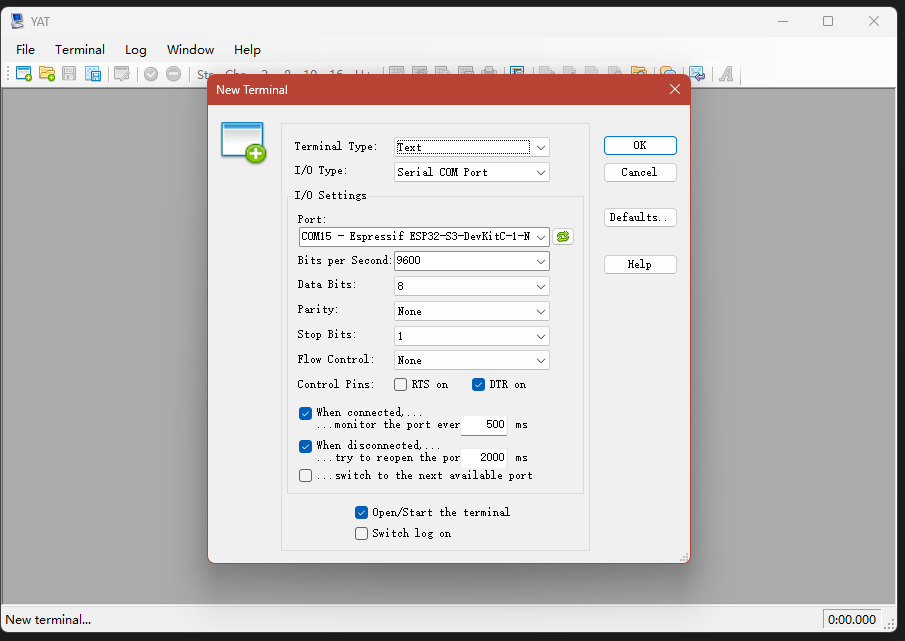
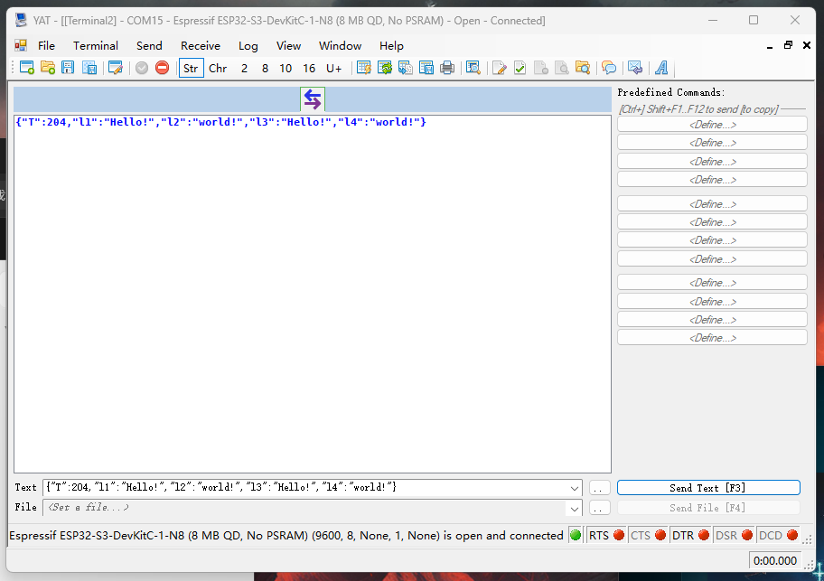

# LinkArm-LT 上位机通信

LinkArm-LT 支持 USB CDC、HTTP 和 WebSocket。三种方式发送相同的 JSON 指令，可根据布线、实时性和反馈需求选择。

## 选择通信方式

| 方式 | 连接 | 典型频率 | 优点 | 适合场景 |
| --- | --- | ---: | --- | --- |
| USB CDC | USB 有线 | 约 60~65 条/秒 | 稳定、低延迟、无需网络 | 调试、固定工作站 |
| HTTP | Wi-Fi | 约 40 条/秒 | API 简单、跨平台 | 任务下发、普通控制 |
| WebSocket | Wi-Fi | 60 条/秒以上 | 长连接、双向推送 | 实时控制、状态反馈 |

示例项目：[robot_driver_with_esp32s3_lite](https://github.com/EffectsMachine/robot_driver_with_esp32s3_lite)

## Python 环境

=== "Windows"

    ```powershell
    python -m venv venv
    .\venv\Scripts\activate
    pip install -r .\requirements.txt
    ```

=== "Linux"

    ```bash
    python3 -m venv venv
    source venv/bin/activate
    pip install -r requirements.txt
    ```

    Ubuntu / Debian 缺少环境组件时：

    ```bash
    sudo apt update
    sudo apt install python3 python3-pip python3-venv git
    ```

=== "macOS"

    ```bash
    python3 -m venv venv
    source venv/bin/activate
    pip install -r requirements.txt
    ```

    需要安装 Python 或 Git 时，可使用 Homebrew：

    ```bash
    brew install python git
    ```

## USB CDC

连接驱动板中间的 `USB` 接口，不要连接旁边用于刷机和串口透传的 `UART` 接口。

### 查找和测试端口

=== "Windows"

    在设备管理器或终端中查找 Espressif ESP32-S3 对应的 `COM` 端口。

    可使用 YAT 图形化测试：

    1. 新建 Serial COM 终端。
    2. 选择 ESP32-S3 的 COM 端口。
    3. 勾选 `DTR on`，否则可能无法接收数据。
    4. USB CDC 不依赖所选波特率。
    5. 发送 OLED 测试指令。

    { .img-rounded }

    ```json
    {"T":204,"l1":"Hello!","l2":"world!","l3":"Hello!","l4":"world!"}
    ```

    { .img-rounded }

    测试后关闭 YAT，避免串口被占用。

=== "Linux"

    查找端口：

    ```bash
    ls /dev/ttyACM* /dev/ttyUSB*
    ```

    使用 `screen` 测试：

    ```bash
    screen /dev/ttyACM0 115200
    ```

    USB CDC 不使用串口波特率，但 `screen` 命令仍要求填写一个值。退出时按 `Ctrl+A`，再按 `K` 并确认。

=== "macOS"

    查找端口：

    ```bash
    ls /dev/tty.usbmodem* /dev/cu.usbmodem*
    ```

    使用 `screen` 测试：

    ```bash
    screen /dev/cu.usbmodem12345 115200
    ```

    退出时按 `Ctrl+A`，再按 `K` 并确认。

### Python 示例

安装 `pyserial` 后，修改 `PORT`：

=== "Windows"

    ```python
    PORT = "COM11"
    ```

=== "Linux"

    ```python
    PORT = "/dev/ttyACM0"
    ```

=== "macOS"

    ```python
    PORT = "/dev/cu.usbmodem12345"
    ```

完整发送示例：

```python
import json
import serial
import time

PORT = "COM11"
ser = serial.Serial(PORT, 1_000_000, timeout=0.5)

time.sleep(2)
command = {"T": 202, "line": 1, "text": "Hello, world!", "update": 1}
ser.write((json.dumps(command) + "\n").encode("utf-8"))
ser.close()
```

USB CDC 中的 `1_000_000` 是 pyserial API 要求的占位值，不决定实际 USB 传输速率。

## HTTP

控制器在端口 `80` 提供：

```text
http://<设备IP>:80/api/cmd
```

- 电脑直连 `Robot` 热点时，设备 IP 为 `192.168.4.1`。
- 使用 STA 模式时，从 OLED 或 Web 控制台读取路由器分配的 IP。

```python
import requests

device_ip = "192.168.4.1"
url = f"http://{device_ip}:80/api/cmd"
command = {"T": 202, "line": 1, "text": "HTTP test", "update": 1}

response = requests.post(url, json=command, timeout=2)
response.raise_for_status()
print(response.text)
```

运行方式：

=== "Windows"

    ```powershell
    python .\http_example.py
    ```

=== "Linux"

    ```bash
    python3 http_example.py
    ```

=== "macOS"

    ```bash
    python3 http_example.py
    ```

HTTP 适合普通动作下发和配置，不适合依赖连续主动反馈的控制回路。

## WebSocket

连接地址：

```text
ws://<设备IP>:80/ws
```

安装 `websocket-client`，然后运行：

```python
import json
import websocket

device_ip = "192.168.4.1"
url = f"ws://{device_ip}:80/ws"

def on_open(ws):
    command = {"T": 202, "line": 1, "text": "WebSocket test", "update": 1}
    ws.send(json.dumps(command))

def on_message(ws, message):
    print(f"recv: {message}")

def on_error(ws, error):
    print(f"error: {error}")

def on_close(ws, status_code, message):
    print("connection closed")

app = websocket.WebSocketApp(
    url,
    on_open=on_open,
    on_message=on_message,
    on_error=on_error,
    on_close=on_close,
)
app.run_forever()
```

=== "Windows"

    ```powershell
    python .\webSocket_example.py
    ```

=== "Linux"

    ```bash
    python3 webSocket_example.py
    ```

=== "macOS"

    ```bash
    python3 webSocket_example.py
    ```

## 常见通信问题

| 现象 | 检查项 |
| --- | --- |
| USB 端口不存在 | USB 线是否支持数据；是否连接了中间的 USB 接口 |
| `Permission denied` | Linux 用户是否有串口权限；端口是否被其他程序占用 |
| HTTP `ConnectionError` | 设备 IP、Wi-Fi 和网络是否一致 |
| HTTP 404 | 路径是否为 `/api/cmd`，固件是否支持该接口 |
| WebSocket `connection refused` | 地址、端口 `80` 和路径 `/ws` 是否正确 |
| 无法导入 `websocket` | 安装 `websocket-client`，不要安装同名的其他包 |
| 控制延迟异常 | 检查 4 个舵机和 TTL Node (A) 是否全部在线 |
