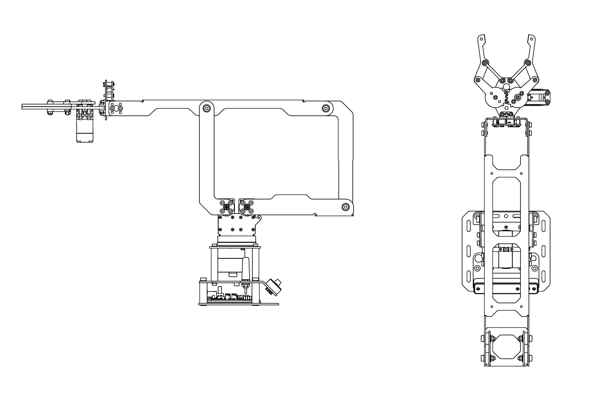
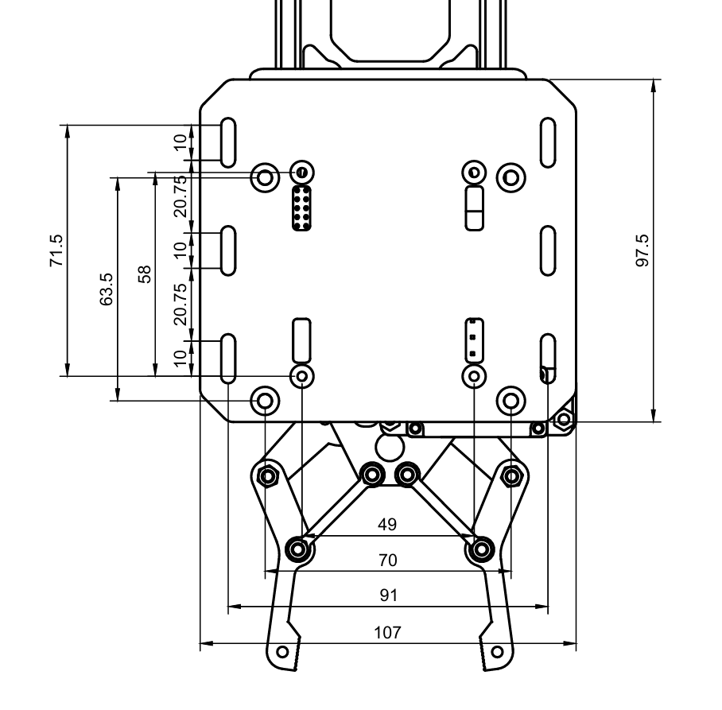

# LinkArm-LT 项目集成与尺寸

LinkArm-LT 可固定到桌面，也可通过安装板集成到移动底盘、实验平台或机器人系统。

{ .img-rounded }

## 供电

| 项目 | 要求 |
| --- | --- |
| 电压范围 | DC 9~12.6V |
| 标准适配器 | 12V 3A，DC5521 |
| 电池供电 | 满足电流需求的 3S 锂电池 |

3S 锂电池标称电压约 11.1V，满电 12.6V。电池、电源线、开关和连接器都必须能够承受机械臂的峰值电流。

!!! warning "USB 不是机械臂动力电源"
    USB 适合控制器开发与通信，不能替代舵机所需的 9~12.6V 动力电源。

## 安装孔位

根据安装图设计底盘面板，并为螺钉、线缆和底座旋转留出空间。

{ .img-rounded }

!!! note "生产前核对原始图纸"
    Wiki 图片适合设计评估，不应直接作为加工比例模板。加工前请使用资料包中的原始尺寸图或 CAD/PDF 文件确认尺寸。

## 原始图纸下载

- [展开姿态尺寸图（PDF）](assets/LinkArm_LT.pdf)
- [折叠姿态尺寸图（PDF）](assets/LinkArm_LT_folded.pdf)
- [二维 CAD 图纸（DXF）](assets/LinkArm_LT_dxf.dxf)

!!! warning "加工前确认图纸版本"
    PDF 和 DXF 适合安装设计、空间评估与加工准备。正式开孔或批量生产前，请确认图纸版本与手中的 LinkArm-LT 硬件批次一致，并复核关键安装尺寸。

## 空间与结构设计

- 安装面应具有足够刚度，避免底座在加减速时弯曲。
- 重心应尽量靠近移动底盘中心。
- 底盘轮距和质量应能抵抗机械臂最大伸展时的倾覆力矩。
- 给关节线束预留弯曲半径，不要让线缆穿过夹点。
- 末端相机、工具和夹持物会改变负载与重心，应降低速度并重新评估稳定性。
- 移动平台运动时，建议先将机械臂收回到低重心姿态。

## 通信集成

=== "同机 USB"

    上位机直接通过 USB CDC 控制，适合固定工位、工控机和单板电脑。

=== "局域网"

    使用 HTTP 下发任务，或使用 WebSocket 进行双向实时通信。

=== "无路由器多机"

    使用 ESP-NOW 完成一对一或一对多同步示教。

=== "自定义固件"

    基于 Robot Driver with ESP32S3 Lite 开源工程扩展传感器、任务逻辑和通信接口。

详细接口见：[上位机通信](host-communication.md)。

## 集成检查表

1. 安装板和紧固件能够承受最大伸展姿态。
2. 机械臂运动包络不与底盘、传感器或外壳相交。
3. 电源满足 9~12.6V 和峰值电流。
4. 急停或断电操作容易触达。
5. 线缆不会被旋转关节拉紧。
6. 上电脚本和远程控制权限明确。
7. 低速完成全工作空间测试后再投入使用。
