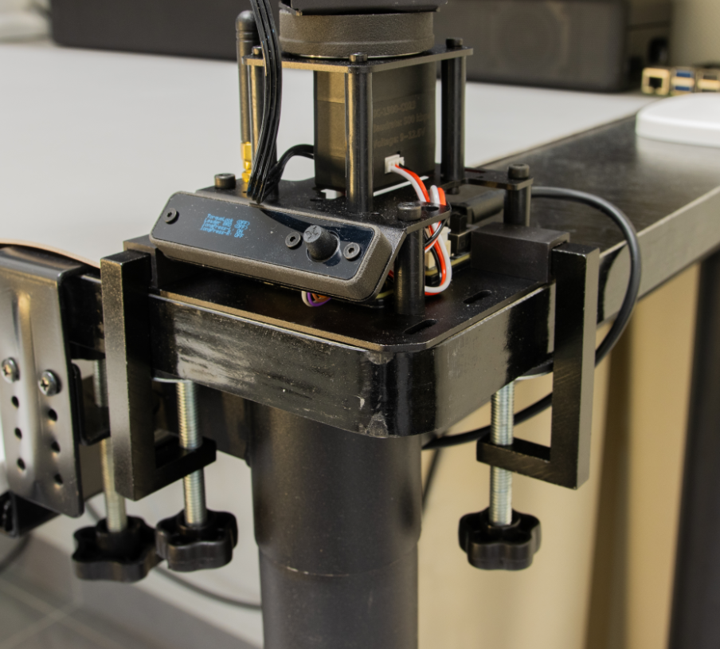
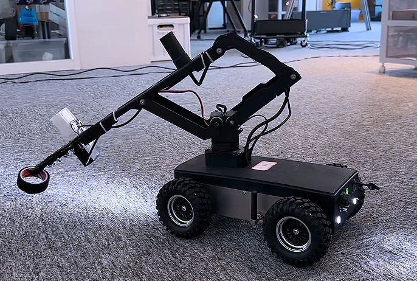
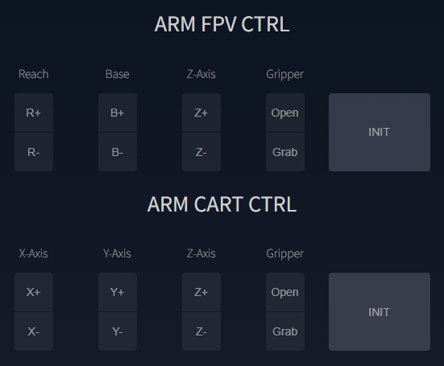

# LinkArm-LT 快速开始

本页带你完成机械臂固定、上电检查和第一次浏览器控制。

## 1. 固定机械臂

标准套装提供两只 G 字夹，适用于厚度约 `7~50 mm`、边缘具有足够夹持空间的桌面。两只夹具应尽量拉开距离，以提高抗倾覆能力。

{ .img-rounded }

!!! danger "禁止直接放在桌面上运行"
    未固定的机械臂很容易因重心变化而倾倒。工作区域内不得放置玻璃等易碎物品，也不要让儿童或眼睛靠近机械臂。

安装到移动底盘时，应通过安装板和螺栓固定：

{ .img-rounded }

详细孔位见：[项目集成与尺寸](integration.md)。

## 2. 上电前检查

1. 检查线缆是否缠绕，确保关节动作不会拉扯或夹断线缆。
2. 清空机械臂运动范围。
3. 确认不存在未知的开机动作脚本或远程控制端。
4. 确认电源为 DC `9~12.6V`，可稳定提供至少 `3A`。
5. 确认 DC 插头与接口连接可靠，再把底座开关拨到 `ON`。

!!! warning "开机后机械臂可能立即动作"
    开机脚本、ESP-NOW 从机模式、HTTP 或 WebSocket 控制都可能使机械臂自动动作。每次上电都应按“会自动运动”进行防护。

!!! note "仅连接 USB"
    USB 可以启动控制器并用于开发调试，但供电能力不足，不建议仅靠 USB 控制机械臂动作。

## 3. 观察开机状态

正常启动时：

1. 蜂鸣器响一声。
2. OLED 屏幕亮起。
3. TTL Node (A) 的 RGB 灯闪烁一次，表示总线通信正常。
4. 机械臂缓慢移动到校准后的初始位置。

如果 RGB 黄灯常亮，或者开机姿态明显异常，通常表示中位校准文件缺失。不要继续控制，先阅读[中位校准](firmware-and-calibration.md#midpoint-calibration)。

## 4. 连接 Web 控制台

=== "Windows"

    1. 在任务栏打开 Wi-Fi 列表。
    2. 连接热点 `Robot`，密码 `12345678`。
    3. 即使系统提示“无 Internet”，也要保持连接。
    4. 使用 Chrome、Edge 或 Firefox 打开 `http://192.168.4.1`。

=== "macOS"

    1. 从菜单栏打开 Wi-Fi。
    2. 连接热点 `Robot`，密码 `12345678`。
    3. 忽略无互联网连接提示。
    4. 使用 Safari、Chrome 或 Firefox 打开 `http://192.168.4.1`。

=== "Linux"

    1. 从桌面网络菜单连接热点 `Robot`，密码 `12345678`。
    2. 保持 Wi-Fi 连接，即使网络管理器提示无法访问互联网。
    3. 使用 Chrome 或 Firefox 打开 `http://192.168.4.1`。

=== "Android / iOS"

    1. 在系统 Wi-Fi 设置中连接热点 `Robot`。
    2. 输入密码 `12345678`。
    3. 选择继续使用这个无互联网连接的网络。
    4. 打开浏览器并访问 `http://192.168.4.1`。

!!! tip "建议修改默认热点名称和密码"
    多台设备同时使用时，重复的 `Robot` 热点很难区分。可在 Web 控制台的 Wi-Fi 设置中修改 AP 名称和密码。

## 5. 第一次动作测试

1. 确认机械臂已经固定，工作范围内无人。
2. 在 Web 控制台中先点击 `INIT`，让机械臂回到默认位置。
3. 短按一个方向按钮，确认按下时动作、松开时停止。
4. 低速、小幅测试夹爪的 `Open` 和 `Grab`。
5. 不要在首次测试中连续切换 FPV 和直角坐标控制。

{ .img-rounded }

## 下一步

- [了解 Web 控制方式和坐标系](web-control.md)
- [配置多台机械臂同步示教](sync-teaching.md)
- [编排自动动作脚本](action-scripting.md)
- [使用 Python 与机械臂通信](host-communication.md)
