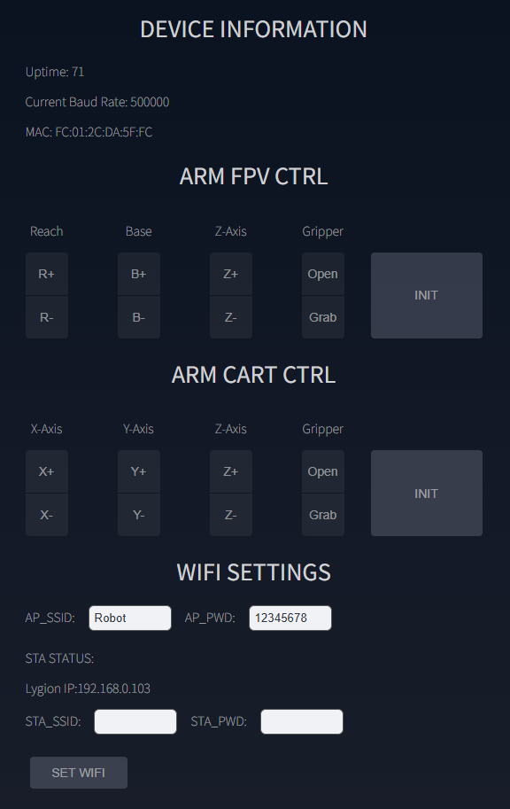
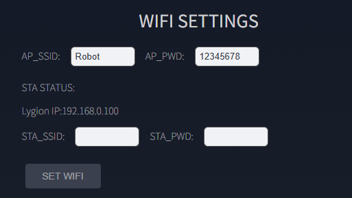
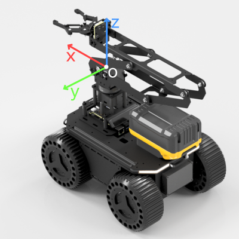
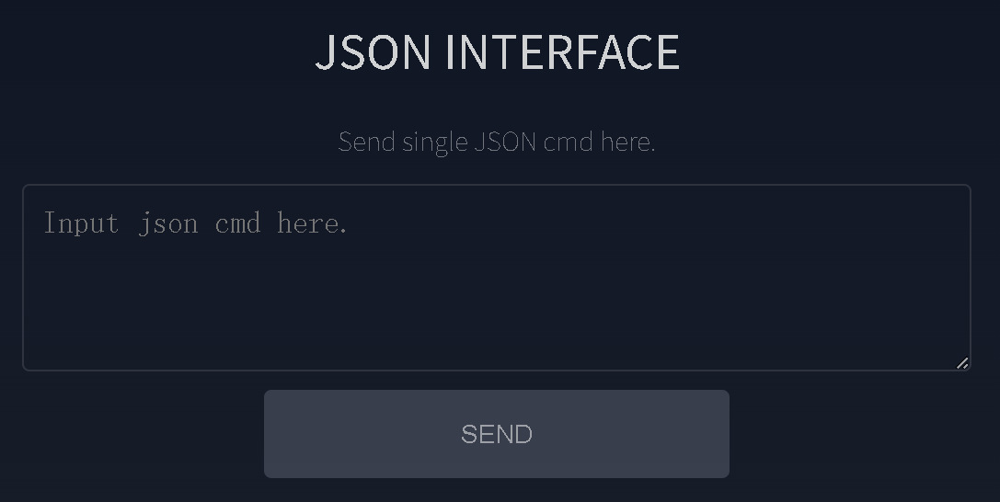

# LinkArm-LT Web 控制台

LinkArm-LT 出厂预装 Web 应用。浏览器与控制器之间通过 WebSocket 保持连接，因此无需安装专用 App。

{ .img-rounded }

## 网络模式

### AP 热点模式

控制器自身建立 Wi-Fi 热点：

| 项目 | 默认值 |
| --- | --- |
| SSID | `Robot` |
| 密码 | `12345678` |
| 控制台地址 | `http://192.168.4.1` |

AP 模式不依赖路由器，适合首次配置和现场直连。连接后不能通过这个 Wi-Fi 访问互联网属于正常现象。

### STA 局域网模式

在 `WIFI SETTINGS` 中填写路由器的 SSID 和密码，再点击 `SET WIFI`。连接成功后：

- `STA STATUS` 显示网络名称和路由器分配的 IP。
- OLED 在下次开机时显示该 IP。
- 手机或电脑连接同一路由器后，可通过该 IP 打开控制台。

{ .img-rounded }

!!! note "AP 与 STA 可同时工作"
    默认固件支持 AP + STA 混合模式。即使设备已经连接路由器，自建热点仍可用于维护。

!!! warning "页面不会显示已保存的真实密码"
    AP 输入框始终显示出厂默认值，不代表当前保存值。当前 AP SSID 可在设备开机时查看 OLED 第一行。

## 设备信息

`DEVICE INFORMATION` 显示：

- `Uptime`：设备运行秒数，持续增加表示页面通信正常。
- `Current Baud Rate`：控制器与总线设备通信的波特率，LinkArm-LT 为 `500000`。
- `MAC`：ESP32-S3 的唯一网络地址，用于 ESP-NOW 配对。

## FPV 控制

FPV 控制适合从安装在机械臂上的摄像头视角操作。

| 控件 | 动作 |
| --- | --- |
| `R+` / `R-` | 末端水平伸出 / 缩回 |
| `B+` / `B-` | 底座向右 / 向左旋转 |
| `Z+` / `Z-` | 末端向上 / 向下 |
| `Open` / `Grab` | 张开 / 闭合夹爪 |
| `INIT` | 回到默认位置 |

`R` 与 `Z` 动作包含垂直平面内的逆运动学；底座旋转为独立关节动作。

## 三维直角坐标控制

坐标系遵循右手规则：

{ .img-rounded }

- `X+`：机械臂正前方
- `Y+`：机械臂左侧
- `Z+`：机械臂上方

坐标原点和 X/Y/Z 正方向以图中箭头为准。`X/Y/Z` 控制均使用三关节逆运动学，使末端点沿指定轴移动；笛卡尔坐标和移动距离的单位为毫米（mm）。

如果机械臂安装在移动底盘或其他方向的支架上，上层应用需要自行完成机械臂坐标系与底盘、相机或世界坐标系之间的转换。

!!! warning "避免高频混用两种控制方式"
    FPV 和直角坐标模式内部维护的目标状态不同。连续操作时尽量使用同一组控件，切换前可先点击 `INIT`。

## JSON 即时调试

`JSON INTERFACE` 用于发送单条 JSON 指令：

1. 从页面下方的指令列表选择一条指令。
2. 指令会自动填入输入框。
3. 修改参数。
4. 点击 `SEND`。

{ .img-rounded }

单条即时指令与 `AUTOMATION SCRIPTS` 不同。后者会将多行指令保存为任务文件，详见[动作脚本](action-scripting.md)。
